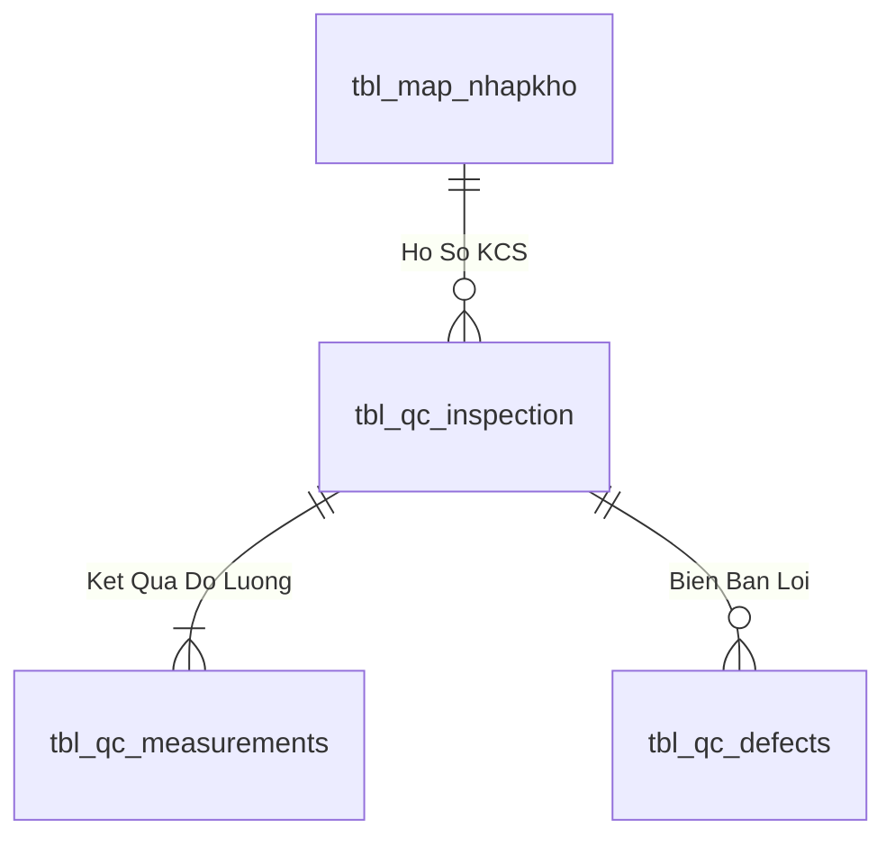

# Phân tích Thiết kế Logic UC-26 (QC-06) - Quản Lý Kho Cách Ly & Thủ Tục Trả Hàng Nhà Cung Cấp Không Đạt

Tài liệu này đi sâu vào phân tích và thiết kế hệ thống ở 5 khía cạnh bắt buộc: **Business Logic**, **UI/UX Guidelines**, **Programming Logic**, **Data Logic**, và **Diagrams (Mermaid)** dành cho chức năng **Quản Lý Kho Cách Ly & Trả Hàng NCC (QC-06)** của QC và Thủ kho.

---

## 1. Business Logic (Logic Nghiệp Vụ)
- **Mục tiêu cốt lõi:** Quản lý toàn bộ các Lô hàng `REJECT` lưu trữ tại các Ô kệ thuộc Khu vực cách ly (`Khu Q`), lập biên bản trả hàng cho Nhà cung cấp kèm hình ảnh lỗi và hạch toán giảm công nợ mua hàng trên ERP Bravo.
- **Endpoint:** `POST /api/v1/qc/quarantine/return-vendor`
- **SP:** `api.usp_WMS_QC06_CreateVendorReturn_v1`

---

## 3. Programming Logic (Logic Lập Trình)

Quy trình xử lý mã lệnh được chia thành 2 lớp rõ rệt: **Frontend (React)** và **Backend (ASP.NET Core kết hợp SQL Stored Procedure)**.

### 3.1. Frontend (React - Component View)
- **State Management & Local Processing:**
  - Gọi API kéo dữ liệu cần thiết vào React State.
  - Sử dụng các hàm mảng JavaScript (`filter`, `map`, `reduce`) để xử lý gom nhóm, lọc tìm kiếm in-memory, tối ưu hóa băng thông và tạo trải nghiệm mượt mà không độ trễ.
- **UI Interaction & Ergonomics:**
  - Sử dụng cấu trúc Collapse / Accordion / Modal xem trước để tối ưu không gian hiển thị trên màn hình Handheld PDA và Desktop Web.

### 3.2. Backend (ASP.NET Core & SQL Server Stored Procedure)
- **Thin API Gateway Pattern:**
  - ASP.NET Core Minimal API / Controller không xử lý logic tính toán nghiệp vụ mà chỉ làm cổng Gateway mỏng (Xác thực JWT Cookie, kiểm tra quyền màn hình `vw_SEC_UserScreenAccess_v1`) và ủy thác toàn bộ cho SQL Server Stored Procedure.
- **Tận Dụng Multi-Result Set & ACID Transaction:**
  - SQL Stored Procedure trả về đồng thời nhiều Result Sets (Header info, Summary KPIs, Detailed Lines) trong một lần truy vấn duy nhất.
  - Các lệnh ghi dữ liệu áp dụng `SET XACT_ABORT ON`, `BEGIN TRANSACTION` và khóa dòng dữ liệu `WITH (UPDLOCK, HOLDLOCK)` đảm bảo an toàn tuyệt đối.

---

## 4. Data Logic & Schema Model (Thiết kế Dữ Liệu Chuyên Sâu)

### 4.1. Entity Relationship Diagram (ERD) & Schema Details

- **Bảng Hồ Sơ Kiểm Định (`dbo.tbl_qc_inspection`):**
  - Khóa chính: `id_inspection` (INT IDENTITY).
  - Khóa ngoại: `id_nhapkho` $
ightarrow$ `tbl_map_nhapkho(id_nhapkho)`.
  - Kết luận kiểm tra: `decision` (`'PASS'`, `'REJECT'`, `'CONCESSION'`).

### 4.2. Data Flow & Transaction Locking Matrix
- **Khóa Lô kiểm định:** Khi QC tiếp nhận lấy mẫu, cập nhật `status_qc = 'IN_INSPECTION'` với `UPDLOCK` để khóa quyền xuất kho cho đến khi có quyết định phê duyệt chính thức.

### 4.3. Conceptual State Model & Transition Rules
| Trạng Thái QC | Điều Kiện Chuyển Đổi | Trạng Thái Sau | Tác Động Hệ Thống |
| :--- | :--- | :--- | :--- |
| **`PENDING`** | KCS tiếp nhận lấy mẫu (QC-01) | `IN_INSPECTION` | Khóa xuất kho |
| **`IN_INSPECTION`** | Đạt tiêu chuẩn AQL (QC-04) | `PASS` / `PASS_CHO_NHAP` | Mở khóa cất kệ & xuất kho |
| **`IN_INSPECTION`** | Không đạt tiêu chuẩn (QC-04) | `REJECT` | Tự động chuyển kho cách ly (QC-06) |
