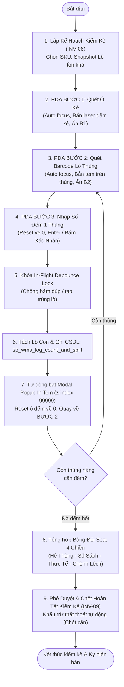
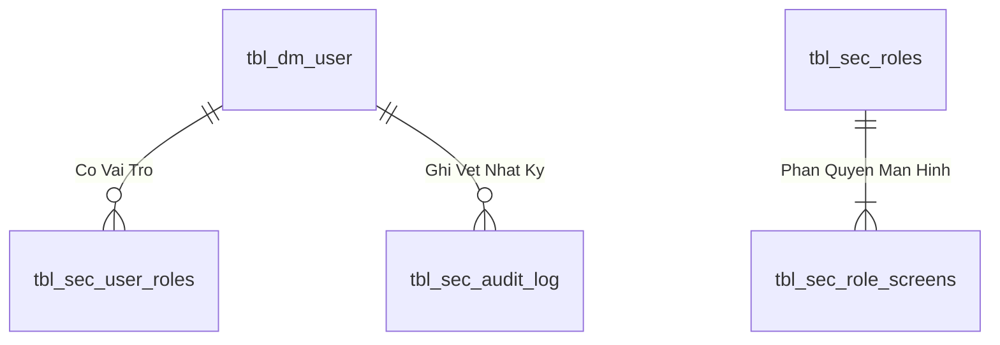
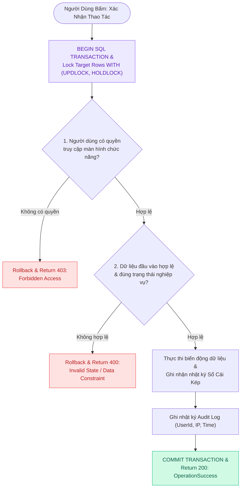

# TÀI LIỆU QUY TRÌNH NGHIỆP VỤ: KIỂM KÊ TỒN KHO XOAY VÒNG (CYCLE COUNT)
## MÃ QUY TRÌNH: MMS-WMS-SOP-INV-08 | USE CASE: UC-27 (PHIÊN BẢN 3.0)

---

| Thông Tin Tài Liệu | Chi Tiết |
| :--- | :--- |
| **Hệ thống áp dụng** | Hệ Thống Quản Lý Kho & Sản Xuất (MMS WMS) |
| **Phân hệ** | Quản Lý Tồn Kho - Kiểm Kê Xoay Vòng (Cycle Count / INV-08 & INV-09) |
| **Đối tượng xem & phê duyệt** | Process Owner (Chủ trì nghiệp vụ Kho), Quản lý Kho, Kế toán Kho, Ban Giám Đốc |
| **Mục đích tài liệu** | Thuyết minh quy trình vận hành kiểm kê xoay vòng 3 bước tự động hóa, cơ chế kiểm đếm theo từng thùng, tách lô định danh, khóa chống gửi trùng lệnh (Debounce Lock), tự động reset về 0, tự động bật pop-up in tem dán tại chỗ và đối soát số liệu sổ sách kế toán. |

---

## 1. MỤC ĐÍCH & PHẠM VI ÁP DỤNG

### 1.1. Mục đích
- Thiết lập quy trình kiểm kê cuốn chiếu định kỳ (Cycle Count) theo từng mặt hàng/khu vực mà không làm gián đoạn hoạt động xuất - nhập kho.
- Đảm bảo kiểm đếm chính xác đến từng kiện/thùng hàng thực tế tại ô kệ (Box-level Counting).
- Tự động hóa việc tách lô con (Sub-batch), cấp mã định danh và tự động bật Pop-up in tem mã vạch dán thùng ngay tại hiện trường.
- Triệt tiêu hoàn toàn tình trạng bấm nhiều lần sinh nhiều lô con nhờ cơ chế khóa Debounce In-Flight Lock.
- Đối soát số liệu giữa Tồn vật lý hệ thống, Tồn sổ sách kế toán và Thực tế kiểm đếm; tự động xử lý chốt cặn và hạch toán hao hụt khi hoàn thành.

### 1.2. Phạm vi áp dụng
- Áp dụng cho toàn bộ hoạt động kiểm kê định kỳ và kiểm kê đột xuất tại Kho Vật Tư.
- Thực hiện bởi nhân viên vận hành kho sử dụng máy quét cầm tay (PDA) và máy tính trạm quản lý kho.

---

## 2. MA TRẬN PHÂN QUYỀN TRÁCH NHIỆM (RACI)

| Hoạt Động Nghiệp Vụ | Kế Toán Kho | Quản Lý Kho / Process Owner | Thủ Kho / NV Kiểm Kê | Hệ Thống WMS |
| :--- | :---: | :---: | :---: | :---: |
| 1. Cung cấp số liệu tồn sổ sách | **R** (Thực hiện) | **A** (Chịu trách nhiệm) | **I** (Theo dõi) | **S** (Hỗ trợ) |
| 2. Tạo kế hoạch kiểm kê & Chốt Snapshot | **I** | **A** | **R** | **A** (Tự động) |
| 3. Quét kệ, đếm từng thùng, tách lô | **I** | **I** | **R** | **S** |
| 4. In tem nhãn dán thùng tại hiện trường | **I** | **I** | **R** | **A** (Tự động Pop-up) |
| 5. Kiểm tra bảng cân bằng đối soát 4 chiều | **C** (Tham vấn) | **R / A** | **R** | **S** |
| 6. Phê duyệt & Chốt sổ hoàn tất kiểm kê | **C** | **A** | **I** | **A** (Tự động) |

---

## 3. CÁC ĐỊNH NGHĨA & CÔNG THỨC NGHIỆP VỤ

### 3.1. Các chỉ số số lượng đối soát
1. **Số lượng hệ thống (System Quantity):** Tổng số lượng vật lý đang được ghi nhận tại các vị trí kệ kho tại thời điểm tạo kế hoạch kiểm kê.
2. **Số lượng sổ sách (Book Quantity):** Số lượng tồn theo số liệu kế toán do bộ phận kế toán/chủ hàng cung cấp tại thời điểm kiểm kê.
3. **Số lượng thực tế (Physical Quantity):** Tổng số lượng đếm được từ tất cả các thùng/kiện hàng được nhân viên ghi nhận tại hiện trường:
   $$\text{Số Lượng Thực Tế} = \sum (\text{Số Lượng Đếm Từng Thùng})$$
4. **Chênh lệch kiểm kê (Variance):**
   $$\text{Chênh Lệch} = \text{Số Lượng Thực Tế} - \text{Số Lượng Sổ Sách}$$

---

## 4. QUY TRÌNH THỰC HIỆN CHI TIẾT (3 BƯỚC HIỆN TRƯỜNG TỰ ĐỘNG HÓA)

---

### Giai đoạn 1: Khởi tạo kế hoạch kiểm kê
1. Quản lý / Thủ kho mở chức năng **Kiểm Kê Tồn Kho (UC-27)** trên phần mềm MMS WMS.
2. Chọn Mã vật tư cần kiểm kê, hệ thống tự động gợi ý tồn máy và số lượng Lô đang lưu kho.
3. Nhập số lượng tồn theo sổ sách kế toán và bấm **Khởi Tạo Kế Hoạch & Snapshot**.

---

### Giai đoạn 2: Kiểm đếm hiện trường PDA 3 bước tự động hóa

1. **Bước 1: Quét Ô Kệ**:
   - Con trỏ `autoFocus` sẵn vào ô quét kệ.
   - Bắn súng quét vào mã dầm kệ (VD: `01-01011`). Hệ thống tự động nhận diện, ẩn Bước 1 và mở Bước 2.
2. **Bước 2: Quét Barcode Lô Thùng**:
   - Con trỏ `autoFocus` vào ô quét tem thùng.
   - Bắn súng quét vào mã vạch thùng. Hệ thống nhận diện Lô, ẩn Bước 2 và mở Bước 3.
   - *Hỗ trợ nút `[🖨️ In Tem]` trực tiếp trên từng thẻ Lô để in tem nhanh.*
3. **Bước 3: Nhập Số Lượng Đếm & Xác Nhận Tách Thùng**:
   - Con trỏ `autoFocus` vào ô số lượng đếm (Mặc định reset về `0`).
   - Nhập cân nặng / số cái, sau đó nhấn phím **`Enter`** hoặc bấm **`[XÁC NHẬN SỐ ĐẾM & TÁCH THÙNG NÀY]`**.
   - **Khóa In-Flight Lock:** Nút bấm lập tức chuyển sang trạng thái Disabled + Spinner quay tròn, ngăn chặn 100% việc tạo nhiều lô con do thao tác spam nút.
   - **Tự động Reset & In Tem:** Sau khi ghi nhận CSDL, ô số lượng tự động về `0`, **Popup Modal In Tem Nhãn bật lên ngay lập tức** (hiển thị SKU, Tên vật tư, Khối lượng, Vị trí ô kệ, Barcode 128, QR Code và Nút in LAN `10.17.16.102:8080`).
   - **Chuẩn bị cho thùng kế tiếp:** Giao diện tự động quay về Bước 2 để nhân viên có thể bắn ngay vào thùng tiếp theo.

---

### Giai đoạn 3: Đối soát số liệu & Chốt hoàn tất kiểm kê (INV-09)
1. Trên màn hình Quản lý: Xem bảng đối soát 4 chiều (**Tồn Máy**, **Sổ Sách**, **Thực Tế**, **Chênh Lệch**).
2. Xem chi tiết các Lô con mới sinh tại Tab **Nhật Ký Quét Thùng & Lô Con** (có nút `[🖨️ In Lại Tem]`).
3. Khi Process Owner / Quản Lý xác nhận số liệu: Bấm **Phê Duyệt & Chốt Hoàn Thành (INV-09)**.
   - Hệ thống tự động trừ sạch tồn các lô gốc còn dư thừa về 0 (xử lý cặn do thất thoát vật lý) và ghi nhận giao dịch `ADJ_DWN` vào sổ cái kho.

---

## 3. Programming Logic (Logic Lập Trình)

Quy trình xử lý mã lệnh được chia thành 2 lớp rõ rệt: **Frontend (React)** và **Backend (ASP.NET Core kết hợp SQL Stored Procedure)**.

### 3.1. Frontend (React - Component View)
- **State Management & Local Processing:**
  - Gọi API kéo dữ liệu cần thiết vào React State.
  - Sử dụng các hàm mảng JavaScript (`filter`, `map`, `reduce`) để xử lý gom nhóm, lọc tìm kiếm in-memory, tối ưu hóa băng thông và tạo trải nghiệm mượt mà không độ trễ.
- **UI Interaction & Ergonomics:**
  - Sử dụng cấu trúc Collapse / Accordion / Modal xem trước để tối ưu không gian hiển thị trên màn hình Handheld PDA và Desktop Web.

### 3.2. Backend (ASP.NET Core & SQL Server Stored Procedure)
- **Thin API Gateway Pattern:**
  - ASP.NET Core Minimal API / Controller không xử lý logic tính toán nghiệp vụ mà chỉ làm cổng Gateway mỏng (Xác thực JWT Cookie, kiểm tra quyền màn hình `vw_SEC_UserScreenAccess_v1`) và ủy thác toàn bộ cho SQL Server Stored Procedure.
- **Tận Dụng Multi-Result Set & ACID Transaction:**
  - SQL Stored Procedure trả về đồng thời nhiều Result Sets (Header info, Summary KPIs, Detailed Lines) trong một lần truy vấn duy nhất.
  - Các lệnh ghi dữ liệu áp dụng `SET XACT_ABORT ON`, `BEGIN TRANSACTION` và khóa dòng dữ liệu `WITH (UPDLOCK, HOLDLOCK)` đảm bảo an toàn tuyệt đối.

---

## 4. Data Logic & Schema Model (Thiết kế Dữ Liệu Chuyên Sâu)

### 4.1. Entity Relationship Diagram (ERD) & Schema Details

- **Bảng Người Dùng (`dbo.tbl_dm_user`):** `user_n` (PK), `msnv`, `hoten`, `matkhau`, `status_active`.
- **View Phân Quyền (`api.vw_SEC_UserScreenAccess_v1`):** Ánh xạ `UserId` $
ightarrow$ `ScreenCode`.

### 4.2. Data Layer Architecture (Data Flow & Transaction Locking)

### 4.3. Conceptual State Model & Transition Rules
| Trạng Thái User | Thao Tác | Trạng Thái Sau | Quyền Hạn |
| :--- | :--- | :--- | :--- |
| **`ACTIVE (1)`** | Đăng nhập thành công (AUTH-01) | Sinh JWT Cookie (8h) | Truy cập các màn hình được cấp quyền |
| **`ACTIVE (1)`** | Khóa tài khoản (ADM-01) | `INACTIVE (0)` | Chặn đăng nhập và thu hồi token tức thì |
