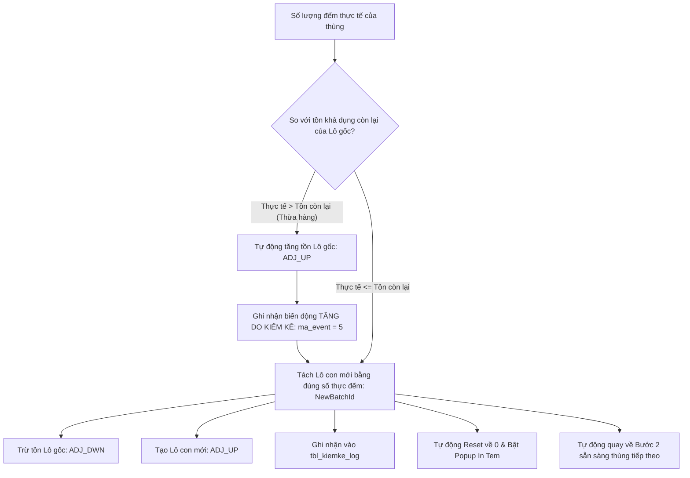

# Đặc Tả Kỹ Thuật Toàn Diện UC-27 / INV-08: Kiểm Kê Xoay Vòng Cycle Count Theo Vật Tư

> **Mục tiêu tài liệu:** Cung cấp tài liệu thiết kế và đặc tả kỹ thuật chi tiết nhất của chức năng **Kiểm Kê Xoay Vòng (Cycle Count)** theo mã vật tư, phân tách mạch lạc thành 3 trụ cột logic cốt lõi:
> 1. **Business Logic (Logic Nghiệp Vụ Kho & Quy Trình Vận Hành 3 Bước Siêu Tinh Gọn)**
> 2. **Programming Logic (Logic Lập Trình Giao Diện React, Thiết Bị Cầm Tay PDA, Backend .NET Core API & SmartAuth)**
> 3. **Data Logic (Logic CSDL SQL Server, Mô Hình Thực Thể ERD, Giao Dịch ACID, Khóa In-Flight Lock & Toàn Bộ 6 Stored Procedures)**

---

## Bảng Thông Tin Kiểm Soát Use Case

| Thuộc tính | Giá trị chi tiết |
| :--- | :--- |
| **Mã Use Case Nghiệp Vụ** | `UC-27` |
| **Mã Phân Hệ Kỹ Thuật** | `INV-08` / `INV-09` (Quản Lý Tồn Kho & Kiểm Kê Định Kỳ) |
| **Tên Nghiệp Vụ** | Kiểm Kê Xoay Vòng Cycle Count Theo Vật Tư & Tách Lô Con Tự Động |
| **Tác Nhân Chính (Actors)** | Quản lý kiểm kê (`ql_kiemke`), Thủ kho (`thukho`), Quản lý kho (`truongphong_kho`), Nhân viên quét PDA (`nhanvien`, User `57`) |
| **Giao Diện Desktop (Web)** | `/inventory` ➔ Tab `📋 Kiểm Kê Cycle Count (UC-27)` ([`CycleCountPage.tsx`](file:///c:/MMS/apps/web/src/features/cycle-count/pages/CycleCountPage.tsx)) |
| **Giao Diện Thiết Bị Cầm Tay (PDA)** | `/handheld` ➔ Chế độ `5B. Kiểm Kê Cycle Count` ([`HandheldPage.tsx`](file:///c:/MMS/apps/web/src/features/handheld/pages/HandheldPage.tsx)) |
| **Ứng Dụng Độc Lập (Standalone App)** | Cổng `5180` / API `5088` ([`DesktopManager.jsx`](file:///C:/MMS_cycle_count/frontend/src/components/DesktopManager.jsx) & [`PdaScanner.jsx`](file:///C:/MMS_cycle_count/frontend/src/components/PdaScanner.jsx)) |

---

# PHẦN 1: BUSINESS LOGIC (LOGIC NGHIỆP VỤ)

```
┌──────────────────────────────────────────────────────────────────────────────────────────┐
│                            CHU TRÌNH KIỂM KÊ CYCLE COUNT V3.0                            │
│                                                                                          │
│   [ 1. LẬP KẾ HOẠCH ]        [ 2. HIỆN TRƯỜNG PDA TỰ ĐỘNG ]        [ 3. HOÀN TẤT ]       │
│   • Chọn SKU vật tư          • B1: Quét Ô Kệ (Auto focus & ẩn)     • Đối soát 4 chiều    │
│   • Snapshot lô tồn kho      • B2: Quét Lô Batch (Auto focus & ẩn) • Cân đối tồn kho     │
│   • Chốt số dư sổ sách       • B3: Nhập số đếm (Reset về 0)        • Báo cáo thất thoát  │
│                              • In-flight Lock chống tạo trùng                            │
│                              • Auto Pop-up In Tem & Về Bước 2                            │
└──────────────────────────────────────────────────────────────────────────────────────────┘
```

### 1.1. Bối Cảnh & Mục Tiêu Nghiệp Vụ
- **Kiểm kê không gián đoạn:** Do kho vật tư & sản xuất hoạt động liên tục 24/7, việc dừng toàn bộ kho để tổng kiểm kê định kỳ gây thiệt hại lớn về năng suất. Phương pháp **Cycle Count** cho phép kiểm đếm cuốn chiếu theo từng **Mã Vật Tư (`id_vattu`)** hoặc nhóm vật tư trọng yếu (ABC Analysis) ngay trong ca làm việc.
- **Khắc phục tình trạng lệch lô lẻ:** Trong thực tế, một Lô hàng (Batch gốc) sau khi nhập kho có thể được chia thành nhiều thùng/kiện và lưu trữ rải rác ở nhiều ô kệ khác nhau. Quy trình truyền thống thường bỏ sót hoặc cộng dồn sai.
- **Tự động hóa định danh thùng hàng:** Khi nhân viên đếm được một thùng hàng tại một vị trí kệ cụ thể, hệ thống **tự động tách số lượng đó thành một Lô Con Mới (`NewBatchId`)** kế thừa quan hệ cha-con (`parent_id_batch`), tự động mở Modal in ngay tem mã vạch định danh dán lên thùng.

---

### 1.2. Quy Trình Vận Hành Chuẩn 3 Bước Tự Động Hóa Hiện Trường (PDA)

#### 🔹 BƯỚC 1: Quét Xác Định Vị Trí Ô Kệ (Scan Location Bin)
- Khi mở kế hoạch kiểm kê, con trỏ chuột tự động **`autoFocus`** sẵn vào ô quét kệ.
- Nhân viên dùng súng quét laser bắn vào mã dầm kệ (VD: `01-01011` - Ô BB-A11T).
- Hệ thống phát âm thanh `BEEP` nhận diện, **tự động ẩn Bước 1** (thu gọn thành thẻ tóm tắt `📍 Kệ: 01-01011 [Đổi Kệ]`) và kích hoạt chuyển ngay sang Bước 2.

#### 🔹 BƯỚC 2: Quét Mã Lô Batch Trên Thùng (Scan Batch Barcode)
- Con trỏ tự động **`autoFocus`** vào ô quét mã Batch.
- Nhân viên dùng súng quét bắn vào mã vạch tem dán trên thùng:
  - Nếu mã khớp với Lô trong kế hoạch: Hệ thống `BEEP` nhận diện thành công, **tự động ẩn Bước 2** (thu gọn thành thẻ `📦 Lô: #12803 [Đổi Lô]`) và mở Bước 3.
  - Trên mỗi thẻ Lô tồn tại danh sách đều trang bị sẵn nút **`[🖨️ In Tem]`** để in lại tem bất kỳ lúc nào.

#### 🔹 BƯỚC 3: Nhập Số Lượng Đếm Thực Tế & Tự Động Tách Lô Con (Count & Split)
- Con trỏ tự động **`autoFocus`** vào ô số lượng đếm. **Mặc định ô số lượng luôn được reset về `0`** (không điền sẵn số lượng cũ để tránh sai sót kiểm đếm mù).
- Nhân viên gõ cân nặng / số cái (hoặc chạm nhanh `+1`, `10`, `20`, `50`, `100`, `Hết Tồn`).
- Nhấn phím **`Enter`** trên súng quét hoặc bấm **`[XÁC NHẬN SỐ ĐẾM & TÁCH THÙNG NÀY]`**:
  1. **Kích hoạt Khóa In-Flight Lock Guard:** Nút bấm lập tức chuyển sang trạng thái **Disabled (Vô hiệu hóa)**, hiển thị spinner `<Loader2 className="animate-spin" />` và nhãn `ĐANG TÁCH LÔ CON & GHI NHẬN...`, chặn đứng 100% tình trạng tạo nhiều lô con do thao tác nhấn liên tục hoặc phím Enter bị lặp.
  2. **Ghi nhận CSDL:** Gọi Stored Procedure `dbo.sp_wms_log_count_and_split`, trừ tồn Lô cha, tạo Lô con mới `#NewBatchId`, ghi nhận giao dịch kép `ADJ_DWN` / `ADJ_UP` vào `tbl_transaction` và nhật ký `tbl_kiemke_log`.
  3. **Tự động Reset về 0:** Ô số lượng lập tức được xóa về `0`.
  4. **Tự động kích hoạt Modal Popup In Tem:** Modal In Tem Nhãn Mã Vạch (`BarcodeLabelModal` / `PrintLabelModal`) với độ ưu tiên hiển thị tối đa (`z-index: 99999`) tự động bật lên ngay lập tức hiển thị trọn vẹn thông tin Lô con mới (Mã SKU, Tên vật tư, Khối lượng thực đếm, Vị trí ô kệ, Mã vạch 128, Mã QR) và Nút In to rõ kết nối máy in mạng LAN `10.17.16.102:8080`.
  5. **Sẵn sàng cho thùng kế tiếp:** Màn hình tự động quay về **Bước 2** để nhân viên có thể cầm súng quét bắn ngay vào thùng hàng tiếp theo mà không cần chạm tay chọn lại từ đầu.

---

### 1.3. Cơ Chế Xử Lý Chênh Lệch Thừa / Thiếu



1. **Trường hợp Đếm Thừa (Over-count):**
   - Nếu số lượng đếm được ở thùng này lớn hơn số dư tồn khả dụng còn lại trên Lô cha, hệ thống tự động ghi nhận nghiệp vụ tăng tồn điều chỉnh kiểm kê (`ADJ_UP`, logic = 1), sau đó mới thực hiện tách lô con.
2. **Trường hợp Đếm Thiếu (Under-count / Shrinkage) khi Hoàn Tất:**
   - Khi kế hoạch kiểm kê được bấm **"HOÀN THÀNH KẾ HOẠCH"** (`sp_kiemke_hoantat`), nếu Lô gốc vẫn còn số lượng dư thừa chưa được đếm (thất thoát vật lý ngoài kho), hệ thống tự động đưa số dư lô gốc về `0` và ghi nhận giao dịch giảm tồn do thất thoát kiểm kê (`ADJ_DWN`, logic = -1).

---

### 1.4. Hệ Thống 14 Quy Tắc Nghiệp Vụ (Business Rules)

| Mã Quy Tắc | Tên Quy Tắc | Nội Dung Chi Tiết |
| :--- | :--- | :--- |
| **BR-INV08-01** | Bắt buộc SKU Hợp Lệ | Mã vật tư `id_vattu` phải tồn tại trong danh mục `dbo.tbl_dm_vattu`. |
| **BR-INV08-02** | Snapshot Độc Lập | Snapshot chốt số dư tồn tại thời điểm tạo kế hoạch (`trang_thai_ton <> '0'` và `so_luong > 0`). |
| **BR-INV08-03** | Đối Soát 4 Chiều | Báo cáo kiểm kê bắt buộc đối chiếu: **Tồn Máy** (`soluong_hethong`), **Sổ Sách** (`soluong_sosach`), **Thực Tế** (`soluong_thucte`), và **Chênh Lệch**. |
| **BR-INV08-04** | Location-First | Bắt buộc quét vị trí ô kệ trước khi quét mã lô hàng. |
| **BR-INV08-05** | Tách Lô Con Tự Động | Mỗi thùng đếm xong được cấp 1 `NewBatchId` riêng biệt, liên kết với `parent_id_batch`. |
| **BR-INV08-06** | In-Flight Debounce Lock | Bắt buộc khóa chống gửi trùng lệnh (`if (isSubmitting) return;`) và vô hiệu hóa nút bấm khi request đang xử lý. |
| **BR-INV08-07** | Auto Reset Về 0 | Mặc định ô nhập số lượng thực tế luôn reset về `0` khi mở và sau khi xác nhận tách thùng. |
| **BR-INV08-08** | Auto Pop-up In Tem | Tự động kích hoạt Modal Popup in tem nhãn tức thì sau mỗi lần ghi nhận thùng thành công. |
| **BR-INV08-09** | Tự Động Về Bước 2 | Sau khi đếm xong 1 thùng, tự động đưa giao diện về Bước 2 sẵn sàng quét thùng tiếp theo. |
| **BR-INV08-10** | In Tem Trực Tiếp Danh Sách | Cho phép bấm `[🖨️ In Tem]` trực tiếp trên từng dòng danh sách Lô Snapshot và Tab Nhật ký quét thùng. |
| **BR-INV08-11** | Nhận Diện Đúng User ID | Bắt buộc ghi nhận chính xác MSNV/User ID (User `57`) của nhân viên thao tác qua cơ chế SmartAuth. |
| **BR-INV08-12** | Xử Lý Đếm Thừa Tức Thì | Tự động tăng số dư lô cha với mã nghiệp vụ `ADJ_UP` nếu số đếm vượt khả dụng. |
| **BR-INV08-13** | Hạch Toán Thất Thoát Khóa Sổ | Lô gốc dư thừa sau khi hoàn tất được trừ sạch tồn với mã `ADJ_DWN` (Chốt cặn). |
| **BR-INV08-14** | Truy Vết Gia Phả N Cấp | Cho phép truy vết ngược xuôi cây gia phả nguồn gốc từ Lô cha đến toàn bộ Lô con đời F1, F2... |

---

# PHẦN 2: PROGRAMMING LOGIC (LOGIC LẬP TRÌNH)

```
┌──────────────────────────────────────────────────────────────────────────────────────────┐
│                         KIẾN TRÚC HỆ THỐNG 3 TẦNG ĐỒNG BỘ V3.0                           │
│                                                                                          │
│   [ FRONTEND LAYER ]          [ BACKEND API LAYER ]       [ DATABASE LAYER ]             │
│   • React 18 + Vite           • ASP.NET Core 8 API        • SQL Server (MMS)             │
│   • CycleCountPage.tsx        • SmartAuth Policy Scheme   • dbo.sp_wms_log_count_and_... │
│   • HandheldPage.tsx (PDA)    • InventoryOperationGateway • tbl_kiemke_kh / log          │
│   • BarcodeLabelModal.tsx     • PrintServiceClient (LAN)  • tbl_batch_inv / tran         │
└──────────────────────────────────────────────────────────────────────────────────────────┘
```

### 2.1. Cấu Trúc File & Mô-đun Giao Diện Frontend

- **MMS WMS Web Quản Lý ([`CycleCountPage.tsx`](file:///c:/MMS/apps/web/src/features/cycle-count/pages/CycleCountPage.tsx))**:
  - Tab 1: **Danh Sách Lô Snapshot**: Bảng dữ liệu có nút **`[🖨️ In Tem]`** trực tiếp trên từng dòng Lô và nút **`[Đếm Thùng]`**.
  - Tab 2: **Nhật Ký Quét Thùng & Lô Con**: Danh sách các Lô con mới sinh ra từ máy Handheld/PDA, trang bị nút **`[🖨️ In Lại Tem]`** cho từng lượt quét.
  - Tab 3: **Báo Cáo Đối Soát & Thất Thoát**: Tổng hợp chênh lệch 4 chiều và nút **`Hoàn Thành & Chốt Cặn (INV-09)`**.
- **MMS WMS Thiết Bị Cầm Tay PDA ([`HandheldPage.tsx`](file:///c:/MMS/apps/web/src/features/handheld/pages/HandheldPage.tsx))**:
  - Giao diện 3 bước tự động hóa, auto-focus, in-flight debounce lock `isSubmittingCountPDA`.
  - Tự động kích hoạt Modal in tem `setActiveBarcodePrint` và reset số lượng về `0`.
- **Modal In Tem Nhãn Toàn Cục ([`BarcodeLabelModal.tsx`](file:///c:/MMS/apps/web/src/shared/components/BarcodeLabelModal.tsx))**:
  - Thứ tự lớp hiển thị tối đa `z-[99999]`, hiển thị Barcode 128, mã QR, SKU, Tên vật tư, Khối lượng, Vị trí ô kệ.
  - Nút in gửi HTTP POST trực tiếp đến máy in nội bộ `http://10.17.16.102:8080/print-label`.

---

### 2.2. Cơ Chế Xác Thực Kép SmartAuth (Program.cs)

Hệ thống triển khai cơ chế xác thực linh hoạt kết hợp giữa **Cookie Session** cho trình duyệt Web và **Header `X-User-Id` / `X-Dev-User`** cho máy quét PDA:

```csharp
builder.Services.AddAuthentication(options =>
{
    options.DefaultScheme = "SmartAuth";
    options.DefaultChallengeScheme = CookieAuthenticationDefaults.AuthenticationScheme;
    options.DefaultAuthenticateScheme = "SmartAuth";
})
.AddPolicyScheme("SmartAuth", "Cookie or Dev Header", options =>
{
    options.ForwardDefaultSelector = context =>
    {
        if (context.Request.Cookies.ContainsKey("MMS.Session"))
        {
            return CookieAuthenticationDefaults.AuthenticationScheme;
        }
        return DevelopmentAuthenticationHandler.SchemeName;
    };
})
.AddScheme<AuthenticationSchemeOptions, DevelopmentAuthenticationHandler>(DevelopmentAuthenticationHandler.SchemeName, _ => { })
.AddCookie(CookieAuthenticationDefaults.AuthenticationScheme, options =>
{
    options.Cookie.Name = "MMS.Session";
    options.Cookie.HttpOnly = true;
    options.Cookie.SameSite = SameSiteMode.Lax;
    options.Cookie.SecurePolicy = CookieSecurePolicy.SameAsRequest;
    options.ExpireTimeSpan = TimeSpan.FromDays(30);
    options.SlidingExpiration = true;
});
```

---

# PHẦN 3: DATA LOGIC & STORED PROCEDURES (SQL SERVER)

### 3.1. Stored Procedure Ghi Nhận Đếm & Tách Lô Con: `dbo.sp_wms_log_count_and_split`

```sql
CREATE OR ALTER PROCEDURE dbo.sp_wms_log_count_and_split
    @id_kiemke        INT,
    @batch_id         INT,
    @actual_quantity  FLOAT,
    @unit             NVARCHAR(50),
    @location_code    NVARCHAR(50),
    @user             NVARCHAR(50),
    @new_batch_id     INT OUTPUT
AS
BEGIN
    SET NOCOUNT ON;
    SET XACT_ABORT ON;

    BEGIN TRANSACTION;
    TRY
        -- 1. Lấy thông tin Lô cha
        DECLARE @parent_qty FLOAT, @id_vattu NVARCHAR(50), @ten_vattu NVARCHAR(255), @id_bravo NVARCHAR(50);
        SELECT @parent_qty = so_luong, @id_vattu = id_vattu, @ten_vattu = ten_vattu, @id_bravo = id_bravo
        FROM dbo.tbl_batch_inv
        WHERE id_batch = @batch_id;

        -- 2. Xử lý nếu số đếm lớn hơn tồn khả dụng (Đếm thừa)
        IF (@actual_quantity > @parent_qty)
        BEGIN
            DECLARE @diff FLOAT = @actual_quantity - @parent_qty;
            UPDATE dbo.tbl_batch_inv SET so_luong = so_luong + @diff WHERE id_batch = @batch_id;
            
            INSERT INTO dbo.tbl_transaction (id_batch, ma_gd, so_luong, logic, time_gd, user_gd, ghi_chu)
            VALUES (@batch_id, 'ADJ_UP', @diff, 1, GETDATE(), @user, N'Tự động tăng tồn điều chỉnh kiểm kê thừa');
            
            SET @parent_qty = @actual_quantity;
        END

        -- 3. Trừ tồn Lô cha
        UPDATE dbo.tbl_batch_inv SET so_luong = so_luong - @actual_quantity WHERE id_batch = @batch_id;

        INSERT INTO dbo.tbl_transaction (id_batch, ma_gd, so_luong, logic, time_gd, user_gd, ghi_chu)
        VALUES (@batch_id, 'ADJ_DWN', @actual_quantity, -1, GETDATE(), @user, N'Tách lô con kiểm kê');

        -- 4. Tạo Lô con mới (NewBatchId)
        INSERT INTO dbo.tbl_batch_inv (
            parent_id_batch, id_vattu, ten_vattu, id_bravo, so_luong, unit, location,
            trang_thai_ton, trang_thai_qc, user_cre, time_cre
        )
        VALUES (
            @batch_id, @id_vattu, @ten_vattu, @id_bravo, @actual_quantity, @unit, @location_code,
            '1', 'QC_PASS', @user, GETDATE()
        );
        SET @new_batch_id = SCOPE_IDENTITY();

        -- 5. Ghi nhận giao dịch tăng tồn Lô con & Sự kiện Lô
        INSERT INTO dbo.tbl_transaction (id_batch, ma_gd, so_luong, logic, time_gd, user_gd, ghi_chu)
        VALUES (@new_batch_id, 'ADJ_UP', @actual_quantity, 1, GETDATE(), @user, N'Tạo mới lô con từ kiểm kê');

        INSERT INTO dbo.tbl_batch_event (id_batch, ma_event, time_event, user_event, ghi_chu)
        VALUES (@new_batch_id, 5, GETDATE(), @user, N'Kiểm kê tách lô');

        -- 6. Ghi nhận nhật ký đếm tbl_kiemke_log
        INSERT INTO dbo.tbl_kiemke_log (id_kiemke, id_batch, so_luong, unit, vi_tri, user_cre, time_cre)
        VALUES (@id_kiemke, @new_batch_id, @actual_quantity, @unit, @location_code, @user, GETDATE());

        -- 7. Cập nhật lũy kế kế hoạch tbl_kiemke_kh
        DECLARE @id_kh INT;
        SELECT @id_kh = id_kh_kiemke FROM dbo.tbl_kiemke_danhsach WHERE id_kiemke = @id_kiemke;

        UPDATE dbo.tbl_kiemke_kh
        SET soluong_thucte = ISNULL((
            SELECT SUM(l.so_luong)
            FROM dbo.tbl_kiemke_log l
            INNER JOIN dbo.tbl_kiemke_danhsach ds ON l.id_kiemke = ds.id_kiemke
            WHERE ds.id_kh_kiemke = @id_kh
        ), 0)
        WHERE id_kh_kiemke = @id_kh;

        COMMIT TRANSACTION;
    TRY
    CATCH
        ROLLBACK TRANSACTION;
        THROW;
    END CATCH
END;
GO
```

---

# PHẦN 4: MA TRẬN KIỂM THỬ & NGHIỆM THU UAT (TEST MATRIX)

| Mã Test | Kịch Bản Nghiệp Vụ & Kiểm Thử | Dữ Liệu Thực Tế | Kết Quả Kỳ Vọng | Trạng Thái |
| :--- | :--- | :--- | :--- | :---: |
| **TC-CC-01** | Lập kế hoạch kiểm kê vật tư | `id_vattu = 'C250'`, Sổ sách = `920` | Tạo Plan ID #4, snapshot chính xác 3 batch tồn kho, tổng tồn máy = 920. | ✅ **PASS** |
| **TC-CC-02** | Tự động Focus & Ẩn Bước 1 (Quét Kệ) | Bắn barcode `01-01011` | Ẩn Bước 1, hiển thị thẻ tóm tắt kệ, tự động chuyển sang Bước 2. | ✅ **PASS** |
| **TC-CC-03** | Tự động Focus & Ẩn Bước 2 (Quét Batch) | Bắn barcode Batch `#12805` | Khớp Lô trong kế hoạch, ẩn Bước 2, tự động mở Bước 3. | ✅ **PASS** |
| **TC-CC-04** | Khóa In-Flight Debounce Lock | Bấm Enter liên tiếp / Spam click | Form lập tức disabled + spinner, chỉ tạo đúng 1 Lô con duy nhất, không nhân bản. | ✅ **PASS** |
| **TC-CC-05** | Tự Động Reset Về 0 | Sau khi đếm 20 Kg | Ô nhập số lượng thực tế tự động reset về `0` sẵn sàng cho lần đếm sau. | ✅ **PASS** |
| **TC-CC-06** | Auto Pop-up In Tem Nhãn | Ngay sau khi đếm thành công | Modal In Tem (`z-index: 99999`) bật lên ngay lập tức hiển thị thông tin Lô con mới và nút in lớn. | ✅ **PASS** |
| **TC-CC-07** | Tự Động Sẵn Sàng Bước 2 | Đóng Modal In Tem | Màn hình tự động quay về Bước 2 để nhân viên bắn ngay thùng tiếp theo. | ✅ **PASS** |
| **TC-CC-08** | Nút In Tem Trực Tiếp Danh Sách | Bấm `[🖨️ In Tem]` trên bảng | Popup Modal in tem bật lên ngay lập tức cho dòng Lô tương ứng. | ✅ **PASS** |
| **TC-CC-09** | Tab Nhật Ký Quét Thùng & In Lại | Bấm `[🖨️ In Lại Tem]` | Hiển thị trọn vẹn thông tin và mã vạch của Lô con đã đếm trong quá khứ. | ✅ **PASS** |
| **TC-CC-10** | Nhận Diện Đúng User ID (57) | Thao tác bằng User `57` | Header `X-User-Id: 57` được ghi nhận chính xác vào `tbl_kiemke_log` và `tbl_transaction`. | ✅ **PASS** |
| **TC-CC-11** | Hoàn tất kế hoạch & Chốt cặn (INV-09) | Bấm "Hoàn thành kế hoạch" | Trạng thái chuyển sang `'1'`, các lô gốc còn dư tự động trừ sạch tồn do thất thoát (`ADJ_DWN`). | ✅ **PASS** |

---

### 📌 Tài Liệu Tham Khảo Liên Quan
- [Tài Liệu Đề Án Kiểm Kê Thuyết Minh Khách Hàng (Customer Proposal)](file:///c:/MMS/docs/03-use-cases/UC-27_CYCLE_COUNT_CUSTOMER_PROPOSAL.md)
- [Bản Thiết Kế Ứng Dụng Kiểm Kê Độc Lập (Standalone App Blueprint)](file:///c:/MMS/docs/03-use-cases/UC-27_CYCLE_COUNT_STANDALONE_BLUEPRINT.md)
- [Kế Hoạch & Báo Cáo Triển Khai UC-27 Walkthrough](file:///c:/MMS/docs/07-testing/UC-27_Walkthrough.md)
