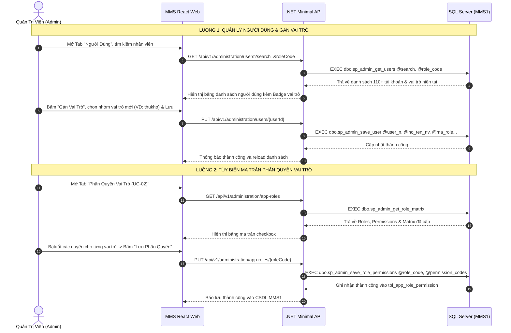
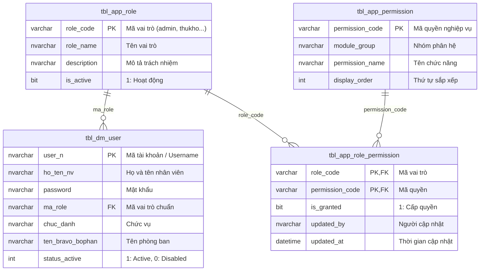

# Phân tích Thiết kế Logic UC-28 (ADM-01 & ADM-02) – Quản Trị Người Dùng & Ma Trận Phân Quyền

> **Mục tiêu tài liệu:** Mô tả toàn diện 3 tầng logic (Business Logic, Programming Logic, Data Logic) của phân hệ Quản trị người dùng và Phân quyền vai trò kết nối trực tiếp CSDL `MMS1`.

## Thông tin kiểm soát tài liệu

| Thuộc tính | Giá trị |
| :--- | :--- |
| **Mã Use Case Nghiệp Vụ** | `UC-28` |
| **Mã Quản Lý Triển Khai** | `ADM-01` (Phân quyền vai trò) & `ADM-02` (Quản trị người dùng) |
| **Tên chức năng** | Quản trị người dùng, nhóm vai trò và ma trận phân quyền |
| **Tác nhân chính** | Quản trị viên hệ thống (`Admin`) |
| **Route React** | `/settings` (Tab Người Dùng & Tab Phân Quyền Vai Trò) |
| **Nhóm triển khai** | W0/W2 - Administration & Access Control |

---

## 1. Business Logic (Logic Nghiệp Vụ)

### 1.1. Mục đích
Hệ thống cho phép Quản trị viên:
1. **Quản lý danh mục người dùng**: Tra cứu hơn 110 tài khoản nhân sự từ `tbl_dm_user`, cấu hình gán nhóm vai trò, cập nhật thông tin phòng ban/chức danh và đổi mật khẩu.
2. **Cấu hình ma trận phân quyền vai trò**: Tùy biến cấp phát hoặc thu hồi 22 quyền nghiệp vụ chi tiết cho 7 nhóm vai trò (`admin`, `truongphong_kho`, `thukho`, `bophan_yeucau`, `nv_sx`, `nhanvien`, `qc`).
3. **Áp dụng tức thời (Real-time RBAC)**: Người dùng sau khi được gán vai trò sẽ được điều hướng và hiển thị danh mục menu tương ứng ngay tại thời điểm đăng nhập.

### 1.2. Danh Sách 7 Nhóm Vai Trò Chuẩn (Roles)

| Mã Role | Tên Vai Trò | Trách Nhiệm Nghiệp Vụ Chính |
| :--- | :--- | :--- |
| `admin` | **Admin Hệ Thống** | Toàn quyền cấu hình, quản trị người dùng, phân quyền vai trò và truy cập tất cả các phân hệ. |
| `truongphong_kho` | **Trưởng Phòng Kho** | **Phê duyệt đề nghị xuất kho**, quản lý điều phối, theo dõi Dashboard KPI & Báo cáo tổng thể. |
| `thukho` | **Thủ Kho Trưởng** | **Quản lý Nhập kho** (nhận PO, đối soát, thủ tục nhập, in tem batch), Tồn kho & Kệ, Xác nhận trả nội bộ. |
| `bophan_yeucau` | **Đơn Vị Yêu Cầu** | Lập đề nghị xuất kho theo kế hoạch/ngoài kế hoạch, theo dõi cấp phát và lập phiếu hoàn trả vật tư nội bộ về kho. |
| `nv_sx` | **Nhân Viên Sản Xuất** | Nhân viên vận hành tổ/chuyền sản xuất, phân xưởng gia công cơ khí. |
| `nhanvien` | **Nhân Viên Kho (PDA)** | Thao tác thực địa trên **Máy quét PDA Laser**, Soạn hàng FIFO, quét barcode cất/dời kệ. |
| `qc` | **Kỹ Thuật QC/QA** | Lập phiếu kiểm định chất lượng, đánh giá Đạt/Không đạt và in tem QC. |

### 1.3. Luồng Nghiệp Vụ Chính (Main Flow)



### 1.4. Business Rules (Quy Tắc Nghiệp Vụ)

| Mã Quy Tắc | Tên Quy Tắc | Nội Dung Chi Tiết |
| :--- | :--- | :--- |
| **BR-ADM01-01** | Toàn quyền Admin | Vai trò `admin` luôn có đầy đủ 100% quyền nghiệp vụ và không bị vô hiệu hóa bởi ma trận phân quyền. |
| **BR-ADM01-02** | Khóa Định Danh User | Mã tài khoản (`user_n`) là khóa chính duy nhất, không được sửa đổi sau khi đã tạo. |
| **BR-ADM01-03** | Mật Khẩu Mặc Định | Khi thêm mới tài khoản, nếu không nhập mật khẩu hệ thống tự động gán mặc định là `123`. |
| **BR-ADM01-04** | Trạng Thái Tài Khoản | Tài khoản có `status_active = 0` sẽ bị từ chối xác thực đăng nhập vào hệ thống. |
| **BR-ADM01-05** | Lưu Quyền Nguyên Tử | Khi lưu quyền cho 1 vai trò, hệ thống thực thi xóa và chèn lại các quyền được chọn trong cùng transaction để đảm bảo toàn vẹn. |

---

## 2. Programming Logic (Logic Lập Trình)

### 2.1. Frontend Web React (TypeScript)
- **Mã nguồn Quản trị**: [`apps/web/src/components/SettingsModule.tsx`](file:///c:/MMS/apps/web/src/components/SettingsModule.tsx)
- **Dịch vụ Client**: [`apps/web/src/services/permissionService.ts`](file:///c:/MMS/apps/web/src/services/permissionService.ts)

### 2.2. Backend .NET Minimal API
- **Endpoint Route**: [`apps/api/Modules/Administration/AdministrationEndpoints.cs`](file:///c:/MMS/apps/api/Modules/Administration/AdministrationEndpoints.cs)
- **Gateway Gateway**: [`apps/api/Modules/Administration/AdministrationGateway.cs`](file:///c:/MMS/apps/api/Modules/Administration/AdministrationGateway.cs)

#### API Contracts

##### 1. Lấy danh sách người dùng
```http
GET /api/v1/administration/users?search=khuong&roleCode=thukho
Authorization: Bearer <token>
```
Response `200 OK`:
```json
[
  {
    "userId": "00",
    "fullName": "NGUYỄN ĐÌNH KHƯƠNG",
    "employeeCode": null,
    "roleCode": "thukho",
    "roleName": "Thủ Kho",
    "jobTitle": "Thủ Kho Trưởng",
    "departmentName": "Bộ Phận Kho Vận",
    "isActive": 1
  }
]
```

##### 2. Thêm hoặc Cập nhật người dùng / Gán vai trò
```http
PUT /api/v1/administration/users/10003
Content-Type: application/json
Authorization: Bearer <token>

{
  "userId": "10003",
  "fullName": "ĐẶNG PHÚC QUANG",
  "password": "",
  "roleCode": "bophan_yeucau",
  "jobTitle": "Nhân viên vận hành",
  "departmentName": "BP. Hành chánh",
  "isActive": 1
}
```
Response `200 OK`:
```json
{
  "isSuccess": true,
  "message": "Cập nhật tài khoản thành công."
}
```

##### 3. Lấy ma trận phân quyền vai trò
```http
GET /api/v1/administration/app-roles
Authorization: Bearer <token>
```
Response `200 OK`:
```json
{
  "roles": [
    { "roleCode": "admin", "roleName": "Admin Hệ Thống", "isActive": true, "userCount": 2 },
    { "roleCode": "thukho", "roleName": "Thủ Kho", "isActive": true, "userCount": 1 }
  ],
  "permissions": [
    { "permissionCode": "inbound.receive", "moduleGroup": "Nhập kho", "permissionName": "Quét & nhận hàng theo PO" }
  ],
  "matrix": {
    "thukho": ["inbound.receive", "inbound.update_po", "inbound.finalize", "inventory.view"]
  }
}
```

##### 4. Lưu quyền cho vai trò
```http
PUT /api/v1/administration/app-roles/thukho
Content-Type: application/json
Authorization: Bearer <token>

{
  "roleCode": "thukho",
  "permissionCodes": ["inbound.receive", "inbound.update_po", "inbound.finalize", "inventory.view", "inventory.putaway"]
}
```
Response `200 OK`:
```json
{
  "isSuccess": true,
  "message": "Cập nhật quyền vai trò thành công."
}
```

---

## 3. Data Logic (Logic Dữ Liệu & Stored Procedures)

### 3.1. Entity Relationship Diagram (Mô Hình Thực Thể)



### 3.2. Mã Nguồn 4 Stored Procedures Đã Triển Khai Trên MMS1

#### 1. `dbo.sp_admin_get_users`
```sql
CREATE OR ALTER PROCEDURE dbo.sp_admin_get_users
    @search NVARCHAR(100) = NULL,
    @role_code VARCHAR(50) = NULL
AS
BEGIN
    SET NOCOUNT ON;

    SELECT 
        u.user_n AS UserId,
        u.ho_ten_nv AS FullName,
        u.msnv AS EmployeeCode,
        u.password AS [Password],
        ISNULL(u.ma_role, 'bophan_yeucau') AS RoleCode,
        ISNULL(r.role_name, N'Chưa phân vai trò') AS RoleName,
        u.chuc_danh AS JobTitle,
        u.ma_bophan AS DepartmentCode,
        u.ma_bravo_bophan AS BravoDepartmentCode,
        u.ten_bravo_bophan AS DepartmentName,
        ISNULL(u.status_active, 1) AS IsActive
    FROM dbo.tbl_dm_user u
    LEFT JOIN dbo.tbl_app_role r ON u.ma_role = r.role_code
    WHERE (@search IS NULL OR @search = '' 
           OR u.user_n LIKE N'%' + @search + N'%' 
           OR u.ho_ten_nv LIKE N'%' + @search + N'%'
           OR u.ten_bravo_bophan LIKE N'%' + @search + N'%')
      AND (@role_code IS NULL OR @role_code = '' OR u.ma_role = @role_code)
    ORDER BY u.status_active DESC, u.user_n ASC;
END;
```

#### 2. `dbo.sp_admin_save_user`
```sql
CREATE OR ALTER PROCEDURE dbo.sp_admin_save_user
    @user_n NVARCHAR(50),
    @ho_ten_nv NVARCHAR(100),
    @password NVARCHAR(100) = NULL,
    @ma_role NVARCHAR(50),
    @chuc_danh NVARCHAR(100) = NULL,
    @ten_bravo_bophan NVARCHAR(150) = NULL,
    @status_active INT = 1,
    @updated_by NVARCHAR(50) = 'admin'
AS
BEGIN
    SET NOCOUNT ON;

    IF EXISTS (SELECT 1 FROM dbo.tbl_dm_user WHERE user_n = @user_n)
    BEGIN
        UPDATE dbo.tbl_dm_user
        SET ho_ten_nv = @ho_ten_nv,
            ma_role = @ma_role,
            chuc_danh = ISNULL(@chuc_danh, chuc_danh),
            ten_bravo_bophan = ISNULL(@ten_bravo_bophan, ten_bravo_bophan),
            status_active = @status_active,
            password = CASE WHEN @password IS NOT NULL AND @password <> '' THEN @password ELSE password END
        WHERE user_n = @user_n;
    END
    ELSE
    BEGIN
        INSERT INTO dbo.tbl_dm_user (user_n, ho_ten_nv, password, ma_role, chuc_danh, ten_bravo_bophan, status_active)
        VALUES (@user_n, @ho_ten_nv, ISNULL(@password, '123'), @ma_role, @chuc_danh, @ten_bravo_bophan, @status_active);
    END

    SELECT 1 AS IsSuccess, N'Cập nhật tài khoản thành công.' AS Message;
END;
```

#### 3. `dbo.sp_admin_get_role_matrix`
```sql
CREATE OR ALTER PROCEDURE dbo.sp_admin_get_role_matrix
    @role_code VARCHAR(50) = NULL
AS
BEGIN
    SET NOCOUNT ON;

    -- 1. Danh sách roles
    SELECT 
        role_code AS RoleCode,
        role_name AS RoleName,
        description AS [Description],
        is_active AS IsActive,
        (SELECT COUNT(*) FROM dbo.tbl_dm_user u WHERE u.ma_role = r.role_code) AS UserCount
    FROM dbo.tbl_app_role r
    WHERE (@role_code IS NULL OR @role_code = '' OR r.role_code = @role_code)
    ORDER BY r.role_code;

    -- 2. Danh sách quyền nghiệp vụ
    SELECT 
        permission_code AS PermissionCode,
        module_group AS ModuleGroup,
        permission_name AS PermissionName,
        description AS [Description],
        display_order AS DisplayOrder
    FROM dbo.tbl_app_permission
    ORDER BY module_group, display_order;

    -- 3. Ma trận quyền đã cấp
    SELECT 
        role_code AS RoleCode,
        permission_code AS PermissionCode,
        is_granted AS IsGranted
    FROM dbo.tbl_app_role_permission
    WHERE is_granted = 1;
END;
```

#### 4. `dbo.sp_admin_save_role_permissions`
```sql
CREATE OR ALTER PROCEDURE dbo.sp_admin_save_role_permissions
    @role_code VARCHAR(50),
    @permission_codes NVARCHAR(MAX),
    @updated_by NVARCHAR(50) = 'admin'
AS
BEGIN
    SET NOCOUNT ON;

    DELETE FROM dbo.tbl_app_role_permission WHERE role_code = @role_code;

    IF @permission_codes IS NOT NULL AND LEN(TRIM(@permission_codes)) > 0
    BEGIN
        INSERT INTO dbo.tbl_app_role_permission (role_code, permission_code, is_granted, updated_by, updated_at)
        SELECT 
            @role_code,
            TRIM(value),
            1,
            @updated_by,
            GETDATE()
        FROM STRING_SPLIT(@permission_codes, ',')
        WHERE LEN(TRIM(value)) > 0;
    END

    SELECT 1 AS IsSuccess, N'Cập nhật quyền vai trò thành công.' AS Message;
END;
```
