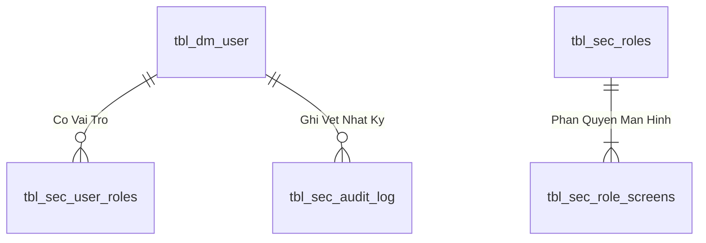

# Phân tích Thiết kế Logic UC-28 (ADM-02) - Phân Quyền Vai Trò & Ma Trận Màn Hình Truy Cập (RBAC & Screen Access Matrix)

Tài liệu này đi sâu vào phân tích và thiết kế hệ thống ở 5 khía cạnh bắt buộc: **Business Logic**, **UI/UX Guidelines**, **Programming Logic**, **Data Logic**, và **Diagrams (Mermaid)** dành cho chức năng **Phân Quyền Vai Trò & Màn Hình (ADM-02)** của Quản trị viên hệ thống (Admin).

---

## 1. Business Logic (Logic Nghiệp Vụ)
- **Mục tiêu cốt lõi:** Thiết lập ma trận phân quyền dựa trên vai trò (Role-Based Access Control - RBAC) và theo từng tài khoản cụ thể. Quản lý quyền truy cập các mã màn hình chức năng: `scr_soanhang`, `scr_soanhang_chitiet`, `scr_soanhang_batch`, `scr_mob_soanhang`, `scr_dengatxuat`, `scr_duyet_xuat`, `scr_tonkho_sku`, `scr_kiemke`, v.v. qua view `api.vw_SEC_UserScreenAccess_v1`.
- **Endpoint:** `POST /api/v1/admin/permissions`
- **SP:** `api.usp_ADM_SavePermissions_v1`

---

## 4. Data Logic & Schema Model (Thiết kế Dữ Liệu Chuyên Sâu)

### 4.1. Entity Relationship Diagram (ERD) & Schema Details

- **Bảng Người Dùng (`dbo.tbl_dm_user`):** `user_n` (PK), `msnv`, `hoten`, `matkhau`, `status_active`.
- **View Phân Quyền (`api.vw_SEC_UserScreenAccess_v1`):** Ánh xạ `UserId` $
ightarrow$ `ScreenCode`.

### 4.2. Data Flow & Transaction Locking Matrix
- **Xác thực phiên:** Truy vấn nhanh không khóa (`NOLOCK`) trên `vw_SEC_UserScreenAccess_v1` và ghi log an toàn vào `tbl_sec_audit_log`.

### 4.3. Conceptual State Model & Transition Rules
| Trạng Thái User | Thao Tác | Trạng Thái Sau | Quyền Hạn |
| :--- | :--- | :--- | :--- |
| **`ACTIVE (1)`** | Đăng nhập thành công (AUTH-01) | Sinh JWT Cookie (8h) | Truy cập các màn hình được cấp quyền |
| **`ACTIVE (1)`** | Khóa tài khoản (ADM-01) | `INACTIVE (0)` | Chặn đăng nhập và thu hồi token tức thì |
