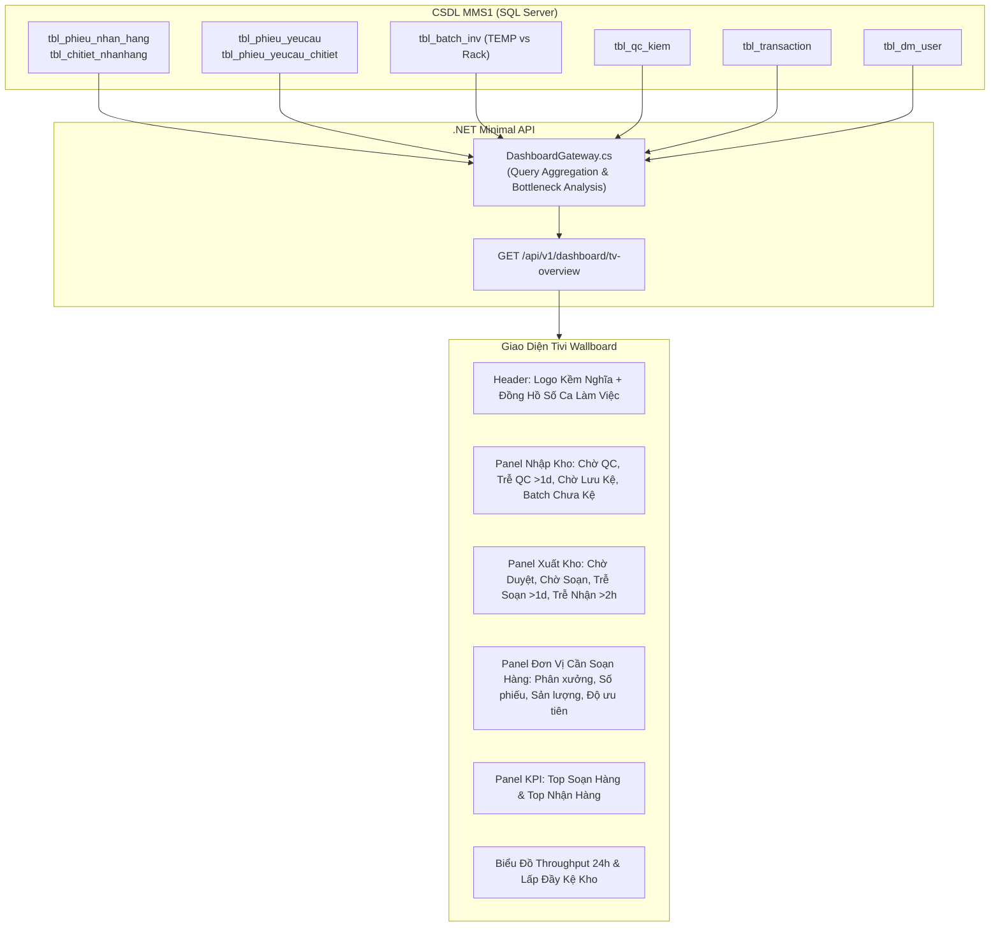

# UC-29 / DASH-01: Bảng Điều Hành Trực Quan Toàn Bộ Vận Hành Kho Hiển Thị Tivi (Live WMS Operations TV Wallboard)

## 1. Mục Đích & Bối Cảnh Nghiệp Vụ
- **Mục tiêu**: Cung cấp màn hình giám sát thời gian thực 24/7 lắp đặt trên Tivi 55"-75" tại văn phòng điều hành kho và sàn kho Kềm Nghĩa.
- **Thương hiệu**: Nhận diện chuẩn **KỀM NGHĨA WMS** (Logo Kềm Nghĩa KNSG, bảng màu Dark Industrial tương phản cao chống mỏi mắt).
- **Yêu cầu trọng tâm**:
  1. **Quản lý Nhập kho (Inbound)**:
     - Số phiếu nhận (Tổng số & Hôm nay).
     - Chờ QC kiểm.
     - ⚠️ Phiếu nhận quá 1 ngày chưa được QC kiểm (Cảnh báo đỏ).
     - Số phiếu đã kiểm chờ nhập kho (QC Pass).
     - ⚠️ Số phiếu quá 1 ngày chưa nhập kho (Cảnh báo vàng/đỏ).
     - 📦 Số batch chưa lên kệ (Lưu tạm tại khu vực tiếp nhận TEMP-INBOUND).
     - ⚠️ Số phiếu QC kiểm không đạt chờ xử lý (QC Reject).
  2. **Quản lý Xuất kho (Outbound)**:
     - Số phiếu chờ duyệt (Trình duyệt BGĐ / Quản đốc).
     - Số phiếu chờ soạn (Đã duyệt sẵn sàng xuất).
     - ⚠️ Phiếu quá hạn 1 ngày chưa soạn.
     - Số phiếu đang soạn (Nhân viên quét barcode PDA thực địa).
     - Phiếu đã soạn xong.
     - Phiếu đã nhận (Phân xưởng đã nhận hàng).
     - ⚠️ Số phiếu đã soạn mà quá hạn 2h chưa nhận (Cảnh báo xưởng trễ nhận).
  3. **Hiển thị rõ Đơn vị / Phân xưởng cần soạn hàng**:
     - Chi tiết từng phân xưởng sản xuất Kềm Nghĩa (`NM1_Thành phẩm Inox`, `NM1_Line Thép`, `NM2_Line Nhíp`, `NM3_Tráng phủ kim loại`...).
     - Số lượng phiếu chờ soạn của từng đơn vị.
     - Tổng sản lượng vật tư cần soạn.
     - Thời gian cần hàng & Mức độ ưu tiên (`CẦN GẤP < 2H`, `TRONG CA HÔM NAY`).
  4. **Chỉ số KPI Năng Suất Nhân Sự Thực Địa**:
     - Top Nhân viên Soạn Hàng (Top Pickers).
     - Top Nhân viên / Phân xưởng Nhận Hàng (Top Receivers).
  5. **Nhịp độ Xuất - Nhập theo giờ (Hourly Throughput)** & **Lấp đầy Kệ kho (Rack Occupancy)**.

---

## 2. Luồng Xử Lý Dữ Liệu (Data Architecture)

---

## 3. Quy Định Màu Sắc & Cảnh Báo Trên Màn Hình Tivi
- 🔴 **Đỏ / Red Pulse (`bg-rose-500`)**: Cảnh báo nút thắt nghẽn nghiêm trọng (Quá 1 ngày chưa QC, Quá 1 ngày chưa cất kệ, Quá 1 ngày chưa soạn, Đã soạn quá 2h xưởng chưa nhận, QC Reject).
- 🟡 **Vàng / Amber (`bg-amber-500`)**: Công việc đang xếp hàng chờ xử lý trong ca (Chờ QC kiểm, Chờ duyệt, Chờ xưởng đến nhận trong khung giờ).
- 🔵 **Xanh Dương / Blue (`bg-blue-500`)**: Đang diễn ra thực địa (Đang soạn hàng PDA, Đã kiểm chờ nhập kho).
- 🟢 **Xanh Lá / Emerald (`bg-emerald-500`)**: Hoàn tất thành công (Đã nhập kho, Đã nhận hàng).
