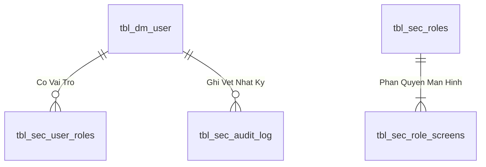
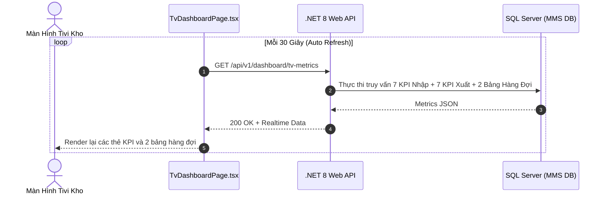

# Phân tích Thiết kế Logic UC-29 (DASH-01) - Bảng Điều Khiển Tổng Quan Dashboard & Màn Hình Tivi Giám Sát Realtime (TV Wallboard)

Tài liệu này đi sâu vào phân tích và thiết kế hệ thống ở 5 khía cạnh bắt buộc: **Business Logic**, **UI/UX Guidelines**, **Programming Logic**, **Data Logic**, và **Diagrams (Mermaid)** dành cho chức năng **Dashboard & Tivi Giám Sát Kho Realtime (DASH-01)** của Ban Quản Đốc, Thủ Kho và Ban Giám Đốc.

---

## 1. Business Logic (Logic Nghiệp Vụ)

- **Mục tiêu cốt lõi:** Cung cấp trung tâm điều hành trực quan hóa toàn bộ hoạt động kho hàng thời gian thực:
  - **7 Chỉ số KPI Nhập Kho (Inbound KPIs):** Tiếp nhận hôm nay, Chờ QC, Đạt QC chờ cất kệ, Đang cất kệ, Chờ xác nhận nhập kho, Nhập kho quá 2h chưa cất, Đã nhập kho thành công.
  - **7 Chỉ số KPI Xuất Kho (Outbound KPIs):** Đề nghị xuất hôm nay, Chờ duyệt xuất, Chờ soạn hàng, Đang soạn hàng, Đã soạn chờ nhận, Đã soạn quá 2h chưa nhận, Đã nhận hàng thành công.
  - **Bảng 1: 1. DANH SÁCH PHIẾU CHỜ SOẠN HÀNG XUẤT KHO:** Hiển thị toàn bộ các phiếu trong hàng đợi xuất kho (`status_soanhang IN ('0', '1')`), thời gian tiếp nhận, thời gian chờ, thời gian đang soạn và nhấp nháy chỉ báo `Đang Soạn` realtime.
  - **Bảng 2: 2. DANH SÁCH PHIẾU ĐÃ SOẠN CHỜ XƯỞNG NHẬN:** Hiển thị các đơn đã soạn xong (`status_soanhang = '2'`) chờ phân xưởng đến lấy hàng, tính toán số phút chờ lấy để cảnh báo ùn ứ.

- **Quy trình tương tác 5 bước (Interaction Flow):**
  - **Bước 1:** Bật trình duyệt trên Tivi thông minh tại sảnh kho, truy cập URL `/tv-dashboard`.
  - **Bước 2:** Màn hình tự động bật chế độ Fullscreen tối ưu độ tương phản cao (`High-contrast Dark Theme`).
  - **Bước 3:** Hệ thống tự động thiết lập chu kỳ Polling tự động làm mới số liệu mỗi 30 giây hoặc nhận tín hiệu qua WebSockets.
  - **Bước 4:** Khi có đơn hàng mới hoặc đơn đang soạn, bảng tự động cập nhật và nhấp nháy hiệu ứng Neon nổi bật.
  - **Bước 5:** Hỗ trợ tính năng phát âm thanh cảnh báo khi có đơn hàng xuất khẩn cấp hoặc đơn hàng chờ quá 2 giờ.

---

## 2. Tiêu chuẩn Thiết kế Giao diện (UI/UX Guidelines)
- Giao diện TV Wallboard chuyên nghiệp, thiết kế siêu nét Full HD / 4K, phông chữ Monospace lớn cho các chỉ số KPI, hiệu ứng chuyển động mượt mà không gây giật lag.

---

## 3. Programming Logic (Logic Lập Trình)

### 3.1. Frontend Component (`TvDashboardPage.tsx`)
- **Polling Loop & State Management:**
```typescript
useEffect(() => {
  const fetchDashboard = async () => {
    try {
      const res = await tvDashboardApi.getDashboardData();
      setData(res);
    } catch (err) {
      console.error('Lỗi tải dữ liệu TV Dashboard:', err);
    }
  };

  fetchDashboard();
  const interval = setInterval(fetchDashboard, 30000); // 30s auto refresh
  return () => clearInterval(interval);
}, []);
```

### 3.2. Backend API & Stored Procedure Execution
- **Endpoint:** `GET /api/v1/dashboard/tv-metrics`
- **Gateway Method:** `DashboardGateway.GetTvMetricsAsync()`

---

## 4. Data Logic & Schema Model (Thiết kế Dữ Liệu Chuyên Sâu)

### 4.1. Entity Relationship Diagram (ERD) & Schema Details


- **Bảng Người Dùng (`dbo.tbl_dm_user`):** `user_n` (PK), `msnv`, `hoten`, `matkhau`, `status_active`.
- **View Phân Quyền (`api.vw_SEC_UserScreenAccess_v1`):** Ánh xạ `UserId` $
ightarrow$ `ScreenCode`.

### 4.2. Data Flow & Transaction Locking Matrix
- **Xác thực phiên:** Truy vấn nhanh không khóa (`NOLOCK`) trên `vw_SEC_UserScreenAccess_v1` và ghi log an toàn vào `tbl_sec_audit_log`.

### 4.3. Conceptual State Model & Transition Rules
| Trạng Thái User | Thao Tác | Trạng Thái Sau | Quyền Hạn |
| :--- | :--- | :--- | :--- |
| **`ACTIVE (1)`** | Đăng nhập thành công (AUTH-01) | Sinh JWT Cookie (8h) | Truy cập các màn hình được cấp quyền |
| **`ACTIVE (1)`** | Khóa tài khoản (ADM-01) | `INACTIVE (0)` | Chặn đăng nhập và thu hồi token tức thì |

---

## 5. Diagrams (Mermaid Sơ Đồ Luồng Nghiệp Vụ)

