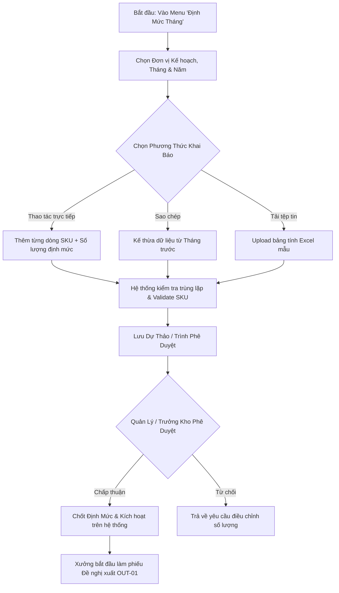

# UC-30 (PLN-01) — KHAI BÁO & QUẢN LÝ ĐỊNH MỨC VẬT TƯ THÁNG CỦA CÁC ĐƠN VỊ

## 0. Document Control

| Thuộc tính | Nội dung |
|---|---|
| Use Case ID | `UC-30 (PLN-01)` |
| Use Case Name | Khai Báo & Quản Lý Định Mức Cấp Phát Vật Tư Tháng Của Các Đơn Vị |
| Module | `WMS / Planning & Material Quota (Quản Lý Định Mức)` |
| Business Owner | Phòng Quản Lý Kế Hoạch Sản Xuất & Ban Quản Trị Kho (KNSG) |
| Product Owner / BA | Đội Ngũ Phân Tích Nghiệp Vụ WMS |
| Technical Owner | Tech Lead / Database & Architecture Team |
| Version | `v1.0` |
| Status | `Proposal / Specification Draft` |
| Last Updated | `2026-08-22` |

---

# A. BUSINESS SPECIFICATION — WHAT

## 1. Use Case Overview

### 1.1. Business Objective
Cung cấp phân hệ chuyên biệt cho phép Phòng Kế Hoạch Sản Xuất và các Đơn vị/Phân xưởng trực thuộc (Xưởng Dập, Xưởng Mạ, Line Inox, Xưởng Nhiệt Luyện,...) khai báo, phê duyệt và giám sát hạn mức cấp phát vật tư tiêu hao theo từng Tháng/Năm (`tbl_dinhmuc`, `tbl_kehoach_dinhmuc`). 

Hệ thống đóng vai trò là "chốt chặn định mức", tự động liên kết với quy trình Đăng ký đề nghị xuất kho theo kế hoạch (UC-19 / OUT-01) nhằm:
1. Kiểm soát chặt chẽ sản lượng vật tư xuất xưởng, ngăn ngừa thất thoát và lãng phí.
2. Tự động tính toán số lượng tiêu hao lũy kế và số dư định mức còn lại theo thời gian thực (Realtime Remaining Quota).
3. Đưa ra cảnh báo trực quan khi phân xưởng chạm ngưỡng hoặc vượt hạn mức tháng.

### 1.2. Primary Actors
- **Nhân viên Kế hoạch Sản xuất / Thư ký Phân xưởng:** Lập bảng dự trù định mức tháng, nhập liệu hoặc tải lên từ Excel.
- **Trưởng Phòng Kế Hoạch / Quản Đốc Phân Xưởng:** Rà soát, xác nhận và gửi duyệt bảng định mức.
- **Trưởng Phòng Kho / Ban Giám Đốc:** Ký duyệt chính thức hạn mức tháng để đưa vào vận hành xuất kho.

### 1.3. Secondary Actors / Systems
- **Hệ thống ERP Bravo:** Đối soát mã bộ phận (`ma_bravo_bophan`), mã vật tư (`id_bravo`) và định mức BOM sản phẩm.
- **Phân hệ Đề nghị Xuất kho (OUT-01 / OUT-04):** Tự động truy vấn số dư định mức khả dụng để duyệt cấp phát tự động.
- **Màn hình Tivi Giám Sát (TV Wallboard UC-29):** Hiển thị biểu đồ % tiến độ tiêu hao định mức của từng phân xưởng trong tháng.

### 1.4. Trigger
- Định kỳ hàng tháng (thường từ ngày 20 đến 28 của tháng trước), đơn vị kế hoạch khởi tạo kỳ định mức mới cho tháng tiếp theo.
- Phát sinh nhu cầu điều chỉnh / bổ sung định mức đột xuất do thay đổi kế hoạch sản xuất.

### 1.5. Preconditions
1. Người dùng đã đăng nhập với tài khoản hợp lệ thuộc nhóm quyền Quản lý định mức (`pln.view`, `pln.create`, `pln.approve`).
2. Danh mục Đơn vị kế hoạch (`dbo.tbl_dm_kehoach`) và Danh mục Bộ phận Bravo (`dbo.tbl_sx_bravo`) đã được cấu hình hoạt động (`status_active = 1`).
3. Danh mục SKU/Vật tư (`dbo.tbl_dm_vattu`) đã đồng bộ đầy đủ mã nội bộ (`id_vattu`), mã Bravo (`id_bravo`) và Đơn vị tính (`unit`).

### 1.6. Postconditions
#### Thành công (Success):
- Bản ghi định mức tháng được lưu trữ đầy đủ trong `dbo.tbl_dinhmuc` với trạng thái hiệu lực (`is_active = 1`).
- Lưu vết lịch sử phê duyệt định mức trong `dbo.tbl_kehoach_dinhmuc` và `dbo.tbl_flow_pheduyet`.
- Các phiếu Đề nghị xuất kho (OUT-01) ngay lập tức nhìn thấy số dư định mức mới để đăng ký vật tư.

#### Thất bại (Failure):
- Giao dịch bị hủy bỏ, hệ thống báo lỗi cụ thể (Trùng mã vật tư trong cùng kỳ, sai định dạng số lượng, đơn vị kế hoạch bị khóa).

---

## 2. Business Rules & Logic Matrix

### 2.1. Ma Trận Quy Tắc Nghiệp Vụ (Business Rules)

| Mã Quy Tắc | Tên Quy Tắc | Mô Tả Chi Tiết & Ràng Buộc Hệ Thống | Mức Độ |
|---|---|---|:---:|
| **BR-PLN-01** | Tính Duy Nhất Của Kỳ Định Mức | Mỗi cặp `(donvi_kehoach, id_vattu, thang, nam)` chỉ tồn tại **duy nhất 1 dòng định mức hoạt động**. Không cho phép khai báo trùng lặp vật tư trong cùng 1 tháng của đơn vị. | **Bắt buộc** |
| **BR-PLN-02** | Số Lượng Định Mức Hợp Lệ | Số lượng định mức (`dinh_muc`) phải là số dương $> 0$, hỗ trợ độ chính xác tối đa 4 chữ số thập phân (`decimal(19,4)`). | **Bắt buộc** |
| **BR-PLN-03** | Khóa Kỳ Định Mức Quá Khứ | Không cho phép chỉnh sửa hoặc tạo mới định mức của các tháng đã qua. Chỉ được phép khai báo cho **Tháng hiện tại** hoặc **Tháng tương lai**. | **Bảo mật** |
| **BR-PLN-04** | Cơ Chế Trừ Lũy Kế Tồn Định Mức | `RemainingQuantity = dinh_muc - SUM(so_luong_da_de_nghi)`. Trong đó, `so_luong_da_de_nghi` tính tất cả các phiếu đề nghị xuất ở trạng thái khác `REJECT` và khác `0 (Đã hủy)`. | **Bắt buộc** |
| **BR-PLN-05** | Sao Chép Nhanh Từ Tháng Trước | Cho phép tính năng **"Copy Định Mức Tháng Trước"** để kế thừa toàn bộ danh mục vật tư & số lượng sang tháng mới chỉ với 1 click, sau đó cho phép sửa nhanh. | **Tiện ích** |
| **BR-PLN-06** | Hỗ Trợ Nhập Liệu Hàng Loạt (Excel) | Cho phép tải lên file Excel (.xlsx) danh sách hàng trăm vật tư định mức. Hệ thống tự động validate mã SKU, cảnh báo dòng lỗi và chỉ import các dòng hợp lệ. | **Tiện ích** |
| **BR-PLN-07** | Phân Quyền Theo Phân Xưởng | Tài khoản của xưởng nào (`ma_bophan`) chỉ được xem và lập định mức của đơn vị đó; Admin và Trưởng phòng được xem/duyệt tất cả các xưởng. | **Phân quyền** |

---

## 3. Workflow & Screen Layout Specification

### 3.1. Luồng Thao Tác Nghiệp Vụ (User Workflow)



### 3.2. Cấu Trúc Giao Diện Người Dùng (Screen Blueprint)

#### Giao diện gồm 3 Tab chính:
1. **Tab 1: Bảng Định Mức Đang Áp Dụng (Active Quota Ledger):**
   - Bộ lọc: Chọn Đơn vị kế hoạch, Chọn Tháng/Năm, Tìm kiếm SKU / Tên vật tư.
   - Các cột dữ liệu:
     - `Mã SKU` | `Mã Bravo` | `Tên Vật Tư` | `ĐVT`
     - `Định Mức Cấp (A)` | `Đã Đề Nghị (B)` | `Thực Xuất (C)` | `Còn Lại (A - B)`
     - `Tiến Độ Tiêu Hao (%)` (Thanh ProgressBar màu: Xanh < 80%, Vàng 80-99%, Đỏ >= 100%)
     - `Ghi Chú` | `Thao Tác (Sửa / Khóa)`
   - Thống kê nhanh Header Cards:
     - *Tổng số loại vật tư* | *Tổng sản lượng định mức* | *Tỷ lệ tiêu hao bình quân* | *Số SKU chạm ngưỡng đỏ*

2. **Tab 2: Khai Báo & Nhập Liệu Mới (Quota Declaration & Import):**
   - Chọn Tháng/Năm áp dụng và Đơn vị tiếp nhận.
   - Nút chức năng:
     - `+ Thêm Mới 1 Dòng Vật Tư`
     - `📥 Tải File Mẫu Excel`
     - `📤 Import Dữ Liệu Từ Excel`
     - `📋 Copy Toàn Bộ Định Mức Tháng Trước`
   - Bảng soạn thảo trực quan với chế độ Inline Edit.
   - Nút `Lưu Bản Nháp` và `Trình Duyệt Định Mức`.

3. **Tab 3: Lịch Sử & Báo Cáo Tiêu Hao Định Mức (Consumption History & Analytics):**
   - Biểu đồ đối chiếu theo thời gian: Định mức được giao vs Lượng thực tế đã xuất.
   - Xuất Báo Cáo Excel / PDF phục vụ kiểm toán chi phí sản xuất cuối tháng.

---

# B. TECHNICAL SPECIFICATION — HOW

## 1. Database Schema & Data Dictionary

### 1.1. Bảng Dữ Liệu Chính: `dbo.tbl_dinhmuc`

```sql
-- DDL cấu trúc chuẩn hóa cho dbo.tbl_dinhmuc
CREATE TABLE dbo.tbl_dinhmuc
(
    id_kehoach          int IDENTITY(1,1) NOT NULL PRIMARY KEY,
    donvi_kehoach       nvarchar(50) NOT NULL,      -- Mã đơn vị kế hoạch (PX_DAP, LINE_KEM_INOX,...)
    id_vattu            nvarchar(50) NOT NULL,      -- Mã SKU vật tư nội bộ
    id_bravo            nvarchar(50) NULL,          -- Mã vật tư kế toán Bravo
    ten_vattu           nvarchar(250) NULL,         -- Tên vật tư hiển thị
    unit                nvarchar(50) NULL,          -- Đơn vị tính
    dinh_muc            decimal(19,4) NOT NULL DEFAULT (0), -- Sản lượng định mức tháng
    thang               int NOT NULL,               -- Tháng áp dụng (1 - 12)
    nam                 int NOT NULL,               -- Năm áp dụng (2026,...)
    ghi_chu             nvarchar(500) NULL,         -- Ghi chú kế hoạch
    is_active           int NOT NULL DEFAULT (1),   -- 1 = Đang áp dụng, 0 = Đã khóa/Hủy
    user_cre            nvarchar(50) NULL,          -- Người khai báo
    time_cre            datetime NOT NULL DEFAULT (GETDATE()), -- Ngày tạo (Mặc định GETDATE())
    user_up             nvarchar(50) NULL,          -- Người cập nhật cuối
    time_up             datetime NULL,              -- Ngày cập nhật cuối
    CONSTRAINT UQ_tbl_dinhmuc_period UNIQUE (donvi_kehoach, id_vattu, thang, nam)
);
```

### 1.2. View Tính Toán Tiêu Hao Thời Gian Thực: `api.vw_WMS_PLN_QuotaBalance_v1`

```sql
CREATE OR ALTER VIEW api.vw_WMS_PLN_QuotaBalance_v1
AS
SELECT 
    planItem.id_kehoach,
    planItem.donvi_kehoach,
    planUnit.ten_kehoach AS ten_donvi_kehoach,
    planItem.id_vattu,
    planItem.id_bravo,
    planItem.ten_vattu,
    planItem.unit,
    planItem.thang,
    planItem.nam,
    planItem.dinh_muc AS LimitQuantity,
    ISNULL(usage.RequestedQuantity, 0) AS RequestedQuantity,
    ISNULL(usage.IssuedQuantity, 0) AS IssuedQuantity,
    CASE 
        WHEN planItem.dinh_muc > ISNULL(usage.RequestedQuantity, 0) 
        THEN planItem.dinh_muc - ISNULL(usage.RequestedQuantity, 0)
        ELSE 0 
    END AS RemainingQuantity,
    CASE 
        WHEN planItem.dinh_muc > 0 
        THEN ROUND((ISNULL(usage.RequestedQuantity, 0) * 100.0) / planItem.dinh_muc, 2)
        ELSE 0 
    END AS ConsumptionPercentage,
    planItem.is_active,
    planItem.ghi_chu
FROM dbo.tbl_dinhmuc AS planItem
LEFT JOIN dbo.tbl_dm_kehoach AS planUnit ON planUnit.donvi_kehoach = planItem.donvi_kehoach
OUTER APPLY
(
    SELECT 
        RequestedQuantity = SUM(ISNULL(line.so_luong, 0)),
        IssuedQuantity = SUM(CASE WHEN req.status_soanhang = N'2' THEN ISNULL(line.so_luong, 0) ELSE 0 END)
    FROM dbo.tbl_phieu_yeucau_chitiet AS line
    INNER JOIN dbo.tbl_phieu_yeucau AS req ON req.id_phieu_yeucau = line.id_phieu_yeucau
    WHERE line.id_kehoach = planItem.id_kehoach
      AND ISNULL(req.trang_thai_phieu, N'0') <> N'0'
      AND NOT EXISTS
      (
          SELECT 1 FROM dbo.tbl_his_pheduyet AS history
          WHERE history.id_phieu_yeucau = req.id_phieu_yeucau
            AND LOWER(ISNULL(history.trangthai_pheduyet, N'')) = N'reject'
      )
) AS usage;
```

---

## 2. Danh Mục Stored Procedures Cần Xây Dựng

| STT | Tên Stored Procedure | Mục Đích Nghiệp Vụ | Tham Số Chính |
|---|---|---|---|
| 1 | `api.usp_WMS_PLN01_GetMonthlyQuota_v1` | Lấy danh sách định mức & % tiêu hao theo tháng/đơn vị | `@UserId`, `@PlanningUnit`, `@Month`, `@Year`, `@Search`, `@Page`, `@PageSize` |
| 2 | `api.usp_WMS_PLN02_SaveQuotaItem_v1` | Thêm mới / Cập nhật 1 dòng định mức vật tư | `@UserId`, `@PlanId`, `@PlanningUnit`, `@MaterialId`, `@Quantity`, `@Month`, `@Year`, `@Note` |
| 3 | `api.usp_WMS_PLN03_BulkSaveQuota_v1` | Lưu hàng loạt định mức từ Form hoặc Import Excel | `@UserId`, `@PlanningUnit`, `@Month`, `@Year`, `@ItemsJson` (hoặc TVP) |
| 4 | `api.usp_WMS_PLN04_CopyPreviousMonthQuota_v1` | Tự động nhân bản định mức từ tháng trước sang tháng mới | `@UserId`, `@PlanningUnit`, `@SourceMonth`, `@SourceYear`, `@TargetMonth`, `@TargetYear` |
| 5 | `api.usp_WMS_PLN05_ToggleQuotaStatus_v1` | Khóa / Kích hoạt dòng định mức | `@UserId`, `@PlanId`, `@IsActive` |

---

## 3. Danh Mục REST API Minimal Endpoints

- `GET /api/v1/planning/quotas`: Lấy danh sách định mức tháng (kèm bộ lọc và số dư tồn khả dụng).
- `POST /api/v1/planning/quotas`: Thêm mới hoặc cập nhật 1 dòng định mức.
- `POST /api/v1/planning/quotas/bulk-import`: Import danh sách định mức từ Excel hoặc JSON payload.
- `POST /api/v1/planning/quotas/copy-previous-month`: Sao chép định mức từ tháng liền kề.
- `PATCH /api/v1/planning/quotas/{planId}/status`: Khóa hoặc mở lại dòng định mức.
- `GET /api/v1/planning/quotas/export-template`: Tải file Excel mẫu để người dùng điền dữ liệu.

---

## 4. Phân Quyền Bảo Mật (RBAC Permissions)

| Mã Quyền | Tên Quyền | Phân Phối Cho Role Mặc Định |
|---|---|---|
| `pln.view` | Xem danh mục định mức & theo dõi tiêu hao | `admin`, `truongphong_kho`, `thukho`, `bophan_yeucau`, `viewer` |
| `pln.create` | Lập dự trù & Khai báo định mức tháng (Import Excel) | `admin`, `truongphong_kho`, `bophan_yeucau` |
| `pln.approve` | Duyệt chốt định mức tháng & Khóa/Mở định mức | `admin`, `truongphong_kho` |
