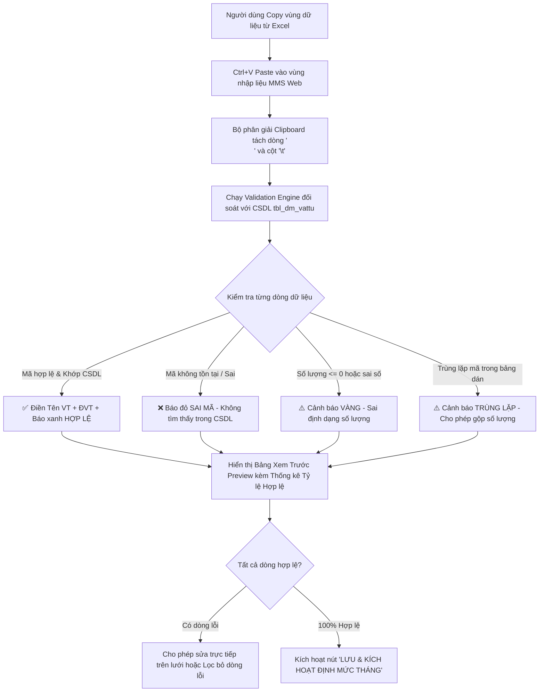

# UC-30 (PLN-01) — KHAI BÁO ĐỊNH MỨC VẬT TƯ THÁNG CHO TỪNG ĐƠN VỊ KẾ HOẠCH

## 0. Document Control

| Thuộc tính | Nội dung |
|---|---|
| Use Case ID | `UC-30 (PLN-01)` |
| Use Case Name | Khai Báo & Thiết Lập Định Mức Cấp Phát Vật Tư Tháng Cho Từng Đơn Vị Kế Hoạch |
| Module | `WMS / Planning & Quota Declaration (Khai Báo Định Mức)` |
| Business Owner | Phòng Quản Lý Kế Hoạch Sản Xuất & Ban Quản Trị Kho (KNSG) |
| Product Owner / BA | Đội Ngũ Phân Tích Nghiệp Vụ WMS |
| Technical Owner | Tech Lead / Database & Frontend Architecture Team |
| Version | `v2.0 (Enhanced with Smart Grid Paste & Code Validator)` |
| Status | `Approved / Specification Complete` |
| Last Updated | `2026-08-22` |

---

# A. BUSINESS SPECIFICATION — WHAT

## 1. Use Case Overview

### 1.1. Business Objective
Cung cấp màn hình khai báo định mức tháng chuyên biệt cho từng **Đơn vị kế hoạch** (`donvi_kehoach` - như Phân xưởng Dập, Phân xưởng Mạ, Line Kèm Inox, Xưởng Nhiệt Luyện,...). 

Trọng tâm của phân hệ là **Cơ chế Dán Dữ Liệu Thông Minh Từ Excel (Smart Grid Paste)** kết hợp **Bộ Đối Soát Mã Danh Mục Tự Động (Catalog Validation Engine)**:
1. Cho phép nhân viên Kế hoạch Copy toàn bộ bảng dữ liệu từ Excel và **Paste trực tiếp vào vùng nhập liệu chuẩn cột** trên giao diện Web.
2. Hệ thống tự động phân tách cột, tự động đối soát từng mã vật tư (`id_vattu` / `id_bravo`) với Danh mục vật tư chuẩn `dbo.tbl_dm_vattu`.
3. Phát hiện và cảnh báo tức thì các dòng sai mã, trùng mã hoặc không tồn tại trước khi lưu vào CSDL.

### 1.2. Primary Actors
- **Nhân viên Kế hoạch Sản xuất / Thư ký Phân xưởng:** Chọn đơn vị kế hoạch, dán bảng Excel định mức tháng, kiểm tra lỗi và lưu định mức.
- **Trưởng Phòng Kế Hoạch / Quản Đốc Phân Xưởng:** Kiểm tra và ký duyệt bảng định mức của đơn vị.

### 1.3. Secondary Actors / Systems
- **Danh mục Vật tư MMS & Bravo (`tbl_dm_vattu`):** Đối soát mã SKU, mã Bravo, tên và ĐVT.
- **Danh mục Đơn vị Kế hoạch (`tbl_dm_kehoach`):** Xác định phạm vi áp dụng của phân xưởng.

### 1.4. Preconditions
1. Người dùng có quyền truy cập chức năng khai báo định mức (`pln.create` / `scr_khai_bao_dinhmuc`).
2. Danh mục Đơn vị kế hoạch và Danh mục SKU vật tư đang ở trạng thái hoạt động (`status_active = 1`).

---

## 2. Quy Định Chuẩn Cột & Cơ Chế Dán Dữ Liệu (Smart Grid Paste Engine)

### 2.1. Quy Định Định Dạng Cột Khi Dán (Paste Format Specification)

Bảng Excel nguồn của người dùng cần tuân thủ thứ tự 4 cột chuẩn sau (hoặc người dùng có thể tùy chỉnh ánh xạ cột):

| Cột | Tên Cột Quy Định | Kiểu Dữ Liệu | Bắt Buộc? | Quy Tắc Kiểm Tra & Xử Lý Tự Động |
|:---:|---|---|:---:|---|
| **1** | **Mã Vật Tư / SKU** | Chuỗi (Varchar) | **Bắt buộc** | So khớp với `id_vattu` hoặc `id_bravo` trong `tbl_dm_vattu`. Tự động cắt khoảng trắng thừa. |
| **2** | **Số Lượng Định Mức** | Số thực (Decimal) | **Bắt buộc** | Phải là số dương $> 0$. Hỗ trợ dấu chấm `.` hoặc phẩy `,` ngăn cách thập phân. |
| **3** | **Đơn Vị Tính (ĐVT)** | Chuỗi (Varchar) | Tùy chọn | Nếu để trống, hệ thống tự động điền ĐVT chuẩn từ `tbl_dm_vattu`. |
| **4** | **Ghi Chú / Mục Đích** | Chuỗi (Varchar) | Tùy chọn | Diễn giải mục đích cấp phát, định mức BOM hoặc lệnh SX. |

---

### 2.2. Bộ Kiểm Soát & Đối Soát Mã Danh Mục (Validation Engine)

Khi người dùng thực hiện thao tác **Ctrl + V (Paste)** vào vùng nhập liệu:

#### Trạng thái dòng sau khi dán:
1. 🟢 **HỢP LỆ (Valid):** Mã khớp `tbl_dm_vattu`, số lượng $> 0$. Tự động hiển thị Tên vật tư và Đơn vị tính chính thức.
2. 🔴 **SAI MÃ (Invalid Code):** Mã không có trong danh mục. Hệ thống tô đỏ ô mã, hiển thị tooltip: *"Mã này không tồn tại trong hệ thống MMS/Bravo"*.
3. 🟡 **TRÙNG LẶP (Duplicate SKU):** Cùng 1 mã SKU xuất hiện nhiều lần trong bảng dán. Hệ thống cung cấp nút bấm: *"Gộp cộng dồn số lượng các dòng trùng"*.

---

## 3. Thiết Kế Giao Diện Khai Báo (Screen Blueprint)

### 3.1. Khu Vực Thiết Lập Kỳ Định Mức (Header Controls)
- **Chọn Đơn vị kế hoạch (`donvi_kehoach`):** Dropdown chọn Phân xưởng Dập / Xưởng Mạ / Line Kèm Inox / Xưởng Nhiệt Luyện / Bao Bì,...
- **Chọn Tháng & Năm:** Mặc định chọn Tháng tiếp theo (hoặc Tháng hiện tại).
- **Bộ đếm trạng thái dòng:**
  - *Tổng số dòng dán:* `N` dòng
  - *Hợp lệ:* `X` dòng (100% sẵn sàng)
  - *Lỗi cần sửa:* `Y` dòng (nếu $Y > 0$, nút Lưu sẽ bị vô hiệu hóa kèm cảnh báo)

### 3.2. Khu Vực Vùng Dán & Bảng Soạn Thảo (Interactive Paste Grid)
- **Khung Dán Nhanh (Smart Paste Dropzone):** Ô viền nét đứt lớn hỗ trợ bấm vào và ấn `Ctrl + V` từ Excel.
- **Bảng Lưới Soạn Thảo Chi Tiết (Data Grid):**
  - Cột `STT` | `Trạng Thái (Icon ✅/❌/⚠️)` | `Mã Vật Tư` | `Mã Bravo` | `Tên Vật Tư` | `ĐVT` | `Số Lượng Định Mức` | `Ghi Chú` | `Xóa`
  - Cho phép **chỉnh sửa trực tiếp (Inline Edit)** trên từng ô để sửa nhanh mã sai mà không cần quay lại Excel.
- **Thanh Công Cụ Hỗ Trợ:**
  - `📋 Copy từ Tháng Trước`: Tự động nạp danh mục định mức của tháng liền kề để chỉnh sửa số lượng.
  - `🧹 Xóa Tất Cả Dòng Lỗi`: Loại bỏ nhanh các dòng sai mã.
  - `📥 Tải File Mẫu Excel`: Tải file `.xlsx` chuẩn cột mẫu.

---

# B. TECHNICAL SPECIFICATION — HOW

## 1. Database Operations & Stored Procedures

### 1.1. Bảng Dữ Liệu Lưu Trữ: `dbo.tbl_dinhmuc`
- `donvi_kehoach`: Mã phân xưởng/đơn vị kế hoạch.
- `id_vattu`: Mã SKU vật tư nội bộ.
- `id_bravo`: Mã vật tư kế toán Bravo.
- `dinh_muc`: Số lượng định mức tháng (`decimal(19,4)`).
- `thang`, `nam`: Kỳ áp dụng.
- Ràng buộc: `time_cre` mặc định `GETDATE()` khi Insert, mọi cập nhật chỉ gán `time_up = GETDATE()`, `user_up = @UserId`.

### 1.2. Stored Procedure Kiểm Tra & Lưu Hàng Loạt: `api.usp_WMS_PLN01_BulkSaveQuota_v1`
- Nhận danh sách dòng JSON hoặc TVP `@ItemsJson`.
- Tự động so khớp với `dbo.tbl_dm_vattu` để điền `ten_vattu`, `unit`, `id_bravo`.
- Thực thi trong giao dịch ACID (`BEGIN TRANSACTION` ... `COMMIT`).

---

## 2. API Endpoints

- `POST /api/v1/planning/quotas/validate-paste`: Nhận mảng chuỗi dữ liệu dán, trả về kết quả đối soát danh mục chi tiết (Tên VT, ĐVT, trạng thái Hợp lệ/Lỗi).
- `POST /api/v1/planning/quotas/bulk-save`: Lưu toàn bộ danh sách định mức đã được validate vào CSDL.
- `POST /api/v1/planning/quotas/copy-previous-month`: Nhân bản định mức từ tháng trước sang tháng mới.
