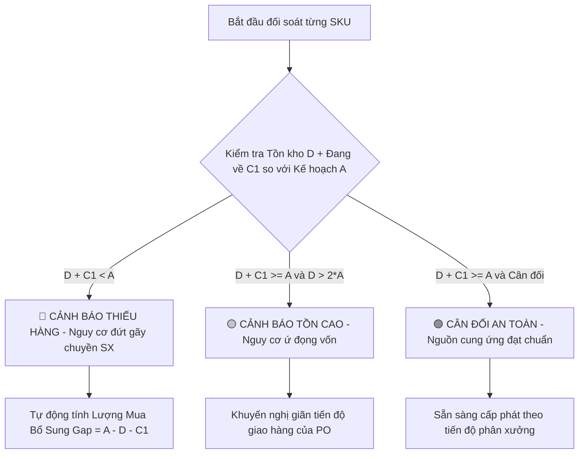

# UC-32 (PLN-03) — QUẢN LÝ ĐỐI SOÁT CÂN ĐỐI KẾ HOẠCH VẬT TƯ — SỬ DỤNG THỰC TẾ — NHẬP MUA HÀNG

## 0. Document Control

| Thuộc tính | Nội dung |
|---|---|
| Use Case ID | `UC-32 (PLN-03)` |
| Use Case Name | Quản Lý Đối Soát Cân Đối Kế Hoạch Vật Tư — Sử Dụng Thực Tế — Nhập Mua Hàng (Planning vs. Consumption vs. Procurement Balance) |
| Module | `WMS / Material Supply-Demand Balancing (Cân Đối Kế Hoạch - Mua Hàng - Sử Dụng)` |
| Business Owner | Ban Giám Đốc, Phòng Kế Hoạch Sản Xuất, Phòng Mua Hàng & Quản Trị Kho (KNSG) |
| Product Owner / BA | Đội Ngũ Phân Tích Nghiệp Vụ WMS |
| Technical Owner | Tech Lead / Database & Analytics Architecture Team |
| Version | `v1.0` |
| Status | `Approved / Specification Complete` |
| Last Updated | `2026-08-22` |

---

# A. BUSINESS SPECIFICATION — WHAT

## 1. Use Case Overview

### 1.1. Business Objective
Cung cấp bức tranh quản trị tổng thể và ma trận cân đối 3 chiều (3-Way Supply & Demand Reconciliation):
$$\mathbf{Kế\ Hoạch\ Định\ Mức\ (A)} \quad \Longleftrightarrow \quad \mathbf{Sử\ Dụng\ Thực\ Tế\ (B)} \quad \Longleftrightarrow \quad \mathbf{Tiến\ Độ\ Nhập\ Mua\ PO\ (C)}$$

Phân hệ giải quyết bài toán cốt lõi của chuỗi cung ứng Kèm Nghĩa (KNSG):
1. **Đối soát Kế hoạch vs Thực xuất ($A \iff B$):** Phân xưởng có sử dụng đúng định mức không? Đang tiết kiệm hay vượt hạn mức?
2. **Đối soát Kế hoạch vs Tiến độ Mua hàng ($A \iff C$):** Phòng Mua hàng đã phát hành PO và nhập kho đủ vật tư để đáp ứng kế hoạch sản xuất chưa? Có nguy cơ đứt chuyền do thiếu vật tư không?
3. **Cân đối Tồn kho & Đề xuất Đặt mua ($D$ & Purchase Recommendation):** Tự động tính toán lượng vật tư cần mua bổ sung dựa trên:
   $$\text{Nhu Cầu Thiếu Hụt (Gap)} = \text{Kế Hoạch (A)} - \big[\text{Tồn Kho Khả Dụng (D)} + \text{Hàng Đang Trên Đường Về (PO In-Transit)}\big]$$
4. **Cảnh báo Lệch Pha Cung - Cầu:** Phát hiện tình trạng **Tồn ứ vượt định mức (Overstock)** hoặc **Thiếu hụt cục bộ (Stockout Warning)**.

### 1.2. Primary Actors
- **Phòng Kế Hoạch Sản Xuất:** Giám sát mức độ đáp ứng vật tư của chuỗi cung ứng cho các đơn vị.
- **Phòng Mua Hàng (Purchasing / SCM):** Theo dõi tiến độ nhập hàng theo PO để kịp thời thúc đẩy nhà cung cấp giao hàng.
- **Ban Quản Trị Kho & Thủ Kho:** Điều phối không gian lưu trữ và lịch tiếp nhận hàng tại cửa nhập.
- **Ban Giám Đốc:** Đánh giá hiệu quả chi phí, vòng quay tồn kho và tỷ lệ hoàn thành kế hoạch.

### 1.3. Secondary Actors / Systems
- **ERP Bravo (PO & AP Module):** Cung cấp dữ liệu đơn đặt hàng mua (`tbl_po_bravo`, `ma_ncc`, `ngay_giao_du_kien`).
- **Phân hệ Nhận hàng Inbound (UC-03 / UC-04):** Ghi nhận sản lượng thực nhận vào kho.
- **Phân hệ Soạn xuất Outbound (UC-23 / UC-24):** Ghi nhận sản lượng thực tế xuất cho các phân xưởng.

---

## 2. Ma Trận Cân Đối 3 Chiều & Các Chỉ Số Quản Trị (3-Way Matrix & KPIs)

### 2.1. Ma Trận Cân Đối Cột Dữ Liệu (Reconciliation Grid Columns)

| Nhóm Cột | Tên Cột | Ký Hiệu | Diễn Giải & Công Thức Tính | Nguồn Dữ Liệu |
|---|---|:---:|---|---|
| **Thông tin SKU** | Mã Vật Tư / SKU | `SKU` | Mã nội bộ + Mã Bravo | `tbl_dm_vattu` |
| | Tên Vật Tư & ĐVT | `Tên` | Tên mô tả và Đơn vị tính | `tbl_dm_vattu` |
| **1. Kế Hoạch (Demand)** | Định Mức Tháng | **$A$** | Tổng định mức tháng được duyệt của tất cả đơn vị | `tbl_dinhmuc` |
| **2. Sử Dụng (Outbound)** | Đã Đề Nghị Xuất | **$B_1$** | Sản lượng trên các phiếu yêu cầu hợp lệ | `tbl_phieu_yeucau_chitiet` |
| | Thực Xuất Cấp Phát | **$B_2$** | Sản lượng đã trừ kho và bàn giao cho xưởng | `tbl_transaction` (OUT_CON) |
| | Tồn Định Mức Còn Lại | **$A - B_1$** | Hạn mức còn lại các xưởng được phép đề nghị | Tính toán thời gian thực |
| **3. Nhập Mua (Inbound)** | Sản Lượng Đặt Mua PO | **$C_1$** | Tổng lượng theo Đơn mua hàng PO phát hành trong kỳ | `tbl_po_bravo` / Inbound PO |
| | Thực Nhập Vào Kho | **$C_2$** | Sản lượng đã qua QC và hoàn tất thủ tục nhập kho | `tbl_receiving_lines` / Batch Inv |
| | Hàng Đang Về (In-Transit) | **$C_1 - C_2$** | Lượng hàng NCC chưa giao hoặc đang chờ QC | `tbl_po_bravo` - Thực nhận |
| **4. Tồn Kho (Inventory)** | Tồn Kho Khả Dụng Hiện Tại | **$D$** | Tồn kho thực tế tại các ô kệ sẵn sàng xuất | `tbl_batch_inv` (`trang_thai_ton=1`) |
| **5. Cân Đối & Đánh Giá** | Tỷ Lệ Đáp Ứng Kế Hoạch | **$R_{supply}$** | $\dfrac{D + C_1}{A} \times 100\%$ (Đã chuẩn bị đủ nguồn hàng chưa) | Chỉ số % tiến độ cung ứng |
| | Tỷ Lệ Tiêu Hao Thực Tế | **$R_{use}$** | $\dfrac{B_2}{A} \times 100\%$ (Đã tiêu thụ bao nhiêu % kế hoạch) | Chỉ số % tiến độ sử dụng |
| | Đề Xuất Mua Bổ Sung | **$Gap$** | $\max(0, A - [D + C_1])$ (Cần đặt mua thêm nếu thiếu) | Cảnh báo mua hàng tự động |

---

### 2.2. Phân Cấp Trạng Thái Cảnh Báo Cân Đối (Status Classification)



1. 🔴 **NGUY CƠ THIẾU VẬT TƯ (Critical Shortage):** $(D + C_1) < A$. Tổng lượng hàng có sẵn và đang đặt mua không đủ phục vụ định mức sản xuất. Hệ thống tô đỏ và đề xuất khối lượng cần đặt mua gấp.
2. 🟡 **DƯ THỪA / TỒN CAO (Overstock Warning):** $D > 2 \times A$. Tồn kho khả dụng vượt quá 2 tháng định mức, cảnh báo phòng Mua hàng xem xét giãn tiến độ giao hàng để tối ưu dòng tiền.
3. 🟢 **CÂN ĐỐI AN TOÀN (Balanced):** Nguồn cung ứng và kế hoạch sản xuất khớp nhau trong ngưỡng an toàn ($\pm 10\%$).

---

## 3. Thiết Kế Giao Diện Quản Lý Cân Đối (Screen Blueprint)

### 3.1. Thống Kê Tổng Quan Cấp Cao (Executive Dashboard Cards)
- 📦 **Tổng Nhu Cầu Định Mức ($A$):** Tổng định mức các phân xưởng trong tháng.
- 🚚 **Tổng Đã Nhập Kho Mua Hàng ($C_2$):** Tiến độ nhập hàng từ nhà cung cấp.
- 🏭 **Tổng Đã Xuất Phục Vụ SX ($B_2$):** Lượng vật tư các xưởng đã thực nhận.
- 🚨 **Số Mặt Hàng Thiếu Hụt Nguồn Cung:** Số lượng SKU cần mua bổ sung ngay lập tức.

### 3.2. Bảng Ma Trận Cân Đối Nguồn Hàng & Bộ Lọc Nâng Cao
- **Bộ Lọc Đa Chiều:**
  - Lọc theo Tháng / Năm.
  - Lọc theo Đơn vị Kế hoạch / Phân xưởng (`donvi_kehoach`).
  - Lọc theo Nhóm Vật Tư (Kim loại, Nhựa, Hóa chất, Bao bì, Vật tư tiêu hao,...).
  - Lọc theo Trạng Thái Cân Đối: `Tất cả` | `🔴 Thiếu Hàng` | `🟡 Tồn Cao` | `🟢 Cân Đối`.
- **Thanh Công Cụ Xuất Báo Cáo:**
  - `📤 Xuất Bảng Đối Soát 3 Chiều (Excel / CSV)`.
  - `📑 In Báo Cáo Cân Đối Cung - Cầu Tháng (PDF)`.

---

# B. TECHNICAL SPECIFICATION — HOW

## 1. SQL View Cân Đối 3 Chiều: `api.vw_WMS_PLN_3WayReconciliation_v1`

```sql
CREATE OR ALTER VIEW api.vw_WMS_PLN_3WayReconciliation_v1
AS
SELECT 
    m.id_vattu AS MaterialId,
    m.id_bravo AS BravoId,
    m.ten_vattu AS MaterialName,
    m.unit AS Unit,
    cal.thang AS PlanMonth,
    cal.nam AS PlanYear,
    
    -- 1. Kế hoạch định mức (Demand - A)
    ISNULL(planSum.TotalPlanQuantity, 0) AS PlannedQuota,
    
    -- 2. Thực tế sử dụng (Consumption - B)
    ISNULL(useSum.TotalRequestedQuantity, 0) AS RequestedQuantity,
    ISNULL(useSum.TotalIssuedQuantity, 0) AS IssuedQuantity,
    CASE 
        WHEN ISNULL(planSum.TotalPlanQuantity, 0) > ISNULL(useSum.TotalRequestedQuantity, 0)
        THEN ISNULL(planSum.TotalPlanQuantity, 0) - ISNULL(useSum.TotalRequestedQuantity, 0)
        ELSE 0 
    END AS RemainingQuota,
    
    -- 3. Tiến độ nhập mua PO (Procurement - C)
    ISNULL(poSum.PoOrderedQuantity, 0) AS PoOrderedQuantity,
    ISNULL(inSum.ReceivedQuantity, 0) AS ReceivedQuantity,
    CASE 
        WHEN ISNULL(poSum.PoOrderedQuantity, 0) > ISNULL(inSum.ReceivedQuantity, 0)
        THEN ISNULL(poSum.PoOrderedQuantity, 0) - ISNULL(inSum.ReceivedQuantity, 0)
        ELSE 0 
    END AS InTransitQuantity,
    
    -- 4. Tồn kho khả dụng hiện tại (Inventory - D)
    ISNULL(invSum.AvailableInventory, 0) AS AvailableInventory,
    
    -- 5. Đánh giá cân đối & Đề xuất mua hàng
    CASE 
        WHEN ISNULL(planSum.TotalPlanQuantity, 0) > (ISNULL(invSum.AvailableInventory, 0) + ISNULL(poSum.PoOrderedQuantity, 0))
        THEN ISNULL(planSum.TotalPlanQuantity, 0) - (ISNULL(invSum.AvailableInventory, 0) + ISNULL(poSum.PoOrderedQuantity, 0))
        ELSE 0 
    END AS PurchaseRecommendationGap,
    
    CASE 
        WHEN (ISNULL(invSum.AvailableInventory, 0) + ISNULL(poSum.PoOrderedQuantity, 0)) < ISNULL(planSum.TotalPlanQuantity, 0) THEN N'SHORTAGE'
        WHEN ISNULL(invSum.AvailableInventory, 0) > (2 * ISNULL(planSum.TotalPlanQuantity, 0)) AND ISNULL(planSum.TotalPlanQuantity, 0) > 0 THEN N'OVERSTOCK'
        ELSE N'BALANCED'
    END AS BalanceStatusCode

FROM dbo.tbl_dm_vattu AS m
CROSS JOIN 
(
    SELECT DISTINCT thang, nam FROM dbo.tbl_dinhmuc
) AS cal

-- 1. Aggregate Plan Quotas
LEFT JOIN 
(
    SELECT id_vattu, thang, nam, SUM(dinh_muc) AS TotalPlanQuantity
    FROM dbo.tbl_dinhmuc
    WHERE is_active = 1
    GROUP BY id_vattu, thang, nam
) AS planSum ON planSum.id_vattu = m.id_vattu AND planSum.thang = cal.thang AND planSum.nam = cal.nam

-- 2. Aggregate Consumption
LEFT JOIN 
(
    SELECT 
        d.id_vattu,
        d.thang,
        d.nam,
        SUM(ISNULL(line.so_luong, 0)) AS TotalRequestedQuantity,
        SUM(CASE WHEN req.status_soanhang = N'2' THEN ISNULL(line.so_luong, 0) ELSE 0 END) AS TotalIssuedQuantity
    FROM dbo.tbl_phieu_yeucau_chitiet AS line
    INNER JOIN dbo.tbl_phieu_yeucau AS req ON req.id_phieu_yeucau = line.id_phieu_yeucau
    INNER JOIN dbo.tbl_dinhmuc AS d ON d.id_kehoach = line.id_kehoach
    WHERE ISNULL(req.trang_thai_phieu, N'0') <> N'0'
    GROUP BY d.id_vattu, d.thang, d.nam
) AS useSum ON useSum.id_vattu = m.id_vattu AND useSum.thang = cal.thang AND useSum.nam = cal.nam

-- 3. Aggregate Inbound PO & Received
LEFT JOIN 
(
    SELECT id_vattu, SUM(ISNULL(so_luong_nhan, 0)) AS ReceivedQuantity
    FROM dbo.tbl_receiving_lines
    GROUP BY id_vattu
) AS inSum ON inSum.id_vattu = m.id_vattu

LEFT JOIN 
(
    SELECT id_vattu, SUM(ISNULL(so_luong_po, 0)) AS PoOrderedQuantity
    FROM dbo.tbl_po_bravo
    GROUP BY id_vattu
) AS poSum ON poSum.id_vattu = m.id_vattu

-- 4. Aggregate Available Inventory
LEFT JOIN 
(
    SELECT id_vattu, SUM(ISNULL(so_luong, 0)) AS AvailableInventory
    FROM dbo.tbl_batch_inv
    WHERE (trang_thai_ton = 1 OR trang_thai_ton = N'1') AND so_luong > 0
    GROUP BY id_vattu
) AS invSum ON invSum.id_vattu = m.id_vattu

WHERE ISNULL(planSum.TotalPlanQuantity, 0) > 0 
   OR ISNULL(useSum.TotalRequestedQuantity, 0) > 0 
   OR ISNULL(invSum.AvailableInventory, 0) > 0;
```

---

## 2. Danh Mục Stored Procedures Cần Xây Dựng

1. **`api.usp_WMS_PLN03_Get3WayReconciliation_v1`**:
   - Tham số: `@UserId`, `@Month`, `@Year`, `@PlanningUnit`, `@Category`, `@BalanceStatus`, `@Search`, `@Page`, `@PageSize`.
   - Trả về: Bảng dữ liệu đối soát 3 chiều kèm các chỉ số KPI tổng hợp.
2. **`api.usp_WMS_PLN03_GetReconciliationDetailBySku_v1`**:
   - Tham số: `@UserId`, `@MaterialId`, `@Month`, `@Year`.
   - Trả về: Chi tiết 3 tab con của 1 SKU:
     - Tab Kế hoạch: Danh sách các phân xưởng được phân bổ định mức.
     - Tab Thực xuất: Lịch sử các phiếu yêu cầu / phiếu xuất đã cấp.
     - Tab Nhập mua: Danh sách các đơn PO và phiếu nhập kho liên quan.

---

## 3. REST API Endpoints

- `GET /api/v1/planning/reconciliation`: Bảng ma trận đối soát 3 chiều (Kế hoạch vs Sử dụng vs Mua hàng).
- `GET /api/v1/planning/reconciliation/{materialId}/details`: Chi tiết đối soát 3 nhánh của 1 SKU.
- `GET /api/v1/planning/reconciliation/export-excel`: Xuất báo cáo đối soát 3 chiều định dạng Excel.
- `GET /api/v1/planning/reconciliation/shortage-alerts`: Danh sách các SKU thiếu hụt cần mua bổ sung khẩn cấp.
