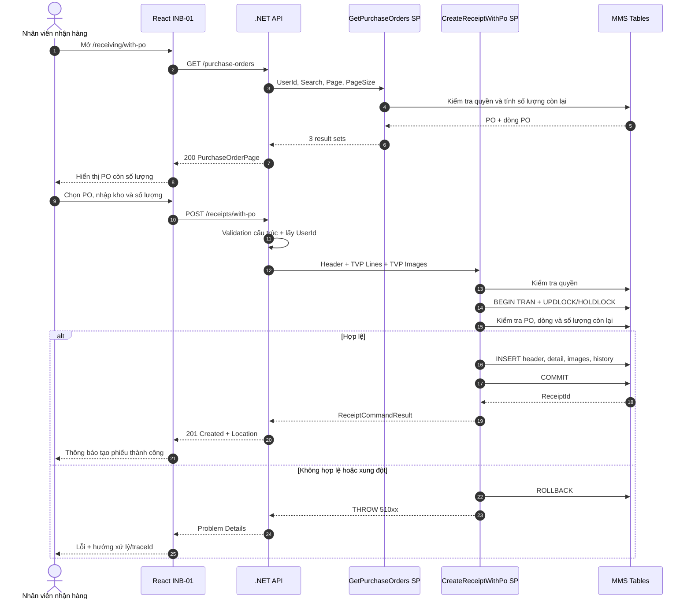
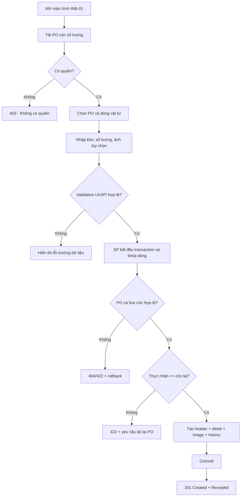
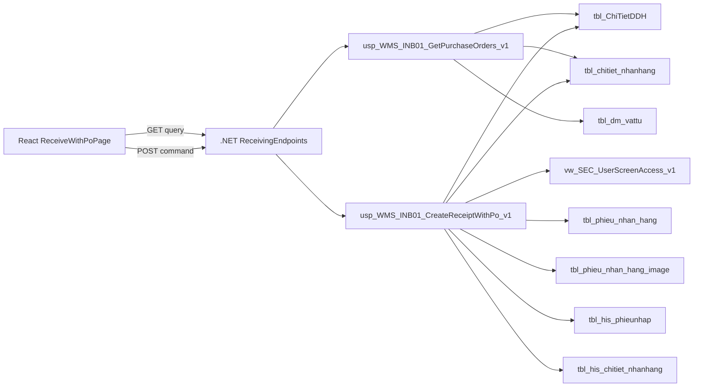
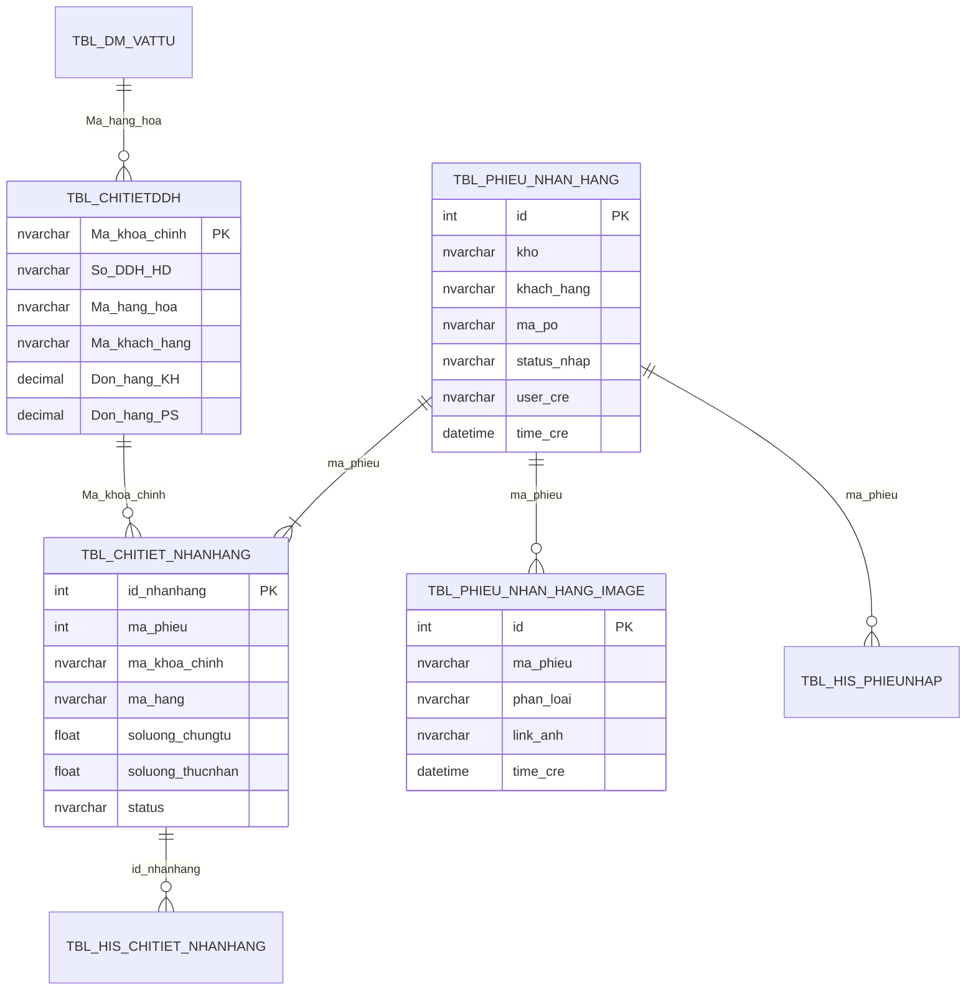
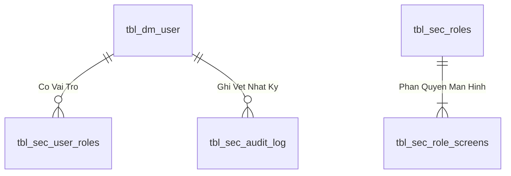

# Phân tích Thiết kế Logic UC01 / INB-01 - Nhận hàng theo PO

> **Mục tiêu tài liệu:** Mô tả đầy đủ nghiệp vụ, giao diện, lập trình, dữ liệu và luồng xử lý của chức năng nhận hàng theo đơn đặt hàng (PO) trong MMS React. Tài liệu sử dụng cấu trúc của `UC04_1_Partial_Receipt.md` nhưng ánh xạ trực tiếp vào contract React, .NET API và SQL hiện có của MMS.

## Thông tin kiểm soát tài liệu

| Thuộc tính | Giá trị |
| --- | --- |
| Use case nghiệp vụ | UC01 |
| Mã quản lý triển khai | INB-01 |
| Tên chức năng | Nhận hàng theo PO |
| Tác nhân chính | Nhân viên nhận hàng (`ACT-01`) |
| Route React | `/receiving/with-po` |
| Nhóm triển khai | W3 - Inbound |
| API | `GET /api/v1/receiving/purchase-orders`; `POST /api/v1/receiving/receipts/with-po` |
| Query SP | `api.usp_WMS_INB01_GetPurchaseOrders_v1` |
| Command SP | `api.usp_WMS_INB01_CreateReceiptWithPo_v1` |
| Trạng thái triển khai | Đã có code, chờ deploy SQL/UAT W3 |

---

## 1. Business Logic (Logic Nghiệp Vụ)

- **Mục tiêu cốt lõi:** Đảm bảo thực thi quy trình nghiệp vụ chuẩn hóa, kiểm soát tính toàn vẹn của dữ liệu và tuân thủ các quy định vận hành kho vật tư & sản xuất của nhà máy Kềm Nghĩa.

- **Các quy tắc nghiệp vụ (Business Rules):**
  - `BR-GEN-01` **Ràng buộc xác thực & Phân quyền (Security & Access Control):** Người dùng bắt buộc phải có phiên đăng nhập hợp lệ và quyền màn hình tương ứng trong `api.vw_SEC_UserScreenAccess_v1`.
  - `BR-GEN-02` **Kiểm tra tính toàn vẹn dữ liệu đầu vào (Input Validation):** Mọi tham số gửi lên API đều phải được chuẩn hóa, trim khoảng trắng và kiểm tra định dạng trước khi thực thi.
  - `BR-GEN-03` **Tính nguyên tử của giao dịch (Atomic Transaction):** Mọi thao tác ghi biến động đều được thực thi trong khối `BEGIN TRANSACTION` với `SET XACT_ABORT ON`, tự động Rollback khi có lỗi.
  - `BR-GEN-04` **Khóa đồng thời chống xung đột dữ liệu (Concurrency Control):** Áp dụng gợi ý khóa `WITH (UPDLOCK, HOLDLOCK)` trên các bảng dữ liệu trọng yếu.
  - `BR-GEN-05` **Hạch toán biến động vào Sổ Cái Kép (Dual Ledger Posting):** Mọi biến động kho đều được ghi nhận vào sổ chi tiết `tbl_transaction` và cập nhật thẻ kho tổng hợp.
  - `BR-GEN-06` **Đồng bộ thời gian thực (Realtime Synchronization):** Đảm bảo tính nhất quán dữ liệu giữa Desktop Web, Handheld PDA và TV Wallboard.
  - `BR-GEN-07` **Ghi vết nhật ký kiểm toán (Audit Trail):** Tự động lưu vết người thực hiện, thời gian, IP và thiết bị cho mọi giao dịch quan trọng.

- **Quy trình tương tác 5 bước (Interaction Flow):**
  - **Bước 1:** Người dùng truy cập phân hệ chức năng tương ứng trên giao diện Web / PDA.
  - **Bước 2:** Nhập liệu các trường thông tin bắt buộc hoặc quét mã Barcode từ thiết bị.
  - **Bước 3:** Frontend validate client-side và gửi request API kèm Token xác thực.
  - **Bước 4:** Backend kiểm tra Fail-fast (Verify JWT $
ightarrow$ Verify Screen Permission $
ightarrow$ Validate Business Rules $
ightarrow$ Execute SQL Stored Procedure trong khối Transaction).
  - **Bước 5:** Backend cập nhật CSDL và trả về kết quả; Frontend hiển thị thông báo thành công, phát âm thanh phản hồi và cập nhật giao diện.

---

## 2. Tiêu chuẩn Thiết kế Giao diện (UI/UX Guidelines)

### 2.1. Bố cục màn hình

Màn hình hỗ trợ desktop và tablet, gồm ba vùng chính:

1. **Tiêu đề:** mã `INB-01`, tên “Nhận hàng theo PO” và mô tả ngắn.
2. **Danh sách PO:** ô tìm kiếm và bảng PO còn số lượng.
3. **Phiếu nhận:** xuất hiện sau khi chọn PO, gồm kho nhận, ảnh, các dòng vật tư và nút tạo phiếu.

### 2.2. Thành phần giao diện

| Thành phần | Yêu cầu |
| --- | --- |
| Tìm PO | Tìm theo mã PO, khách hàng/nhà cung cấp, mã hoặc tên vật tư |
| Bảng PO | Hiển thị PO, khách hàng/nhà cung cấp, ngày giao và tổng số lượng còn lại |
| Chọn PO | Mã PO là nút/link có thể thao tác bàn phím |
| Kho nhận | Bắt buộc; hiện tại UI mặc định `20020100` nhưng SP vẫn phải kiểm tra |
| Liên kết ảnh | Không bắt buộc; không gửi chuỗi chỉ có khoảng trắng |
| Bảng dòng PO | Hiển thị mã/tên vật tư, số lượng còn lại, đơn vị và ô thực nhận |
| Thực nhận | Kiểu số, lớn hơn 0, không vượt số lượng còn lại |
| Tạo phiếu | Vô hiệu khi đang gửi hoặc kho rỗng; chỉ gửi một lần cho mỗi thao tác |
| Thành công | Hiển thị `ReceiptId` và trạng thái trả về |

### 2.3. Trạng thái giao diện

| Trạng thái | Hiển thị |
| --- | --- |
| Loading | Skeleton/spinner hoặc thông báo đang tải danh sách PO |
| Empty | Không có PO phù hợp hoặc không còn số lượng |
| Error | Thông báo thân thiện, nút **Thử lại**, mã truy vết nếu có |
| Editing | Hiển thị form của PO đang chọn và giữ dữ liệu nhập cục bộ |
| Submitting | Khóa nút tạo phiếu, tránh submit lặp |
| Success | Banner thành công, mã phiếu và hành động mở chi tiết phiếu |
| Conflict | Yêu cầu tải lại PO vì số lượng còn lại đã thay đổi |

### 2.4. Validation phía giao diện

Validation React chỉ giúp user sửa nhanh, không thay thế validation trong SP:

- PO và kho không được rỗng.
- Phải chọn ít nhất một dòng có số lượng lớn hơn 0.
- Giá trị phải là số hữu hạn.
- Số lượng không âm và không vượt `remainingQuantity` đang hiển thị.
- Decimal được phép vì table type sử dụng `decimal(19,4)`; UI phải giới hạn tối đa 4 chữ số thập phân.
- Không sử dụng `parseInt` cho trường số lượng.

### 2.5. Accessibility

- Mỗi input số lượng phải có `aria-label` chứa mã vật tư.
- Không dùng màu sắc làm tín hiệu lỗi duy nhất.
- Focus chuyển tới trường lỗi đầu tiên sau validation.
- Thông báo thành công/lỗi dùng vùng `aria-live`.
- Nút và link phải thao tác được bằng bàn phím.

---

## 3. Programming Logic (Logic Lập Trình)

Quy trình xử lý mã lệnh được chia thành 2 lớp rõ rệt: **Frontend (React)** và **Backend (ASP.NET Core kết hợp SQL Stored Procedure)**.

### 3.1. Frontend (React - Component View)
- **State Management & Local Processing:**
  - Gọi API kéo dữ liệu cần thiết vào React State.
  - Sử dụng các hàm mảng JavaScript (`filter`, `map`, `reduce`) để xử lý gom nhóm, lọc tìm kiếm in-memory, tối ưu hóa băng thông và tạo trải nghiệm mượt mà không độ trễ.
- **UI Interaction & Ergonomics:**
  - Sử dụng cấu trúc Collapse / Accordion / Modal xem trước để tối ưu không gian hiển thị trên màn hình Handheld PDA và Desktop Web.

### 3.2. Backend (ASP.NET Core & SQL Server Stored Procedure)
- **Thin API Gateway Pattern:**
  - ASP.NET Core Minimal API / Controller không xử lý logic tính toán nghiệp vụ mà chỉ làm cổng Gateway mỏng (Xác thực JWT Cookie, kiểm tra quyền màn hình `vw_SEC_UserScreenAccess_v1`) và ủy thác toàn bộ cho SQL Server Stored Procedure.
- **Tận Dụng Multi-Result Set & ACID Transaction:**
  - SQL Stored Procedure trả về đồng thời nhiều Result Sets (Header info, Summary KPIs, Detailed Lines) trong một lần truy vấn duy nhất.
  - Các lệnh ghi dữ liệu áp dụng `SET XACT_ABORT ON`, `BEGIN TRANSACTION` và khóa dòng dữ liệu `WITH (UPDLOCK, HOLDLOCK)` đảm bảo an toàn tuyệt đối.

---

## 4. Data Logic (Thiết kế Dữ liệu)

### 4.1. Ma trận CRUD

| Đối tượng | Loại | C | R | U | D | Mục đích |
| --- | --- | :---: | :---: | :---: | :---: | --- |
| `api.vw_SEC_UserScreenAccess_v1` | View |  | ✓ |  |  | Kiểm tra quyền user |
| `dbo.tbl_ChiTietDDH` | Table |  | ✓ |  |  | PO và dòng đặt hàng |
| `dbo.tbl_dm_vattu` | Table |  | ✓ |  | Tên vật tư, đơn vị |
| `dbo.tbl_phieu_nhan_hang` | Table | ✓ |  |  | Header phiếu nhận |
| `dbo.tbl_chitiet_nhanhang` | Table | ✓ | ✓ |  | Dòng nhận và tổng đã nhận |
| `dbo.tbl_phieu_nhan_hang_image` | Table | ✓ |  |  | Liên kết ảnh chứng từ |
| `dbo.tbl_his_phieunhap` | Table | ✓ |  |  | Audit header |
| `dbo.tbl_his_chitiet_nhanhang` | Table | ✓ |  | Audit detail |
| `api.ReceivingLineItem_v1` | Table type |  | ✓ |  | Truyền danh sách dòng vào SP |
| `api.ReceiptImageItem_v1` | Table type |  | ✓ |  | Truyền danh sách ảnh vào SP |

### 4.2. Mapping trường dữ liệu

| Contract | Cột vật lý/nguồn | Ghi chú |
| --- | --- | --- |
| `purchaseOrder` | `tbl_ChiTietDDH.So_DDH_HD` → `tbl_phieu_nhan_hang.ma_po` | PO được xác minh trong SQL |
| `purchaseOrderKey` | `tbl_ChiTietDDH.Ma_khoa_chinh` → `tbl_chitiet_nhanhang.ma_khoa_chinh` | Khóa trace tới dòng PO |
| `materialId` | `tbl_ChiTietDDH.Ma_hang_hoa` → `tbl_chitiet_nhanhang.ma_hang` | Phải khớp dòng PO |
| `customerCode` | `tbl_ChiTietDDH.Ma_khach_hang` → `tbl_phieu_nhan_hang.khach_hang` | Không nhận từ client |
| `warehouseCode` | Request → `tbl_phieu_nhan_hang.kho` | Bắt buộc |
| `documentQuantity` | Request → `tbl_chitiet_nhanhang.soluong_chungtu` | Vật lý hiện tại là `float` |
| `receivedQuantity` | Request → `tbl_chitiet_nhanhang.soluong_thucnhan` | Contract dùng `decimal(19,4)` |
| `unit` | `tbl_dm_vattu.unit`/request → `tbl_chitiet_nhanhang.unit` | Theo dòng PO |
| `deliveryDate` | `tbl_ChiTietDDH.Ngay_giao_DDH`/request → `ngay_giao_hang` | Nếu null dùng ngày tạo |
| `imageLink` | Request → `tbl_phieu_nhan_hang_image.link_anh` | Chỉ ghi link không rỗng |
| `userId` | Authenticated claim → `user_cre` | Không tin dữ liệu client |
| `statusCode` | Hằng nghiệp vụ hiện tại → `status_nhap = '2'` | Không thay đổi mã vật lý |

### 4.3. State Model

#### Trạng thái dòng PO được suy diễn

| Trạng thái khái niệm | Điều kiện | Có lưu cột trạng thái mới? |
| --- | --- | --- |
| `AVAILABLE` | Đã nhận = 0, còn lại > 0 | Không |
| `PARTIALLY_RECEIVED` | Đã nhận > 0, còn lại > 0 | Không |
| `FULLY_RECEIVED` | Còn lại <= 0 | Không |

Các trạng thái trên được suy diễn từ số lượng; UC01 không thêm cột hoặc thay đổi cấu trúc `tbl_ChiTietDDH`.

#### Trạng thái phiếu nhận

```text
UC01 tạo phiếu status_nhap = '2'
        |
        +--> INB-03: sửa / xác nhận / hủy theo trạng thái cho phép
        |
        +--> QC nếu vật tư yêu cầu kiểm tra
        |
        +--> INB-07: tạo batch và hạch toán nhập kho khi đủ điều kiện
```

### 4.4. Transaction Boundary

Các thao tác sau phải cùng commit hoặc cùng rollback:

```text
tbl_phieu_nhan_hang
    + tbl_chitiet_nhanhang
    + tbl_phieu_nhan_hang_image (nếu có)
    + tbl_his_phieunhap
    + tbl_his_chitiet_nhanhang
```

UC01 không ghi:

```text
tbl_batch_inv
tbl_transaction
tbl_phieu_transaction
```

### 4.5. Kiểm soát dữ liệu cần gia cố

| Mức | Nội dung | Hướng xử lý |
| --- | --- | --- |
| P0 | Chưa có idempotency cho command tạo phiếu | Thêm contract và bảng kỹ thuật sidecar sau phê duyệt |
| P1 | `TOP (1)` lấy khách hàng của PO chưa có kiểm tra nhiều mã khách hàng | SP phải từ chối PO không nhất quán hoặc xác lập quy tắc chọn xác định |
| P1 | Contract dùng decimal nhưng cột vật lý nhận dùng float | Kiểm thử sai số và thống nhất precision khi đọc/ghi, không đổi bảng ở giai đoạn này |
| P1 | Chưa xác minh `WarehouseCode` thuộc danh mục kho trong command SP | Bổ sung validation bằng nguồn danh mục hiện có |
| P2 | Link ảnh chưa có whitelist giao thức/miền | Kiểm soát ở API hoặc dịch vụ lưu trữ |

---

## 5. Biểu đồ Thiết kế (Diagrams)

### 5.1. Sequence Diagram



### 5.2. Flowchart



### 5.3. Data Flow Architecture



### 5.4. Entity Relationship Map

> Sơ đồ thể hiện quan hệ logic phục vụ UC01; không khẳng định mọi quan hệ đều đã có foreign key vật lý trong database hiện tại.



---

## 6. Acceptance Criteria và UAT

| Mã | Kịch bản | Kết quả mong đợi |
| --- | --- | --- |
| AC-01 | User có quyền mở màn hình | Danh sách chỉ gồm PO còn số lượng |
| AC-02 | Tìm theo mã PO | Trả đúng PO và các dòng còn lại |
| AC-03 | Nhận một phần dòng PO | Tạo phiếu; lần tải sau số còn lại giảm đúng |
| AC-04 | Nhận đủ dòng PO | Tạo phiếu; dòng không còn xuất hiện trong danh sách khả dụng |
| AC-05 | Nhận nhiều dòng cùng PO | Tạo một header và đúng số detail |
| AC-06 | Không nhập ảnh | Tạo phiếu thành công, không có dòng ảnh rỗng |
| AC-07 | Nhận vượt số còn lại | HTTP 422; không có header/detail/history mới |
| AC-08 | Dòng không thuộc PO | HTTP 422; rollback toàn bộ |
| AC-09 | User không có quyền | HTTP 403; không lộ dữ liệu PO |
| AC-10 | Hai request cạnh tranh cùng dòng | Không được nhận vượt tổng số PO |
| AC-11 | Lỗi ở bước ghi history | Header/detail cũng rollback |
| AC-12 | API lỗi ngoài dự kiến | UI hiển thị thông báo chung và `traceId` |

### 6.1. Dữ liệu đối soát sau UAT

Với mỗi `ReceiptId` thành công, phải đối chiếu:

```text
1 header trong tbl_phieu_nhan_hang
N dòng trong tbl_chitiet_nhanhang = lineCount trả về
0..N ảnh hợp lệ trong tbl_phieu_nhan_hang_image
1 history header trong tbl_his_phieunhap
N history detail trong tbl_his_chitiet_nhanhang
0 batch và 0 transaction được tạo bởi UC01
```

### 6.2. Tiêu chí phi chức năng

- Query phân trang tối đa 200 PO mỗi request.
- Command không dùng SQL động.
- Không ghi dữ liệu ngoài stored procedure command.
- Không log token, chuỗi kết nối hoặc nội dung nhạy cảm.
- Mọi lỗi 500 phải có `traceId` để hỗ trợ vận hành.
- Kiểm thử tải phải bao gồm nhiều request cạnh tranh trên cùng dòng PO.

---

## 7. Cutover và Dự phòng Power Apps

- React là giao diện ghi chính sau cutover UC01.
- Power Apps không chạy ghi song song; chỉ giữ làm phương án dự phòng.
- Bảng và mã trạng thái vật lý không thay đổi để Power Apps vẫn có thể đọc dữ liệu hiện hành.
- Khi rollback giao diện, tắt route/feature flag React và bật lại Power Apps; không đảo ngược các phiếu React đã commit.
- Trước khi bật lại Power Apps, xác nhận không còn command React đang chạy và đối soát phiếu cuối cùng theo `ReceiptId`/thời gian.

---

## 8. Traceability Matrix

| Hạng mục | Tham chiếu |
| --- | --- |
| Hồ sơ tổng thể | `HO_SO_TONG_THE_UNG_DUNG_MMS.md` - INB-01 |
| Kế hoạch chuyển đổi | `KE_HOACH_CHUYEN_DOI_POWER_APPS_SANG_REACT_MMS.md` - W3/INB-01 |
| React page | `apps/web/src/features/w3/ReceiveWithPoPage.tsx` |
| React API client | `apps/web/src/features/w3/w3Api.ts` |
| Zod contract | `apps/web/src/features/w3/contracts.ts` |
| .NET endpoints | `apps/api/Modules/Receiving/ReceivingEndpoints.cs` |
| .NET contracts | `apps/api/Modules/Receiving/ReceivingContracts.cs` |
| Query gateway | `apps/api/Modules/Receiving/ReceivingGateway.Queries.cs` |
| Command gateway | `apps/api/Modules/Receiving/ReceivingGateway.Commands.cs` |
| Query SP | `database/stored-procedures/w3/api.usp_WMS_INB01_GetPurchaseOrders_v1.sql` |
| Command SP | `database/stored-procedures/w3/api.usp_WMS_INB01_CreateReceiptWithPo_v1.sql` |
| Table types | `database/migrations/0003_w3_table_types.sql` |
| Contract smoke test | `database/tests/w3_contract_smoke.sql` |
| UAT tổng thể | `UAT_CUTOVER_CHECKLIST_MMS.md` - INB-01 |

---

## 9. Definition of Done

UC01 được coi là hoàn tất khi:

- [ ] Query SP và Command SP đã deploy đúng phiên bản.
- [ ] Runtime role chỉ có quyền `EXECUTE`/`SELECT` cần thiết qua contract `api`.
- [ ] React, .NET và SQL contract khớp tên trường, kiểu dữ liệu và thứ tự result set.
- [ ] Toàn bộ AC-01 đến AC-12 đạt trên môi trường UAT với dữ liệu đại diện.
- [ ] Đã kiểm thử concurrency trên cùng dòng PO.
- [ ] Đã có quyết định và kiểm thử idempotency trước production.
- [ ] Có log/traceId và runbook xử lý lỗi.
- [ ] Đối soát xác nhận UC01 không tạo batch hoặc transaction tồn kho.
- [ ] Có biên bản phê duyệt nghiệp vụ của nhận hàng, kho, QC và IT vận hành.


---

## 4. Data Logic & Schema Model (Thiết kế Dữ Liệu Chuyên Sâu)

### 4.1. Entity Relationship Diagram (ERD) & Schema Details


- **Bảng Người Dùng (`dbo.tbl_dm_user`):** `user_n` (PK), `msnv`, `hoten`, `matkhau`, `status_active`.
- **View Phân Quyền (`api.vw_SEC_UserScreenAccess_v1`):** Ánh xạ `UserId` $
ightarrow$ `ScreenCode`.

### 4.2. Data Flow & Transaction Locking Matrix
- **Xác thực phiên:** Truy vấn nhanh không khóa (`NOLOCK`) trên `vw_SEC_UserScreenAccess_v1` và ghi log an toàn vào `tbl_sec_audit_log`.

### 4.3. Conceptual State Model & Transition Rules
| Trạng Thái User | Thao Tác | Trạng Thái Sau | Quyền Hạn |
| :--- | :--- | :--- | :--- |
| **`ACTIVE (1)`** | Đăng nhập thành công (AUTH-01) | Sinh JWT Cookie (8h) | Truy cập các màn hình được cấp quyền |
| **`ACTIVE (1)`** | Khóa tài khoản (ADM-01) | `INACTIVE (0)` | Chặn đăng nhập và thu hồi token tức thì |
