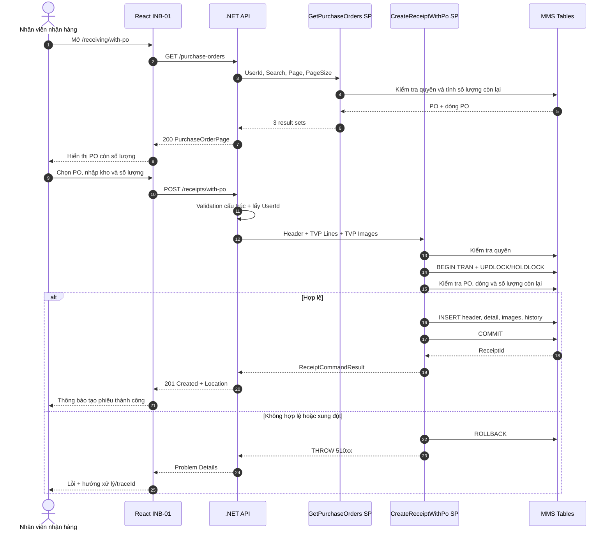
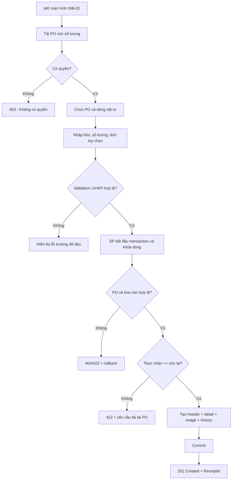

# Phân tích Thiết kế Logic UC01 / INB-01 - Nhận hàng theo PO

> **Mục tiêu tài liệu:** Mô tả đầy đủ nghiệp vụ, giao diện, lập trình, dữ liệu và luồng xử lý của chức năng nhận hàng theo đơn đặt hàng (PO) trong MMS React. Tài liệu sử dụng cấu trúc của `UC04_1_Partial_Receipt.md` nhưng ánh xạ trực tiếp vào contract React, .NET API và SQL hiện có của MMS.

## Thông tin kiểm soát tài liệu

| Thuộc tính | Giá trị |
| --- | --- |
| Use case nghiệp vụ | UC01 |
| Mã quản lý triển khai | INB-01 |
| Tên chức năng | Nhận hàng theo PO |
| Tác nhân chính | Nhân viên nhận hàng (`ACT-01`) |
| Route React | `/receiving/with-po` |
| Nhóm triển khai | W3 - Inbound |
| API | `GET /api/v1/receiving/purchase-orders`; `POST /api/v1/receiving/receipts/with-po` |
| Query SP | `api.usp_WMS_INB01_GetPurchaseOrders_v1` |
| Command SP | `api.usp_WMS_INB01_CreateReceiptWithPo_v1` |
| Trạng thái triển khai | Đã có code, chờ deploy SQL/UAT W3 |

---

## 1. Business Logic (Logic Nghiệp Vụ)

- **Mục tiêu cốt lõi:** Đảm bảo thực thi quy trình nghiệp vụ chuẩn hóa, kiểm soát tính toàn vẹn của dữ liệu và tuân thủ các quy định vận hành kho vật tư & sản xuất của nhà máy Kềm Nghĩa.

- **Các quy tắc nghiệp vụ (Business Rules):**
  - `BR-GEN-01` **Ràng buộc xác thực & Phân quyền (Security & Access Control):** Người dùng bắt buộc phải có phiên đăng nhập hợp lệ và quyền màn hình tương ứng trong `api.vw_SEC_UserScreenAccess_v1`.
  - `BR-GEN-02` **Kiểm tra tính toàn vẹn dữ liệu đầu vào (Input Validation):** Mọi tham số gửi lên API đều phải được chuẩn hóa, trim khoảng trắng và kiểm tra định dạng trước khi thực thi.
  - `BR-GEN-03` **Tính nguyên tử của giao dịch (Atomic Transaction):** Mọi thao tác ghi biến động đều được thực thi trong khối `BEGIN TRANSACTION` với `SET XACT_ABORT ON`, tự động Rollback khi có lỗi.
  - `BR-GEN-04` **Khóa đồng thời chống xung đột dữ liệu (Concurrency Control):** Áp dụng gợi ý khóa `WITH (UPDLOCK, HOLDLOCK)` trên các bảng dữ liệu trọng yếu.
  - `BR-GEN-05` **Hạch toán biến động vào Sổ Cái Kép (Dual Ledger Posting):** Mọi biến động kho đều được ghi nhận vào sổ chi tiết `tbl_transaction` và cập nhật thẻ kho tổng hợp.
  - `BR-GEN-06` **Đồng bộ thời gian thực (Realtime Synchronization):** Đảm bảo tính nhất quán dữ liệu giữa Desktop Web, Handheld PDA và TV Wallboard.
  - `BR-GEN-07` **Ghi vết nhật ký kiểm toán (Audit Trail):** Tự động lưu vết người thực hiện, thời gian, IP và thiết bị cho mọi giao dịch quan trọng.

- **Quy trình tương tác 5 bước (Interaction Flow):**
  - **Bước 1:** Người dùng truy cập phân hệ chức năng tương ứng trên giao diện Web / PDA.
  - **Bước 2:** Nhập liệu các trường thông tin bắt buộc hoặc quét mã Barcode từ thiết bị.
  - **Bước 3:** Frontend validate client-side và gửi request API kèm Token xác thực.
  - **Bước 4:** Backend kiểm tra Fail-fast (Verify JWT $
ightarrow$ Verify Screen Permission $
ightarrow$ Validate Business Rules $
ightarrow$ Execute SQL Stored Procedure trong khối Transaction).
  - **Bước 5:** Backend cập nhật CSDL và trả về kết quả; Frontend hiển thị thông báo thành công, phát âm thanh phản hồi và cập nhật giao diện.

---

## 2. Tiêu chuẩn Thiết kế Giao diện (UI/UX Guidelines)

### 2.1. Bố cục màn hình

Màn hình hỗ trợ desktop và tablet, gồm ba vùng chính:

1. **Tiêu đề:** mã `INB-01`, tên “Nhận hàng theo PO” và mô tả ngắn.
2. **Danh sách PO:** ô tìm kiếm và bảng PO còn số lượng.
3. **Phiếu nhận:** xuất hiện sau khi chọn PO, gồm kho nhận, ảnh, các dòng vật tư và nút tạo phiếu.

### 2.2. Thành phần giao diện

| Thành phần | Yêu cầu |
| --- | --- |
| Tìm PO | Tìm theo mã PO, khách hàng/nhà cung cấp, mã hoặc tên vật tư |
| Bảng PO | Hiển thị PO, khách hàng/nhà cung cấp, ngày giao và tổng số lượng còn lại |
| Chọn PO | Mã PO là nút/link có thể thao tác bàn phím |
| Kho nhận | Bắt buộc; hiện tại UI mặc định `20020100` nhưng SP vẫn phải kiểm tra |
| Liên kết ảnh | Không bắt buộc; không gửi chuỗi chỉ có khoảng trắng |
| Bảng dòng PO | Hiển thị mã/tên vật tư, số lượng còn lại, đơn vị và ô thực nhận |
| Thực nhận | Kiểu số, lớn hơn 0, không vượt số lượng còn lại |
| Tạo phiếu | Vô hiệu khi đang gửi hoặc kho rỗng; chỉ gửi một lần cho mỗi thao tác |
| Thành công | Hiển thị `ReceiptId` và trạng thái trả về |

### 2.3. Trạng thái giao diện

| Trạng thái | Hiển thị |
| --- | --- |
| Loading | Skeleton/spinner hoặc thông báo đang tải danh sách PO |
| Empty | Không có PO phù hợp hoặc không còn số lượng |
| Error | Thông báo thân thiện, nút **Thử lại**, mã truy vết nếu có |
| Editing | Hiển thị form của PO đang chọn và giữ dữ liệu nhập cục bộ |
| Submitting | Khóa nút tạo phiếu, tránh submit lặp |
| Success | Banner thành công, mã phiếu và hành động mở chi tiết phiếu |
| Conflict | Yêu cầu tải lại PO vì số lượng còn lại đã thay đổi |

### 2.4. Validation phía giao diện

Validation React chỉ giúp user sửa nhanh, không thay thế validation trong SP:

- PO và kho không được rỗng.
- Phải chọn ít nhất một dòng có số lượng lớn hơn 0.
- Giá trị phải là số hữu hạn.
- Số lượng không âm và không vượt `remainingQuantity` đang hiển thị.
- Decimal được phép vì table type sử dụng `decimal(19,4)`; UI phải giới hạn tối đa 4 chữ số thập phân.
- Không sử dụng `parseInt` cho trường số lượng.

### 2.5. Accessibility

- Mỗi input số lượng phải có `aria-label` chứa mã vật tư.
- Không dùng màu sắc làm tín hiệu lỗi duy nhất.
- Focus chuyển tới trường lỗi đầu tiên sau validation.
- Thông báo thành công/lỗi dùng vùng `aria-live`.
- Nút và link phải thao tác được bằng bàn phím.

---

## 3. Programming Logic (Logic Lập Trình)

Quy trình xử lý mã lệnh được chia thành 2 lớp rõ rệt: **Frontend (React)** và **Backend (ASP.NET Core kết hợp SQL Stored Procedure)**.

### 3.1. Frontend (React - Component View)
- **State Management & Local Processing:**
  - Gọi API kéo dữ liệu cần thiết vào React State.
  - Sử dụng các hàm mảng JavaScript (`filter`, `map`, `reduce`) để xử lý gom nhóm, lọc tìm kiếm in-memory, tối ưu hóa băng thông và tạo trải nghiệm mượt mà không độ trễ.
- **UI Interaction & Ergonomics:**
  - Sử dụng cấu trúc Collapse / Accordion / Modal xem trước để tối ưu không gian hiển thị trên màn hình Handheld PDA và Desktop Web.

### 3.2. Backend (ASP.NET Core & SQL Server Stored Procedure)
- **Thin API Gateway Pattern:**
  - ASP.NET Core Minimal API / Controller không xử lý logic tính toán nghiệp vụ mà chỉ làm cổng Gateway mỏng (Xác thực JWT Cookie, kiểm tra quyền màn hình `vw_SEC_UserScreenAccess_v1`) và ủy thác toàn bộ cho SQL Server Stored Procedure.
- **Tận Dụng Multi-Result Set & ACID Transaction:**
  - SQL Stored Procedure trả về đồng thời nhiều Result Sets (Header info, Summary KPIs, Detailed Lines) trong một lần truy vấn duy nhất.
  - Các lệnh ghi dữ liệu áp dụng `SET XACT_ABORT ON`, `BEGIN TRANSACTION` và khóa dòng dữ liệu `WITH (UPDLOCK, HOLDLOCK)` đảm bảo an toàn tuyệt đối.

---

## 4. Data Logic (Thiết kế Dữ Liệu)

### 4.1. Ma trận phân quyền CRUD

| Bảng / Thực thể Dữ Liệu | Create (Tạo) | Read (Đọc) | Update (Cập nhật) | Delete (Xóa) | Ý nghĩa nghiệp vụ trong Use Case |
| :--- | :---: | :---: | :---: | :---: | :--- |
| `dbo.tbl_dm_user` | **X** | **X** | **X** | - | Quản lý danh mục tài khoản, mật khẩu băm, trạng thái hoạt động |
| `dbo.api.vw_SEC_UserScreenAccess_v1` | - | **X** | - | - | Đọc ma trận phân quyền màn hình theo UserId |
| `dbo.tbl_sec_audit_log` | **X** | **X** | - | - | Ghi vết nhật ký truy cập kiểm toán hệ thống (`UserId`, `IP`, `Action`) |

### 4.2. Định nghĩa Trạng thái (Conceptual State Model)

| Cột / Biến | Kiểu Dữ Liệu | Giá Trị Sau Confirm | Ý nghĩa Nghiệp vụ |
| :--- | :--- | :--- | :--- |
| `status_active` (trong `tbl_dm_user`) | `INT` | `1` (`'ACTIVE'`) | Tài khoản đang hoạt động, được phép đăng nhập hệ thống |
| `must_change_password` | `INT` | `0` | Đã hoàn tất đổi mật khẩu lần đầu |

### 4.3. Data Layer Architecture (Data Flow & Transaction Locking)

### 5.2. Flowchart

---
