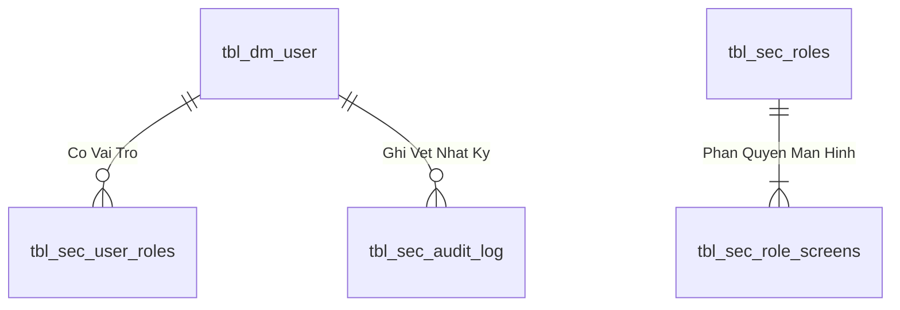

# Phân tích Thiết kế Logic UC01 - Đăng nhập và phân quyền PC/Mobile

Tài liệu mô tả chi tiết **Business Logic**, **UI/UX Guidelines**, **Programming Logic**, **Data Logic** và **Diagrams** cho chức năng đăng nhập của hệ thống Quản lý Kho Vật tư khi chuyển từ Power Apps sang React.

Phạm vi được đối chiếu trực tiếp từ các màn hình `scr_login` và `scr_mob_login` trong hai ứng dụng:

- `Quản lý kho vật tư .msapp`: đăng nhập PC, đăng nhập mobile, nạp quyền màn hình theo role và đổi mật khẩu.
- `Kho vật tư .msapp`: đăng nhập kho, gán nhóm vận hành cục bộ và đổi mật khẩu.

Nguyên tắc kiến trúc bắt buộc: React chỉ quản lý giao diện; backend xác thực request, gọi Stored Procedure, định dạng response và phát token; toàn bộ kiểm tra tài khoản, trạng thái tài khoản, phân quyền, khóa đăng nhập và đổi mật khẩu được xử lý trong SQL Stored Procedure.

---

## 1. Business Logic (Logic Nghiệp vụ)

### 1.1. Mục tiêu cốt lõi

- Xác thực người dùng bằng mã nhân viên/tài khoản và mật khẩu.
- Chỉ cho phép tài khoản đang hoạt động truy cập hệ thống.
- Nạp đúng thông tin nhân viên, bộ phận Bravo, vai trò và danh sách màn hình được phép sử dụng.
- Dùng chung một cơ chế đăng nhập cho PC và mobile; thiết bị chỉ ảnh hưởng màn hình đích, không thay đổi quy tắc xác thực.
- Không để React hoặc backend tự suy diễn quyền bằng danh sách mã nhân viên hard-code.
- Ghi nhận lịch sử đăng nhập thành công/thất bại phục vụ audit và điều tra sự cố.

### 1.2. Hiện trạng Power Apps đã đối chiếu

| Nguồn | Cách xác thực hiện tại | Phân quyền/điều hướng | Điểm cần xử lý khi chuyển đổi |
|---|---|---|---|
| `Quản lý kho vật tư` - PC | `LookUp(tbl_dm_user, user_n = Trim(user_input.Text))`, sau đó so sánh trực tiếp `var_user.password` | Lọc `tbl_role_screen` theo `id_role_app = var_user.ma_role`; vào `scr_main` | Mật khẩu đang được đọc và so sánh ở client; cần chuyển hoàn toàn về SP |
| `Quản lý kho vật tư` - Mobile | Tra `tbl_dm_user`, so sánh trực tiếp mật khẩu | Nạp quyền rồi vào `scr_mob_denghi_xuatkho_log` | Chưa chuẩn hóa `Trim`; màn hình đích đang cố định |
| `Kho vật tư` | Tra `tbl_dm_user`, so sánh `password` và `user_n` | Vào `scr_main`; gán `var_in` bằng danh sách MSNV hard-code | Chưa nạp `tbl_role_screen`; hard-code người dùng tạo rủi ro sai quyền |
| Cả hai app | `Patch(tbl_dm_user, ..., {password: ...})` | Đổi mật khẩu trực tiếp từ client | Mật khẩu dạng rõ; không có policy, khóa tài khoản hoặc audit đầy đủ |

### 1.3. Actor

- Nhân viên kho, QC, sản xuất, kế hoạch, quản lý hoặc quản trị hệ thống.
- React Web Client chạy trên PC hoặc thiết bị mobile/PDA.
- Backend API đóng vai trò Auth Gateway mỏng.
- SQL Server và các Stored Procedure UC01.

### 1.4. Tiền điều kiện

- Người dùng có bản ghi trong `dbo.tbl_dm_user`.
- `status_active = 1` đối với tài khoản được phép đăng nhập.
- `ma_role` của người dùng được khai báo trong `dbo.tbl_role`.
- Role có ít nhất một quyền hợp lệ trong `dbo.tbl_role_screen`.
- Client gửi request qua HTTPS.
- Các cột bảo mật bổ sung và SP UC01 đã được triển khai trước khi cắt chuyển khỏi Power Apps.

### 1.5. Hậu điều kiện

Khi thành công:

- API trả access token, thông tin người dùng và danh sách quyền màn hình.
- React chỉ tạo route/menu từ danh sách quyền do SP trả về.
- Thời điểm đăng nhập gần nhất và audit đăng nhập được cập nhật.
- Người dùng được điều hướng đến route mặc định hợp lệ đầu tiên cho loại thiết bị.

Khi thất bại:

- Không trả mật khẩu, hash, salt hoặc thông tin cho biết tài khoản có tồn tại hay không.
- Số lần sai được tăng và tài khoản có thể bị khóa tạm theo policy.
- Audit lưu mã kết quả, tài khoản nhập, IP, thiết bị và thời điểm.

### 1.6. Business Rules

- **`[BR-UC01-01]` Chuẩn hóa tài khoản:** `user_n` được `LTRIM/RTRIM`, không phân biệt chữ hoa/thường theo collation nghiệp vụ. Giá trị rỗng bị từ chối.
- **`[BR-UC01-02]` Không lộ thông tin tài khoản:** Sai tài khoản và sai mật khẩu cùng trả mã `INVALID_CREDENTIALS`.
- **`[BR-UC01-03]` Trạng thái hoạt động:** Chỉ `status_active = 1` được đăng nhập. Tài khoản ngừng hoạt động trả `ACCOUNT_INACTIVE` sau khi đã xác thực phù hợp ở tầng nội bộ; UI hiển thị thông báo chung.
- **`[BR-UC01-04]` Mật khẩu không xử lý ở client:** React không đọc trường `password`; backend không truy vấn bảng người dùng trực tiếp.
- **`[BR-UC01-05]` Mật khẩu mục tiêu phải được băm:** SQL lưu `password_hash` và `password_salt`; không lưu mật khẩu mới dạng rõ.
- **`[BR-UC01-06]` Khóa tạm:** Sau 5 lần sai liên tiếp trong cửa sổ policy, tài khoản bị khóa 15 phút. Số lần và thời gian khóa do SP quản lý.
- **`[BR-UC01-07]` Quyền theo role:** Quyền được lấy từ `tbl_role_screen.id_role_app = tbl_dm_user.ma_role`; chỉ các dòng quyền có tên màn hình hợp lệ mới trả về client.
- **`[BR-UC01-08]` Không hard-code MSNV:** Nhóm `bb`, `vt` hoặc quyền đặc thù phải được cấu hình trong role/bộ phận, không viết trong React.
- **`[BR-UC01-09]` Không có quyền:** Tài khoản xác thực đúng nhưng không có màn hình hợp lệ trả `NO_PERMISSION`; không tạo phiên đăng nhập sử dụng được.
- **`[BR-UC01-10]` Route mặc định:** PC ưu tiên `/home`; mobile ưu tiên route mobile được cấp quyền. Nếu route ưu tiên không có quyền, chọn quyền có thứ tự nhỏ nhất.
- **`[BR-UC01-11]` Đổi mật khẩu:** Bắt buộc đúng mật khẩu hiện tại; mật khẩu mới và xác nhận phải trùng; không trùng mật khẩu hiện tại; đáp ứng policy độ dài và độ phức tạp.
- **`[BR-UC01-12]` Phiên đăng nhập:** Access token có thời hạn ngắn; thông tin quyền trong token chỉ là snapshot. Các nghiệp vụ quan trọng vẫn kiểm tra quyền phía server/SP.
- **`[BR-UC01-13]` Audit:** Mỗi lần login và đổi mật khẩu phải ghi log thành công/thất bại, nhưng tuyệt đối không ghi mật khẩu.
- **`[BR-UC01-14]` Atomicity:** Cập nhật failed count, khóa tài khoản, last login và audit phải nằm trong transaction của SP.

### 1.7. Luồng chính - Đăng nhập

| Bước | Actor/Thành phần | Thao tác | Kết quả |
|---|---|---|---|
| 1 | Người dùng | Mở trang đăng nhập PC/mobile | React hiển thị form tương ứng thiết bị |
| 2 | Người dùng | Nhập mã nhân viên và mật khẩu | React chỉ kiểm tra bắt buộc nhập và độ dài tối đa |
| 3 | React | Gọi `POST /api/v1/auth/login` | Gửi `username`, `password`, `clientType`, `deviceId` |
| 4 | Backend | Bổ sung IP/User-Agent và gọi `dbo.usp_MMS_UC01_Login` | Không tự đọc bảng hoặc tự kiểm tra role |
| 5 | SQL SP | Khóa bản ghi user, kiểm tra trạng thái, khóa tạm và mật khẩu | Fail-fast theo mã kết quả chuẩn |
| 6 | SQL SP | Nạp profile, role và quyền màn hình | Trả hai result set: login context và permissions |
| 7 | Backend | Phát access token/refresh token khi `SUCCESS` | Token không chứa dữ liệu nhạy cảm |
| 8 | React | Lưu phiên theo cơ chế bảo mật, dựng menu/route | Điều hướng tới route mặc định được cấp quyền |

### 1.8. Luồng phụ - Đổi mật khẩu

| Bước | Actor/Thành phần | Thao tác | Kết quả |
|---|---|---|---|
| 1 | Người dùng | Mở hộp thoại Đổi mật khẩu | Hiển thị mật khẩu cũ, mới, xác nhận mới |
| 2 | React | Kiểm tra đủ trường và hai mật khẩu mới trùng nhau | Không tự xác thực mật khẩu cũ |
| 3 | Backend | Gọi `dbo.usp_MMS_UC01_ChangePassword` | Truyền user từ token, không tin user do client tự gửi |
| 4 | SQL SP | Xác thực mật khẩu hiện tại và policy | Rollback khi không hợp lệ |
| 5 | SQL SP | Tạo salt mới, cập nhật hash, reset failed count và ghi audit | Trả `SUCCESS` |
| 6 | Backend/React | Thu hồi refresh token cũ và yêu cầu đăng nhập lại | Giảm rủi ro chiếm dụng phiên |

### 1.9. Luồng ngoại lệ

| Mã | Tình huống | HTTP | Xử lý UI | Xử lý SQL |
|---|---|---:|---|---|
| `INVALID_INPUT` | Thiếu tài khoản/mật khẩu | 400 | Đánh dấu trường bắt buộc | Không truy cập bảng |
| `INVALID_CREDENTIALS` | Tài khoản hoặc mật khẩu sai | 401 | Thông báo chung | Tăng `failed_count`, ghi audit |
| `ACCOUNT_LOCKED` | Đang trong thời gian khóa | 423 | Hiển thị thời gian thử lại | Không kiểm tra tiếp mật khẩu |
| `ACCOUNT_INACTIVE` | `status_active <> 1` | 403 | Liên hệ quản trị | Ghi audit, không tạo phiên |
| `NO_PERMISSION` | Đúng mật khẩu nhưng role không có màn hình | 403 | Thông báo chưa được phân quyền | Không phát phiên hợp lệ |
| `PASSWORD_POLICY_FAILED` | Mật khẩu mới không đạt policy | 422 | Hiển thị yêu cầu policy | Không cập nhật user |
| `DATABASE_ERROR` | Lỗi SQL ngoài dự kiến | 500 | Thông báo thử lại | Rollback toàn bộ transaction |

---

## 2. UI/UX Guidelines

### 2.1. Cấu trúc màn hình PC

- Tiêu đề hệ thống và tên môi trường ở phần đầu trang.
- Form đăng nhập rộng tối đa 420 px, gồm Mã nhân viên, Mật khẩu, nút hiện/ẩn mật khẩu và nút Đăng nhập.
- Link Đổi mật khẩu chỉ mở dialog; không điều hướng sang trang khác.
- Nút Đăng nhập có loading state cố định kích thước để tránh xê dịch bố cục.
- Không hiển thị tùy chọn PC/Mobile bằng nút chuyển màn hình; responsive routing tự quyết định layout.

### 2.2. Cấu trúc màn hình Mobile/PDA

- Vùng chạm tối thiểu 44 x 44 px.
- Form một cột, không dùng bảng ngang.
- Bàn phím tự mở ở trường Mã nhân viên; hỗ trợ Enter chuyển sang mật khẩu và Enter lần hai để submit.
- Sau lỗi chỉ xóa mật khẩu, giữ mã nhân viên để thao tác nhanh.
- Route sau đăng nhập được lấy từ `defaultRoute` do API trả về, không cố định `scr_mob_denghi_xuatkho_log`.

### 2.3. Trạng thái giao diện

| Trạng thái | Hiển thị |
|---|---|
| Idle | Form sẵn sàng nhập, nút Đăng nhập bật khi đủ hai trường |
| Submitting | Khóa submit lặp, hiện spinner trong nút |
| Invalid | Thông báo chung “Thông tin đăng nhập không đúng” |
| Locked | Cảnh báo khóa tạm và thời gian có thể thử lại |
| No permission | Thông báo tài khoản chưa được phân quyền |
| Success | Chuyển route; không để form đăng nhập trong browser history nghiệp vụ |

### 2.4. Yêu cầu accessibility và bảo mật UI

- Label liên kết đúng với input; lỗi dùng `aria-describedby` và vùng thông báo `aria-live`.
- Cho phép trình quản lý mật khẩu hoạt động; không chặn paste mật khẩu.
- Không lưu mật khẩu vào `localStorage`, Redux store, log trình duyệt hoặc telemetry.
- Không phân biệt thông báo “không tồn tại user” với “sai password”.
- Nút hiện mật khẩu dùng icon quen thuộc và có tooltip/accessible label.

---

## 3. Programming Logic (Logic Lập Trình)

Quy trình xử lý mã lệnh được chia thành 2 lớp rõ rệt: **Frontend (React)** và **Backend (ASP.NET Core kết hợp SQL Stored Procedure)**.

### 3.1. Frontend (React - Component View)
- **State Management & Local Processing:**
  - Gọi API kéo dữ liệu cần thiết vào React State.
  - Sử dụng các hàm mảng JavaScript (`filter`, `map`, `reduce`) để xử lý gom nhóm, lọc tìm kiếm in-memory, tối ưu hóa băng thông và tạo trải nghiệm mượt mà không độ trễ.
- **UI Interaction & Ergonomics:**
  - Sử dụng cấu trúc Collapse / Accordion / Modal xem trước để tối ưu không gian hiển thị trên màn hình Handheld PDA và Desktop Web.

### 3.2. Backend (ASP.NET Core & SQL Server Stored Procedure)
- **Thin API Gateway Pattern:**
  - ASP.NET Core Minimal API / Controller không xử lý logic tính toán nghiệp vụ mà chỉ làm cổng Gateway mỏng (Xác thực JWT Cookie, kiểm tra quyền màn hình `vw_SEC_UserScreenAccess_v1`) và ủy thác toàn bộ cho SQL Server Stored Procedure.
- **Tận Dụng Multi-Result Set & ACID Transaction:**
  - SQL Stored Procedure trả về đồng thời nhiều Result Sets (Header info, Summary KPIs, Detailed Lines) trong một lần truy vấn duy nhất.
  - Các lệnh ghi dữ liệu áp dụng `SET XACT_ABORT ON`, `BEGIN TRANSACTION` và khóa dòng dữ liệu `WITH (UPDLOCK, HOLDLOCK)` đảm bảo an toàn tuyệt đối.

---

## 4. Data Logic & Schema Model (Thiết kế Dữ Liệu Chuyên Sâu)

### 4.1. Entity Relationship Diagram (ERD) & Schema Details

- **Bảng Người Dùng (`dbo.tbl_dm_user`):** `user_n` (PK), `msnv`, `hoten`, `matkhau`, `status_active`.
- **View Phân Quyền (`api.vw_SEC_UserScreenAccess_v1`):** Ánh xạ `UserId` $
ightarrow$ `ScreenCode`.

### 4.2. Data Flow & Transaction Locking Matrix
- **Xác thực phiên:** Truy vấn nhanh không khóa (`NOLOCK`) trên `vw_SEC_UserScreenAccess_v1` và ghi log an toàn vào `tbl_sec_audit_log`.

### 4.3. Conceptual State Model & Transition Rules
| Trạng Thái User | Thao Tác | Trạng Thái Sau | Quyền Hạn |
| :--- | :--- | :--- | :--- |
| **`ACTIVE (1)`** | Đăng nhập thành công (AUTH-01) | Sinh JWT Cookie (8h) | Truy cập các màn hình được cấp quyền |
| **`ACTIVE (1)`** | Khóa tài khoản (ADM-01) | `INACTIVE (0)` | Chặn đăng nhập và thu hồi token tức thì |
