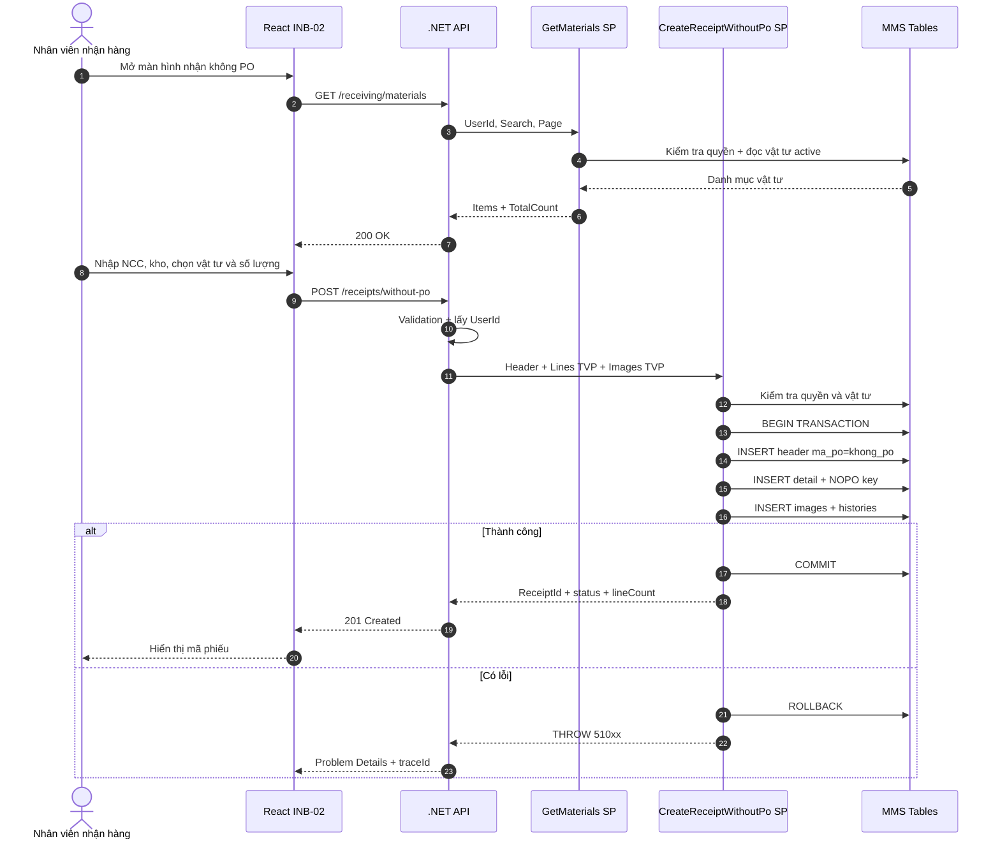
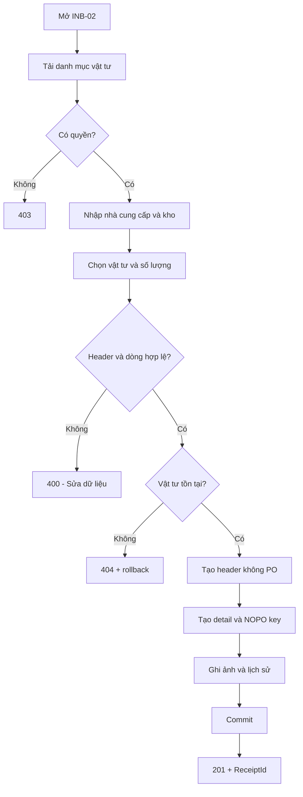

# Phân tích Thiết kế Logic UC02 / INB-02 - Nhận hàng không PO

> **Mục tiêu tài liệu:** Mô tả nghiệp vụ, UI/UX, React, .NET API, stored procedure, dữ liệu và kiểm thử của chức năng nhận hàng chưa có PO. Tài liệu theo cấu trúc mẫu `UC04_1_Partial_Receipt.md` và cùng chuẩn với `UC01_Receive_With_PO.md`.

## Thông tin kiểm soát tài liệu

| Thuộc tính | Giá trị |
| --- | --- |
| Use case nghiệp vụ | UC02 |
| Mã triển khai | INB-02 |
| Tên chức năng | Nhận hàng không PO |
| Tác nhân chính | Nhân viên nhận hàng (`ACT-01`) |
| Route React | `/receiving/without-po` |
| Màn hình quyền legacy | `scr_nhanhang_khong_po` |
| Nhóm triển khai | W3 - Inbound |
| Query API | `GET /api/v1/receiving/materials` |
| Command API | `POST /api/v1/receiving/receipts/without-po` |
| Query SP | `api.usp_WMS_INB02_GetMaterials_v1` |
| Command SP | `api.usp_WMS_INB02_CreateReceiptWithoutPo_v1` |
| Trạng thái | Đã triển khai contract vào database MMS; cần UAT nghiệp vụ |

---

## 1. Business Logic (Logic Nghiệp Vụ)

- **Mục tiêu cốt lõi:** Đảm bảo thực thi quy trình nghiệp vụ chuẩn hóa, kiểm soát tính toàn vẹn của dữ liệu và tuân thủ các quy định vận hành kho vật tư & sản xuất của nhà máy Kềm Nghĩa.

- **Các quy tắc nghiệp vụ (Business Rules):**
  - `BR-GEN-01` **Ràng buộc xác thực & Phân quyền (Security & Access Control):** Người dùng bắt buộc phải có phiên đăng nhập hợp lệ và quyền màn hình tương ứng trong `api.vw_SEC_UserScreenAccess_v1`.
  - `BR-GEN-02` **Kiểm tra tính toàn vẹn dữ liệu đầu vào (Input Validation):** Mọi tham số gửi lên API đều phải được chuẩn hóa, trim khoảng trắng và kiểm tra định dạng trước khi thực thi.
  - `BR-GEN-03` **Tính nguyên tử của giao dịch (Atomic Transaction):** Mọi thao tác ghi biến động đều được thực thi trong khối `BEGIN TRANSACTION` với `SET XACT_ABORT ON`, tự động Rollback khi có lỗi.
  - `BR-GEN-04` **Khóa đồng thời chống xung đột dữ liệu (Concurrency Control):** Áp dụng gợi ý khóa `WITH (UPDLOCK, HOLDLOCK)` trên các bảng dữ liệu trọng yếu.
  - `BR-GEN-05` **Hạch toán biến động vào Sổ Cái Kép (Dual Ledger Posting):** Mọi biến động kho đều được ghi nhận vào sổ chi tiết `tbl_transaction` và cập nhật thẻ kho tổng hợp.
  - `BR-GEN-06` **Đồng bộ thời gian thực (Realtime Synchronization):** Đảm bảo tính nhất quán dữ liệu giữa Desktop Web, Handheld PDA và TV Wallboard.
  - `BR-GEN-07` **Ghi vết nhật ký kiểm toán (Audit Trail):** Tự động lưu vết người thực hiện, thời gian, IP và thiết bị cho mọi giao dịch quan trọng.

- **Quy trình tương tác 5 bước (Interaction Flow):**
  - **Bước 1:** Người dùng truy cập phân hệ chức năng tương ứng trên giao diện Web / PDA.
  - **Bước 2:** Nhập liệu các trường thông tin bắt buộc hoặc quét mã Barcode từ thiết bị.
  - **Bước 3:** Frontend validate client-side và gửi request API kèm Token xác thực.
  - **Bước 4:** Backend kiểm tra Fail-fast (Verify JWT $
ightarrow$ Verify Screen Permission $
ightarrow$ Validate Business Rules $
ightarrow$ Execute SQL Stored Procedure trong khối Transaction).
  - **Bước 5:** Backend cập nhật CSDL và trả về kết quả; Frontend hiển thị thông báo thành công, phát âm thanh phản hồi và cập nhật giao diện.

---

## 2. Tiêu chuẩn Thiết kế Giao diện (UI/UX Guidelines)

### 2.1. Bố cục

Màn hình gồm:

1. Header `INB-02 – Nhận hàng không PO`.
2. Form nhà cung cấp, kho nhận, liên kết ảnh.
3. Ô tìm kiếm và bảng danh mục vật tư.
4. Bảng các vật tư đã chọn và số lượng.
5. Nút **Tạo phiếu không PO** và vùng thông báo.

### 2.2. Thành phần UI

| Thành phần | Yêu cầu |
| --- | --- |
| Nhà cung cấp | Bắt buộc, tối đa phù hợp contract `nvarchar(50)` |
| Kho nhận | Bắt buộc; UI hiện mặc định `20020100` |
| Liên kết ảnh | Tùy chọn, không gửi chuỗi rỗng |
| Tìm vật tư | Tìm mã MMS, mã Bravo, tên hoặc mã NCC |
| Chọn/Bỏ chọn | Thao tác không làm mất tìm kiếm hiện tại |
| Số lượng | Số hữu hạn, > 0, tối đa 4 chữ số thập phân |
| Nút tạo phiếu | Disabled khi đang gửi hoặc thiếu header |
| Thành công | Hiển thị `ReceiptId`, trạng thái và hành động tiếp theo |

### 2.3. Trạng thái giao diện

| Trạng thái | Cách hiển thị |
| --- | --- |
| Loading | Đang tải danh mục vật tư |
| Empty | Không có vật tư phù hợp |
| Editing | Giữ danh sách vật tư và số lượng đã chọn |
| Submitting | Khóa nút tạo phiếu, không tự retry POST |
| Success | Banner thành công và mã phiếu |
| Validation error | Chỉ rõ trường hoặc dòng lỗi |
| System error | Thông báo chung, nút thử lại và `traceId` |

### 2.4. Validation frontend

- Trim nhà cung cấp, kho và link ảnh.
- Ít nhất một vật tư có quantity > 0.
- Không chấp nhận `NaN`, `Infinity`, số âm hoặc 0.
- Không dùng `parseInt`; contract cho phép `decimal(19,4)`.
- Không cho quá 4 chữ số thập phân.
- Validation UI không thay thế validation SP.

### 2.5. Accessibility

- Input số lượng có `aria-label` chứa mã vật tư.
- Nút Chọn/Bỏ chọn thể hiện trạng thái bằng chữ, không chỉ bằng màu.
- Thông báo sử dụng `aria-live`.
- Focus chuyển đến lỗi đầu tiên.
- Hỗ trợ thao tác bàn phím toàn bộ bảng và form.

---

## 3. Programming Logic (Logic Lập Trình)

Quy trình xử lý mã lệnh được chia thành 2 lớp rõ rệt: **Frontend (React)** và **Backend (ASP.NET Core kết hợp SQL Stored Procedure)**.

### 3.1. Frontend (React - Component View)
- **State Management & Local Processing:**
  - Gọi API kéo dữ liệu cần thiết vào React State.
  - Sử dụng các hàm mảng JavaScript (`filter`, `map`, `reduce`) để xử lý gom nhóm, lọc tìm kiếm in-memory, tối ưu hóa băng thông và tạo trải nghiệm mượt mà không độ trễ.
- **UI Interaction & Ergonomics:**
  - Sử dụng cấu trúc Collapse / Accordion / Modal xem trước để tối ưu không gian hiển thị trên màn hình Handheld PDA và Desktop Web.

### 3.2. Backend (ASP.NET Core & SQL Server Stored Procedure)
- **Thin API Gateway Pattern:**
  - ASP.NET Core Minimal API / Controller không xử lý logic tính toán nghiệp vụ mà chỉ làm cổng Gateway mỏng (Xác thực JWT Cookie, kiểm tra quyền màn hình `vw_SEC_UserScreenAccess_v1`) và ủy thác toàn bộ cho SQL Server Stored Procedure.
- **Tận Dụng Multi-Result Set & ACID Transaction:**
  - SQL Stored Procedure trả về đồng thời nhiều Result Sets (Header info, Summary KPIs, Detailed Lines) trong một lần truy vấn duy nhất.
  - Các lệnh ghi dữ liệu áp dụng `SET XACT_ABORT ON`, `BEGIN TRANSACTION` và khóa dòng dữ liệu `WITH (UPDLOCK, HOLDLOCK)` đảm bảo an toàn tuyệt đối.

---

## 4. Data Logic (Thiết kế Dữ Liệu)

### 4.1. Ma trận phân quyền CRUD

| Bảng / Thực thể Dữ Liệu | Create (Tạo) | Read (Đọc) | Update (Cập nhật) | Delete (Xóa) | Ý nghĩa nghiệp vụ trong Use Case |
| :--- | :---: | :---: | :---: | :---: | :--- |
| `dbo.tbl_dm_user` | **X** | **X** | **X** | - | Quản lý danh mục tài khoản, mật khẩu băm, trạng thái hoạt động |
| `dbo.api.vw_SEC_UserScreenAccess_v1` | - | **X** | - | - | Đọc ma trận phân quyền màn hình theo UserId |
| `dbo.tbl_sec_audit_log` | **X** | **X** | - | - | Ghi vết nhật ký truy cập kiểm toán hệ thống (`UserId`, `IP`, `Action`) |

### 4.2. Định nghĩa Trạng thái (Conceptual State Model)

| Cột / Biến | Kiểu Dữ Liệu | Giá Trị Sau Confirm | Ý nghĩa Nghiệp vụ |
| :--- | :--- | :--- | :--- |
| `status_active` (trong `tbl_dm_user`) | `INT` | `1` (`'ACTIVE'`) | Tài khoản đang hoạt động, được phép đăng nhập hệ thống |
| `must_change_password` | `INT` | `0` | Đã hoàn tất đổi mật khẩu lần đầu |

### 4.3. Data Layer Architecture (Data Flow & Transaction Locking)

### 5.2. Flowchart

---
