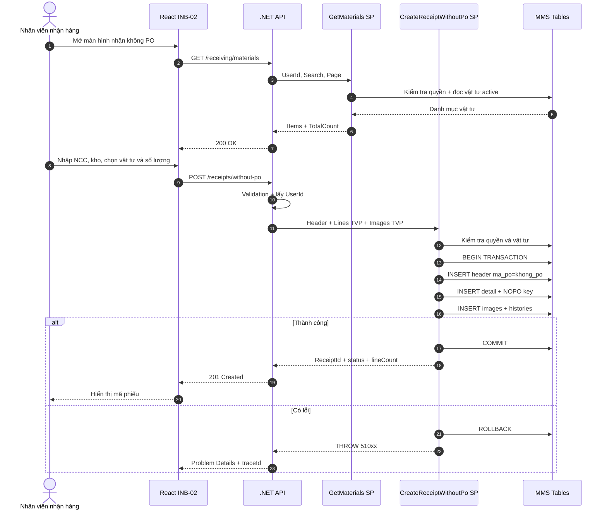
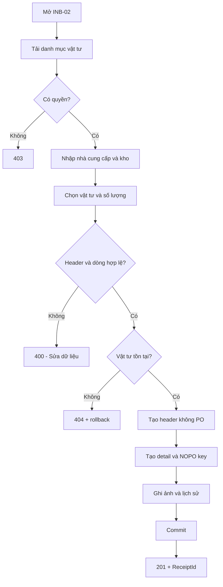
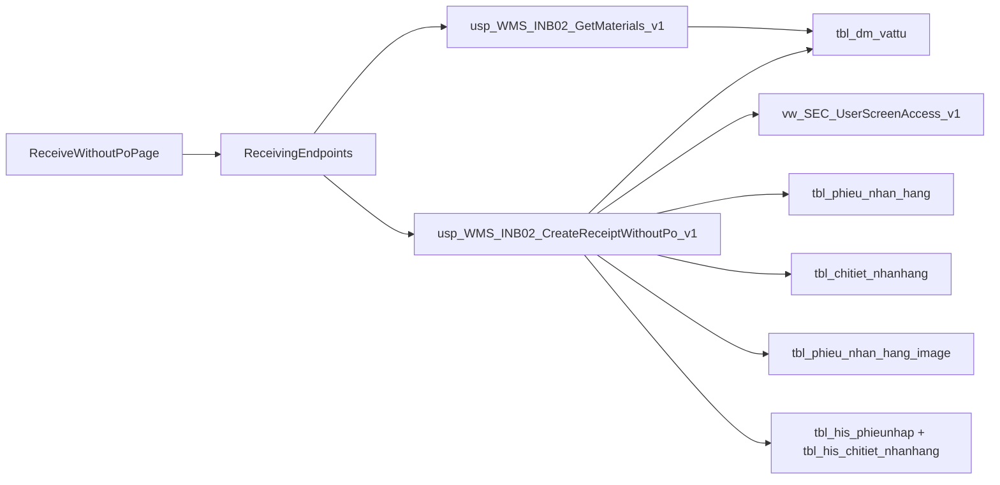
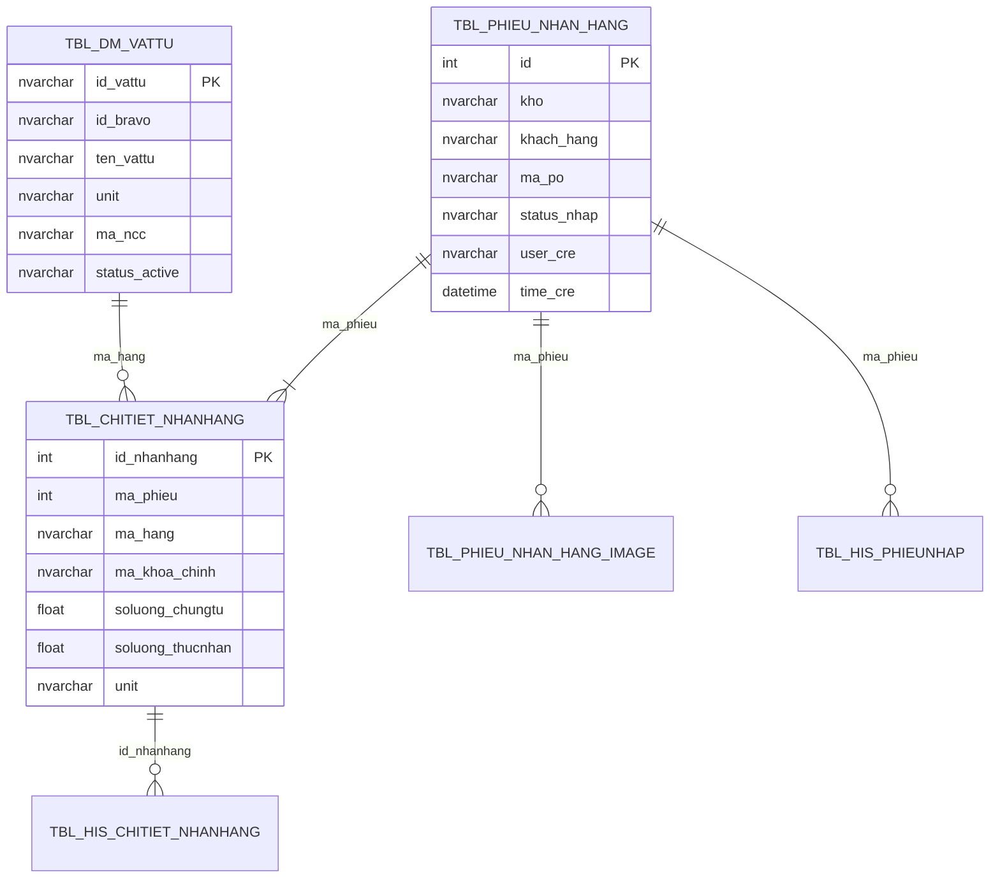
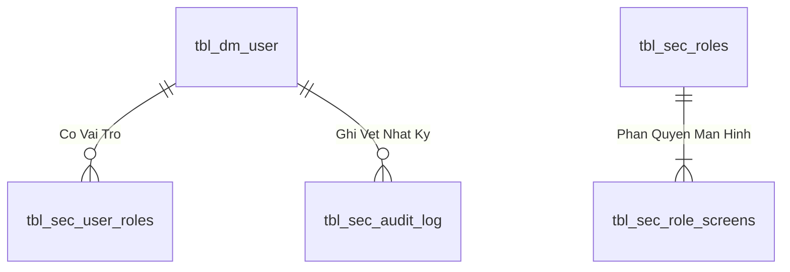

# Phân tích Thiết kế Logic UC02 / INB-02 - Nhận hàng không PO

> **Mục tiêu tài liệu:** Mô tả nghiệp vụ, UI/UX, React, .NET API, stored procedure, dữ liệu và kiểm thử của chức năng nhận hàng chưa có PO. Tài liệu theo cấu trúc mẫu `UC04_1_Partial_Receipt.md` và cùng chuẩn với `UC01_Receive_With_PO.md`.

## Thông tin kiểm soát tài liệu

| Thuộc tính | Giá trị |
| --- | --- |
| Use case nghiệp vụ | UC02 |
| Mã triển khai | INB-02 |
| Tên chức năng | Nhận hàng không PO |
| Tác nhân chính | Nhân viên nhận hàng (`ACT-01`) |
| Route React | `/receiving/without-po` |
| Màn hình quyền legacy | `scr_nhanhang_khong_po` |
| Nhóm triển khai | W3 - Inbound |
| Query API | `GET /api/v1/receiving/materials` |
| Command API | `POST /api/v1/receiving/receipts/without-po` |
| Query SP | `api.usp_WMS_INB02_GetMaterials_v1` |
| Command SP | `api.usp_WMS_INB02_CreateReceiptWithoutPo_v1` |
| Trạng thái | Đã triển khai contract vào database MMS; cần UAT nghiệp vụ |

---

## 1. Business Logic (Logic Nghiệp vụ)

### 1.1. Mục đích

UC02 cho phép ghi nhận lô hàng đến kho khi chưa xác định hoặc chưa có PO tại thời điểm nhận. Nhân viên nhập tên nhà cung cấp, kho nhận, chọn vật tư từ danh mục, khai báo số lượng và có thể gắn liên kết ảnh chứng từ.

Phiếu được tạo với dấu hiệu vật lý hiện hành:

```text
tbl_phieu_nhan_hang.ma_po = 'khong_po'
tbl_phieu_nhan_hang.status_nhap = '2'
```

UC02 chỉ ghi nhận hàng ban đầu. Phiếu có thể được đối soát và gắn một hoặc nhiều PO ở INB-05/INB-06 trước khi thực hiện thủ tục nhập kho tại INB-07.

### 1.2. Phạm vi

**Trong phạm vi:**

- Tra cứu vật tư đang hoạt động.
- Tìm theo mã MMS, mã Bravo, tên vật tư hoặc mã nhà cung cấp.
- Chọn một hoặc nhiều vật tư.
- Nhập tên nhà cung cấp và kho nhận.
- Nhập số lượng chứng từ/thực nhận.
- Gắn liên kết ảnh chứng từ tùy chọn.
- Tạo phiếu, chi tiết, ảnh và lịch sử trong một transaction.
- Sinh khóa truy vết tạm cho từng dòng không PO.

**Ngoài phạm vi:**

- Chọn hoặc kiểm tra số lượng còn lại của PO: INB-01.
- Chỉnh sửa, xác nhận hoặc hủy phiếu: INB-03.
- Gắn một PO: INB-05.
- Gắn nhiều PO: INB-06.
- QC đầu vào: QC-03 đến QC-06.
- Tạo batch và hạch toán tồn kho: INB-07.
- In tem batch: INB-08.

### 1.3. Tác nhân và điều kiện

| Thành phần | Mô tả |
| --- | --- |
| Tác nhân chính | Nhân viên nhận hàng |
| Hệ thống hỗ trợ | React MMS, .NET API, SQL Server MMS |
| Xác thực | Có phiên MMS hợp lệ |
| Phân quyền | Có quyền `scr_nhanhang_khong_po` |
| Điều kiện trước | Vật tư tồn tại và đang hoạt động; nhà cung cấp và kho đã xác định |
| Sau thành công | Tạo một phiếu trạng thái `2`, các dòng nhận, ảnh hợp lệ và lịch sử |
| Sau thất bại | Không có dữ liệu nào được ghi; transaction rollback |

### 1.4. Luồng chính

1. User mở màn hình **Nhận hàng không PO**.
2. React tải danh mục vật tư thông qua Query SP.
3. User nhập nhà cung cấp, kho nhận và liên kết ảnh nếu có.
4. User tìm, chọn một hoặc nhiều vật tư.
5. User khai báo số lượng từng vật tư.
6. React chỉ gửi các dòng có số lượng lớn hơn 0.
7. API kiểm tra cấu trúc request và lấy `UserId` từ phiên xác thực.
8. Command SP kiểm tra quyền, header, dòng, số lượng, trùng vật tư và sự tồn tại của vật tư.
9. SP tạo header với `ma_po = 'khong_po'`.
10. SP tạo detail và khóa truy vết `NOPO:<ReceiptId>:<MaterialId>`.
11. SP ghi ảnh, lịch sử header và lịch sử detail.
12. SP commit và trả mã phiếu; UI thông báo thành công.

### 1.5. Luồng thay thế và ngoại lệ

| Mã | Tình huống | Kết quả |
| --- | --- | --- |
| ALT-01 | Không nhập từ khóa | Hiển thị trang vật tư hoạt động đầu tiên |
| ALT-02 | Không có ảnh | Tạo phiếu bình thường, không ghi dòng ảnh rỗng |
| ALT-03 | Chọn nhiều vật tư | Tạo một header và nhiều detail |
| ALT-04 | Đơn vị request rỗng | SP lấy đơn vị từ `tbl_dm_vattu.unit` |
| EX-01 | Không có quyền | HTTP 403, không trả danh mục/không ghi dữ liệu |
| EX-02 | Thiếu nhà cung cấp hoặc kho | HTTP 400, không ghi dữ liệu |
| EX-03 | Không có dòng hợp lệ | HTTP 400, không ghi dữ liệu |
| EX-04 | Số lượng <= 0 | HTTP 400, rollback |
| EX-05 | Một vật tư lặp trong request | HTTP 400, rollback |
| EX-06 | Vật tư không tồn tại | HTTP 404, rollback |
| EX-07 | Lỗi tại bất kỳ bước INSERT nào | Rollback toàn bộ và trả `traceId` |

### 1.6. Business Rules

| Mã rule | Quy tắc |
| --- | --- |
| BR-UC02-01 | User phải được xác thực và có quyền `scr_nhanhang_khong_po`. |
| BR-UC02-02 | Nhà cung cấp và kho nhận là bắt buộc sau khi trim. |
| BR-UC02-03 | Phiếu phải có ít nhất một dòng vật tư. |
| BR-UC02-04 | `DocumentQuantity` và `ReceivedQuantity` phải lớn hơn 0. |
| BR-UC02-05 | Một `MaterialId` không được xuất hiện hai lần trong cùng request. |
| BR-UC02-06 | Mọi vật tư phải tồn tại trong `tbl_dm_vattu`. |
| BR-UC02-07 | Danh mục tra cứu chỉ hiển thị vật tư không mang trạng thái `0`, `false`, `inactive`. |
| BR-UC02-08 | Phiếu không PO lưu `ma_po = 'khong_po'`. |
| BR-UC02-09 | Dòng nhận sinh khóa tạm tối đa 150 ký tự: `NOPO:<ReceiptId>:<MaterialId>`. |
| BR-UC02-10 | Đơn vị ưu tiên request; nếu rỗng thì lấy từ danh mục vật tư. |
| BR-UC02-11 | Ngày giao ưu tiên request; nếu rỗng thì dùng ngày tạo phiếu. |
| BR-UC02-12 | Header, detail, ảnh và lịch sử phải commit/rollback cùng nhau. |
| BR-UC02-13 | UC02 không tạo batch và không làm tăng tồn kho. |
| BR-UC02-14 | User tạo phiếu lấy từ authenticated claim, không lấy từ JSON body. |

### 1.7. Quy tắc khóa truy vết tạm

```text
PurchaseOrderKey = LEFT('NOPO:' + ReceiptId + ':' + MaterialId, 150)
```

Khóa này giúp phân biệt các dòng trước khi gắn PO. INB-05/06 chịu trách nhiệm thay thế/ánh xạ dòng nhận với khóa dòng PO thật theo quy tắc đối soát.

### 1.8. Ranh giới trách nhiệm

| Lớp | Trách nhiệm |
| --- | --- |
| React | Thu thập dữ liệu, validation trải nghiệm và hiển thị trạng thái |
| .NET API | Xác thực, validation cấu trúc, lấy user claim, gọi SP và ánh xạ lỗi |
| Stored procedure | Quyền, rule nghiệp vụ, transaction và ghi dữ liệu |
| INB-05/06 | Đối soát/gắn PO sau khi phiếu được tạo |
| INB-07 | Tạo batch và hạch toán nhập kho |

---

## 2. Tiêu chuẩn Thiết kế Giao diện (UI/UX Guidelines)

### 2.1. Bố cục

Màn hình gồm:

1. Header `INB-02 – Nhận hàng không PO`.
2. Form nhà cung cấp, kho nhận, liên kết ảnh.
3. Ô tìm kiếm và bảng danh mục vật tư.
4. Bảng các vật tư đã chọn và số lượng.
5. Nút **Tạo phiếu không PO** và vùng thông báo.

### 2.2. Thành phần UI

| Thành phần | Yêu cầu |
| --- | --- |
| Nhà cung cấp | Bắt buộc, tối đa phù hợp contract `nvarchar(50)` |
| Kho nhận | Bắt buộc; UI hiện mặc định `20020100` |
| Liên kết ảnh | Tùy chọn, không gửi chuỗi rỗng |
| Tìm vật tư | Tìm mã MMS, mã Bravo, tên hoặc mã NCC |
| Chọn/Bỏ chọn | Thao tác không làm mất tìm kiếm hiện tại |
| Số lượng | Số hữu hạn, > 0, tối đa 4 chữ số thập phân |
| Nút tạo phiếu | Disabled khi đang gửi hoặc thiếu header |
| Thành công | Hiển thị `ReceiptId`, trạng thái và hành động tiếp theo |

### 2.3. Trạng thái giao diện

| Trạng thái | Cách hiển thị |
| --- | --- |
| Loading | Đang tải danh mục vật tư |
| Empty | Không có vật tư phù hợp |
| Editing | Giữ danh sách vật tư và số lượng đã chọn |
| Submitting | Khóa nút tạo phiếu, không tự retry POST |
| Success | Banner thành công và mã phiếu |
| Validation error | Chỉ rõ trường hoặc dòng lỗi |
| System error | Thông báo chung, nút thử lại và `traceId` |

### 2.4. Validation frontend

- Trim nhà cung cấp, kho và link ảnh.
- Ít nhất một vật tư có quantity > 0.
- Không chấp nhận `NaN`, `Infinity`, số âm hoặc 0.
- Không dùng `parseInt`; contract cho phép `decimal(19,4)`.
- Không cho quá 4 chữ số thập phân.
- Validation UI không thay thế validation SP.

### 2.5. Accessibility

- Input số lượng có `aria-label` chứa mã vật tư.
- Nút Chọn/Bỏ chọn thể hiện trạng thái bằng chữ, không chỉ bằng màu.
- Thông báo sử dụng `aria-live`.
- Focus chuyển đến lỗi đầu tiên.
- Hỗ trợ thao tác bàn phím toàn bộ bảng và form.

---

## 3. Programming Logic (Logic Lập Trình)

Quy trình xử lý mã lệnh được chia thành 2 lớp rõ rệt: **Frontend (React)** và **Backend (ASP.NET Core kết hợp SQL Stored Procedure)**.

### 3.1. Frontend (React - Component View)
- **State Management & Local Processing:**
  - Gọi API kéo dữ liệu cần thiết vào React State.
  - Sử dụng các hàm mảng JavaScript (`filter`, `map`, `reduce`) để xử lý gom nhóm, lọc tìm kiếm in-memory, tối ưu hóa băng thông và tạo trải nghiệm mượt mà không độ trễ.
- **UI Interaction & Ergonomics:**
  - Sử dụng cấu trúc Collapse / Accordion / Modal xem trước để tối ưu không gian hiển thị trên màn hình Handheld PDA và Desktop Web.

### 3.2. Backend (ASP.NET Core & SQL Server Stored Procedure)
- **Thin API Gateway Pattern:**
  - ASP.NET Core Minimal API / Controller không xử lý logic tính toán nghiệp vụ mà chỉ làm cổng Gateway mỏng (Xác thực JWT Cookie, kiểm tra quyền màn hình `vw_SEC_UserScreenAccess_v1`) và ủy thác toàn bộ cho SQL Server Stored Procedure.
- **Tận Dụng Multi-Result Set & ACID Transaction:**
  - SQL Stored Procedure trả về đồng thời nhiều Result Sets (Header info, Summary KPIs, Detailed Lines) trong một lần truy vấn duy nhất.
  - Các lệnh ghi dữ liệu áp dụng `SET XACT_ABORT ON`, `BEGIN TRANSACTION` và khóa dòng dữ liệu `WITH (UPDLOCK, HOLDLOCK)` đảm bảo an toàn tuyệt đối.

---

## 4. Data Logic (Thiết kế Dữ liệu)

### 4.1. Ma trận CRUD

| Đối tượng | Loại | C | R | U | D | Vai trò |
| --- | --- | :---: | :---: | :---: | :---: | --- |
| `api.vw_SEC_UserScreenAccess_v1` | View |  | ✓ |  |  | Kiểm tra quyền |
| `dbo.tbl_dm_vattu` | Table |  | ✓ |  |  | Danh mục và đơn vị vật tư |
| `dbo.tbl_phieu_nhan_hang` | Table | ✓ |  |  | Header phiếu |
| `dbo.tbl_chitiet_nhanhang` | Table | ✓ |  |  | Dòng nhận |
| `dbo.tbl_phieu_nhan_hang_image` | Table | ✓ |  |  | Ảnh chứng từ |
| `dbo.tbl_his_phieunhap` | Table | ✓ |  |  | Lịch sử header |
| `dbo.tbl_his_chitiet_nhanhang` | Table | ✓ |  |  | Lịch sử detail |
| `api.ReceivingLineItem_v1` | Type |  | ✓ |  |  | TVP dòng nhận |
| `api.ReceiptImageItem_v1` | Type |  | ✓ |  |  | TVP ảnh |

### 4.2. Mapping dữ liệu

| Contract | Đích/nguồn vật lý | Ghi chú |
| --- | --- | --- |
| `supplierName` | `tbl_phieu_nhan_hang.khach_hang` | Tên khai báo tự do |
| `warehouseCode` | `tbl_phieu_nhan_hang.kho` | Bắt buộc |
| Hằng `khong_po` | `tbl_phieu_nhan_hang.ma_po` | Nhận diện phiếu chưa gắn PO |
| Hằng `2` | `tbl_phieu_nhan_hang.status_nhap` | Giữ trạng thái legacy |
| `materialId` | `tbl_chitiet_nhanhang.ma_hang` | Phải tồn tại trong danh mục |
| `documentQuantity` | `soluong_chungtu` | Contract decimal, cột vật lý float |
| `receivedQuantity` | `soluong_thucnhan` | Contract decimal, cột vật lý float |
| Khóa `NOPO:*` | `ma_khoa_chinh` | Truy vết tạm trước đối soát PO |
| `unit` | `unit` | Request hoặc danh mục |
| `deliveryDate` | `ngay_giao_hang` | Request hoặc ngày tạo |
| `imageLink` | `link_anh` | Chỉ ghi link không rỗng |
| Auth user | `user_cre` | Không nhận từ body |

### 4.3. State Model

```text
[Chưa tạo]
    |
    | UC02
    v
[Phiếu không PO: ma_po='khong_po', status_nhap='2']
    |                         |
    | INB-03                  | INB-05/06
    v                         v
[Sửa/Xác nhận/Hủy]      [Đã đối soát PO]
                              |
                              | QC nếu cần + INB-07
                              v
                        [Tạo batch/Nhập kho]
```

### 4.4. Transaction Boundary

Các ghi sau cùng commit hoặc rollback:

```text
tbl_phieu_nhan_hang
  + tbl_chitiet_nhanhang
  + tbl_phieu_nhan_hang_image (nếu có)
  + tbl_his_phieunhap
  + tbl_his_chitiet_nhanhang
```

UC02 không ghi `tbl_batch_inv`, `tbl_transaction`, `tbl_phieu_transaction`.

### 4.5. Điểm cần gia cố

| Mức | Nội dung | Khuyến nghị |
| --- | --- | --- |
| P0 | Chưa có idempotency | Thêm idempotency contract trước production |
| P1 | Chưa kiểm tra `WarehouseCode` thuộc danh mục kho | Bổ sung validation SP bằng nguồn chuẩn hiện có |
| P1 | Nhà cung cấp là chuỗi tự do | Chuẩn hóa hoặc liên kết danh mục nếu nghiệp vụ yêu cầu |
| P1 | Decimal được chuyển sang float vật lý | Kiểm thử sai số và quy tắc làm tròn |
| P1 | Vật tư command chỉ kiểm tra tồn tại, chưa loại inactive | Thống nhất command với Query SP |
| P2 | Link ảnh chưa kiểm soát protocol/domain | Whitelist tại API/dịch vụ lưu trữ |
| P2 | Khóa `NOPO:*` bị cắt ở 150 ký tự | Kiểm thử MaterialId dài và khả năng trùng |

---

## 5. Biểu đồ Thiết kế (Diagrams)

### 5.1. Sequence Diagram



### 5.2. Flowchart



### 5.3. Data Flow



### 5.4. ERD Logic Map



---

## 6. Acceptance Criteria và UAT

| Mã | Kịch bản | Kết quả mong đợi |
| --- | --- | --- |
| AC-01 | User có quyền mở UC02 | Danh mục vật tư active được tải |
| AC-02 | Tìm theo mã/tên/Bravo/NCC | Trả đúng vật tư và phân trang |
| AC-03 | Tạo phiếu một vật tư | Một header, một detail, lịch sử đầy đủ |
| AC-04 | Tạo phiếu nhiều vật tư | Một header, N detail, `lineCount = N` |
| AC-05 | Không nhập ảnh | Tạo thành công, không có ảnh rỗng |
| AC-06 | Unit request rỗng | Detail nhận unit từ danh mục |
| AC-07 | DeliveryDate rỗng | Dùng ngày tạo phiếu |
| AC-08 | Thiếu nhà cung cấp/kho | HTTP 400, không ghi dữ liệu |
| AC-09 | Trùng MaterialId | HTTP 400, rollback |
| AC-10 | Vật tư không tồn tại | HTTP 404, rollback |
| AC-11 | User không có quyền | HTTP 403, không lộ danh mục |
| AC-12 | Lỗi khi ghi lịch sử | Header/detail/ảnh đều rollback |
| AC-13 | Tạo thành công | `ma_po='khong_po'`, `status_nhap='2'` |
| AC-14 | Kiểm tra hậu giao dịch | Không có batch/transaction tồn kho do UC02 tạo |
| AC-15 | Đối soát tại INB-05/06 | Phiếu xuất hiện đúng trong danh sách chưa gắn PO |

### 6.1. Đối soát dữ liệu

Với mỗi `ReceiptId` thành công:

```text
1 header tbl_phieu_nhan_hang
N detail tbl_chitiet_nhanhang
N khóa ma_khoa_chinh bắt đầu bằng NOPO:<ReceiptId>:
0..N ảnh hợp lệ
1 history header
N history detail
0 batch và 0 transaction được tạo bởi UC02
```

### 6.2. Tiêu chí phi chức năng

- Query tối đa 200 vật tư/trang.
- Stored procedure không dùng SQL động.
- Không ghi bảng trực tiếp từ React hoặc API.
- Không log token, mật khẩu hoặc connection string.
- Lỗi hệ thống phải có `traceId`.
- POST không tự retry khi chưa có idempotency.

---

## 7. Cutover và Dự phòng Power Apps

- React là giao diện ghi chính sau cutover UC02.
- Power Apps chỉ dùng dự phòng, không ghi đồng thời cùng React.
- Không thay đổi bảng hoặc mã trạng thái legacy.
- Rollback giao diện bằng feature flag/route; không đảo ngược phiếu đã commit.
- Trước khi bật Power Apps dự phòng, đối soát `ReceiptId` cuối cùng và dừng command React đang chạy.

---

## 8. Traceability Matrix

| Hạng mục | Tham chiếu |
| --- | --- |
| Hồ sơ tổng thể | `HO_SO_TONG_THE_UNG_DUNG_MMS.md` - INB-02 |
| Kế hoạch chuyển đổi | `KE_HOACH_CHUYEN_DOI_POWER_APPS_SANG_REACT_MMS.md` - W3 |
| React page | `apps/web/src/features/w3/ReceiveWithoutPoPage.tsx` |
| React API | `apps/web/src/features/w3/w3Api.ts` |
| Zod contracts | `apps/web/src/features/w3/contracts.ts` |
| .NET endpoints | `apps/api/Modules/Receiving/ReceivingEndpoints.cs` |
| .NET contracts | `apps/api/Modules/Receiving/ReceivingContracts.cs` |
| Query gateway | `apps/api/Modules/Receiving/ReceivingGateway.Queries.cs` |
| Command gateway | `apps/api/Modules/Receiving/ReceivingGateway.Commands.cs` |
| Query SP | `database/stored-procedures/w3/api.usp_WMS_INB02_GetMaterials_v1.sql` |
| Command SP | `database/stored-procedures/w3/api.usp_WMS_INB02_CreateReceiptWithoutPo_v1.sql` |
| Table types | `database/migrations/0003_w3_table_types.sql` |
| Smoke test | `database/tests/w3_contract_smoke.sql` |
| UAT | `UAT_CUTOVER_CHECKLIST_MMS.md` - INB-02 |

---

## 9. Definition of Done

- [x] Query và command SP đã triển khai vào MMS.
- [x] React, API và SQL contract đã tồn tại.
- [x] Không thay đổi cấu trúc bảng và trạng thái legacy.
- [ ] Hoàn tất AC-01 đến AC-15 trên UAT với dữ liệu đại diện.
- [ ] Xác nhận danh mục kho và vật tư inactive trong command.
- [ ] Phê duyệt giải pháp idempotency trước production.
- [ ] Kiểm thử sai số decimal-to-float.
- [ ] Đối soát luồng UC02 → INB-05/06 → INB-07.
- [ ] Có biên bản nghiệm thu nghiệp vụ nhận hàng, kho, QC và IT vận hành.


---

## 4. Data Logic & Schema Model (Thiết kế Dữ Liệu Chuyên Sâu)

### 4.1. Entity Relationship Diagram (ERD) & Schema Details


- **Bảng Người Dùng (`dbo.tbl_dm_user`):** `user_n` (PK), `msnv`, `hoten`, `matkhau`, `status_active`.
- **View Phân Quyền (`api.vw_SEC_UserScreenAccess_v1`):** Ánh xạ `UserId` $
ightarrow$ `ScreenCode`.

### 4.2. Data Flow & Transaction Locking Matrix
- **Xác thực phiên:** Truy vấn nhanh không khóa (`NOLOCK`) trên `vw_SEC_UserScreenAccess_v1` và ghi log an toàn vào `tbl_sec_audit_log`.

### 4.3. Conceptual State Model & Transition Rules
| Trạng Thái User | Thao Tác | Trạng Thái Sau | Quyền Hạn |
| :--- | :--- | :--- | :--- |
| **`ACTIVE (1)`** | Đăng nhập thành công (AUTH-01) | Sinh JWT Cookie (8h) | Truy cập các màn hình được cấp quyền |
| **`ACTIVE (1)`** | Khóa tài khoản (ADM-01) | `INACTIVE (0)` | Chặn đăng nhập và thu hồi token tức thì |
