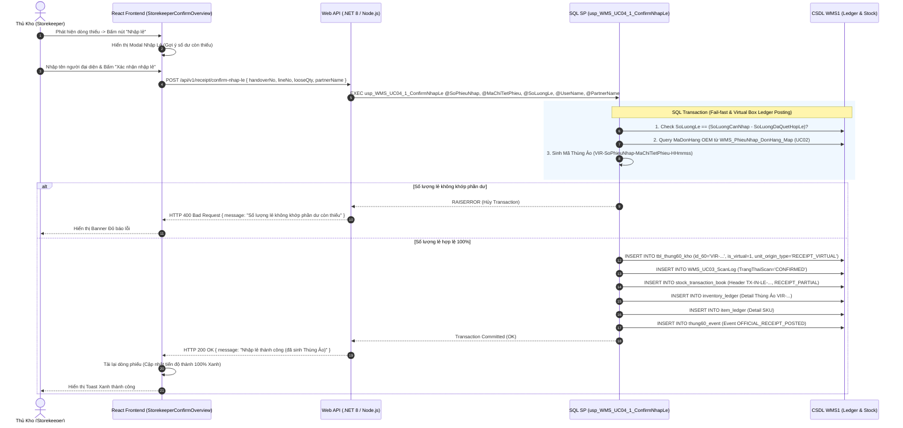
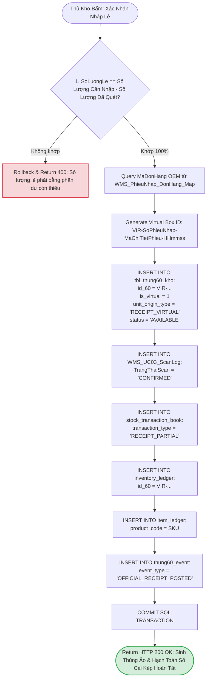
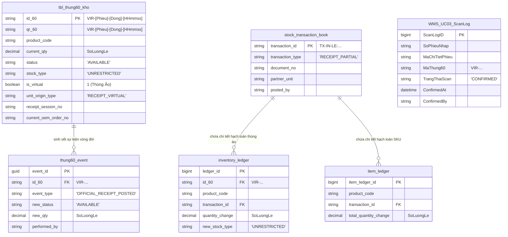
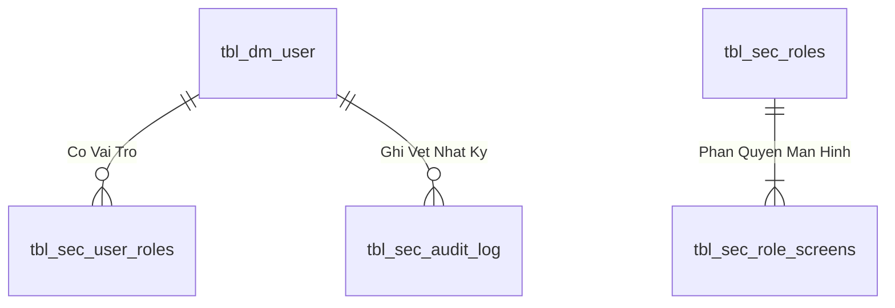
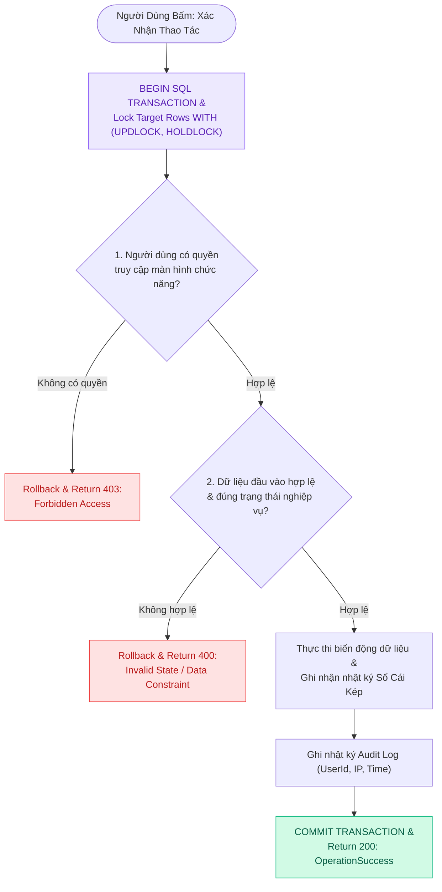

# Phân tích Thiết kế Logic UC04.1 - Nhập Lẻ & Sinh Thùng Ảo (Partial / Loose Receipt)

Tài liệu này đi sâu vào phân tích và thiết kế toàn diện hệ thống ở 5 khía cạnh bắt buộc: **Business Logic**, **UI/UX Guidelines**, **Programming Logic**, **Data Logic**, và **Diagrams (Mermaid)** dành cho chức năng **Nhập Lẻ & Sinh Thùng Ảo (UC04.1)** - giải pháp tiếp nhận hàng hóa lẻ không nguyên thùng 60 trong Hệ thống WMS.

---

## 1. Business Logic (Logic Nghiệp Vụ)

- **Mục tiêu cốt lõi:** Đảm bảo thực thi quy trình nghiệp vụ chuẩn hóa, kiểm soát tính toàn vẹn của dữ liệu và tuân thủ các quy định vận hành kho vật tư & sản xuất của nhà máy Kềm Nghĩa.

- **Các quy tắc nghiệp vụ (Business Rules):**
  - `BR-GEN-01` **Ràng buộc xác thực & Phân quyền (Security & Access Control):** Người dùng bắt buộc phải có phiên đăng nhập hợp lệ và quyền màn hình tương ứng trong `api.vw_SEC_UserScreenAccess_v1`.
  - `BR-GEN-02` **Kiểm tra tính toàn vẹn dữ liệu đầu vào (Input Validation):** Mọi tham số gửi lên API đều phải được chuẩn hóa, trim khoảng trắng và kiểm tra định dạng trước khi thực thi.
  - `BR-GEN-03` **Tính nguyên tử của giao dịch (Atomic Transaction):** Mọi thao tác ghi biến động đều được thực thi trong khối `BEGIN TRANSACTION` với `SET XACT_ABORT ON`, tự động Rollback khi có lỗi.
  - `BR-GEN-04` **Khóa đồng thời chống xung đột dữ liệu (Concurrency Control):** Áp dụng gợi ý khóa `WITH (UPDLOCK, HOLDLOCK)` trên các bảng dữ liệu trọng yếu.
  - `BR-GEN-05` **Hạch toán biến động vào Sổ Cái Kép (Dual Ledger Posting):** Mọi biến động kho đều được ghi nhận vào sổ chi tiết `tbl_transaction` và cập nhật thẻ kho tổng hợp.
  - `BR-GEN-06` **Đồng bộ thời gian thực (Realtime Synchronization):** Đảm bảo tính nhất quán dữ liệu giữa Desktop Web, Handheld PDA và TV Wallboard.
  - `BR-GEN-07` **Ghi vết nhật ký kiểm toán (Audit Trail):** Tự động lưu vết người thực hiện, thời gian, IP và thiết bị cho mọi giao dịch quan trọng.

- **Quy trình tương tác 5 bước (Interaction Flow):**
  - **Bước 1:** Người dùng truy cập phân hệ chức năng tương ứng trên giao diện Web / PDA.
  - **Bước 2:** Nhập liệu các trường thông tin bắt buộc hoặc quét mã Barcode từ thiết bị.
  - **Bước 3:** Frontend validate client-side và gửi request API kèm Token xác thực.
  - **Bước 4:** Backend kiểm tra Fail-fast (Verify JWT $
ightarrow$ Verify Screen Permission $
ightarrow$ Validate Business Rules $
ightarrow$ Execute SQL Stored Procedure trong khối Transaction).
  - **Bước 5:** Backend cập nhật CSDL và trả về kết quả; Frontend hiển thị thông báo thành công, phát âm thanh phản hồi và cập nhật giao diện.

---

## 2. Tiêu chuẩn Thiết kế Giao diện (UI/UX Guidelines)

- **Thiết bị đích:** Máy tính để bàn (Desktop Web UI) cho Thủ kho và Máy tính bảng Tablet.
- **Yêu cầu trải nghiệm (UX Principles):**
  - **Nút Nhập lẻ có điều kiện (Conditional Render):** Nút **"Nhập lẻ"** (Màu cam/tím) chỉ xuất hiện ở các dòng chứng từ có `SoLuongCanNhap > SoLuongDaQuetHopLe`. Nút ẩn khi dòng đã quét đủ 100%.
  - **Modal Khai Báo Số Lượng Lẻ:** Modal hiển thị rõ ràng:
    - *Số lượng yêu cầu (Requirement Qty).*
    - *Số lượng chẵn đã quét (Scanned Valid Qty).*
    - *Số lượng lẻ còn thiếu (Suggested Loose Qty)* $\rightarrow$ Ô nhập tự động điền sẵn con số này.
  - **Cảnh báo lỗi nhập sai:** Nếu nhập số lượng lẻ khác số dư còn thiếu hoặc gõ số âm/thập phân, ô nhập báo viền Đỏ kèm thông báo: *"Số lượng lẻ khai báo phải bằng đúng phần dư còn thiếu"*.
  - **Phản hồi hoàn tất:** Hiển thị Badge tag **[Thùng Ảo: VIR-...]** kèm Banner thông báo *"Nhập lẻ thành công! Đã tự động tạo Thùng Ảo và hạch toán Sổ Cái Kép"*.

---

## 3. Programming Logic (Logic Lập Trình)

Quy trình xử lý mã lệnh được chia thành 2 lớp rõ rệt: **Frontend (React)** và **Backend (ASP.NET Core kết hợp SQL Stored Procedure)**.

### 3.1. Frontend (React - Component View)
- **State Management & Local Processing:**
  - Gọi API kéo dữ liệu cần thiết vào React State.
  - Sử dụng các hàm mảng JavaScript (`filter`, `map`, `reduce`) để xử lý gom nhóm, lọc tìm kiếm in-memory, tối ưu hóa băng thông và tạo trải nghiệm mượt mà không độ trễ.
- **UI Interaction & Ergonomics:**
  - Sử dụng cấu trúc Collapse / Accordion / Modal xem trước để tối ưu không gian hiển thị trên màn hình Handheld PDA và Desktop Web.

### 3.2. Backend (ASP.NET Core & SQL Server Stored Procedure)
- **Thin API Gateway Pattern:**
  - ASP.NET Core Minimal API / Controller không xử lý logic tính toán nghiệp vụ mà chỉ làm cổng Gateway mỏng (Xác thực JWT Cookie, kiểm tra quyền màn hình `vw_SEC_UserScreenAccess_v1`) và ủy thác toàn bộ cho SQL Server Stored Procedure.
- **Tận Dụng Multi-Result Set & ACID Transaction:**
  - SQL Stored Procedure trả về đồng thời nhiều Result Sets (Header info, Summary KPIs, Detailed Lines) trong một lần truy vấn duy nhất.
  - Các lệnh ghi dữ liệu áp dụng `SET XACT_ABORT ON`, `BEGIN TRANSACTION` và khóa dòng dữ liệu `WITH (UPDLOCK, HOLDLOCK)` đảm bảo an toàn tuyệt đối.

---

## 4. Data Logic (Thiết kế Dữ Liệu)

### 4.1. Ma trận phân quyền CRUD

| Bảng / Thực thể Dữ Liệu | Create (Tạo) | Read (Đọc) | Update (Cập nhật) | Delete (Xóa) | Ý nghĩa nghiệp vụ trong UC04.1 |
| :--- | :---: | :---: | :---: | :---: | :--- |
| `tbl_thung60_kho` | **X** | **X** | - | - | Khởi tạo bản ghi Thùng Ảo (`is_virtual = 1`, `unit_origin_type = 'RECEIPT_VIRTUAL'`) |
| `WMS_UC03_ScanLog` | **X** | **X** | - | - | Chèn bản ghi log `CONFIRMED` để đồng bộ tiến độ UI dòng phiếu |
| `WMS_PhieuNhap_DonHang_Map` | - | **X** | - | - | Đọc kế thừa `MaDonHang` OEM đã map ở UC02 |
| `stock_transaction_book` | **X** | **X** | - | - | Ghi Header chứng từ nhập lẻ (`transaction_type = 'RECEIPT_PARTIAL'`) |
| `inventory_ledger` | **X** | **X** | - | - | Ghi Detail hạch toán kho cấp Thùng Ảo (`VIR-...`) |
| `item_ledger` | **X** | **X** | - | - | Ghi Detail hạch toán kho cấp Mã hàng SKU |
| `thung60_event` | **X** | **X** | - | - | Ghi vết sự kiện vòng đời đầu tiên cho Thùng Ảo |

### 4.2. Định nghĩa Trạng thái (Conceptual State Model)

| Cột / Biến | Kiểu Dữ Liệu | Giá Trị Gán Cho Thùng Ảo | Ý nghĩa Nghiệp vụ |
| :--- | :--- | :--- | :--- |
| `id_60` / `qr_60` | `NVARCHAR(50)` | `VIR-[Phieu]-[Dong]-[HHmmss]` | Mã định danh thùng ảo bắt đầu bằng tiền tố `VIR-` |
| `is_virtual` | `BIT` / `BOOLEAN` | `1` (True) | Cờ xác nhận đây là Thùng Ảo do WMS tự sinh ra |
| `unit_origin_type` | `VARCHAR(30)` | `'RECEIPT_VIRTUAL'` | Loại nguồn gốc thùng: Sinh ra từ tiến trình Nhập Lẻ WMS |
| `status` | `VARCHAR(20)` | `'AVAILABLE'` | Trạng thái tồn kho khả dụng sẵn sàng xuất hàng |
| `stock_type` | `VARCHAR(20)` | `'UNRESTRICTED'` | Loại tồn kho tự do sử dụng không bị phong tỏa |

### 4.3. Phân tích Chi tiết Hạch Toán Sổ Cái Kép cho Thùng Ảo (Dual Ledger Virtual Box Analysis)
Khi thực hiện Nhập Lẻ tại UC04.1, thùng ảo được coi như một thực thể tồn kho đầy đủ tư cách trong Sổ Cái Kép:
1. **Header Transaction (`stock_transaction_book`):** Đánh dấu loại giao dịch riêng biệt `RECEIPT_PARTIAL` để phục vụ báo cáo kiểm toán và phân tách tỷ lệ hàng nguyên thùng vs hàng lẻ.
2. **Operational Detail (`inventory_ledger`):** Đổ dữ liệu biến động kho cấp thùng theo mã `VIR-...` giúp phân hệ Pick/Pack xuất hàng (UC16) sau này có thể chọn xuất chính xác thùng ảo chứa hàng lẻ mà không bị tắc nghẽn logic.
3. **Financial Accounting Detail (`item_ledger`):** Tăng tổng số lượng tồn kho kế toán cấp mã sản phẩm SKU tương ứng.

---

## 5. Biểu Đồ Thiết Kế (Diagrams)

### 5.1. Sequence Diagram (Luồng Nhập Lẻ & Sinh Thùng Ảo)

---

### 5.2. Data Layer Architecture (Data Flow & Virtual Box Posting)

---

### 5.3. Entity Relationship & State Logic Map (ERD Map UC04.1)

---

## 4. Data Logic & Schema Model (Thiết kế Dữ Liệu Chuyên Sâu)

### 4.1. Entity Relationship Diagram (ERD) & Schema Details

- **Bảng Người Dùng (`dbo.tbl_dm_user`):** `user_n` (PK), `msnv`, `hoten`, `matkhau`, `status_active`.
- **View Phân Quyền (`api.vw_SEC_UserScreenAccess_v1`):** Ánh xạ `UserId` $
ightarrow$ `ScreenCode`.

### 4.2. Data Layer Architecture (Data Flow & Transaction Locking)

### 4.3. Conceptual State Model & Transition Rules
| Trạng Thái User | Thao Tác | Trạng Thái Sau | Quyền Hạn |
| :--- | :--- | :--- | :--- |
| **`ACTIVE (1)`** | Đăng nhập thành công (AUTH-01) | Sinh JWT Cookie (8h) | Truy cập các màn hình được cấp quyền |
| **`ACTIVE (1)`** | Khóa tài khoản (ADM-01) | `INACTIVE (0)` | Chặn đăng nhập và thu hồi token tức thì |
