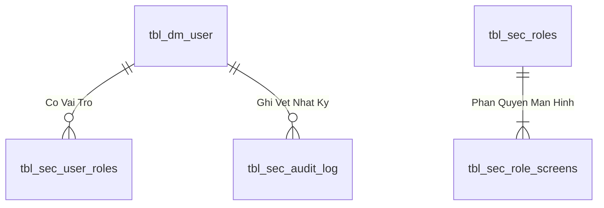

# Phân tích Thiết kế Logic UC09 - Thủ tục nhập kho

Tài liệu phân tích toàn diện **Business Logic**, **UI/UX Guidelines**, **Programming Logic**, **Data Logic** và **Diagrams** cho chức năng **Thủ tục nhập kho** khi chuyển hệ thống Quản lý Kho Vật tư từ Power Apps sang React.

Nguyên tắc bắt buộc: React chỉ xử lý giao diện; backend là API host mỏng; mọi quy tắc nghiệp vụ, chuyển trạng thái và transaction nhiều bảng được thực thi trong SQL Stored Procedure.

---

## 1. Business Logic (Logic Nghiệp vụ)

### 1.1. Mục tiêu cốt lõi

Xác nhận nhập kho, tạo batch tồn và ghi đầy đủ phiếu giao dịch cùng transaction trong một giao dịch SQL.

### 1.2. Phạm vi và nguồn hiện hữu

| Màn hình | Nguồn | Datasource phát hiện trong YAML |
|---|---|---|
| scr_nhapkho_thutuc | Quản lý kho vật tư .msapp | vw_status_phieu_nhanhang, tbl_phieu_transaction, tbl_chitiet_nhanhang, vw_chitietnhan_coPO, tbl_phieu_nhan_hang, MMS_insert_nhapkho, vw_nhapkho_vattu, tbl_transaction, MMS_sql |
| scr_nhapkho_ql | Quản lý kho vật tư .msapp | vw_status_phieu_nhanhang, vw_phieukiem_group_qc, tbl_chitiet_nhanhang, vw_chitietnhan_coPO, tbl_phieu_nhan_hang, vw_nhapkho_vattu |
| scr_nhapkho_batch | Quản lý kho vật tư .msapp | vw_phieu_nhanhang_nhapkho, tbl_phieu_transaction, tbl_transaction, MMS_split_batch, vw_batch_print, tbl_batch_inv, Http_to_C_MMS |

- Thao tác Power Fx phát hiện: **ClearCollect, Collect, Flow.Run, Navigate, Patch, Remove**.
- Datasource tham chiếu thực tế: `Http_to_C_MMS, MMS_insert_nhapkho, MMS_split_batch, MMS_sql, tbl_batch_inv, tbl_chitiet_nhanhang, tbl_phieu_nhan_hang, tbl_phieu_transaction, tbl_transaction, vw_batch_print, vw_chitietnhan_coPO, vw_nhapkho_vattu, vw_phieu_nhanhang_nhapkho, vw_phieukiem_group_qc, vw_status_phieu_nhanhang`.
- Nhãn giao diện tiêu biểu: `Nhà Cung Cấp:`, `Phiếu Nhận`, `Mã PO`, `Nhà Cung Cấp`, `Kết Quả QC`, `SL Không Đạt`, `SL Thực Nhận`, `XÁC NHẬN`, `TẠO PHIẾU`, `ĐVT`, `SL Nhập Kho`, `ĐÓNG PHIẾU`.

### 1.3. Actor

- Actor nghiệp vụ: Thủ kho nhập.
- React Web Client trên PC hoặc mobile/PDA tùy màn hình.
- Backend API xác thực, phân quyền, validate hình thức và gọi SP.
- SQL Server MMS chịu trách nhiệm toàn bộ logic nghiệp vụ.

### 1.4. Tiền điều kiện

- Người dùng đã đăng nhập và có quyền `UC09`.
- Danh mục và chứng từ nguồn liên quan đang hoạt động.
- Dữ liệu đầu vào thuộc đúng kho/bộ phận mà người dùng được phép thao tác.
- Các Stored Procedure của use case đã được triển khai và version tương thích API.

### 1.5. Hậu điều kiện

- Khi thành công, dữ liệu và trạng thái được cập nhật atomic, có người thao tác và thời gian.
- API trả mã kết quả, thông báo và dữ liệu mới nhất do SP xác nhận.
- Khi thất bại, SP rollback toàn bộ phần ghi và không để dữ liệu trung gian dở dang.
- React refresh dữ liệu từ response/read SP; không tự giả lập trạng thái thành công.

### 1.6. Business Rules

- **`[BR-UC09-01]`** Chỉ phiếu đủ điều kiện mới nhập.
- **`[BR-UC09-02]`** Không nhập vượt số lượng nhận hợp lệ.
- **`[BR-UC09-03]`** Mỗi batch có định danh duy nhất.
- **`[BR-UC09-04]`** Batch, phiếu transaction và transaction phải atomic.
- **`[BR-UC09-05]`** Transaction nhập có trạng thái nhập kho.
- **`[BR-UC09-06]`** Không commit nếu bất kỳ dòng nào lỗi.

- **`[BR-UC09-07]`** User thao tác lấy từ token; SP kiểm tra lại quyền và phạm vi dữ liệu.
- **`[BR-UC09-08]`** Mọi command phải hỗ trợ `RequestId` để chống gửi lặp.
- **`[BR-UC09-09]`** Không dùng SQL động do client truyền và không cho backend cập nhật bảng trực tiếp.

### 1.7. Luồng chính

| Bước | Thao tác | React/API | SQL Stored Procedure |
|---|---|---|---|
| 1 | Chọn phiếu chờ nhập | Hiển thị/thu thập dữ liệu và gọi API | Đọc, kiểm tra rule hoặc ghi dữ liệu trong SP |
| 2 | Kiểm tra trạng thái QC/PO | Hiển thị/thu thập dữ liệu và gọi API | Đọc, kiểm tra rule hoặc ghi dữ liệu trong SP |
| 3 | Xác nhận số lượng và kho nhận | Hiển thị/thu thập dữ liệu và gọi API | Đọc, kiểm tra rule hoặc ghi dữ liệu trong SP |
| 4 | Tạo thông tin batch | Hiển thị/thu thập dữ liệu và gọi API | Đọc, kiểm tra rule hoặc ghi dữ liệu trong SP |
| 5 | Ghi phiếu transaction | Hiển thị/thu thập dữ liệu và gọi API | Đọc, kiểm tra rule hoặc ghi dữ liệu trong SP |
| 6 | Ghi transaction nhập | Hiển thị/thu thập dữ liệu và gọi API | Đọc, kiểm tra rule hoặc ghi dữ liệu trong SP |
| 7 | Cập nhật trạng thái phiếu nhận | Hiển thị/thu thập dữ liệu và gọi API | Đọc, kiểm tra rule hoặc ghi dữ liệu trong SP |

### 1.8. Luồng ngoại lệ

| Mã | Tình huống | HTTP | Xử lý bắt buộc |
|---|---|---:|---|
| `INVALID_INPUT` | Thiếu hoặc sai định dạng dữ liệu | 400 | React đánh dấu trường; SP không ghi dữ liệu |
| `FORBIDDEN` | Không có quyền hoặc sai phạm vi kho | 403 | Không trả dữ liệu ngoài phạm vi |
| `NOT_FOUND` | Chứng từ/danh mục không tồn tại | 404 | Refresh danh sách và yêu cầu chọn lại |
| `INVALID_STATE` | Trạng thái hiện tại không cho phép thao tác | 409 | SP rollback, trả trạng thái mới nhất |
| `CONCURRENCY_CONFLICT` | Dữ liệu đã thay đổi bởi phiên khác | 409 | UI tải lại dữ liệu; không tự retry command |
| `DUPLICATE_REQUEST` | `RequestId` đã xử lý | 200/409 | Trả lại kết quả cũ hoặc mã trùng an toàn |
| `DATABASE_ERROR` | Lỗi SQL ngoài dự kiến | 500 | Rollback và ghi technical log |

### 1.9. State Model

| Trạng thái | Ý nghĩa | Hành động tiếp theo |
|---|---|---|
| RECEIVED | Trạng thái nghiệp vụ RECEIVED của thủ tục nhập kho | Theo state machine và quyền của SP |
| QC_PASSED | Trạng thái nghiệp vụ QC_PASSED của thủ tục nhập kho | Theo state machine và quyền của SP |
| READY_TO_STORE | Trạng thái nghiệp vụ READY_TO_STORE của thủ tục nhập kho | Theo state machine và quyền của SP |
| WAREHOUSED | Trạng thái nghiệp vụ WAREHOUSED của thủ tục nhập kho | Theo state machine và quyền của SP |

---

## 2. UI/UX Guidelines

### 2.1. Cấu trúc màn hình

- Thanh tiêu đề hiển thị tên nghiệp vụ, kho/bộ phận và người đang thao tác.
- Vùng bộ lọc/danh mục ở đầu, vùng dữ liệu chính ở giữa và thanh hành động cố định ở cuối.
- Danh sách nhiều dòng dùng table trên PC và list compact trên mobile, không lồng card.
- Trạng thái hiển thị bằng badge có cả màu và chữ; không chỉ dựa vào màu.
- Command chính chỉ bật khi dữ liệu đầu vào và trạng thái UI hợp lệ.

### 2.2. Trạng thái tương tác

| UI State | Hành vi |
|---|---|
| `idle` | Sẵn sàng nhập/chọn dữ liệu |
| `loading` | Skeleton cho vùng danh sách; giữ ổn định kích thước layout |
| `editing` | Cho phép thay đổi trường theo quyền và trạng thái |
| `submitting` | Khóa submit lặp; hiển thị tiến trình trong nút |
| `success` | Hiển thị mã chứng từ/kết quả và refresh từ server |
| `error` | Giữ dữ liệu người dùng, chỉ rõ trường hoặc rule bị lỗi |
| `conflict` | Cảnh báo dữ liệu đã đổi và cung cấp nút tải lại |

### 2.3. Responsive và accessibility

- Vùng chạm mobile tối thiểu 44 x 44 px; input số mở bàn phím số.
- Table rộng chuyển sang chế độ row detail trên màn hình nhỏ.
- Label liên kết input; lỗi dùng `aria-describedby`; dialog giữ focus đúng chuẩn.
- Hỗ trợ bàn phím cho tìm kiếm, thêm dòng, xác nhận và đóng dialog.
- Không hiển thị hướng dẫn kỹ thuật hoặc tên bảng/SP trong UI sản xuất.

---

## 3. Programming Logic (Logic Lập Trình)

Quy trình xử lý mã lệnh được chia thành 2 lớp rõ rệt: **Frontend (React)** và **Backend (ASP.NET Core kết hợp SQL Stored Procedure)**.

### 3.1. Frontend (React - Component View)
- **State Management & Local Processing:**
  - Gọi API kéo dữ liệu cần thiết vào React State.
  - Sử dụng các hàm mảng JavaScript (`filter`, `map`, `reduce`) để xử lý gom nhóm, lọc tìm kiếm in-memory, tối ưu hóa băng thông và tạo trải nghiệm mượt mà không độ trễ.
- **UI Interaction & Ergonomics:**
  - Sử dụng cấu trúc Collapse / Accordion / Modal xem trước để tối ưu không gian hiển thị trên màn hình Handheld PDA và Desktop Web.

### 3.2. Backend (ASP.NET Core & SQL Server Stored Procedure)
- **Thin API Gateway Pattern:**
  - ASP.NET Core Minimal API / Controller không xử lý logic tính toán nghiệp vụ mà chỉ làm cổng Gateway mỏng (Xác thực JWT Cookie, kiểm tra quyền màn hình `vw_SEC_UserScreenAccess_v1`) và ủy thác toàn bộ cho SQL Server Stored Procedure.
- **Tận Dụng Multi-Result Set & ACID Transaction:**
  - SQL Stored Procedure trả về đồng thời nhiều Result Sets (Header info, Summary KPIs, Detailed Lines) trong một lần truy vấn duy nhất.
  - Các lệnh ghi dữ liệu áp dụng `SET XACT_ABORT ON`, `BEGIN TRANSACTION` và khóa dòng dữ liệu `WITH (UPDLOCK, HOLDLOCK)` đảm bảo an toàn tuyệt đối.

---

## 4. Data Logic & Schema Model (Thiết kế Dữ Liệu Chuyên Sâu)

### 4.1. Entity Relationship Diagram (ERD) & Schema Details

- **Bảng Người Dùng (`dbo.tbl_dm_user`):** `user_n` (PK), `msnv`, `hoten`, `matkhau`, `status_active`.
- **View Phân Quyền (`api.vw_SEC_UserScreenAccess_v1`):** Ánh xạ `UserId` $
ightarrow$ `ScreenCode`.

### 4.2. Data Flow & Transaction Locking Matrix
- **Xác thực phiên:** Truy vấn nhanh không khóa (`NOLOCK`) trên `vw_SEC_UserScreenAccess_v1` và ghi log an toàn vào `tbl_sec_audit_log`.

### 4.3. Conceptual State Model & Transition Rules
| Trạng Thái User | Thao Tác | Trạng Thái Sau | Quyền Hạn |
| :--- | :--- | :--- | :--- |
| **`ACTIVE (1)`** | Đăng nhập thành công (AUTH-01) | Sinh JWT Cookie (8h) | Truy cập các màn hình được cấp quyền |
| **`ACTIVE (1)`** | Khóa tài khoản (ADM-01) | `INACTIVE (0)` | Chặn đăng nhập và thu hồi token tức thì |
