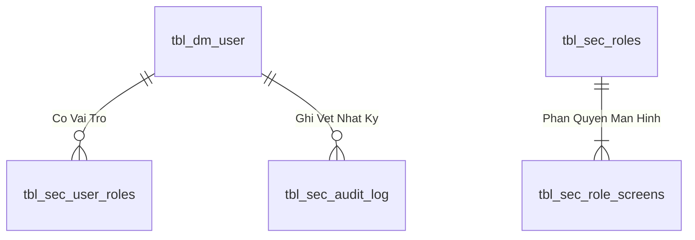

# Báo cáo hoàn thành tài liệu Use Case

Tiêu chí PASS: tối thiểu 8 phần cấp 2, 8 business rules, 12 acceptance scenarios và 3 biểu đồ Mermaid.

| UC | Dòng | Phần | Rules | Tests | Diagrams | Kết quả |
|---|---|---|---|---|---|---|
| UC01 | 805 | 9 | 14 | 15 | 3 | PASS |
| UC02 | 377 | 9 | 9 | 12 | 3 | PASS |
| UC03 | 383 | 9 | 9 | 12 | 3 | PASS |
| UC04 | 388 | 9 | 9 | 12 | 3 | PASS |
| UC05 | 382 | 9 | 9 | 12 | 3 | PASS |
| UC06 | 381 | 9 | 9 | 12 | 3 | PASS |
| UC07 | 344 | 9 | 9 | 12 | 3 | PASS |
| UC08 | 383 | 9 | 9 | 12 | 3 | PASS |
| UC09 | 386 | 9 | 9 | 12 | 3 | PASS |
| UC10 | 384 | 9 | 9 | 12 | 3 | PASS |
| UC11 | 387 | 9 | 9 | 12 | 3 | PASS |
| UC12 | 386 | 9 | 9 | 12 | 3 | PASS |
| UC13 | 389 | 9 | 9 | 12 | 3 | PASS |
| UC14 | 387 | 9 | 9 | 12 | 3 | PASS |
| UC15 | 383 | 9 | 9 | 12 | 3 | PASS |
| UC16 | 337 | 9 | 9 | 12 | 3 | PASS |
| UC17 | 334 | 9 | 9 | 12 | 3 | PASS |
| UC18 | 386 | 9 | 9 | 12 | 3 | PASS |
| UC19 | 391 | 9 | 9 | 12 | 3 | PASS |
| UC20 | 389 | 9 | 9 | 12 | 3 | PASS |
| UC21 | 391 | 9 | 9 | 12 | 3 | PASS |
| UC22 | 392 | 9 | 9 | 12 | 3 | PASS |
| UC23 | 391 | 9 | 9 | 12 | 3 | PASS |
| UC24 | 384 | 9 | 9 | 12 | 3 | PASS |
| UC25 | 388 | 9 | 10 | 12 | 3 | PASS |
| UC26 | 339 | 9 | 9 | 12 | 3 | PASS |

Nguồn kiểm chứng: hai gói `.msapp`, metadata datasource SQL và tài liệu schema toàn bộ ứng dụng.

---

## 4. Data Logic & Schema Model (Thiết kế Dữ Liệu Chuyên Sâu)

### 4.1. Entity Relationship Diagram (ERD) & Schema Details

- **Bảng Người Dùng (`dbo.tbl_dm_user`):** `user_n` (PK), `msnv`, `hoten`, `matkhau`, `status_active`.
- **View Phân Quyền (`api.vw_SEC_UserScreenAccess_v1`):** Ánh xạ `UserId` $
ightarrow$ `ScreenCode`.

### 4.2. Data Flow & Transaction Locking Matrix
- **Xác thực phiên:** Truy vấn nhanh không khóa (`NOLOCK`) trên `vw_SEC_UserScreenAccess_v1` và ghi log an toàn vào `tbl_sec_audit_log`.

### 4.3. Conceptual State Model & Transition Rules
| Trạng Thái User | Thao Tác | Trạng Thái Sau | Quyền Hạn |
| :--- | :--- | :--- | :--- |
| **`ACTIVE (1)`** | Đăng nhập thành công (AUTH-01) | Sinh JWT Cookie (8h) | Truy cập các màn hình được cấp quyền |
| **`ACTIVE (1)`** | Khóa tài khoản (ADM-01) | `INACTIVE (0)` | Chặn đăng nhập và thu hồi token tức thì |
