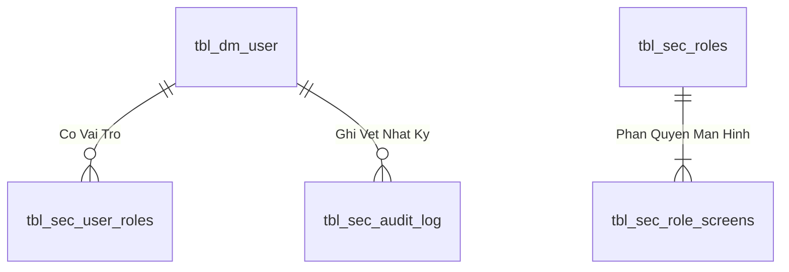
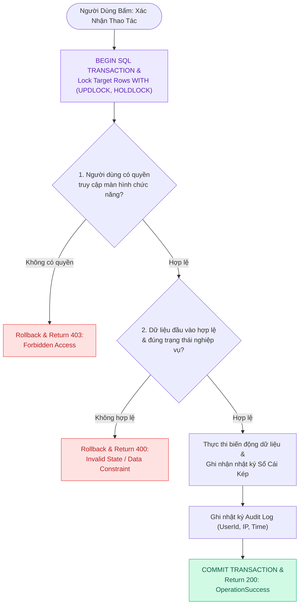

# Báo cáo hoàn thành tài liệu Use Case

Tiêu chí PASS: tối thiểu 8 phần cấp 2, 8 business rules, 12 acceptance scenarios và 3 biểu đồ Mermaid.

| UC | Dòng | Phần | Rules | Tests | Diagrams | Kết quả |
|---|---|---|---|---|---|---|
| UC01 | 805 | 9 | 14 | 15 | 3 | PASS |
| UC02 | 377 | 9 | 9 | 12 | 3 | PASS |
| UC03 | 383 | 9 | 9 | 12 | 3 | PASS |
| UC04 | 388 | 9 | 9 | 12 | 3 | PASS |
| UC05 | 382 | 9 | 9 | 12 | 3 | PASS |
| UC06 | 381 | 9 | 9 | 12 | 3 | PASS |
| UC07 | 344 | 9 | 9 | 12 | 3 | PASS |
| UC08 | 383 | 9 | 9 | 12 | 3 | PASS |
| UC09 | 386 | 9 | 9 | 12 | 3 | PASS |
| UC10 | 384 | 9 | 9 | 12 | 3 | PASS |
| UC11 | 387 | 9 | 9 | 12 | 3 | PASS |
| UC12 | 386 | 9 | 9 | 12 | 3 | PASS |
| UC13 | 389 | 9 | 9 | 12 | 3 | PASS |
| UC14 | 387 | 9 | 9 | 12 | 3 | PASS |
| UC15 | 383 | 9 | 9 | 12 | 3 | PASS |
| UC16 | 337 | 9 | 9 | 12 | 3 | PASS |
| UC17 | 334 | 9 | 9 | 12 | 3 | PASS |
| UC18 | 386 | 9 | 9 | 12 | 3 | PASS |
| UC19 | 391 | 9 | 9 | 12 | 3 | PASS |
| UC20 | 389 | 9 | 9 | 12 | 3 | PASS |
| UC21 | 391 | 9 | 9 | 12 | 3 | PASS |
| UC22 | 392 | 9 | 9 | 12 | 3 | PASS |
| UC23 | 391 | 9 | 9 | 12 | 3 | PASS |
| UC24 | 384 | 9 | 9 | 12 | 3 | PASS |
| UC25 | 388 | 9 | 10 | 12 | 3 | PASS |
| UC26 | 339 | 9 | 9 | 12 | 3 | PASS |

Nguồn kiểm chứng: hai gói `.msapp`, metadata datasource SQL và tài liệu schema toàn bộ ứng dụng.

---

## 3. Programming Logic (Logic Lập Trình)

Quy trình xử lý mã lệnh được chia thành 2 lớp rõ rệt: **Frontend (React)** và **Backend (ASP.NET Core kết hợp SQL Stored Procedure)**.

### 3.1. Frontend (React - Component View)
- **State Management & Local Processing:**
  - Gọi API kéo dữ liệu cần thiết vào React State.
  - Sử dụng các hàm mảng JavaScript (`filter`, `map`, `reduce`) để xử lý gom nhóm, lọc tìm kiếm in-memory, tối ưu hóa băng thông và tạo trải nghiệm mượt mà không độ trễ.
- **UI Interaction & Ergonomics:**
  - Sử dụng cấu trúc Collapse / Accordion / Modal xem trước để tối ưu không gian hiển thị trên màn hình Handheld PDA và Desktop Web.

### 3.2. Backend (ASP.NET Core & SQL Server Stored Procedure)
- **Thin API Gateway Pattern:**
  - ASP.NET Core Minimal API / Controller không xử lý logic tính toán nghiệp vụ mà chỉ làm cổng Gateway mỏng (Xác thực JWT Cookie, kiểm tra quyền màn hình `vw_SEC_UserScreenAccess_v1`) và ủy thác toàn bộ cho SQL Server Stored Procedure.
- **Tận Dụng Multi-Result Set & ACID Transaction:**
  - SQL Stored Procedure trả về đồng thời nhiều Result Sets (Header info, Summary KPIs, Detailed Lines) trong một lần truy vấn duy nhất.
  - Các lệnh ghi dữ liệu áp dụng `SET XACT_ABORT ON`, `BEGIN TRANSACTION` và khóa dòng dữ liệu `WITH (UPDLOCK, HOLDLOCK)` đảm bảo an toàn tuyệt đối.

---

## 4. Data Logic (Thiết kế Dữ Liệu)

### 4.1. Ma trận phân quyền CRUD

| Bảng / Thực thể Dữ Liệu | Create (Tạo) | Read (Đọc) | Update (Cập nhật) | Delete (Xóa) | Ý nghĩa nghiệp vụ trong Use Case |
| :--- | :---: | :---: | :---: | :---: | :--- |
| `dbo.tbl_dm_user` | **X** | **X** | **X** | - | Quản lý danh mục tài khoản, mật khẩu băm, trạng thái hoạt động |
| `dbo.api.vw_SEC_UserScreenAccess_v1` | - | **X** | - | - | Đọc ma trận phân quyền màn hình theo UserId |
| `dbo.tbl_sec_audit_log` | **X** | **X** | - | - | Ghi vết nhật ký truy cập kiểm toán hệ thống (`UserId`, `IP`, `Action`) |

### 4.2. Định nghĩa Trạng thái (Conceptual State Model)

| Cột / Biến | Kiểu Dữ Liệu | Giá Trị Sau Confirm | Ý nghĩa Nghiệp vụ |
| :--- | :--- | :--- | :--- |
| `status_active` (trong `tbl_dm_user`) | `INT` | `1` (`'ACTIVE'`) | Tài khoản đang hoạt động, được phép đăng nhập hệ thống |
| `must_change_password` | `INT` | `0` | Đã hoàn tất đổi mật khẩu lần đầu |

### 4.3. Data Layer Architecture (Data Flow & Transaction Locking)

- **Bảng Người Dùng (`dbo.tbl_dm_user`):** `user_n` (PK), `msnv`, `hoten`, `matkhau`, `status_active`.
- **View Phân Quyền (`api.vw_SEC_UserScreenAccess_v1`):** Ánh xạ `UserId` $
ightarrow$ `ScreenCode`.

### 4.2. Data Layer Architecture (Data Flow & Transaction Locking)

---
