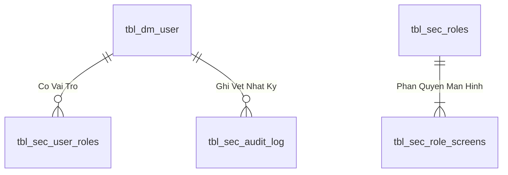

# Use Case Catalog

| UC | Tên nghiệp vụ | Tài liệu chi tiết | Trạng thái |
|---|---|---|---|
| UC01 | Đăng nhập PC/Mobile | [UC01_ng_nh_p_PC_Mobile.md](./UC01_ng_nh_p_PC_Mobile.md) | Hoàn thành |
| UC02 | Quản trị role và màn hình | [UC02_Qu_n_tr_role_v_m_n_h_nh.md](./UC02_Qu_n_tr_role_v_m_n_h_nh.md) | Hoàn thành |
| UC03 | Tạm nhận hàng | [UC03_T_m_nh_n_h_ng.md](./UC03_T_m_nh_n_h_ng.md) | Hoàn thành |
| UC04 | Nhận hàng theo PO | [UC04_Nh_n_h_ng_theo_PO.md](./UC04_Nh_n_h_ng_theo_PO.md) | Hoàn thành |
| UC05 | Nhận hàng không PO | [UC05_Nh_n_h_ng_kh_ng_PO.md](./UC05_Nh_n_h_ng_kh_ng_PO.md) | Hoàn thành |
| UC06 | Nhận hàng nội bộ | [UC06_Nh_n_h_ng_n_i_b.md](./UC06_Nh_n_h_ng_n_i_b.md) | Hoàn thành |
| UC07 | Lịch sử nhận hàng | [UC07_L_ch_s_nh_n_h_ng.md](./UC07_L_ch_s_nh_n_h_ng.md) | Hoàn thành |
| UC08 | Cập nhật PO nhập kho | [UC08_C_p_nh_t_PO_nh_p_kho.md](./UC08_C_p_nh_t_PO_nh_p_kho.md) | Hoàn thành |
| UC09 | Thủ tục nhập kho | [UC09_Th_t_c_nh_p_kho.md](./UC09_Th_t_c_nh_p_kho.md) | Hoàn thành |
| UC10 | Tách batch và in tem | [UC10_T_ch_batch_v_in_tem.md](./UC10_T_ch_batch_v_in_tem.md) | Hoàn thành |
| UC11 | Lưu kho lên kệ | [UC11_L_u_kho_l_n_k.md](./UC11_L_u_kho_l_n_k.md) | Hoàn thành |
| UC12 | Cấu hình QC | [UC12_C_u_h_nh_QC.md](./UC12_C_u_h_nh_QC.md) | Hoàn thành |
| UC13 | Phiếu kiểm QC | [UC13_Phi_u_ki_m_QC.md](./UC13_Phi_u_ki_m_QC.md) | Hoàn thành |
| UC14 | Đánh giá vật tư QC | [UC14_nh_gi_v_t_t_QC.md](./UC14_nh_gi_v_t_t_QC.md) | Hoàn thành |
| UC15 | Khai báo tồn kho | [UC15_Khai_b_o_t_n_kho.md](./UC15_Khai_b_o_t_n_kho.md) | Hoàn thành |
| UC16 | In tem tồn kho | [UC16_In_tem_t_n_kho.md](./UC16_In_tem_t_n_kho.md) | Hoàn thành |
| UC17 | Lịch sử batch | [UC17_L_ch_s_batch.md](./UC17_L_ch_s_batch.md) | Hoàn thành |
| UC18 | Kiểm kê batch | [UC18_Ki_m_k_batch.md](./UC18_Ki_m_k_batch.md) | Hoàn thành |
| UC19 | Tạo đề nghị xuất kho | [UC19_T_o_ngh_xu_t_kho.md](./UC19_T_o_ngh_xu_t_kho.md) | Hoàn thành |
| UC20 | Đề nghị xuất kho mobile | [UC20_ngh_xu_t_kho_mobile.md](./UC20_ngh_xu_t_kho_mobile.md) | Hoàn thành |
| UC21 | Lịch sử và chỉnh sửa đề nghị xuất kho | [UC21_L_ch_s_v_ch_nh_s_a_ngh_xu_t_kho.md](./UC21_L_ch_s_v_ch_nh_s_a_ngh_xu_t_kho.md) | Hoàn thành |
| UC22 | Soạn hàng | [UC22_So_n_h_ng.md](./UC22_So_n_h_ng.md) | Hoàn thành |
| UC23 | Thủ tục xuất kho | [UC23_Th_t_c_xu_t_kho.md](./UC23_Th_t_c_xu_t_kho.md) | Hoàn thành |
| UC24 | Phê duyệt phiếu | [UC24_Ph_duy_t_phi_u.md](./UC24_Ph_duy_t_phi_u.md) | Hoàn thành |
| UC25 | Phiếu trả/nhập nội bộ | [UC25_Phi_u_tr_nh_p_n_i_b.md](./UC25_Phi_u_tr_nh_p_n_i_b.md) | Hoàn thành |
| UC26 | Báo cáo tồn và giao dịch | [UC26_B_o_c_o_t_n_v_giao_d_ch.md](./UC26_B_o_c_o_t_n_v_giao_d_ch.md) | Hoàn thành |

---

## 4. Data Logic & Schema Model (Thiết kế Dữ Liệu Chuyên Sâu)

### 4.1. Entity Relationship Diagram (ERD) & Schema Details

- **Bảng Người Dùng (`dbo.tbl_dm_user`):** `user_n` (PK), `msnv`, `hoten`, `matkhau`, `status_active`.
- **View Phân Quyền (`api.vw_SEC_UserScreenAccess_v1`):** Ánh xạ `UserId` $
ightarrow$ `ScreenCode`.

### 4.2. Data Flow & Transaction Locking Matrix
- **Xác thực phiên:** Truy vấn nhanh không khóa (`NOLOCK`) trên `vw_SEC_UserScreenAccess_v1` và ghi log an toàn vào `tbl_sec_audit_log`.

### 4.3. Conceptual State Model & Transition Rules
| Trạng Thái User | Thao Tác | Trạng Thái Sau | Quyền Hạn |
| :--- | :--- | :--- | :--- |
| **`ACTIVE (1)`** | Đăng nhập thành công (AUTH-01) | Sinh JWT Cookie (8h) | Truy cập các màn hình được cấp quyền |
| **`ACTIVE (1)`** | Khóa tài khoản (ADM-01) | `INACTIVE (0)` | Chặn đăng nhập và thu hồi token tức thì |
