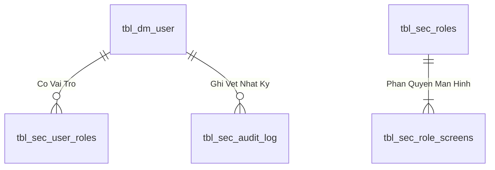

# Danh mục use case – WMS Kho Thành Phẩm

## 1. Phạm vi khảo sát

- Ứng dụng tham chiếu: `http://10.17.16.164:5173/`
- Phiên bản hiển thị: WMS Kho Thành Phẩm v5.0 / ASP.NET Core 8.0
- Ngày khảo sát: 2026-08-15
- Nguồn: dashboard của tài khoản quản trị và màn hình báo cáo Sổ Cái Kép.
- Quy ước: giữ nguyên mã UC được ứng dụng công bố; mục chưa có mã dùng mã đề xuất theo miền nghiệp vụ.

## 2. Danh mục use case nguyên tử

| STT | Mã UC | Nhóm | Use case | Tác nhân chính | Kết quả nghiệp vụ |
|---:|---|---|---|---|---|
| 1 | AUTH-R01 | Xác thực | Đăng nhập WMS | Tất cả người dùng | Khởi tạo phiên theo tài khoản và vai trò |
| 2 | INB-R01 | Nhập kho | Quét nhận Thùng 60 | Nhân viên tiếp nhận | Ghi nhận thùng theo phiếu bàn giao |
| 3 | INB-R02 | Nhập kho | Duyệt phiếu nhập kho | Thủ kho | Xác nhận nhập và tăng tồn chính thức |
| 4 | INB-R03 | Nhập kho | Nhập kho hàng lẻ | Nhân viên kho | Xử lý lô lệch số lượng hoặc nhập thiếu |
| 5 | PKG-R01 | Đóng gói | Đóng gói Kiện 360 | Nhân viên đóng gói | Gom Thùng 60, cân và in tem TSPL |
| 6 | PKG-R02 | Đóng gói | Đóng gói kiện Repack | Nhân viên đóng gói | Tạo kiện từ hàng lẻ sau xử lý Repack |
| 7 | PKG-R03 | Đóng gói | Tách thùng khỏi kiện | Nhân viên kho | Giải phóng Thùng 60 khỏi Kiện 360 |
| 8 | PKG-R04 | Đóng gói | Chuyển đơn OEM Pack360 | Điều phối OEM | Chuyển các thùng trong kiện sang đơn OEM mới |
| 9 | LOC-R01 | Lưu trữ | Quản lý pallet và vị trí kho | Nhân viên kho | Tạo/hạ pallet và chuyển vị trí kệ |
| 10 | OUT-R01 | Xuất kho | Lập và thực hiện đơn soạn hàng | Nhân viên soạn hàng | Pick theo vị trí, hỗ trợ tách thùng lẻ |
| 11 | OUT-R02 | Xuất kho | Duyệt xuất kho | Thủ kho | Ký duyệt hàng đủ điều kiện xuất |
| 12 | OUT-R03 | Xuất kho | Kiểm cổng bảo vệ | Bảo vệ | Kiểm soát xe và hàng trước khi rời cổng |
| 13 | OUT-R04 | Xuất kho | Xác nhận phiếu xuất bến và vận chuyển | Điều phối vận chuyển | Xuất xe và ghi giảm tồn trên sổ cái |
| 14 | UC18-A | Xuất tạm | Tạo phiếu xuất tạm thành phẩm | Thủ kho/Điều phối | Xuất hàng mẫu hoặc hàng triển lãm có theo dõi |
| 15 | UC18-B | Xuất tạm | Hoàn nhập hàng xuất tạm | Thủ kho | Nhận trả và hoàn nhập tồn kho |
| 16 | UC12 | Truy vết | Tra cứu hồ sơ tài sản | Kho/QC/Quản trị | Xem phả hệ Thùng 60–Pack360–Pallet, cân nặng và sổ cái |
| 17 | RPT-R01 | Báo cáo | Báo cáo tồn kho và truy vết | Quản lý kho | Xem tồn Macro/Micro và vòng đời thùng |
| 18 | UC22.2 | Báo cáo | Báo cáo Sổ Cái Kép | Kế toán kho/Quản lý | Đối soát sổ SKU và sổ chi tiết đơn vị phiếu |
| 19 | OEM-R01 | OEM | Quản lý đơn hàng OEM | Điều phối OEM | Theo dõi tiến độ sản xuất và đóng gói |
| 20 | UC13 | Kiểm soát tồn | Khóa tồn kho | Thủ kho/Quản trị | Ngăn tồn bị sử dụng trong giao dịch mới |
| 21 | UC14 | Kiểm soát tồn | Release tồn kho | Thủ kho/Quản trị | Mở khóa và giải phóng tồn hợp lệ |
| 22 | ADM-R01 | Quản trị | Quản lý master data | Quản trị viên | Quản lý vị trí kệ, sản phẩm và khách hàng |
| 23 | ADM-R02 | Quản trị | Quản trị người dùng | IT Admin | Phân quyền tài khoản và cấp lại mật khẩu |

## 3. Nhóm menu cấp cao trên dashboard

1. Nhập Kho & Tiếp Nhận: INB-R01 đến INB-R03.
2. Lưu Trữ & Đóng Gói: PKG-R01 đến PKG-R04 và LOC-R01.
3. Soạn Hàng & Xuất Bến: OUT-R01 đến OUT-R04 và UC18-A/UC18-B.
4. Kiểm Soát & Quản Trị: UC12, RPT-R01, UC22.2, OEM-R01, UC13, UC14, ADM-R01, ADM-R02.

## 4. Ghi chú chuẩn hóa

- `UC18`, `UC13`, `UC14`, `UC12` và `UC22.2` là mã hiển thị trực tiếp trong ứng dụng.
- Các mã có hậu tố `-R` là mã tham chiếu đề xuất, chưa phải mã legacy chính thức.
- Một số thẻ dashboard chứa nhiều mục tiêu nghiệp vụ nên được tách thành use case nguyên tử: duyệt xuất/kiểm cổng, xuất tạm/hoàn nhập, khóa/release.
- Cần bổ sung actor–role matrix và trạng thái dữ liệu chi tiết sau khi khảo sát từng màn hình chức năng.

---

## 4. Data Logic & Schema Model (Thiết kế Dữ Liệu Chuyên Sâu)

### 4.1. Entity Relationship Diagram (ERD) & Schema Details

- **Bảng Người Dùng (`dbo.tbl_dm_user`):** `user_n` (PK), `msnv`, `hoten`, `matkhau`, `status_active`.
- **View Phân Quyền (`api.vw_SEC_UserScreenAccess_v1`):** Ánh xạ `UserId` $
ightarrow$ `ScreenCode`.

### 4.2. Data Flow & Transaction Locking Matrix
- **Xác thực phiên:** Truy vấn nhanh không khóa (`NOLOCK`) trên `vw_SEC_UserScreenAccess_v1` và ghi log an toàn vào `tbl_sec_audit_log`.

### 4.3. Conceptual State Model & Transition Rules
| Trạng Thái User | Thao Tác | Trạng Thái Sau | Quyền Hạn |
| :--- | :--- | :--- | :--- |
| **`ACTIVE (1)`** | Đăng nhập thành công (AUTH-01) | Sinh JWT Cookie (8h) | Truy cập các màn hình được cấp quyền |
| **`ACTIVE (1)`** | Khóa tài khoản (ADM-01) | `INACTIVE (0)` | Chặn đăng nhập và thu hồi token tức thì |
