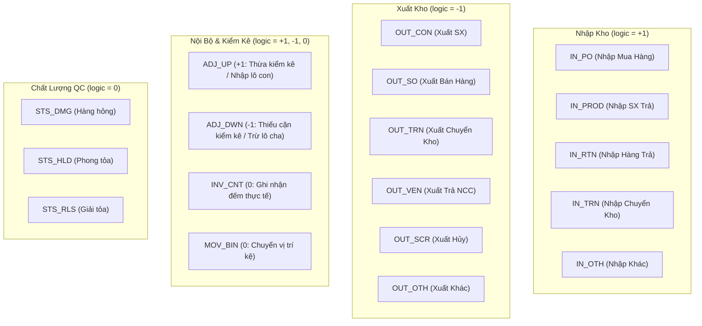

# 📘 DANH MỤC NGHIỆP VỤ KHO VÀ NGUYÊN LÝ SỔ CÁI (MMS WMS TRANSACTION LEDGER CATALOG)

> **Tài liệu tham chiếu chuẩn cho toàn bộ Hệ Thống Quản Lý Kho & Sản Xuất MMS (Kềm Nghĩa)**  
> **Phiên bản:** 2.0 (Chuẩn Hóa 18 Mã Nghiệp Vụ Kho)  
> **Bảng Dữ Liệu Nguồn:** `dbo.tbl_dm_nghiepvu_kho` & `dbo.tbl_transaction`  

---

## 1. NGUYÊN LÝ THIẾT KẾ CỐT LÕI (CORE ARCHITECTURAL PRINCIPLES)

1. **Quy ước Số Lượng Giao Dịch (`tbl_transaction.so_luong`)**:
   - Trường `so_luong` trong bảng `tbl_transaction` **LUÔN LUÔN LƯU SỐ DƯƠNG (`so_luong > 0`)**.
   - Không lưu dấu âm `(-)` trực tiếp vào trường số lượng.

2. **Quy ước Dấu Biến Động (`tbl_dm_nghiepvu_kho.logic`)**:
   - Chiều biến động tăng/giảm kho được quyết định duy nhất bởi trường **`logic`** trong bảng danh mục nghiệp vụ `tbl_dm_nghiepvu_kho`:
     - $\mathbf{+1}$: Nghiệp vụ làm **TĂNG** tồn kho vật lý.
     - $\mathbf{-1}$: Nghiệp vụ làm **GIẢM** tồn kho vật lý.
     - $\mathbf{0}$: Nghiệp vụ **KHÔNG LÀM THAY ĐỔI TỔNG TỒN** (Chuyển vị trí kệ, đổi trạng thái QC/Cách ly, đếm ghi nhận).

3. **Công Thức Tính Tồn Kho Sổ Cái (Ledger Balance)**:
   $$\text{Tồn Kho Sổ Cái} = \sum \big( \text{tbl\_transaction.so\_luong} \times \text{tbl\_dm\_nghiepvu\_kho.logic} \big)$$

```sql
-- Cú pháp tính tồn kho sổ cái chuẩn mực:
SELECT 
    t.id_vattu,
    vattu.ten_vattu,
    t.unit,
    LedgerBalance = CONVERT(decimal(19,4), SUM(
        CONVERT(decimal(19,4), ISNULL(t.so_luong, 0)) 
        * ISNULL(TRY_CONVERT(int, nv.logic), 0)
    ))
FROM dbo.tbl_transaction t
INNER JOIN dbo.tbl_dm_nghiepvu_kho nv ON nv.ma_nghiepvu = t.nghiep_vu
LEFT JOIN dbo.tbl_dm_vattu vattu ON vattu.id_vattu = t.id_vattu
WHERE t.id_vattu IS NOT NULL
GROUP BY t.id_vattu, vattu.ten_vattu, t.unit;
```

---

## 2. BẢNG DANH MỤC 18 MÃ NGHIỆP VỤ KHO CHUẨN (`tbl_dm_nghiepvu_kho`)

| STT | Nhóm Nghiệp Vụ | Mã Nghiệp Vụ | Tên Nghiệp Vụ | Dấu `logic` | Mô Tả Nghiệp Vụ & Biến Động Tồn Kho |
| :---: | :--- | :--- | :--- | :---: | :--- |
| **1** | **Nội Bộ** | `ADJ_DWN` | **Điều Chỉnh Giảm** | $\mathbf{-1}$ | Ghi nhận giảm tồn kho sau kiểm kê phát hiện thiếu/thất thoát, hoặc trừ số lượng trên lô cha khi tách lô (`SPLIT_OUT`). |
| **2** | **Nội Bộ** | `ADJ_UP` | **Điều Chỉnh Tăng** | $\mathbf{+1}$ | Ghi nhận tăng tồn kho sau kiểm kê phát hiện thừa, hoặc tăng số lượng vào lô con mới sinh khi tách lô (`SPLIT_IN`). |
| **3** | **Nhập Kho** | `IN_PO` | **Nhập Mua Hàng** | $\mathbf{+1}$ | Ghi nhận hàng từ Nhà cung cấp theo đơn mua hàng (PO) sau khi hoàn tất kiểm tra chất lượng (QC Pass). |
| **4** | **Nhập Kho** | `IN_PROD` | **Nhập Sản Xuất Trả** | $\mathbf{+1}$ | Ghi nhận vật tư thừa / thu hồi từ dây chuyền 6 phân xưởng sản xuất Kềm Nghĩa trả về kho. |
| **5** | **Nhập Kho** | `IN_RTN` | **Nhập Hàng Trả** | $\mathbf{+1}$ | Ghi nhận hàng khách hàng trả lại (Return to Merchant / RMA). |
| **6** | **Nhập Kho** | `IN_TRN` | **Nhập Chuyển Kho** | $\mathbf{+1}$ | Ghi nhận hàng từ một kho khác trong cùng công ty điều chuyển đến. |
| **7** | **Nhập Kho** | `IN_OTH` | **Nhập Khác** | $\mathbf{+1}$ | Nhập hàng mẫu, hàng biếu tặng, hàng tài trợ, hoặc các trường hợp nhập kho đặc biệt khác. |
| **8** | **Nội Bộ** | `INV_CNT` | **Kiểm Kê Kho** | $\mathbf{0}$ | Nghiệp vụ ghi nhận số lượng kiểm đếm thực tế tại một thời điểm, dùng làm cơ sở tính chênh lệch thừa/thiếu. |
| **9** | **Nội Bộ** | `MOV_BIN` | **Chuyển Vị Trí** | $\mathbf{0}$ | Di chuyển hàng hóa từ vị trí Bin/Kệ này sang vị trí Bin/Kệ khác trong cùng một kho (Putaway / Relocation). |
| **10** | **Xuất Kho** | `OUT_CON` | **Xuất Cho Sản Xuất** | $\mathbf{-1}$ | Xuất nguyên vật liệu / phụ tùng cho lệnh sản xuất của 6 phân xưởng (Xi mạ, Dập nguội, Cắt dây EDM, Mài cán, Đóng gói, Bảo trì). |
| **11** | **Xuất Kho** | `OUT_SO` | **Xuất Bán Hàng** | $\mathbf{-1}$ | Xuất hàng giao cho khách hàng theo đơn bán hàng (Sales Order - SO). |
| **12** | **Xuất Kho** | `OUT_TRN` | **Xuất Chuyển Kho** | $\mathbf{-1}$ | Xuất hàng điều chuyển đi đến một kho khác trong cùng công ty. |
| **13** | **Xuất Kho** | `OUT_VEN` | **Xuất Trả NCC** | $\mathbf{-1}$ | Xuất hàng trả lại cho Nhà cung cấp do phát hiện lỗi QC, sai quy cách, không đạt chuẩn. |
| **14** | **Xuất Kho** | `OUT_SCR` | **Xuất Hủy** | $\mathbf{-1}$ | Ghi nhận hàng hóa bị hỏng, hết hạn sử dụng, biến chất và tiến hành tiêu hủy. |
| **15** | **Xuất Kho** | `OUT_OTH` | **Xuất Khác** | $\mathbf{-1}$ | Xuất hàng mẫu, cho tặng, phục vụ hội chợ, hoặc tiêu hao nội bộ văn phòng. |
| **16** | **Chất Lượng** | `STS_DMG` | **Ghi Nhận Hàng Hỏng** | $\mathbf{0}$ | Chuyển trạng thái hàng tốt sang hàng hỏng (ví dụ: bị rơi vỡ, móp méo trong kho). |
| **17** | **Chất Lượng** | `STS_HLD` | **Phong Tỏa / Tạm Giữ** | $\mathbf{0}$ | Thay đổi trạng thái của hàng hóa thành "Tạm giữ" để chờ kiểm tra chất lượng (Quarantine / Hold). |
| **18** | **Chất Lượng** | `STS_RLS` | **Giải Tỏa** | $\mathbf{0}$ | Thay đổi trạng thái của hàng hóa từ "Tạm giữ" về "Sẵn sàng" xuất kho (Release / Available). |

---

## 3. ÁNH XẠ NGHIỆP VỤ & STORED PROCEDURES (STORED PROCEDURE MAPPING)



### 3.1. Quy Trình Đếm Kiểm Kê & Tách Lô In Tem (`dbo.sp_wms_log_count_and_split`)
- **Khi đếm phát hiện thừa (`@actual_quantity > @current_qty`)**:
  - Ghi nhận `ADJ_UP` với số lượng chênh lệch `@diff > 0`.
- **Khi trừ số lượng trên Lô cha**:
  - Ghi nhận `ADJ_DWN` với số lượng `@actual_quantity > 0`.
- **Khi tạo Lô con mới sinh dán tem**:
  - Ghi nhận `ADJ_UP` với số lượng `@actual_quantity > 0`.
- $\rightarrow$ **Kết quả:** Tổng tồn sổ cái $\sum (\text{Qty} \times \text{logic})$ giữ nguyên bảo toàn, số dư lô cha giảm tương ứng số lượng lô con tăng.

### 3.2. Quy Trình Chốt & Đóng Kế Hoạch Kiểm Kê (`dbo.sp_wms_finish_cycle_count`)
- **Khi chốt sổ phát hiện Lô cha còn dư cặn thất thoát**:
  - Ghi nhận `ADJ_DWN` với số lượng cặn `b.so_luong > 0`.
  - Đưa `so_luong` của Lô cha về `0` và chuyển trạng thái `trang_thai_ton = 0`.
- $\rightarrow$ **Kết quả:** Tồn kho sổ cái được trừ đúng bằng số lượng hao hụt thực tế.

---

## 4. TÍCH HỢP HỆ THỐNG POWERAPPS / WEB / BACKEND API

1. **PowerApps & Web App Client**:
   - Khi hiển thị sổ nhật ký giao dịch: Ánh xạ mã `t.nghiep_vu` qua `tbl_dm_nghiepvu_kho` để lấy tên hiển thị `ten_nghiepvu` và nhóm `nhom_nghiepvu`.
   - Hiển thị màu sắc:
     - `logic = 1` $\rightarrow$ Badge Xanh lá (`+ Số lượng`), nhãn Nhập / Tăng tồn.
     - `logic = -1` $\rightarrow$ Badge Cam / Đỏ (`- Số lượng`), nhãn Xuất / Giảm tồn.
     - `logic = 0` $\rightarrow$ Badge Xanh dương / Xám, nhãn Điều chuyển / Chất lượng.

2. **Kiểm Soát Đối Soát Tồn Kho (Reconciliation Integrity)**:
   - Hệ thống định kỳ chạy `api.usp_WMS_INV01_GetInventoryBalance_v1` để so sánh:
     - `BatchBalance` (Tổng số lượng theo từng thùng trong `tbl_batch_inv`).
     - `LedgerBalance` (Tổng giao dịch $\sum \text{Qty} \times \text{logic}$ trong `tbl_transaction`).
   - Nếu `ABS(BatchBalance - LedgerBalance) > 0`, hệ thống phát cảnh báo lệch sổ cái để thủ kho đối soát ngay.
