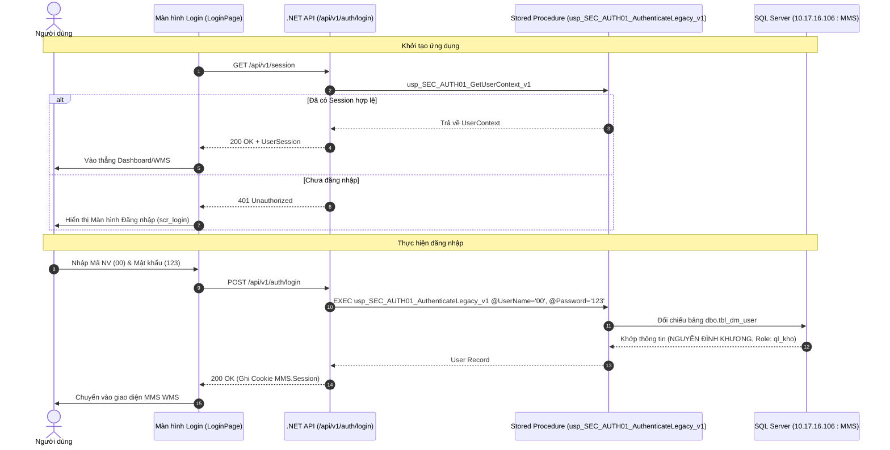

# Báo Cáo Nghiệm Thu UC-01: Đăng Nhập Hệ Thống & Quản Lý Phiên Làm Việc Thực Tế

- **Mã Use Case**: `UC-01` (Tương ứng đặc tả `AUTH-01` trong `docs/use-cases/UC-01_AUTH-01.md`)
- **Màn hình**: `scr_login` (Màn hình đăng nhập chính thức)
- **Database**: CSDL MMS1
- **Backend**: .NET API (`apps/api`), Stored Procedure `api.usp_SEC_AUTH01_AuthenticateLegacy_v1` & `api.usp_SEC_AUTH01_GetUserContext_v1`
- **Frontend**: React 19, Tailwind CSS v4, TypeScript
- **Trạng thái**: **Hoàn thành (Passed & Verified)**
- **Nhánh đồng bộ**: `pharse1` (`https://github.com/Sohoa-KNSG/mms/tree/pharse1`)

---

## 1. Luồng Hoạt Động Đăng Nhập Thực Tế Chuẩn Tài Liệu

---

## 2. Các Thành Phần Đã Triển Khai

| STT | Thành phần | Vị trí file | Chi tiết |
| :--- | :--- | :--- | :--- |
| 1 | **Màn hình Đăng nhập** | [LoginPage.tsx](file:///c:/MMS/apps/web/src/components/LoginPage.tsx) | Màn hình đăng nhập độc lập (`scr_login`), chặn truy cập khi chưa xác thực, thiết kế Smart Factory. |
| 2 | **Cổng Xác thực (Gate)** | [App.tsx](file:///c:/MMS/apps/web/src/App.tsx) | Kiểm tra `isAuthenticated` & `isAuthChecking` trước khi cho phép vào các module. |
| 3 | **Service API** | [authService.ts](file:///c:/MMS/apps/web/src/services/authService.ts) | Gọi `POST /api/v1/auth/login`, `GET /api/v1/session`, `POST /api/v1/auth/logout`. |
| 4 | **Store Quản lý Phiên** | [warehouseStore.tsx](file:///c:/MMS/apps/web/src/services/warehouseStore.tsx) | Quản lý User Context và đồng bộ trạng thái đăng nhập/đăng xuất. |
| 5 | **Cấu hình CSDL** | [appsettings.Development.json](file:///c:/MMS/apps/api/appsettings.Development.json) | Kết nối CSDL MMS1. |

---

## 3. Hướng Dẫn Kiểm Thử Trực Quan

1. Mở trình duyệt tại: **http://localhost:5174**
2. Hệ thống sẽ hiển thị **Màn hình Đăng nhập MMS SMART FACTORY**.
3. **Thử nghiệm nhập sai mật khẩu**:
   - Nhập `00` và mật khẩu `9999` -> Bấm *Đăng nhập* -> Hệ thống thông báo lỗi màu đỏ: *"Tên đăng nhập hoặc mật khẩu không đúng"*.
4. **Thử nghiệm đăng nhập thành công**:
   - Nhập `00` và mật khẩu `123` (hoặc bấm chọn nút nhanh *"Quản lý kho (00 / 123)"*).
   - Hệ thống xác thực với Stored Procedure của SQL Server `10.17.16.106`, đăng nhập thành công và mở toàn bộ các module kho với danh tính **NGUYỄN ĐÌNH KHƯƠNG (Quản Lý Kho)**.
5. **Thử nghiệm đăng xuất**:
   - Mở menu avatar góc trên bên phải -> Bấm *"Đăng xuất"* -> Hệ thống xóa phiên làm việc và lập tức quay trở lại màn hình Đăng nhập.
