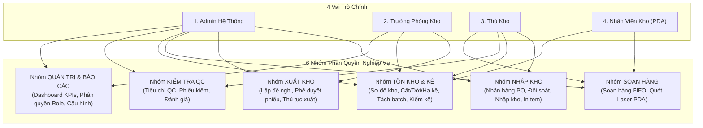

# Kế Hoạch Triển Khai UC-02: Mô Hình Phân Quyền Mới (Admin, Trưởng Phòng Kho, Thủ Kho, Nhân Viên)

Tài liệu này tái cấu trúc toàn bộ mô hình phân quyền của hệ thống MMS React, loại bỏ các mã màn hình cũ của Power Apps và thiết lập hệ thống phân quyền chuẩn mới theo đúng 4 nhóm vai trò và 6 nhóm nghiệp vụ: **Xuất kho, Nhập kho, Soạn hàng, Tồn kho, QC và Quản trị**.

---

## 1. Mô Hình 4 Vai Trò Chuẩn (Roles Definition)

| Vai Trò | Mã Role | Mô Tả & Trách Nhiệm Chính |
| :--- | :--- | :--- |
| **Admin Hệ Thống** | `admin` | Toàn quyền quản trị hệ thống, phân quyền vai trò, quản lý danh mục và xem tất cả phân hệ. |
| **Trưởng Phòng Kho** | `truongphong_kho` | **Phê duyệt đề nghị xuất kho**, quản lý điều phối, theo dõi Dashboard KPI và báo cáo xuất-nhập-tồn tổng hợp. |
| **Thủ Kho** | `thukho` | **Quản lý Nhập kho**, đối soát PO, làm thủ tục nhập kho, cất hàng lên kệ, quản lý tồn kho, xác nhận trả nội bộ và in tem batch. |
| **Nhân Viên Kho** | `nhanvien` | **Soạn hàng FIFO**, thao tác trên **Máy quét PDA**, quét barcode nhận hàng, quét cất/dời kệ tại vị trí thực địa. |
| *(Mở rộng: QC/QA)* | `qc` | Khai báo tiêu chuẩn QC, lập phiếu kiểm định, đánh giá vật tư Đạt/Không đạt và in tem kiểm tra chất lượng. |

---

## 2. Ma Trận Nhóm Quyền Nghiệp Vụ Chuẩn React (Permissions Matrix)

### Bảng Chi Tiết Quyền Nghiệp Vụ

| Nhóm Nghiệp Vụ | Mã Quyền (Permission Key) | Tên Chức Năng | Admin | Trưởng Phòng | Thủ Kho | Nhân Viên | QC |
| :--- | :--- | :--- | :---: | :---: | :---: | :---: | :---: |
| **Nhập kho** | `inbound.receive` | Quét & nhận hàng theo PO / Không PO | ✅ | ❌ | ✅ | ✅ | ❌ |
| | `inbound.update_po` | Cập nhật & đối soát số lượng PO | ✅ | ❌ | ✅ | ❌ | ❌ |
| | `inbound.finalize` | Hoàn tất thủ tục nhập kho & sinh Batch | ✅ | ❌ | ✅ | ❌ | ❌ |
| | `inbound.print_label`| In tem nhãn Barcode / QR Batch | ✅ | ❌ | ✅ | ❌ | ❌ |
| **Xuất kho** | `outbound.request` | Tạo đề nghị xuất kho | ✅ | ✅ | ✅ | ❌ | ❌ |
| | `outbound.approve` | **Phê duyệt / Từ chối đề nghị xuất** | ✅ | ✅ | ❌ | ❌ | ❌ |
| | `outbound.finalize`| Hoàn tất thủ tục xuất & in phiếu xuất | ✅ | ❌ | ✅ | ❌ | ❌ |
| **Soạn hàng** | `picking.queue` | Xem hàng đợi soạn hàng | ✅ | ✅ | ✅ | ✅ | ❌ |
| | `picking.fifo_scan`| **Quét soạn hàng theo lô ưu tiên FIFO** | ✅ | ❌ | ✅ | ✅ | ❌ |
| | `picking.pda` | Sử dụng Chế độ Máy quét cầm tay PDA | ✅ | ❌ | ✅ | ✅ | ❌ |
| **Tồn kho & Kệ**| `inventory.view` | Tra cứu tồn kho & Sơ đồ vị trí kệ | ✅ | ✅ | ✅ | ✅ | ✅ |
| | `inventory.putaway` | Quét barcode cất kệ (Putaway) | ✅ | ❌ | ✅ | ✅ | ❌ |
| | `inventory.transfer`| Chuyển vị trí kệ & Hạ kệ | ✅ | ❌ | ✅ | ✅ | ❌ |
| | `inventory.split` | Tách batch & Khai báo tồn kho | ✅ | ❌ | ✅ | ❌ | ❌ |
| | `inventory.audit` | Kiểm kê theo batch & vị trí kệ | ✅ | ✅ | ✅ | ❌ | ❌ |
| **QC Kiểm định**| `qc.evaluate` | Kiểm tra chất lượng Đạt/Không đạt | ✅ | ❌ | ❌ | ❌ | ✅ |
| | `qc.config` | Khai báo bộ tiêu chuẩn QC | ✅ | ❌ | ❌ | ❌ | ✅ |
| **Quản trị** | `admin.roles` | Quản trị ma trận phân quyền vai trò | ✅ | ❌ | ❌ | ❌ | ❌ |
| | `admin.dashboard` | Dashboard KPIs & Báo cáo tổng thể | ✅ | ✅ | ✅ | ❌ | ❌ |

---

## 3. Các Thay Đổi Dự Kiến Triển Khai (Proposed Changes)

### A. Tầng Phân Quyền & Types
- **[MODIFY] apps/web/src/types.ts**:
  - Cập nhật kiểu `UserRole = 'admin' | 'truongphong_kho' | 'thukho' | 'nhanvien' | 'qc'`.
  - Bổ sung cấu trúc `PermissionDefinition`, `RolePermissionConfig`.

### B. Tầng Dịch Vụ API Frontend
- **[NEW] apps/web/src/services/permissionService.ts**:
  - Hàm kiểm tra quyền: `hasPermission(userRole, permissionKey)`.
  - Hàm lấy danh sách module hiển thị cho từng vai trò.
  - Quản lý cấu hình ma trận phân quyền lưu trữ CSDL / Local.

### C. Tầng Giao Diện Điều Hướng (Sidebar & Navbar)
- **[MODIFY] apps/web/src/components/Sidebar.tsx**:
  - Tự động ẩn/hiện menu theo các nhóm quyền thực tế:
    - *Nhân viên kho*: Chỉ thấy Máy quét PDA, Soạn hàng FIFO, Cất/dời kệ.
    - *Trưởng phòng kho*: Thấy Duyệt xuất kho, Báo cáo & Dashboard KPIs.
    - *Thủ kho*: Thấy Nhập kho, Quản lý tồn kho, Kệ, Soạn hàng, Phiếu xuất.
    - *Admin*: Thấy đầy đủ tất cả menu.
- **[MODIFY] apps/web/src/components/Navbar.tsx**:
  - Cập nhật hiển thị vai trò chính xác: *Admin*, *Trưởng Phòng Kho*, *Thủ Kho Trưởng*, *Nhân Viên Kho (PDA)*, *Kỹ Thuật QC*.

### D. Giao Diện Quản Trị Phân Quyền (SettingsModule)
- **[MODIFY] apps/web/src/components/SettingsModule.tsx**:
  - Tab **"Ma Trận Phân Quyền Vai Trò (UC-02)"**: Cho phép Admin tùy chỉnh bật/tắt quyền Xuất, Nhập, Soạn hàng, Tồn kho, QC cho từng vai trò và lưu cấu hình.

---

## 4. Kế Hoạch Kiểm Thử (Verification Plan)

1. **Kiểm thử chuyển đổi vai trò**:
   - Chuyển sang **Nhân viên kho** -> Sidebar chỉ hiển thị các tác vụ thao tác thực địa (PDA, Soạn hàng, Cất kệ).
   - Chuyển sang **Trưởng phòng kho** -> Sidebar hiển thị màn hình Phê duyệt đề nghị xuất và Dashboard báo cáo.
   - Chuyển sang **Thủ kho** -> Sidebar hiển thị toàn bộ luồng Nhận hàng, Nhập kho, Lưu kho, Tách batch.
   - Chuyển sang **Admin** -> Toàn quyền truy cập.
2. **Kiểm thử biên dịch**:
   - Chạy `pnpm run build --filter @mms/web` đảm bảo 100% không lỗi.
