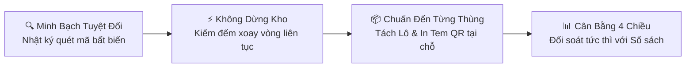
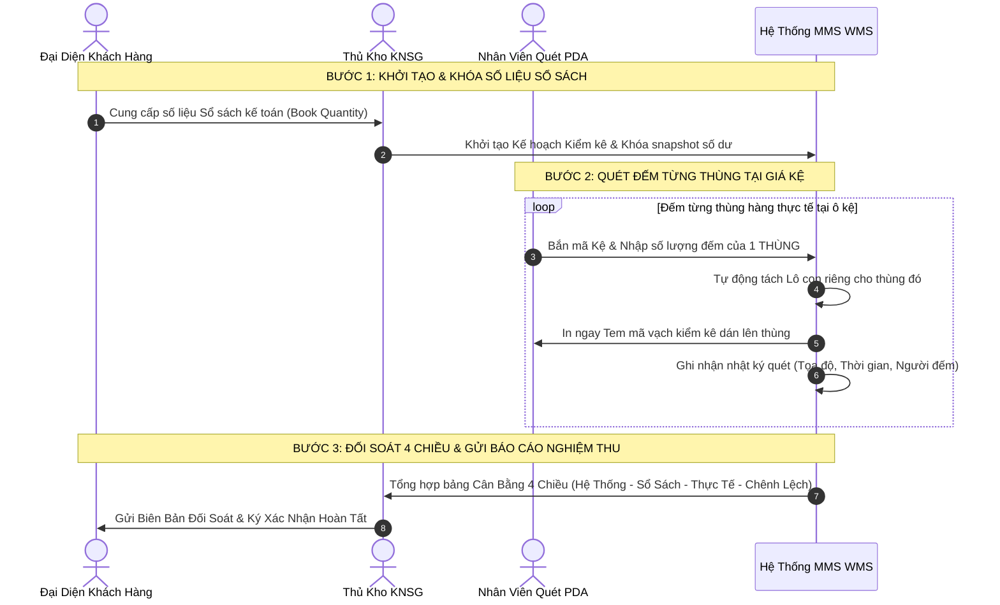
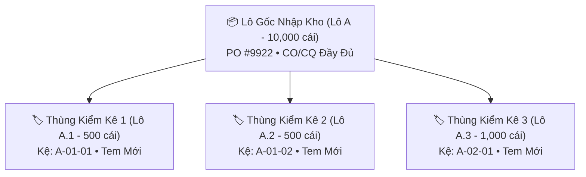

# GIẢI PHÁP KIỂM KÊ TỒN KHO XOAY VÒNG THÔNG MINH (CYCLE COUNT)
## BẢN THUYẾT MINH NGHIỆP VỤ & CAM KẾT CHẤT LƯỢNG DỊCH VỤ DÀNH CHO KHÁCH HÀNG GỬI KHO

**Kính gửi:** Quý Khách hàng, Quý Đối tác Doanh nghiệp  
**Đơn vị cung cấp dịch vụ:** Ban Quản lý Vận hành Kho Vận KNSG (MMS WMS Smart Factory)  
**Mục tiêu:** Cung cấp tài liệu nghiệp vụ minh bạch, chuẩn hóa quốc tế về phương pháp **Kiểm Kê Xoay Vòng Định Kỳ (Cycle Count)** – đảm bảo an toàn tuyệt đối, độ chính xác tồn kho $\ge 99.8\%$ và **không làm gián đoạn hoạt động xuất/nhập hàng** của Quý khách.

---

## 1. THƯ NGỎ GỬI QUÝ KHÁCH HÀNG (EXECUTIVE SUMMARY)

Kính thưa Quý Khách hàng,

Trong hoạt động quản lý chuỗi cung ứng hiện đại, tính chính xác của dữ liệu tồn kho là yếu tố sống còn quyết định đến tiến độ sản xuất và uy tín kinh doanh. Thấu hiểu những băn khoăn của Quý khách về tình trạng thất thoát, nhầm lẫn hàng hóa hoặc sự gián đoạn kinh doanh mỗi khi phải đóng cửa kiểm kê toàn diện, **Trung tâm Kho Vận KNSG** đã triển khai phân hệ **Kiểm Kê Xoay Vòng (Cycle Count)** tự động hóa 100% trên nền tảng **MMS WMS (2026)**.

Giải pháp này cho phép chúng tôi kiểm đếm chi tiết **đến từng thùng hàng**, tự động phân bổ mã định danh và đối chiếu liên tục với số liệu kế toán của Quý khách theo thời gian thực mà **không cần dừng hoạt động xuất nhập kho**.



---

## 2. BẢNG SO SÁNH GIÁ TRỊ VƯỢT TRỘI DÀNH CHO KHÁCH HÀNG

| Tiêu Chí So Sánh | Phương Pháp Kiểm Kê Truyền Thống | Giải Pháp Cycle Count MMS WMS | Lợi Ích Trực Tiếp Cho Khách Hàng |
| :--- | :--- | :--- | :--- |
| **Ảnh hưởng vận hành** | Đóng cửa kho $1 - 3$ ngày; dừng mọi hoạt động xuất nhập hàng. | **0% Gián đoạn.** Kiểm đếm cuốn chiếu theo từng danh mục vật tư/khu vực. | Đơn hàng xuất cho sản xuất và giao khách luôn đúng hạn. |
| **Đơn vị kiểm đếm** | Đếm áng chừng theo cả pallet hoặc cộng dồn số lượng lớn. | **Đếm chi tiết theo từng thùng hàng thực tế (Box-level accuracy).** | Loại bỏ 100% rủi ro thùng rỗng hoặc thiếu hàng bên trong kiện. |
| **Truy vết mã vạch** | Tem nhãn cũ dễ rách nát, mờ chữ số qua thời gian lưu kho. | **Tự động in Tem QR/Barcode mới** dán ngay lên từng thùng vừa đếm. | Hàng hóa luôn có tem mới sắc nét, thuận tiện quét xuất hàng. |
| **Mức độ minh bạch** | Biên bản viết tay, dễ xảy ra sai lệch số liệu và khó truy trách nhiệm. | **Ghi vết tự động vào CSDL (Thời gian, Tọa độ kệ, Người đếm, Súng quét).** | Khách hàng có thể kiểm tra nhật ký đối soát chi tiết bất kỳ lúc nào. |
| **Độ chính xác tồn kho** | $92\% - 95\%$ (Sai số tích lũy lớn sau cả năm). | **$\ge 99.8\%$** (Dữ liệu được làm sạch và hiệu chỉnh liên tục). | Tránh rủi ro thiếu hàng đột xuất gây ngừng trệ dây chuyền sản xuất. |

---

## 3. QUY TRÌNH 3 BƯỚC KIỂM KÊ MINH BẠCH & BẢO TOÀN TÀI SẢN



### Bước 1: Khởi Tạo Kế Hoạch & Khóa Số Liệu Đối Chiếu
- Thủ kho tiếp nhận số liệu tồn kho trên sổ sách kế toán của Quý khách (`soluong_sosach`).
- Hệ thống MMS WMS tự động chụp lại trạng thái tức thời (**Snapshot**) của toàn bộ các lô hàng vật lý đang lưu trữ tại các vị trí kệ, đảm bảo số liệu đối chiếu có tính độc lập và không thể bị sửa đổi hồi tố.

### Bước 2: Kiểm Đếm Từng Thùng Thực Tế & In Tem Nhãn Tức Thì
- Nhân viên kho sử dụng máy quét cầm tay chuyên dụng (**Industrial Handheld PDA**) tiếp cận từng ô kệ chứa hàng của Quý khách:
  1. Quét mã vạch vị trí kệ để xác định chính xác tọa độ hàng hóa.
  2. Đếm số lượng thực tế của **từng thùng hàng riêng biệt**.
  3. Hệ thống tự động tách số lượng này thành một **Mã Lô Con Mới** và lệnh cho máy in nhiệt di động in ngay **Tem Kiểm Kê Chuẩn (Mã QR/Barcode)** dán trực tiếp lên kiện hàng.
  4. Mọi thông tin *(Ai đếm, lúc mấy giờ, tại kệ nào, thùng bao nhiêu cái)* đều được lưu bất biến vào bảng nhật ký `tbl_kiemke_log`.

### Bước 3: Cân Bằng 4 Chiều & Nghiệm Thu Kết Quả
Hệ thống tự động tổng hợp bảng đối chiếu 4 chiều theo công thức chuẩn:
$$\text{Chênh Lệch (+/-)} = \text{Số Lượng Thực Tế Đếm (Physical)} - \text{Số Lượng Sổ Sách Kế Toán (Book)}$$

- **Trường hợp Khớp số liệu ($= 0$):** Kế hoạch hoàn tất mỹ mãn, toàn bộ hàng hóa đã được dán tem định danh mới.
- **Trường hợp Phát sinh Thừa/Thiếu:** Hệ thống tự động lập Bảng kê chi tiết sai lệch kèm hình ảnh và tọa độ ô kệ để Ban Quản lý Kho cùng Đại diện Khách hàng rà soát, tìm nguyên nhân và ký biên bản điều chỉnh tồn theo đúng quy chuẩn kế toán.

---

## 4. QUẢN LÝ GIA PHẢ LÔ HÀNG (BATCH GENEALOGY TRACEABILITY)

> [!NOTE]  
> **Giải đáp băn khoăn của Khách hàng:** *"Khi thùng hàng của tôi bị chia nhỏ hoặc tách lô trong quá trình kiểm kê thì có bị mất dấu thông tin lô gốc của nhà sản xuất không?"*

**Câu trả lời là HOÀN TOÀN KHÔNG.** Hệ thống MMS WMS sử dụng thuật toán **Cây Gia Phả Lô Hàng (Genealogy Tree)** phân tầng đa cấp:
- Mỗi thùng hàng sau khi tách sẽ lưu giữ liên kết chặt chẽ với Lô Cha Mẹ gốc (`parent_id_batch`).
- Toàn bộ thông tin nguồn gốc *(Mã PO, Nhà sản xuất, Ngày sản xuất, Hạn sử dụng, Chứng chỉ CO/CQ và Lịch sử kiểm định chất lượng)* đều được kế thừa nguyên vẹn 100%.
- Bất kỳ lúc nào, Quý khách cũng có thể yêu cầu trích xuất **Sơ đồ Cây Phả Hệ** của từng kiện hàng để phục vụ việc kiểm toán chất lượng hoặc truy hồi sản phẩm.



---

## 5. MẪU BIÊN BẢN ĐỐI SOÁT KIỂM KÊ GỬI KHÁCH HÀNG

Sau mỗi đợt kiểm kê, Quý khách sẽ nhận được **Biên Bản Tổng Hợp Kiểm Kê Tồn Kho** (Bản mềm PDF có ký số điện tử hoặc bản cứng đóng dấu):

```
========================================================================================================
                                 BIÊN BẢN ĐỐI SOÁT KIỂM KÊ TỒN KHO
                                  (CYCLE COUNT RECONCILIATION REPORT)
========================================================================================================
Khách hàng: CÔNG TY TNHH SẢN XUẤT ABC                            Mã Kế Hoạch: #KH-2026-0818
Kho lưu trữ: Kho Vật Tư KNSG (20020100)                          Thời gian: 18/08/2026 08:30 - 11:30
--------------------------------------------------------------------------------------------------------
Vật tư kiểm kê: CGBM901I5 - Chốt gắn BM901 Inox S304 (ĐVT: Cái)

I. BẢNG CÂN BẰNG TỒN KHO 4 CHIỀU:
  1. Tồn Hệ Thống Vật Lý (System Quantity):             187,749 Cái
  2. Tồn Theo Sổ Sách Khách Hàng (Book Quantity):       100.00 Cái
  3. Thực Tế Đếm Được Tại Sàn Kho (Physical Quantity):  100.00 Cái
  4. Chênh Lệch Kiểm Kê (Variance):                           0 Cái (100.0% Khớp số liệu)

II. DANH SÁCH CHI TIẾT CÁC THÙNG HÀNG ĐÃ KIỂM & DÁN TEM MỚI:
  + Thùng 1: Mã Lô #12810 | Vị trí: Kệ A-01-01 | Số lượng: 30.0 Cái | Người đếm: NV_KHO_01
  + Thùng 2: Mã Lô #12811 | Vị trí: Kệ A-01-02 | Số lượng: 20.0 Cái | Người đếm: NV_KHO_01
  + Thùng 3: Mã Lô #12812 | Vị trí: Kệ A-02-01 | Số lượng: 50.0 Cái | Người đếm: NV_KHO_02
--------------------------------------------------------------------------------------------------------
Kết luận: Hàng hóa nguyên vẹn, bao bì sạch sẽ, tem nhãn mã vạch sắc nét, đạt tiêu chuẩn lưu kho.
========================================================================================================
```

---

## 6. CAM KẾT CHẤT LƯỢNG DỊCH VỤ (SERVICE LEVEL AGREEMENT - SLA)

Chúng tôi cam kết bằng văn bản với Quý khách hàng về các tiêu chuẩn vận hành:

1. **Độ chính xác tồn kho:** Cam kết tỷ lệ chính xác số liệu $\ge 99.8\%$.
2. **Tần suất kiểm kê:** Định kỳ hàng tuần / hàng tháng hoặc kiểm kê đột xuất theo yêu cầu bằng văn bản của Quý khách trong vòng $24$ giờ làm việc.
3. **Bồi thường sai lệch:** Trường hợp phát sinh hao hụt do lỗi vận hành kho, Trung tâm Kho Vận cam kết xử lý bồi thường theo đúng thỏa thuận hợp đồng lưu kho trong vòng $03$ ngày làm việc.
4. **Bảo mật thông tin:** Dữ liệu hàng hóa và doanh số của Quý khách được mã hóa, phân quyền độc lập và bảo mật tuyệt đối theo tiêu chuẩn ISO/IEC 27001.

---

## 7. LIÊN HỆ & ĐĂNG KÝ LỊCH KIỂM KÊ ĐỊNH KỲ

Quý khách có nhu cầu thiết lập lịch kiểm kê định kỳ hoặc nhận tài khoản đăng nhập xem báo cáo tồn kho trực tuyến, vui lòng liên hệ:

- **Bộ phận Dịch vụ Khách hàng Kho Vận KNSG**
- **Hotline Vận Hành:** (028) 38xx xxxx – Ext: 102
- **Email tiếp nhận yêu cầu:** `wms-support@knsg.com.vn`
- **Địa chỉ trung tâm kho:** KCN Hiệp Phước / KCN Tân Bình, TP. Hồ Chí Minh
- **Cổng thông tin tra cứu tồn kho trực tuyến:** `http://mms.knsg.com.vn`

---
*KNSG Logistics & MMS WMS – Đồng hành cùng sự phát triển bền vững và thịnh vượng của Quý Doanh nghiệp.*
