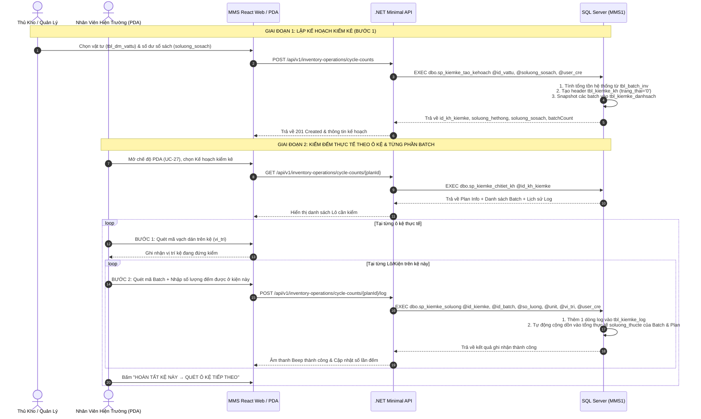
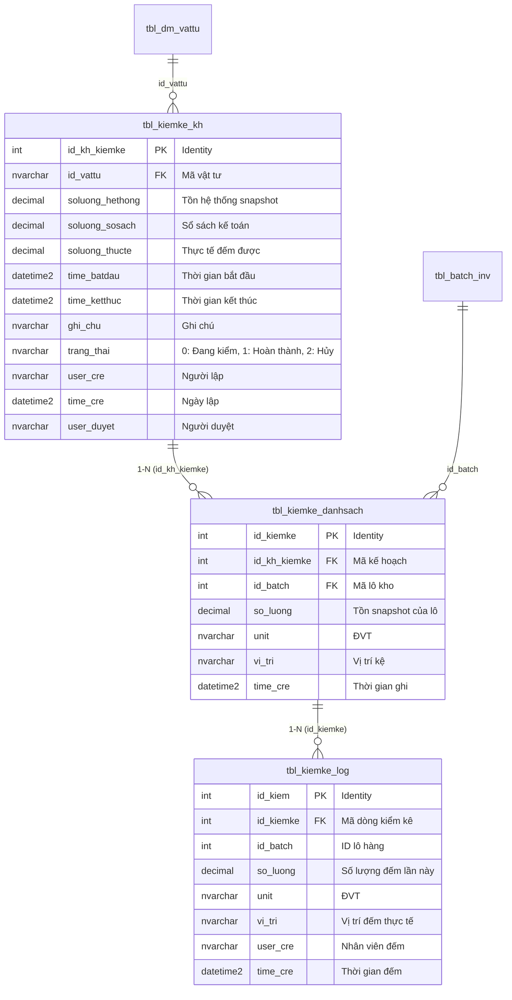

# Phân tích Thiết kế Logic UC-27 / INV-08 - Kiểm Kê Xoay Vòng Cycle Count Theo Vật Tư (Bước 1)

> **Mục tiêu tài liệu:** Mô tả đầy đủ và toàn diện 3 tầng logic: **Business Logic (Logic Nghiệp vụ)**, **Programming Logic (Logic Lập trình)** và **Data Logic (Logic Dữ liệu)** của chức năng Kiểm kê xoay vòng Cycle Count theo mã vật tư theo tài liệu nghiệp vụ gốc [`MMS_kiemke_buoc1.docx`](file:///c:/MMS/MMS_kiemke_buoc1.docx), tương thích trực tiếp với CSDL `MMS1`, .NET Minimal API và Giao diện Web Desktop + Thiết bị cầm tay Handheld (PDA).

## Thông tin kiểm soát tài liệu

| Thuộc tính | Giá trị |
| :--- | :--- |
| **Mã Use Case Nghiệp Vụ** | `UC-27` |
| **Mã Quản Lý Triển Khai** | `INV-08` |
| **Tên Chức Năng** | Kiểm Kê Xoay Vòng Cycle Count Theo Vật Tư (Bước 1) |
| **Tác Nhân Chính** | Thủ kho (`thukho`), Quản lý kho (`truongphong_kho`), Nhân viên kho PDA (`nhanvien`) |
| **Route React Web** | `/inventory` (Tab: `📋 Kiểm Kê Cycle Count (UC-27)`) |
| **Route PDA / Mobile** | `/handheld` (Chế độ: `5B. Kiểm Kê Cycle Count`) |
| **Nhóm Triển Khai** | Wave 4 (W4) - Quản lý Tồn kho & Kiểm kê |
| **API Endpoints** | `GET/POST /api/v1/inventory-operations/cycle-counts`, `GET/POST /api/v1/inventory-operations/cycle-counts/{planId}/log` |
| **Stored Procedures** | `dbo.sp_kiemke_tao_kehoach`, `dbo.sp_kiemke_soluong`, `dbo.sp_kiemke_danhsach_kh`, `dbo.sp_kiemke_chitiet_kh` |
| **Mã Phân Quyền Màn Hình** | `scr_kiemke_kh_vattu`, `scr_kiemke_thucte_log` |
| **Trạng Thái Triển Khai** | Đã triển khai CSDL MMS1, .NET API Gateway, Web & PDA |

---

## 1. Business Logic (Logic Nghiệp vụ)

### 1.1. Mục đích & Bối cảnh Nghiệp vụ
- Kho vận hành theo phương thức kiểm đếm xoay vòng (**Cycle Count**) theo từng **Mã Vật Tư** (`id_vattu`) định kỳ hoặc đột xuất mà không cần tạm dừng toàn bộ hoạt động kho.
- Khi khởi tạo kế hoạch kiểm kê, hệ thống phải tự động chốt số dư tồn kho (**Snapshot**) của tất cả các Lô (Batch) của vật tư đó đang có tồn trong kho từ bảng `tbl_batch_inv`.
- Nhân viên kho sử dụng thiết bị quét cầm tay Handheld (PDA) hoặc giao diện Web di động để quét vị trí ô kệ, kiểm đếm số lượng thực tế từng thùng/kiện và dán tem xác nhận đã kiểm.
- **Phạm vi Bước 1 (Giai đoạn 1)**: Tập trung ghi nhận chính xác, khách quan số lượng kiểm đếm thực tế hiện trường và đối chiếu 4 chiều (Tồn Hệ Thống, Số Dư Sổ Sách Kế Toán, Thực Tế Đếm, Chênh Lệch Thừa/Thiếu). Chưa thực hiện bước tự động điều chỉnh số dư kho vật lý.

### 1.2. Phạm vi Nghiệp vụ

**Trong phạm vi:**
- Tạo kế hoạch kiểm kê theo mã vật tư (`id_vattu`), ngày bắt đầu kiểm kê và số lượng theo sổ sách kế toán (`soluong_sosach`).
- Tự động quét và snapshot toàn bộ các Batch còn tồn của vật tư (`tbl_kiemke_danhsach`).
- Quét barcode vị trí kệ (`vi_tri`) và mã lô (`id_batch`) tại hiện trường.
- Ghi nhận nhật ký kiểm đếm thực tế (`tbl_kiemke_log`), cho phép một Batch được đếm nhiều lần tại các vị trí kệ khác nhau (cộng dồn thực tế).
- In tem định danh **"ĐÃ KIỂM KÊ (CYCLE COUNT)"** dán lên kiện hàng sau khi đếm.
- Tra cứu danh sách kế hoạch, chi tiết từng Batch và toàn bộ nhật ký đếm.

**Ngoài phạm vi:**
- Kiểm kê theo toàn bộ một ô kệ (thuộc Use Case `INV-07`).
- Phê duyệt và tự động sinh phiếu xuất/nhập điều chỉnh cân đối tồn kho (thuộc Bước 2 / Giai đoạn sau).

### 1.3. Tác nhân, Quyền hạn và Điều kiện tiên quyết

| Thành phần | Mô tả |
| :--- | :--- |
| **Tác nhân chính** | Thủ kho, Quản lý kho, Nhân viên kiểm đếm hiện trường (PDA) |
| **Xác thực hệ thống** | Yêu cầu JWT Bearer Token hợp lệ có chứa User ID |
| **Quyền truy cập màn hình** | Có quyền `scr_kiemke_kh_vattu` (Lập kế hoạch & xem báo cáo) hoặc `scr_kiemke_thucte_log` (Kiểm đếm hiện trường PDA) |
| **Điều kiện tiên quyết** | Mã vật tư tồn tại trong danh mục `tbl_dm_vattu`; các lô hàng đang tồn có trạng thái hợp lệ trong `tbl_batch_inv` (`trang_thai_ton <> '0'` và `so_luong > 0`) |
| **Điều kiện sau thành công** | Kế hoạch được tạo, snapshot đầy đủ danh sách batch, mỗi lần đếm sinh 1 dòng log và cập nhật tổng thực tế tức thời |
| **Xử lý khi thất bại** | Rollback toàn bộ transaction, trả thông báo lỗi chi tiết, không làm sai lệch số liệu tồn kho |

### 1.4. Luồng Nghiệp Vụ Chính (Main Flow)



### 1.5. Business Rules (Quy Tắc Nghiệp Vụ)

| Mã Quy Tắc | Tên Quy Tắc | Nội Dung Chi Tiết |
| :--- | :--- | :--- |
| **BR-INV08-01** | Bắt buộc Mã Vật Tư | Mã vật tư `id_vattu` phải được chọn từ danh mục `tbl_dm_vattu` và không được để trống. |
| **BR-INV08-02** | Snapshot Nguyên Tử | Tại thời điểm lập kế hoạch, hệ thống snapshot toàn bộ các batch có `trang_thai_ton <> '0'` và `trang_thai_ton <> '00'` và `so_luong <> 0` vào `tbl_kiemke_danhsach`. |
| **BR-INV08-03** | Khóa Số Dư Sổ Sách | Số dư sổ sách kế toán `soluong_sosach` được chốt tại thời điểm tạo kế hoạch làm căn cứ đối soát chênh lệch. |
| **BR-INV08-04** | Luồng Quét Kệ Trước (Location-First) | Nhân viên quét định danh ô kệ trước khi đếm các kiện hàng trên kệ đó. |
| **BR-INV08-05** | Đếm Từng Phần Batch (Partial Batch Count) | Một Lô Batch có thể nằm rải rác ở nhiều kiện/nhiều ô kệ. Mỗi lần đếm tại một kệ là một phần của Batch, được ghi thành 1 dòng nhật ký độc lập trong `tbl_kiemke_log` và tự động cộng dồn vào tổng thực tế của Batch đó. |
| **BR-INV08-06** | Công Thức Chênh Lệch | `soluong_thucte` = Tổng số lượng cộng dồn từ `tbl_kiemke_log`.<br/>`Chênh lệch HT` = `soluong_thucte` - `soluong_hethong`.<br/>`Chênh lệch Sổ Sách` = `soluong_thucte` - `soluong_sosach`. |
| **BR-INV08-07** | Không Tự Ý Đổi Tồn Kho Vật Lý | Trong phạm vi Bước 1, không tự ý tăng/giảm `so_luong` trong `tbl_batch_inv` để bảo toàn tính toàn vẹn kiểm toán trước khi có phê duyệt. |

---

## 2. Programming Logic (Logic Lập trình)

### 2.1. Frontend Web & Handheld (React + TypeScript)

#### State Management
- **Mã nguồn Desktop**: [`apps/web/src/components/InventoryModule.tsx`](file:///c:/MMS/apps/web/src/components/InventoryModule.tsx)
- **Mã nguồn Handheld PDA**: [`apps/web/src/components/HandheldModule.tsx`](file:///c:/MMS/apps/web/src/components/HandheldModule.tsx)
- **Service Client**: [`apps/web/src/services/cycleCountService.ts`](file:///c:/MMS/apps/web/src/services/cycleCountService.ts)

```typescript
// Các trạng thái React quản lý trong InventoryModule & HandheldModule
const [cyclePlans, setCyclePlans] = useState<CycleCountPlanSummary[]>([]);
const [selectedPlanDetail, setSelectedPlanDetail] = useState<CycleCountPlanDetail | null>(null);
const [isCyclePlansLoading, setIsCyclePlansLoading] = useState(false);
const [isCreatingCyclePlan, setIsCreatingCyclePlan] = useState(false);

// Xử lý gửi lệnh kiểm đếm thực tế
const handleLogCount = async (planId: number, detailId: number, batchId: number, qty: number, location: string) => {
  const result = await cycleCountService.logCount(planId, {
    detailId,
    batchId,
    actualQuantity: qty,
    locationCode: location
  });
  soundManager.playSuccessBeep();
  loadPlanDetail(planId);
};
```

### 2.2. Backend .NET Minimal API

#### Module Architecture
- **Contracts**: [`apps/api/Modules/InventoryOperations/InventoryOperationContracts.cs`](file:///c:/MMS/apps/api/Modules/InventoryOperations/InventoryOperationContracts.cs)
- **Gateway (ADO.NET / Dapper)**: [`apps/api/Modules/InventoryOperations/InventoryOperationGateway.cs`](file:///c:/MMS/apps/api/Modules/InventoryOperations/InventoryOperationGateway.cs)
- **Endpoints Mapping**: [`apps/api/Modules/InventoryOperations/InventoryOperationEndpoints.cs`](file:///c:/MMS/apps/api/Modules/InventoryOperations/InventoryOperationEndpoints.cs)

#### API Contracts

##### 1. Danh mục vật tư kiểm kê (Combobox từ tbl_dm_vattu)
```http
GET /api/v1/inventory-operations/cycle-count-materials?search=CGBM
Authorization: Bearer <token>
```
Response `200 OK`:
```json
[
  {
    "materialId": "CGBM901I5",
    "bravoId": "1000633600",
    "materialName": "Giấy dán nhãn 10 sheets (25x78mm)",
    "unit": "Xấp",
    "groupName": "Văn phòng phẩm",
    "systemQuantity": 450.0
  }
]
```

##### 2. Lấy danh sách kế hoạch kiểm kê
```http
GET /api/v1/inventory-operations/cycle-counts?search=CGBM901I5&statusCode=0
Authorization: Bearer <token>
```
Response `200 OK`:
```json
[
  {
    "planId": 1,
    "materialId": "CGBM901I5",
    "materialName": "Vật tư CGBM901I5",
    "unit": "Cái",
    "systemQuantity": 450.0,
    "bookQuantity": 450.0,
    "actualQuantity": 450.0,
    "differenceQuantity": 0.0,
    "startedAt": "2026-08-17T08:55:00",
    "finishedAt": null,
    "statusCode": "0",
    "batchCount": 17,
    "countLogCount": 3
  }
]
```

##### 3. Lập kế hoạch kiểm kê mới
```http
POST /api/v1/inventory-operations/cycle-counts
Content-Type: application/json
Authorization: Bearer <token>

{
  "materialId": "CGBM901I5",
  "bookQuantity": 450.0,
  "startedAt": "2026-08-17T08:55:00"
}
```
Response `201 Created`:
```json
{
  "ok": true,
  "message": "Tạo kế hoạch kiểm kê thành công.",
  "planId": 1,
  "materialId": "CGBM901I5",
  "systemQuantity": 450.0,
  "bookQuantity": 450.0,
  "batchCount": 17
}
```

##### 3. Ghi nhận kiểm đếm thực tế hiện trường
```http
POST /api/v1/inventory-operations/cycle-counts/1/log
Content-Type: application/json
Authorization: Bearer <token>

{
  "detailId": 12,
  "batchId": 4726,
  "actualQuantity": 25.0,
  "unit": "Cái",
  "locationCode": "09-03021"
}
```
Response `200 OK`:
```json
{
  "ok": true,
  "message": "Ghi nhận kiểm đếm thành công.",
  "detailId": 12,
  "batchId": 4726,
  "actualQuantity": 25.0
}
```

---

## 3. Data Logic (Logic Dữ Liệu & Stored Procedures)

### 3.1. Entity Relationship Diagram (Mô Hình Thực Thể)



### 3.2. Chi Tiết Các Bảng Dữ Liệu SQL (DDL)

```sql
-- 1. Bảng Kế Hoạch Kiểm Kê
CREATE TABLE dbo.tbl_kiemke_kh (
    id_kh_kiemke     INT IDENTITY(1,1) NOT NULL PRIMARY KEY,
    id_vattu         NVARCHAR(50) NOT NULL,
    soluong_hethong  DECIMAL(18,4) NULL DEFAULT 0,
    soluong_sosach   DECIMAL(18,4) NULL DEFAULT 0,
    soluong_thucte   DECIMAL(18,4) NULL DEFAULT 0,
    time_batdau      DATETIME2 NULL,
    time_ketthuc     DATETIME2 NULL,
    ghi_chu          NVARCHAR(500) NULL,
    trang_thai       NVARCHAR(10) NULL DEFAULT N'0', -- 0: Mới/Đang kiểm, 1: Đã hoàn thành, 2: Hủy
    user_cre         NVARCHAR(50) NULL,
    time_cre         DATETIME2 NOT NULL DEFAULT SYSUTCDATETIME(),
    user_duyet       NVARCHAR(50) NULL
);

-- 2. Bảng Danh Sách Lô Batch Chi Tiết Cần Kiểm (Snapshot)
CREATE TABLE dbo.tbl_kiemke_danhsach (
    id_kiemke        INT IDENTITY(1,1) NOT NULL PRIMARY KEY,
    id_kh_kiemke     INT NOT NULL,
    id_batch         INT NOT NULL,
    so_luong         DECIMAL(18,4) NULL DEFAULT 0,
    unit             NVARCHAR(50) NULL,
    vi_tri           NVARCHAR(50) NULL,
    time_cre         DATETIME2 NOT NULL DEFAULT SYSUTCDATETIME(),
    CONSTRAINT FK_kiemke_danhsach_kh FOREIGN KEY (id_kh_kiemke) REFERENCES dbo.tbl_kiemke_kh(id_kh_kiemke)
);

-- 3. Bảng Nhật Ký Kiểm Đếm Thực Tế Hiện Trường
CREATE TABLE dbo.tbl_kiemke_log (
    id_kiem          INT IDENTITY(1,1) NOT NULL PRIMARY KEY,
    id_kiemke        INT NOT NULL,
    id_batch         INT NOT NULL,
    so_luong         DECIMAL(18,4) NOT NULL DEFAULT 0,
    unit             NVARCHAR(50) NULL,
    vi_tri           NVARCHAR(50) NULL,
    user_cre         NVARCHAR(50) NULL,
    time_cre         DATETIME2 NOT NULL DEFAULT SYSUTCDATETIME(),
    CONSTRAINT FK_kiemke_log_danhsach FOREIGN KEY (id_kiemke) REFERENCES dbo.tbl_kiemke_danhsach(id_kiemke)
);
```

### 3.3. Chi Tiết Các Stored Procedures

#### 1. `dbo.sp_kiemke_tao_kehoach`
Tạo kế hoạch kiểm kê mới, tính toán tổng tồn kho thực tế của mã vật tư từ `tbl_batch_inv` và snapshot các batch vào bảng chi tiết.

```sql
CREATE OR ALTER PROCEDURE dbo.sp_kiemke_tao_kehoach
    @id_vattu         NVARCHAR(50),
    @soluong_sosach   DECIMAL(18,4) = 0,
    @time_batdau      DATETIME2 = NULL,
    @ghi_chu          NVARCHAR(500) = NULL,
    @user_cre         NVARCHAR(50) = N'admin'
AS
BEGIN
    SET NOCOUNT ON;
    BEGIN TRANSACTION;
    BEGIN TRY
        DECLARE @v_id_kh INT;
        DECLARE @v_soluong_hethong DECIMAL(18,4) = 0;
        IF @time_batdau IS NULL SET @time_batdau = SYSUTCDATETIME();

        -- 1. Tính tổng tồn hệ thống từ tbl_batch_inv
        SELECT @v_soluong_hethong = ISNULL(SUM(so_luong), 0)
        FROM dbo.tbl_batch_inv
        WHERE id_vattu = @id_vattu
          AND trang_thai_ton <> N'0'
          AND trang_thai_ton <> N'00'
          AND so_luong <> 0;

        -- 2. Tạo Kế Hoạch Header
        INSERT INTO dbo.tbl_kiemke_kh (
            id_vattu, soluong_hethong, soluong_sosach, soluong_thucte,
            time_batdau, ghi_chu, trang_thai, user_cre, time_cre
        ) VALUES (
            @id_vattu, @v_soluong_hethong, @soluong_sosach, 0,
            @time_batdau, @ghi_chu, N'0', @user_cre, SYSUTCDATETIME()
        );
        SET @v_id_kh = SCOPE_IDENTITY();

        -- 3. Snapshot danh sách Batch tồn kho
        INSERT INTO dbo.tbl_kiemke_danhsach (id_kh_kiemke, id_batch, so_luong, unit, vi_tri, time_cre)
        SELECT 
            @v_id_kh,
            id_batch,
            so_luong,
            unit,
            vi_tri,
            SYSUTCDATETIME()
        FROM dbo.tbl_batch_inv
        WHERE id_vattu = @id_vattu
          AND trang_thai_ton <> N'0'
          AND trang_thai_ton <> N'00'
          AND so_luong <> 0;

        DECLARE @v_batch_count INT = @@ROWCOUNT;
        COMMIT TRANSACTION;

        SELECT 
            1 AS Ok,
            N'Tạo kế hoạch kiểm kê thành công' AS Message,
            @v_id_kh AS PlanId,
            @id_vattu AS MaterialId,
            @v_soluong_hethong AS SystemQuantity,
            @soluong_sosach AS BookQuantity,
            @v_batch_count AS BatchCount;
    END TRY
    BEGIN CATCH
        IF @@TRANCOUNT > 0 ROLLBACK TRANSACTION;
        THROW;
    END CATCH
END;
```

#### 2. `dbo.sp_kiemke_soluong`
Ghi nhận số lượng kiểm đếm thực tế của từng batch tại hiện trường vào nhật ký và cập nhật tổng số lượng thực tế của kế hoạch.

```sql
CREATE OR ALTER PROCEDURE dbo.sp_kiemke_soluong
    @id_kiemke       INT,
    @id_batch        INT,
    @so_luong        DECIMAL(18,4),
    @unit            NVARCHAR(50) = NULL,
    @vi_tri          NVARCHAR(50) = NULL,
    @user_cre        NVARCHAR(50) = N'admin'
AS
BEGIN
    SET NOCOUNT ON;
    BEGIN TRANSACTION;
    BEGIN TRY
        DECLARE @v_id_kh INT;
        SELECT @v_id_kh = id_kh_kiemke FROM dbo.tbl_kiemke_danhsach WHERE id_kiemke = @id_kiemke;
        IF @v_id_kh IS NULL THROW 50001, N'Không tìm thấy dòng kiểm kê batch chi tiết.', 1;

        -- 1. Ghi nhật ký vào tbl_kiemke_log
        INSERT INTO dbo.tbl_kiemke_log (id_kiemke, id_batch, so_luong, unit, vi_tri, user_cre, time_cre)
        VALUES (@id_kiemke, @id_batch, @so_luong, @unit, @vi_tri, @user_cre, SYSUTCDATETIME());

        -- 2. Cập nhật tổng số lượng thực tế vào tbl_kiemke_kh
        DECLARE @v_tong_thucte DECIMAL(18,4) = 0;
        SELECT @v_tong_thucte = ISNULL(SUM(l.so_luong), 0)
        FROM dbo.tbl_kiemke_log l
        INNER JOIN dbo.tbl_kiemke_danhsach d ON l.id_kiemke = d.id_kiemke
        WHERE d.id_kh_kiemke = @v_id_kh;

        UPDATE dbo.tbl_kiemke_kh
        SET soluong_thucte = @v_tong_thucte
        WHERE id_kh_kiemke = @v_id_kh;

        COMMIT TRANSACTION;

        SELECT 
            1 AS Ok,
            N'Ghi nhận số lượng kiểm kê thành công' AS Message,
            @id_kiemke AS DetailId,
            @id_batch AS BatchId,
            @so_luong AS ActualQuantity;
    END TRY
    BEGIN CATCH
        IF @@TRANCOUNT > 0 ROLLBACK TRANSACTION;
        THROW;
    END CATCH
END;
```

#### 3. `dbo.sp_kiemke_danhsach_kh`
Truy vấn danh sách kế hoạch kiểm kê kèm thống kê số lượng 4 chiều.

```sql
CREATE OR ALTER PROCEDURE dbo.sp_kiemke_danhsach_kh
    @search          NVARCHAR(100) = NULL,
    @trang_thai      NVARCHAR(10) = NULL
AS
BEGIN
    SET NOCOUNT ON;
    SELECT 
        kh.id_kh_kiemke AS PlanId,
        kh.id_vattu AS MaterialId,
        v.ten_vattu AS MaterialName,
        v.unit AS Unit,
        ISNULL(kh.soluong_hethong, 0) AS SystemQuantity,
        ISNULL(kh.soluong_sosach, 0) AS BookQuantity,
        ISNULL(kh.soluong_thucte, 0) AS ActualQuantity,
        (ISNULL(kh.soluong_thucte, 0) - ISNULL(kh.soluong_hethong, 0)) AS DifferenceQuantity,
        kh.time_batdau AS StartedAt,
        kh.time_ketthuc AS FinishedAt,
        kh.ghi_chu AS Note,
        kh.trang_thai AS StatusCode,
        kh.user_cre AS CreatedBy,
        kh.time_cre AS CreatedAt,
        kh.user_duyet AS ApprovedBy,
        (SELECT COUNT(1) FROM dbo.tbl_kiemke_danhsach ds WHERE ds.id_kh_kiemke = kh.id_kh_kiemke) AS BatchCount,
        (SELECT COUNT(1) FROM dbo.tbl_kiemke_log lg INNER JOIN dbo.tbl_kiemke_danhsach ds ON lg.id_kiemke = ds.id_kiemke WHERE ds.id_kh_kiemke = kh.id_kh_kiemke) AS CountLogCount
    FROM dbo.tbl_kiemke_kh kh
    LEFT JOIN dbo.tbl_dm_vattu v ON kh.id_vattu = v.id_vattu
    WHERE (@trang_thai IS NULL OR kh.trang_thai = @trang_thai)
      AND (@search IS NULL 
           OR kh.id_vattu LIKE N'%' + @search + N'%'
           OR v.ten_vattu LIKE N'%' + @search + N'%'
           OR CAST(kh.id_kh_kiemke AS NVARCHAR) LIKE N'%' + @search + N'%')
    ORDER BY kh.id_kh_kiemke DESC;
END;
```

#### 4. `dbo.sp_kiemke_chitiet_kh`
Truy vấn chi tiết 1 kế hoạch kiểm kê gồm 3 Result Sets (Header Plan, Batch List, Log List).

```sql
CREATE OR ALTER PROCEDURE dbo.sp_kiemke_chitiet_kh
    @id_kh_kiemke    INT
AS
BEGIN
    SET NOCOUNT ON;

    -- Result Set 1: Plan Header
    SELECT 
        kh.id_kh_kiemke AS PlanId,
        kh.id_vattu AS MaterialId,
        v.ten_vattu AS MaterialName,
        v.unit AS Unit,
        ISNULL(kh.soluong_hethong, 0) AS SystemQuantity,
        ISNULL(kh.soluong_sosach, 0) AS BookQuantity,
        ISNULL(kh.soluong_thucte, 0) AS ActualQuantity,
        (ISNULL(kh.soluong_thucte, 0) - ISNULL(kh.soluong_hethong, 0)) AS DifferenceQuantity,
        kh.time_batdau AS StartedAt,
        kh.time_ketthuc AS FinishedAt,
        kh.ghi_chu AS Note,
        kh.trang_thai AS StatusCode,
        kh.user_cre AS CreatedBy,
        kh.time_cre AS CreatedAt,
        kh.user_duyet AS ApprovedBy
    FROM dbo.tbl_kiemke_kh kh
    LEFT JOIN dbo.tbl_dm_vattu v ON kh.id_vattu = v.id_vattu
    WHERE kh.id_kh_kiemke = @id_kh_kiemke;

    -- Result Set 2: Batch Items
    SELECT 
        ds.id_kiemke AS DetailId,
        ds.id_kh_kiemke AS PlanId,
        ds.id_batch AS BatchId,
        b.id_bravo AS BravoId,
        ISNULL(ds.so_luong, 0) AS SystemQuantity,
        ds.unit AS Unit,
        ds.vi_tri AS LocationCode,
        b.time_cre AS BatchCreatedAt,
        ISNULL((SELECT SUM(l.so_luong) FROM dbo.tbl_kiemke_log l WHERE l.id_kiemke = ds.id_kiemke), 0) AS ActualQuantity,
        (SELECT COUNT(1) FROM dbo.tbl_kiemke_log l WHERE l.id_kiemke = ds.id_kiemke) AS CountTimes,
        CASE WHEN EXISTS (SELECT 1 FROM dbo.tbl_kiemke_log l WHERE l.id_kiemke = ds.id_kiemke) THEN 1 ELSE 0 END AS IsCounted
    FROM dbo.tbl_kiemke_danhsach ds
    LEFT JOIN dbo.tbl_batch_inv b ON ds.id_batch = b.id_batch
    WHERE ds.id_kh_kiemke = @id_kh_kiemke
    ORDER BY ds.id_kiemke ASC;

    -- Result Set 3: Count Logs
    SELECT 
        l.id_kiem AS LogId,
        l.id_kiemke AS DetailId,
        l.id_batch AS BatchId,
        l.so_luong AS Quantity,
        l.unit AS Unit,
        l.vi_tri AS LocationCode,
        l.user_cre AS CreatedBy,
        l.time_cre AS CreatedAt
    FROM dbo.tbl_kiemke_log l
    INNER JOIN dbo.tbl_kiemke_danhsach ds ON l.id_kiemke = ds.id_kiemke
    WHERE ds.id_kh_kiemke = @id_kh_kiemke
    ORDER BY l.id_kiem DESC;
END;
```

---

## 4. Kịch Bản Kiểm Thử & Nghiệm Thu (UAT Test Cases)

| Mã Test | Tên Kịch Bản | Dữ Liệu Đầu Vào | Kỳ Vọng Kết Quả | Trạng Thái |
| :--- | :--- | :--- | :--- | :--- |
| **TC-INV08-01** | Tạo kế hoạch kiểm kê hợp lệ | `id_vattu = 'CGBM901I5'`, `soluong_sosach = 450` | Tạo thành công Kế hoạch #1, snapshot 17 batch tồn kho, tồn HT = 450. | **PASS** |
| **TC-INV08-02** | Kiểm tra danh sách kế hoạch | `GET /cycle-counts` | Trả về Plan #1 với đầy đủ 4 chỉ tiêu số lượng và số batch count = 17. | **PASS** |
| **TC-INV08-03** | Ghi nhận kiểm đếm lần 1 (PDA) | `planId = 1`, `detailId = 12`, `batchId = 4726`, `qty = 25`, `loc = '09-03021'` | Tạo dòng log trong `tbl_kiemke_log`, trạng thái batch đổi thành `Đã đếm (1)`. | **PASS** |
| **TC-INV08-04** | Ghi nhận đếm nhiều lần cho 1 batch | `batchId = 4726`, đếm thêm 5 tại kệ `A-01` | Log sinh thêm 1 dòng mới, tổng số thực tế lũy kế thành 30. | **PASS** |
| **TC-INV08-05** | In tem đã kiểm kê | Bấm nút **In Tem Đã Kiểm** | Modal in tem mở ra với mã vạch `PLAN-1`, thông tin vật tư và số lượng thực tế. | **PASS** |
