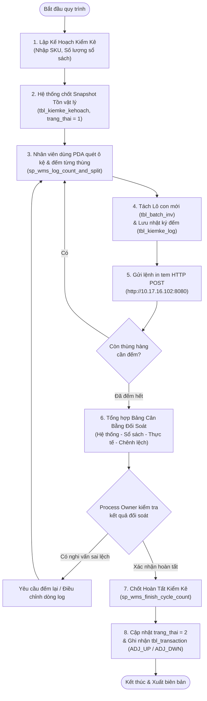

# TÀI LIỆU QUY TRÌNH NGHIỆP VỤ: KIỂM KÊ TỒN KHO XOAY VÒNG (CYCLE COUNT)
## MÃ QUY TRÌNH: MMS-WMS-SOP-INV-08 | USE CASE: UC-27

---

| Thông Tin Tài Liệu | Chi Tiết |
| :--- | :--- |
| **Hệ thống áp dụng** | MMS WMS (Hệ thống Quản lý Kho & Sản xuất) |
| **Phân hệ** | Quản lý Tồn kho (Inventory Management) - Kiểm kê (Cycle Count) |
| **Đối tượng xem & phê duyệt** | Process Owner (Chủ trì nghiệp vụ Kho), Quản lý Kho, Kế toán Kho |
| **Mục đích tài liệu** | Mô tả chi tiết luồng nghiệp vụ kiểm kê xoay vòng, cơ chế tách lô, in tem nhãn và ghi nhận giao dịch sổ cái để Process Owner thẩm định và ký duyệt áp dụng. |

---

## 1. MỤC ĐÍCH & PHẠM VI ÁP DỤNG

### 1.1. Mục đích
- Thiết lập quy trình kiểm kê cuốn chiếu định kỳ (Cycle Count) theo từng mặt hàng/vị trí mà không làm gián đoạn toàn bộ hoạt động xuất - nhập kho.
- Đảm bảo kiểm đếm chính xác theo từng kiện/thùng hàng thực tế tại ô kệ (Box-level Counting).
- Tự động hóa việc tách lô con (Sub-batch), cấp mã định danh và in tem mã vạch dán thùng ngay tại hiện trường.
- Đối soát số liệu giữa Tồn vật lý hệ thống, Tồn sổ sách kế toán và Thực tế kiểm đếm; tự động ghi nhận giao dịch điều chỉnh tồn kho theo đúng danh mục nghiệp vụ chuẩn.

### 1.2. Phạm vi áp dụng
- Áp dụng cho toàn bộ hoạt động kiểm kê định kỳ, kiểm kê đột xuất tại Kho Vật Tư (`kho: "vt"`).
- Thực hiện bởi nhân viên vận hành kho sử dụng máy quét cầm tay (PDA) và máy tính trạm WMS.

---

## 2. MA TRẬN PHÂN QUYỀN TRÁCH NHIỆM (RACI)

| Hoạt Động Nghiệp Vụ | Kế Toán Kho | Quản Lý Kho / Process Owner | Thủ Kho / NV Kiểm Kê | Hệ Thống WMS |
| :--- | :---: | :---: | :---: | :---: |
| 1. Cung cấp số liệu tồn sổ sách | **R** (Responsible) | **A** (Accountable) | **I** (Informed) | **S** (Support) |
| 2. Tạo kế hoạch kiểm kê & Chốt Snapshot | **I** | **A** | **R** | **A** (Tự động) |
| 3. Quét kệ, đếm từng thùng, tách lô | **I** | **I** | **R** | **S** |
| 4. In tem nhãn dán thùng tại hiện trường | **I** | **I** | **R** | **A** (Gửi máy in) |
| 5. Kiểm tra bảng cân bằng chênh lệch | **C** (Consulted) | **R / A** | **R** | **S** |
| 6. Phê duyệt & Chốt sổ hoàn tất kiểm kê | **C** | **A** | **I** | **A** (Ghi sổ cái) |

---

## 3. CÁC ĐỊNH NGHĨA & CÔNG THỨC NGHIỆP VỤ

### 3.1. Các chỉ số số lượng đối soát
1. **Số lượng hệ thống (`soluong_hethong` - System Quantity):** Tổng số lượng vật lý đang được ghi nhận tại các vị trí kệ trong bảng `tbl_batch_inv` tại thời điểm tạo kế hoạch.
2. **Số lượng sổ sách (`soluong_sosach` - Book Quantity):** Số lượng tồn theo số liệu kế toán do bên quản lý/khách hàng cung cấp tại thời điểm kiểm kê.
3. **Số lượng thực tế (`soluong_thucte` - Physical Quantity):** Tổng số lượng đếm được từ tất cả các thùng/kiện được ghi nhận trong bảng `tbl_kiemke_log`:
   $$\text{soluong\_thucte} = \sum (\text{tbl\_kiemke\_log.so\_luong})$$
4. **Chênh lệch kiểm kê (`chenh_lech` - Variance):**
   $$\text{chenh\_lech} = \text{soluong\_thucte} - \text{soluong\_sosach}$$

### 3.2. Quy tắc ghi nhận giao dịch biến động tồn (`tbl_transaction`)
- Trường `tbl_transaction.so_luong` **luôn luôn lưu giá trị dương ($> 0$)**.
- Chiều biến động tăng/giảm do cột `logic` trong bảng danh mục `tbl_dm_nghiepvu_kho` quy định:
  - **Khi thừa hàng ($\text{chenh\_lech} > 0$):** Ghi nhận mã **`ADJ_UP`** (`logic = 1`), số lượng ghi nhận $= \text{chenh\_lech}$.
  - **Khi thiếu hàng ($\text{chenh\_lech} < 0$):** Ghi nhận mã **`ADJ_DWN`** (`logic = -1`), số lượng ghi nhận $= |\text{chenh\_lech}|$.
  - **Khi khớp số liệu ($\text{chenh\_lech} = 0$):** Không phát sinh giao dịch điều chỉnh.
- **Thời điểm ghi nhận sổ cái:** Chỉ ghi nhận giao dịch vào `tbl_transaction` khi Quản lý Kho xác nhận hoàn tất kế hoạch kiểm kê (`sp_wms_finish_cycle_count`). Trong quá trình đếm từng thùng, hệ thống chỉ lưu nhật ký `tbl_kiemke_log` và quản lý phân bổ lô con `tbl_batch_inv`.

---

## 4. QUY TRÌNH THỰC HIỆN CHI TIẾT



---

### Giai đoạn 1: Khởi tạo kế hoạch kiểm kê (Plan Initialization)
1. Người dùng (Thủ kho / Quản lý) mở chức năng **Kiểm kê tồn kho (INV-08)** trên phần mềm.
2. Chọn Kho (`kho: "vt"`), chọn Mã vật tư / SKU cần kiểm kê.
3. Nhập số lượng tồn theo sổ sách (`soluong_sosach`).
4. Bấm **Tạo Kế Hoạch Kiểm Kê**:
   - Hệ thống tự động truy vấn tồn hiện tại trong `tbl_batch_inv` để lưu vào trường `soluong_hethong`.
   - Tạo bản ghi mới trong bảng `tbl_kiemke_kehoach` với trạng thái `trang_thai = 1` (Đang kiểm kê).

---

### Giai đoạn 2: Kiểm đếm thực tế, tách lô & in tem nhãn (Counting & Split)
1. Nhân viên kiểm kê mang thiết bị cầm tay (PDA) đến vị trí kệ chứa hàng.
2. Quét mã vạch vị trí kệ (`location_code`).
3. Đếm số lượng thực tế của **1 thùng/kiện hàng cụ thể**, chọn lô gốc và nhập số lượng đếm.
4. Bấm **Ghi nhận kiểm đếm**:
   - Hệ thống gọi Stored Procedure `dbo.sp_wms_log_count_and_split`.
   - Tạo bản ghi nhật ký trong `tbl_kiemke_log` (lưu: `id_kehoach`, `id_batch`, `so_luong`, `location_code`, `nguoi_tao`, `time_cre`).
   - Tự động sinh bản ghi Lô con mới trong `tbl_batch_inv` với `parent_id_batch = id_batch_gốc`, cập nhật số lượng tồn thực tế của lô con và trừ tương ứng trên lô cha.
   - Phát lệnh in tem nhãn qua HTTP POST:
     - **URL:** `http://10.17.16.102:8080`
     - **Headers:** `Content-Type: application/json`
     - **Payload:**
       ```json
       {
         "batch": "12815",
         "msnv": "00",
         "kho": "vt"
       }
       ```
5. Máy in tại hiện trường nhả tem mã vạch; nhân viên dán trực tiếp tem mới lên thùng hàng vừa đếm.
6. Lặp lại các bước trên cho tất cả các thùng/kiện hàng còn lại của vật tư đó.

---

### Giai đoạn 3: Đối soát số liệu & Chốt hoàn tất kiểm kê (Reconciliation & Finalization)
1. Khi hoàn tất đếm tất cả các thùng, hệ thống tự động tổng hợp:
   - $\text{Tổng thực tế} = \sum (\text{SL các thùng trong nhật ký})$
   - $\text{Chênh lệch} = \text{Tổng thực tế} - \text{Số lượng sổ sách}$
2. Quản lý Kho / Process Owner kiểm tra bảng đối soát trên giao diện:
   - Nếu phát hiện nhầm lẫn trong quá trình nhập liệu: Có thể xóa dòng log sai và đếm lại.
   - Nếu số liệu đã chính xác: Bấm **Xác Nhận & Hoàn Tất Kế Hoạch Kiểm Kê**.
3. Hệ thống thực thi Stored Procedure `dbo.sp_wms_finish_cycle_count`:
   - Cập nhật `tbl_kiemke_kehoach`: `soluong_thucte = @actual_total`, `chenh_lech = @diff`, `trang_thai = 2` (Đã hoàn tất), `ngay_hoantat = GETDATE()`.
   - Nếu $\text{chenh\_lech} > 0$ (Thừa): Chèn 1 dòng vào `tbl_transaction` với mã nghiệp vụ `ADJ_UP`, số lượng $= \text{chenh\_lech}$.
   - Nếu $\text{chenh\_lech} < 0$ (Thiếu): Chèn 1 dòng vào `tbl_transaction` với mã nghiệp vụ `ADJ_DWN`, số lượng $= |\text{chenh\_lech}|$.
   - Đồng bộ số liệu tồn kho cuối cùng.

---

## 5. QUẢN LÝ TRUY VẾT GIA PHẢ LÔ HÀNG (BATCH GENEALOGY)

Mọi lô con được sinh ra trong quá trình kiểm kê đều được lưu vết quan hệ nguồn gốc trong bảng `tbl_batch_inv`:

```
[Lô Gốc #10000] (Nhập kho ban đầu theo PO)
    ├── [Lô Con #12810] (Thùng 1: 50 Cái, Kệ VT-01-A1) -> Dán tem #12810
    ├── [Lô Con #12811] (Thùng 2: 50 Cái, Kệ VT-01-A2) -> Dán tem #12811
    └── [Lô Con #12812] (Thùng 3: 30 Cái, Kệ VT-02-B1) -> Dán tem #12812
```

- Trường `parent_id_batch` liên kết chính xác về mã lô cha ban đầu.
- Toàn bộ thông tin gốc như mã vật tư, tên vật tư, hạn sử dụng, nhà cung cấp được bảo lưu đầy đủ phục vụ việc truy xuất nguồn gốc (Traceability) khi xuất kho sản xuất.

---

## 6. MẪU BIÊN BẢN ĐỐI SOÁT KIỂM KÊ (CHUẨN IN & LƯU TRỮ)

```
========================================================================================================
                              BIÊN BẢN KIỂM KÊ VẬT TƯ / TỒN KHO XOAY VÒNG
                                   Mã Kế Hoạch: #KK-2026-0820-001
========================================================================================================
Kho kiểm kê: Kho Vật Tư (vt)                                    Ngày kiểm kê: 20/08/2026
Mã vật tư: 20020100 - Chốt Inox S304                           Đơn vị tính: Cái
Người lập kế hoạch: NGUYỄN VĂN A                                Người kiểm đếm: TRẦN VĂN B
--------------------------------------------------------------------------------------------------------
I. SỐ LIỆU ĐỐI SOÁT TỒN KHO:
  1. Số lượng tồn hệ thống vật lý (Snapshot):                   150.00 Cái
  2. Số lượng tồn theo sổ sách kế toán:                         130.00 Cái
  3. Số lượng thực tế kiểm đếm tại kệ:                          130.00 Cái
  4. Chênh lệch (Thực tế - Sổ sách):                              0.00 Cái (Khớp 100%)
  5. Mã giao dịch điều chỉnh phát sinh:                         KHÔNG (Khớp số liệu)

II. CHI TIẾT CÁC THÙNG HÀNG ĐÃ KIỂM ĐẾM & TÁCH LÔ:
  STT | Mã Lô Con | Mã Lô Gốc | Vị Trí Kệ   | Số Lượng Đếm | ĐVT | Thời Gian Quét     | Người Quét
  ----+-----------+-----------+-------------+--------------+-----+--------------------+------------
   1  | #12815    | #10200    | VT-K01-T1   |        50.00 | Cái | 20/08/2026 09:15   | NV01
   2  | #12816    | #10200    | VT-K01-T2   |        50.00 | Cái | 20/08/2026 09:22   | NV01
   3  | #12817    | #10200    | VT-K02-T1   |        30.00 | Cái | 20/08/2026 09:30   | NV01
  ----+-----------+-----------+-------------+--------------+-----+--------------------+------------
      | TỔNG CỘNG:                          |       130.00 | Cái |                    |
--------------------------------------------------------------------------------------------------------
Ý kiến xử lý chênh lệch (nếu có): Số liệu thực tế khớp hoàn toàn với sổ sách. Tem nhãn dán đầy đủ.
========================================================================================================
```

---

## 7. BẢNG KÝ DUYỆT XÁC NHẬN CỦA PROCESS OWNER

| Đại Diện Lập Quy Trình | Process Owner / Trưởng Quản Lý Kho | Kế Toán Trưởng / Kế Toán Kho |
| :---: | :---: | :---: |
| *(Ký & Ghi rõ họ tên)* | *(Ký & Ghi rõ họ tên)* | *(Ký & Ghi rõ họ tên)* |
| <br/><br/><br/> | <br/><br/><br/> | <br/><br/><br/> |
| Ngày: ...../...../2026 | Ngày: ...../...../2026 | Ngày: ...../...../2026 |
