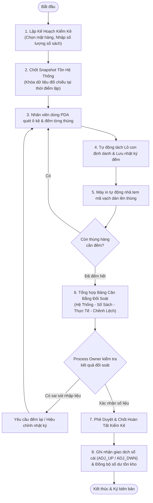

# TÀI LIỆU QUY TRÌNH NGHIỆP VỤ: KIỂM KÊ TỒN KHO XOAY VÒNG (CYCLE COUNT)
## MÃ QUY TRÌNH: MMS-WMS-SOP-INV-08 | USE CASE: UC-27

---

| Thông Tin Tài Liệu | Chi Tiết |
| :--- | :--- |
| **Hệ thống áp dụng** | Hệ Thống Quản Lý Kho & Sản Xuất (MMS WMS) |
| **Phân hệ** | Quản Lý Tồn Kho - Kiểm Kê Xoay Vòng (Cycle Count) |
| **Đối tượng xem & phê duyệt** | Process Owner (Chủ trì nghiệp vụ Kho), Quản lý Kho, Kế toán Kho |
| **Mục đích tài liệu** | Thuyết minh quy trình vận hành kiểm kê xoay vòng, cơ chế kiểm đếm theo từng thùng, tách lô định danh, in dán tem nhãn tại chỗ và đối soát số liệu sổ sách kế toán để Process Owner thẩm định và ký duyệt áp dụng. |

---

## 1. MỤC ĐÍCH & PHẠM VI ÁP DỤNG

### 1.1. Mục đích
- Thiết lập quy trình kiểm kê cuốn chiếu định kỳ (Cycle Count) theo từng mặt hàng/khu vực mà không làm gián đoạn hoạt động xuất - nhập kho.
- Đảm bảo kiểm đếm chính xác đến từng kiện/thùng hàng thực tế tại ô kệ (Box-level Counting).
- Tự động hóa việc tách lô con (Sub-batch), cấp mã định danh và in tem mã vạch dán thùng ngay tại hiện trường.
- Đối soát số liệu giữa Tồn vật lý hệ thống, Tồn sổ sách kế toán và Thực tế kiểm đếm; tự động ghi nhận giao dịch điều chỉnh tồn kho theo đúng danh mục nghiệp vụ chuẩn.

### 1.2. Phạm vi áp dụng
- Áp dụng cho toàn bộ hoạt động kiểm kê định kỳ và kiểm kê đột xuất tại Kho Vật Tư.
- Thực hiện bởi nhân viên vận hành kho sử dụng máy quét cầm tay (PDA) và máy tính trạm quản lý kho.

---

## 2. MA TRẬN PHÂN QUYỀN TRÁCH NHIỆM (RACI)

| Hoạt Động Nghiệp Vụ | Kế Toán Kho | Quản Lý Kho / Process Owner | Thủ Kho / NV Kiểm Kê | Hệ Thống WMS |
| :--- | :---: | :---: | :---: | :---: |
| 1. Cung cấp số liệu tồn sổ sách | **R** (Thực hiện) | **A** (Chịu trách nhiệm) | **I** (Theo dõi) | **S** (Hỗ trợ) |
| 2. Tạo kế hoạch kiểm kê & Chốt Snapshot | **I** | **A** | **R** | **A** (Tự động) |
| 3. Quét kệ, đếm từng thùng, tách lô | **I** | **I** | **R** | **S** |
| 4. In tem nhãn dán thùng tại hiện trường | **I** | **I** | **R** | **A** (Tự động) |
| 5. Kiểm tra bảng cân bằng chênh lệch | **C** (Tham vấn) | **R / A** | **R** | **S** |
| 6. Phê duyệt & Chốt sổ hoàn tất kiểm kê | **C** | **A** | **I** | **A** (Tự động) |

---

## 3. CÁC ĐỊNH NGHĨA & CÔNG THỨC NGHIỆP VỤ

### 3.1. Các chỉ số số lượng đối soát
1. **Số lượng hệ thống (System Quantity):** Tổng số lượng vật lý đang được ghi nhận tại các vị trí kệ kho tại thời điểm tạo kế hoạch kiểm kê.
2. **Số lượng sổ sách (Book Quantity):** Số lượng tồn theo số liệu kế toán do bộ phận kế toán/chủ hàng cung cấp tại thời điểm kiểm kê.
3. **Số lượng thực tế (Physical Quantity):** Tổng số lượng đếm được từ tất cả các thùng/kiện hàng được nhân viên ghi nhận tại hiện trường:
   $$\text{Số Lượng Thực Tế} = \sum (\text{Số Lượng Đếm Từng Thùng})$$
4. **Chênh lệch kiểm kê (Variance):**
   $$\text{Chênh Lệch} = \text{Số Lượng Thực Tế} - \text{Số Lượng Sổ Sách}$$

### 3.2. Quy tắc ghi nhận biến động tồn kho
- Số lượng biến động ghi nhận vào sổ cái kho luôn là **giá trị dương ($> 0$)**.
- Chiều tăng/giảm do mã nghiệp vụ kho quy định:
  - **Khi thừa hàng ($\text{Chênh Lệch} > 0$):** Ghi nhận nghiệp vụ **Điều Chỉnh Tăng (`ADJ_UP`)**, số lượng ghi nhận $= \text{Chênh Lệch}$.
  - **Khi thiếu hàng ($\text{Chênh Lệch} < 0$):** Ghi nhận nghiệp vụ **Điều Chỉnh Giảm (`ADJ_DWN`)**, số lượng ghi nhận $= |\text{Chênh Lệch}|$.
  - **Khi khớp số liệu ($\text{Chênh Lệch} = 0$):** Không phát sinh giao dịch điều chỉnh.
- **Thời điểm ghi nhận sổ cái:** Giao dịch điều chỉnh tồn kho chỉ được ghi nhận khi Quản lý Kho / Process Owner phê duyệt hoàn tất kế hoạch kiểm kê. Trong quá trình đếm từng thùng, hệ thống chỉ lưu nhật ký kiểm đếm và phân bổ lô con, không làm biến động sổ cái.

---

## 4. QUY TRÌNH THỰC HIỆN CHI TIẾT



---

### Giai đoạn 1: Khởi tạo kế hoạch kiểm kê
1. Người dùng mở chức năng **Kiểm Kê Tồn Kho** trên phần mềm quản lý kho.
2. Chọn Kho, chọn Mã vật tư cần kiểm kê.
3. Nhập số lượng tồn theo sổ sách kế toán.
4. Bấm **Tạo Kế Hoạch Kiểm Kê**:
   - Hệ thống tự động ghi nhận số lượng tồn vật lý hiện có tại các ô kệ để làm căn cứ đối chiếu.
   - Kế hoạch chuyển sang trạng thái **Đang kiểm kê**.

---

### Giai đoạn 2: Kiểm đếm thực tế, tách lô & in dán tem nhãn
1. Nhân viên kiểm kê mang thiết bị cầm tay (PDA) đến vị trí kệ chứa hàng.
2. Quét mã vạch vị trí kệ.
3. Đếm số lượng thực tế của **từng thùng/kiện hàng cụ thể**, chọn lô gốc và nhập số lượng đếm.
4. Bấm **Ghi nhận kiểm đếm**:
   - Hệ thống lưu lại chi tiết lượt đếm (thời gian, vị trí kệ, người đếm, số lượng đếm).
   - Tự động sinh mã Lô con mới gắn với Lô gốc để quản lý riêng cho thùng hàng vừa đếm.
   - Tự động phát lệnh in tem mã vạch ra máy in tại hiện trường.
5. Nhân viên dán tem mới trực tiếp lên thùng hàng vừa đếm.
6. Lặp lại thao tác cho toàn bộ các thùng hàng còn lại.

---

### Giai đoạn 3: Đối soát số liệu & Chốt hoàn tất kiểm kê
1. Khi hoàn tất đếm toàn bộ các thùng hàng, hệ thống tự động tổng hợp:
   - $\text{Số Lượng Thực Tế} = \sum (\text{Số Lượng Các Thùng Đã Đếm})$
   - $\text{Chênh Lệch} = \text{Số Lượng Thực Tế} - \text{Số Lượng Sổ Sách}$
2. Quản lý Kho / Process Owner kiểm tra bảng đối soát tổng hợp:
   - Nếu phát hiện nhầm lẫn trong quá trình đếm: Yêu cầu kiểm tra lại thùng hàng tương ứng.
   - Nếu số liệu chính xác: Bấm **Phê Duyệt & Hoàn Tất Kiểm Kê**.
3. Hệ thống xử lý chốt số liệu:
   - Chuyển trạng thái kế hoạch sang **Đã hoàn tất**.
   - Nếu có chênh lệch thừa: Tự động ghi nhận giao dịch **Điều Chỉnh Tăng (`ADJ_UP`)**.
   - Nếu có chênh lệch thiếu: Tự động ghi nhận giao dịch **Điều Chỉnh Giảm (`ADJ_DWN`)**.
   - Cập nhật số tồn khả dụng và hoàn tất chu trình.

---

## 5. QUẢN LÝ TRUY VẾT GIA PHẢ LÔ HÀNG (BATCH GENEALOGY)

Mọi lô con được sinh ra trong quá trình kiểm kê đều duy trì liên kết nguồn gốc với lô cha:

```
[Lô Gốc Ban Đầu] (Nhập kho theo đơn mua hàng / sản xuất)
    ├── [Lô Con 1] (Thùng 1: 50 Cái, Kệ VT-01-A1) -> Tem mã vạch Thùng 1
    ├── [Lô Con 2] (Thùng 2: 50 Cái, Kệ VT-01-A2) -> Tem mã vạch Thùng 2
    └── [Lô Con 3] (Thùng 3: 30 Cái, Kệ VT-02-B1) -> Tem mã vạch Thùng 3
```

- Toàn bộ thông tin xuất xứ, nhà cung cấp, hạn sử dụng và tiêu chuẩn chất lượng được kế thừa nguyên vẹn phục vụ việc xuất kho sản xuất và truy xuất nguồn gốc.

---

## 6. MẪU BIÊN BẢN ĐỐI SOÁT KIỂM KÊ (CHUẨN IN & LƯU TRỮ)

```
========================================================================================================
                              BIÊN BẢN KIỂM KÊ VẬT TƯ / TỒN KHO XOAY VÒNG
                                   Mã Kế Hoạch: #KK-2026-0820-001
========================================================================================================
Kho kiểm kê: Kho Vật Tư                                         Ngày kiểm kê: 20/08/2026
Mã vật tư: 20020100 - Chốt Inox S304                           Đơn vị tính: Cái
Người lập kế hoạch: NGUYỄN VĂN A                                Người kiểm đếm: TRẦN VĂN B
--------------------------------------------------------------------------------------------------------
I. SỐ LIỆU ĐỐI SOÁT TỒN KHO:
  1. Số lượng tồn hệ thống vật lý (Snapshot):                   150.00 Cái
  2. Số lượng tồn theo sổ sách kế toán:                         130.00 Cái
  3. Số lượng thực tế kiểm đếm tại kệ:                          130.00 Cái
  4. Chênh lệch (Thực tế - Sổ sách):                              0.00 Cái (Khớp 100%)
  5. Mã giao dịch điều chỉnh phát sinh:                         KHÔNG (Khớp số liệu)

II. CHI TIẾT CÁC THÙNG HÀNG ĐÃ KIỂM ĐẾM & TÁCH LÔ:
  STT | Mã Lô Con | Mã Lô Gốc | Vị Trí Kệ   | Số Lượng Đếm | ĐVT | Thời Gian Quét     | Người Quét
  ----+-----------+-----------+-------------+--------------+-----+--------------------+------------
   1  | #12815    | #10200    | VT-K01-T1   |        50.00 | Cái | 20/08/2026 09:15   | NV01
   2  | #12816    | #10200    | VT-K01-T2   |        50.00 | Cái | 20/08/2026 09:22   | NV01
   3  | #12817    | #10200    | VT-K02-T1   |        30.00 | Cái | 20/08/2026 09:30   | NV01
  ----+-----------+-----------+-------------+--------------+-----+--------------------+------------
      | TỔNG CỘNG:                          |       130.00 | Cái |                    |
--------------------------------------------------------------------------------------------------------
Ý kiến xử lý chênh lệch (nếu có): Số liệu thực tế khớp hoàn toàn với sổ sách. Tem nhãn dán đầy đủ.
========================================================================================================
```

---

## 7. BẢNG KÝ DUYỆT XÁC NHẬN CỦA PROCESS OWNER

| Đại Diện Lập Quy Trình | Process Owner / Trưởng Quản Lý Kho | Kế Toán Trưởng / Kế Toán Kho |
| :---: | :---: | :---: |
| *(Ký & Ghi rõ họ tên)* | *(Ký & Ghi rõ họ tên)* | *(Ký & Ghi rõ họ tên)* |
| <br/><br/><br/> | <br/><br/><br/> | <br/><br/><br/> |
| Ngày: ...../...../2026 | Ngày: ...../...../2026 | Ngày: ...../...../2026 |

