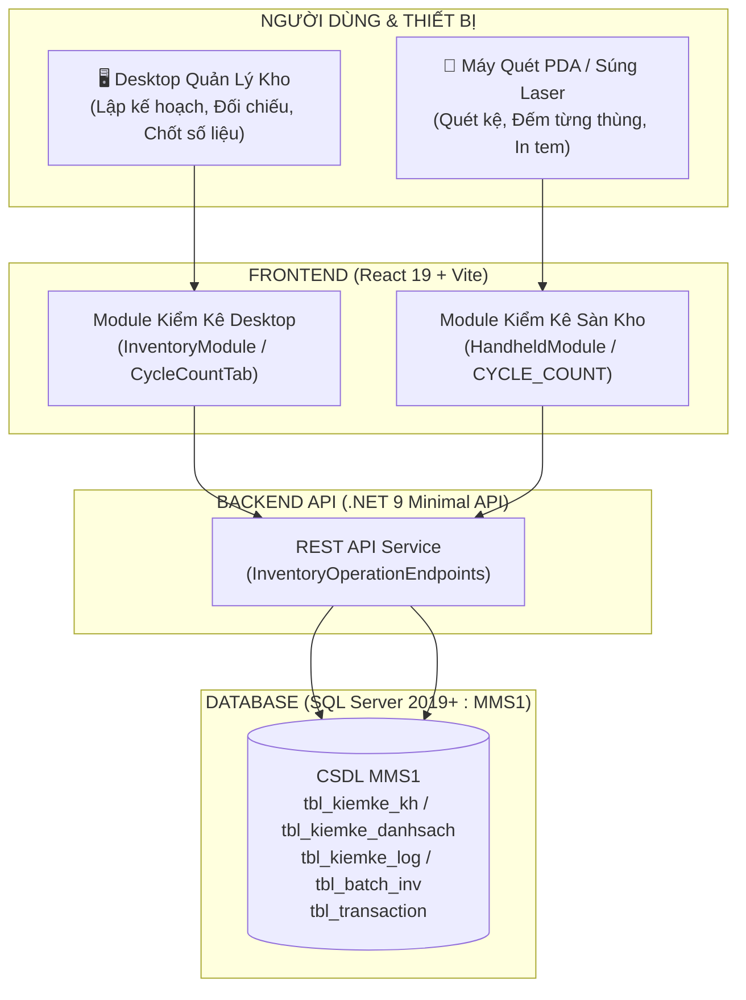
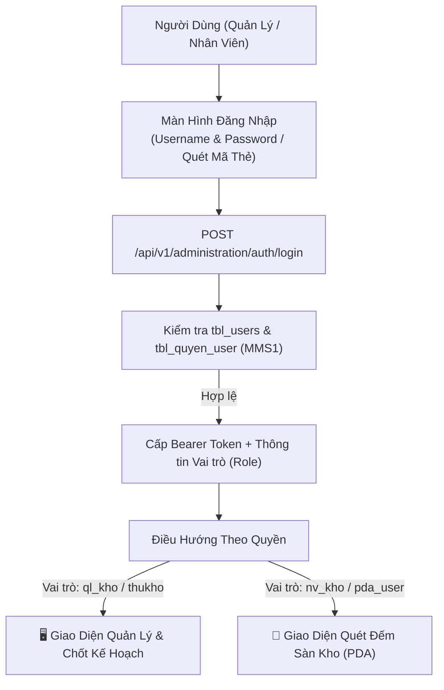
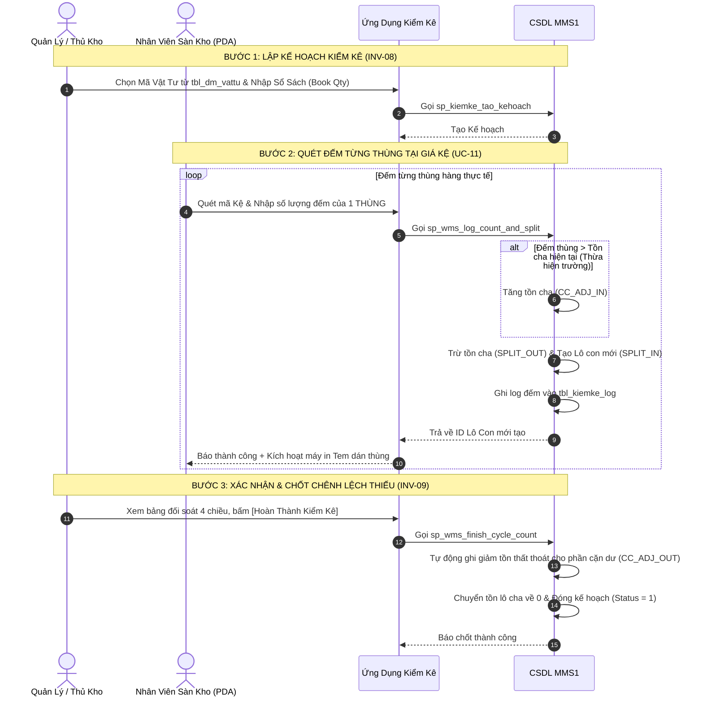

# TÀI LIỆU THIẾT KẾ & HƯỚNG DẪN XÂY DỰNG ỨNG DỤNG KIỂM KÊ ĐỘC LẬP
## (STANDALONE CYCLE COUNT APP BLUEPRINT & DEPLOYMENT GUIDE)

**Dự án:** MMS WMS – Phân Hệ Kiểm Kê Hiện Trường (Pilot Phase)  
**Mục tiêu:** Cung cấp tài liệu kỹ thuật và nghiệp vụ đầy đủ để đóng gói, chạy độc lập một ứng dụng chuyên biệt về **Kiểm Kê Sàn Kho (Desktop Manager & Handheld PDA)** trước khi đưa toàn bộ hệ thống vào vận hành lớn.

---

## 1. TỔNG QUAN KIẾN TRÚC ỨNG DỤNG ĐỘC LẬP (STANDALONE ARCHITECTURE)

Ứng dụng Kiểm Kê Độc Lập bao gồm 2 giao diện phục vụ 2 nhóm người dùng:
1. **Desktop Web App (Dành cho Quản lý / Thủ kho):** Lập kế hoạch kiểm kê theo vật tư, đối chiếu cân bằng 4 chiều (Hệ thống - Sổ sách - Thực tế - Chênh lệch), phê duyệt và chốt số liệu.
2. **Mobile Handheld PDA (Dành cho Nhân viên sàn kho):** Thao tác quét mã vạch bằng súng laser, đếm số lượng của **từng thùng**, tự động tách lô con và in tem dán ngay tại hiện trường.



---

## 2. PHÂN HỆ XÁC THỰC & ĐĂNG NHẬP NGƯỜI DÙNG (AUTHENTICATION & ACCESS CONTROL - UC-01)

Để đảm bảo tính bảo mật và ghi vết chính xác người thực hiện từng lượt quét kiểm đếm, ứng dụng Kiểm Kê tích hợp phân hệ đăng nhập và phân quyền đa cấp.



### 2.1. Ma Trận Phân Quyền Trong Kiểm Kê

| Nhóm Vai Trò (`Role`) | Mã Tài Khoản Thử Nghiệm | Mật Khẩu | Quyền Hạn Trong Phân Hệ Kiểm Kê |
| :--- | :---: | :---: | :--- |
| **Quản Trị Hệ Thống (`admin`)** | `admin` | `123` | Toàn quyền cấu hình, tạo kế hoạch, đếm và chốt số liệu. |
| **Trưởng Phòng Kho (`truongphong` / `ql_kho`)** | `ql_kho` | `123` | Xem đối soát 4 chiều, **Phê duyệt & Chốt Hoàn Thành Kiểm Kê** (Xử lý hao hụt). |
| **Thủ Kho Trưởng (`thukho`)** | `thukho` | `123` | Khởi tạo Kế hoạch kiểm kê mới, snapshot danh mục lô, in tem nhãn. |
| **Nhân Viên Sàn Kho (`nv_kho` / `pda_user`)** | `nv_kho` | `123` | Thao tác trên thiết bị PDA: Quét kệ, nhập số đếm từng thùng, in tem dán. |

### 2.2. Giao Thức Xác Thực (Authentication Protocol)
- **Phương thức:** `POST /api/v1/administration/auth/login`
- **Request Payload:**
```json
{
  "username": "ql_kho",
  "password": "123"
}
```
- **Response Payload:**
```json
{
  "success": true,
  "data": {
    "token": "mms-jwt-token-xyz789",
    "user": {
      "userId": "ql_kho",
      "userName": "ql_kho",
      "fullName": "Nguyễn Văn Quản Lý",
      "role": "truongphong",
      "warehouseCode": "20020100"
    }
  }
}
```
- **Lưu trữ phiên (Session Storage):** Token và thông tin định danh người dùng được lưu trong `localStorage.getItem('mms_current_user')` và tự động gắn vào Header `Authorization: Bearer <token>` trong tất cả các lệnh gọi API kiểm kê tiếp theo.

---

## 3. QUY TRÌNH NGHIỆP VỤ CỐT LÕI (CORE BUSINESS FLOW)



---

## 4. CƠ SỞ DỮ LIỆU & STORED PROCEDURES (DATABASE SPECIFICATION)

### 4.1. Cấu Trúc Các Bảng Liên Quan

1. **`tbl_kiemke_kh` (Bảng Kế hoạch kiểm kê tổng hợp):**
   - `id_kh_kiemke` (INT, PK, Identity): Mã kế hoạch kiểm kê.
   - `id_vattu` (NVARCHAR(50)): Mã vật tư kiểm kê.
   - `soluong_hethong` (FLOAT): Tổng tồn vật lý trên hệ thống tại thời điểm lập.
   - `soluong_sosach` (FLOAT): Số lượng ghi nhận trên sổ cái kế toán (Bravo).
   - `soluong_thucte` (FLOAT): Lũy kế số lượng thực tế đếm được từ sàn kho.
   - `time_batdau`, `time_ketthuc` (DATETIME): Thời gian bắt đầu và kết thúc.
   - `trang_thai` (INT): `0` = Đang kiểm kê; `1` = Đã hoàn thành/Chốt số.
   - `user_cre` (NVARCHAR(50)): Người tạo kế hoạch.

2. **`tbl_kiemke_danhsach` (Danh sách các Lô cha cần kiểm tra):**
   - `id_kiemke` (INT, PK, Identity): Mã dòng chi tiết.
   - `id_kh_kiemke` (INT, FK): Liên kết kế hoạch.
   - `id_batch` (INT): Mã Lô gốc (Batch cha).
   - `so_luong` (FLOAT): Lũy kế số lượng đã quét đếm cho lô này.
   - `unit` (NVARCHAR(20)): Đơn vị tính.
   - `vi_tri` (NVARCHAR(100)): Tọa độ kệ ghi nhận gần nhất.

3. **`tbl_kiemke_log` (Nhật ký từng lần quét thùng thực tế):**
   - `id_kiem` (INT, PK, Identity): Mã lượt quét.
   - `id_kiemke` (INT): Liên kết dòng chi tiết kế hoạch.
   - `id_batch` (INT): **Mã Lô Con mới sinh ra** sau khi tách thùng.
   - `so_luong` (FLOAT): Số lượng của thùng vừa đếm.
   - `unit` (NVARCHAR(20)), `vi_tri` (NVARCHAR(100)).
   - `user_cre` (NVARCHAR(50)), `time_cre` (DATETIME).

4. **`tbl_batch_inv` (Bảng Quản lý Tồn kho theo Lô):**
   - `id_batch` (INT, PK), `parent_id_batch` (INT, Nullable - Mã lô cha nếu là lô con được tách).
   - `id_vattu`, `ten_vattu`, `so_luong`, `unit`, `location`, `trang_thai_ton`.

5. **`tbl_transaction` (Sổ cái biến động kho bất biến):**
   - `id_trans` (INT, PK), `id_batch` (INT), `nghiep_vu` (NVARCHAR(50)), `so_luong` (FLOAT), `unit`, `time_cre`, `trang_thai`.

---

### 4.2. Mã Nguồn Stored Procedures Chuẩn (Production-Ready)

#### A. Stored Procedure Ghi Nhận Đếm Từng Thùng & Tách Lô (`sp_wms_log_count_and_split`)

```sql
CREATE OR ALTER PROCEDURE dbo.sp_wms_log_count_and_split
    @id_kiemke INT,
    @batch_id INT,
    @actual_quantity FLOAT,
    @unit NVARCHAR(50),
    @location_code NVARCHAR(100),
    @user NVARCHAR(100)
AS
BEGIN
    SET NOCOUNT ON;
    SET XACT_ABORT ON;

    BEGIN TRY
        BEGIN TRANSACTION;

        -- 0. Khóa cứng: Số lượng đếm phải > 0
        IF @actual_quantity IS NULL OR @actual_quantity <= 0
            THROW 51000, N'Số lượng kiểm đếm phải lớn hơn 0! (Lô không đếm hoặc bằng 0 sẽ được tự động xử lý khi Chốt Kiểm Kê)', 1;

        -- 1. Lấy thông tin lô gốc
        DECLARE 
            @current_qty       FLOAT,
            @material_id       NVARCHAR(100),
            @bravo_id          NVARCHAR(100),
            @material_name     NVARCHAR(255),
            @ma_kho            NVARCHAR(50),
            @location_event_up NVARCHAR(50),
            @ma_event_up       NVARCHAR(50),
            @trang_thai_ton    NVARCHAR(50),
            @Now               DATETIME = GETDATE();

        SELECT 
            @current_qty       = so_luong, 
            @material_id       = id_vattu, 
            @bravo_id          = id_bravo, 
            @material_name     = ten_vattu,
            @ma_kho            = ma_kho,
            @location_event_up = ISNULL(location_event_up, N'0'),
            @ma_event_up       = ISNULL(ma_event_up, N'1'),
            @trang_thai_ton    = ISNULL(trang_thai_ton, N'1')
        FROM dbo.tbl_batch_inv WITH (UPDLOCK, HOLDLOCK)
        WHERE id_batch = @batch_id;

        IF @current_qty IS NULL
            THROW 51000, N'Lô hàng không tồn tại trong hệ thống!', 1;

        -- 2. Xử lý Chênh lệch thừa: Nếu đếm thùng này > tồn khả dụng còn lại của lô cha
        IF @actual_quantity > @current_qty
        BEGIN
            DECLARE @diff FLOAT = @actual_quantity - @current_qty;
            
            -- Tăng tồn kho lô cha
            UPDATE dbo.tbl_batch_inv 
            SET 
                so_luong = so_luong + @diff,
                time_up = @Now,
                user_up = @user
            WHERE id_batch = @batch_id;
            
            -- Ghi nhận biến động TĂNG DO KIỂM KÊ (Mã chuẩn ADJ_UP, logic = 1)
            INSERT INTO dbo.tbl_transaction (id_batch, nghiep_vu, id_vattu, id_bravo, ten_vattu, so_luong, unit, time_cre, trang_thai)
            VALUES (@batch_id, N'ADJ_UP', @material_id, @bravo_id, @material_name, @diff, @unit, @Now, N'1');
            
            SET @current_qty = @actual_quantity;
        END;

        -- 3. Tách lô cho thùng thực tế vừa đếm
        -- A. Trừ số lượng trên lô gốc
        UPDATE dbo.tbl_batch_inv 
        SET 
            so_luong = so_luong - @actual_quantity,
            ma_event_up = N'5', -- 5: Đếm kiểm kê
            time_up = @Now,
            user_up = @user
        WHERE id_batch = @batch_id;

        -- Ghi log batch_event cho lô cha (audit trail)
        INSERT INTO dbo.tbl_batch_event (
            id_batch, ma_event, id_vattu, so_luong, unit, time_up, user_up, trang_thai_ton
        )
        VALUES (
            @batch_id, 5, @material_id, @current_qty - @actual_quantity, @unit, @Now, @user, @trang_thai_ton
        );

        -- Ghi nhận giao dịch giảm tồn lô cha (Mã chuẩn ADJ_DWN, logic = -1, số lượng luôn dương)
        IF @actual_quantity > 0
        BEGIN
            INSERT INTO dbo.tbl_transaction (id_batch, nghiep_vu, id_vattu, id_bravo, ten_vattu, so_luong, unit, time_cre, trang_thai)
            VALUES (@batch_id, N'ADJ_DWN', @material_id, @bravo_id, @material_name, @actual_quantity, @unit, @Now, N'1');
        END;

        -- B. Tạo lô con mới (kế thừa parent_id_batch từ lô gốc để in tem dán thùng)
        DECLARE @new_batch_id INT;
        INSERT INTO dbo.tbl_batch_inv (
            parent_id_batch, 
            ma_kho, 
            id_vattu, 
            id_bravo, 
            ten_vattu, 
            so_luong, 
            unit, 
            location, 
            location_event_up, 
            ma_event_up, 
            trang_thai_ton,
            time_cre,
            user_up,
            time_up
        )
        VALUES (
            @batch_id, 
            @ma_kho, 
            @material_id, 
            @bravo_id, 
            @material_name, 
            @actual_quantity, 
            @unit, 
            @location_code, 
            N'1', 
            N'5', 
            @trang_thai_ton,
            @Now,
            @user,
            @Now
        );
        
        SET @new_batch_id = SCOPE_IDENTITY();

        -- Ghi log batch_event cho Lô Con mới sinh
        INSERT INTO dbo.tbl_batch_event (
            id_batch, ma_event, id_vattu, so_luong, unit, time_up, user_up, trang_thai_ton
        )
        VALUES (
            @new_batch_id, 5, @material_id, @actual_quantity, @unit, @Now, @user, @trang_thai_ton
        );

        -- Ghi log location_event cho Lô Con mới (lưu theo ma_location)
        IF @location_code IS NOT NULL AND LTRIM(RTRIM(@location_code)) <> ''
        BEGIN
            INSERT INTO dbo.tbl_location_event (
                ma_location, id_batch, location_event, user_cre, time_cre
            )
            VALUES (
                @location_code, @new_batch_id, N'1', @user, @Now
            );
        END;

        -- C. Ghi nhận giao dịch tăng tồn lô con mới (Mã chuẩn ADJ_UP, logic = 1, số lượng luôn dương)
        IF @actual_quantity > 0
        BEGIN
            INSERT INTO dbo.tbl_transaction (id_batch, nghiep_vu, id_vattu, id_bravo, ten_vattu, so_luong, unit, time_cre, trang_thai)
            VALUES (@new_batch_id, N'ADJ_UP', @material_id, @bravo_id, @material_name, @actual_quantity, @unit, @Now, N'1');
        END;

        -- 4. Cập nhật tiến độ kiểm kê trong danh sách chi tiết
        UPDATE dbo.tbl_kiemke_danhsach
        SET 
            so_luong = ISNULL(so_luong, 0) + @actual_quantity,
            vi_tri = @location_code
        WHERE id_kiemke = @id_kiemke;

        -- 5. Ghi log kiểm kê gắn với ID LÔ CON vừa sinh ra
        INSERT INTO dbo.tbl_kiemke_log (id_kiemke, id_batch, so_luong, unit, vi_tri, user_cre, time_cre)
        VALUES (@id_kiemke, @new_batch_id, @actual_quantity, @unit, @location_code, @user, @Now);

        -- 6. Cập nhật tổng số lượng thực tế của kế hoạch
        DECLARE @id_kh_kiemke INT;
        SELECT @id_kh_kiemke = id_kh_kiemke FROM dbo.tbl_kiemke_danhsach WHERE id_kiemke = @id_kiemke;

        UPDATE dbo.tbl_kiemke_kh
        SET soluong_thucte = ISNULL(soluong_thucte, 0) + @actual_quantity
        WHERE id_kh_kiemke = @id_kh_kiemke;

        COMMIT TRANSACTION;
        
        -- Trả về Result Set chuẩn cho ứng dụng Web / PDA / Backend API
        SELECT 
            1 AS IsSuccess,
            N'Đã ghi nhận đếm thùng và tách lô con thành công' AS Message,
            @new_batch_id AS NewBatchId;
    END TRY
    BEGIN CATCH
        IF @@TRANCOUNT > 0 ROLLBACK TRANSACTION;
        DECLARE @ErrorMessage NVARCHAR(4000) = ERROR_MESSAGE();
        RAISERROR(@ErrorMessage, 16, 1);
    END CATCH
END;
GO
```

#### B. Stored Procedure Hoàn Thành & Chốt Chênh Lệch Thiếu (`sp_wms_finish_cycle_count`)

```sql
CREATE OR ALTER PROCEDURE dbo.sp_wms_finish_cycle_count
    @plan_id INT,
    @user NVARCHAR(100)
AS
BEGIN
    SET NOCOUNT ON;
    BEGIN TRY
        BEGIN TRANSACTION;

        DECLARE @status INT;
        SELECT @status = trang_thai FROM tbl_kiemke_kh WHERE id_kh_kiemke = @plan_id;
        
        IF @status IS NULL
        BEGIN
            RAISERROR(N'Kế hoạch kiểm kê không tồn tại!', 16, 1);
            RETURN;
        END

        IF @status = 1
        BEGIN
            RAISERROR(N'Kế hoạch kiểm kê này đã được đóng trước đó!', 16, 1);
            RETURN;
        END

        -- Bước 1: Ghi nhận giảm tồn hao hụt cho các lô gốc còn tồn dư (số lượng luôn dương)
        INSERT INTO tbl_transaction (id_batch, nghiep_vu, id_vattu, id_bravo, ten_vattu, so_luong, unit, trang_thai)
        SELECT 
            b.id_batch, 
            'ADJ_DWN', 
            b.id_vattu, 
            b.id_bravo, 
            b.ten_vattu, 
            b.so_luong, 
            b.unit, 
            1
        FROM tbl_kiemke_danhsach d
        INNER JOIN tbl_batch_inv b ON d.id_batch = b.id_batch
        WHERE d.id_kh_kiemke = @plan_id AND b.so_luong > 0;

        -- Bước 2: Đưa số lượng tồn của các lô gốc còn dư về 0
        UPDATE b
        SET b.so_luong = 0
        FROM tbl_kiemke_danhsach d
        INNER JOIN tbl_batch_inv b ON d.id_batch = b.id_batch
        WHERE d.id_kh_kiemke = @plan_id AND b.so_luong > 0;

        -- Bước 3: Đóng kế hoạch kiểm kê
        UPDATE tbl_kiemke_kh
        SET trang_thai = 1,
            time_ketthuc = GETDATE()
        WHERE id_kh_kiemke = @plan_id;

        COMMIT TRANSACTION;
    END TRY
    BEGIN CATCH
        IF @@TRANCOUNT > 0 ROLLBACK TRANSACTION;
        DECLARE @ErrorMessage NVARCHAR(4000) = ERROR_MESSAGE();
        RAISERROR(@ErrorMessage, 16, 1);
    END CATCH
END;
GO
```

---

## 5. DANH MỤC REST API BACKEND (.NET MINIMAL API)

| Method | Endpoint | Quyền Hạn | Chức Năng |
| :--- | :--- | :---: | :--- |
| `POST`| `/api/v1/administration/auth/login` | Công khai | **Đăng nhập hệ thống**, xác thực tài khoản & cấp token. |
| `GET` | `/api/v1/inventory-operations/cycle-count-materials?search=...` | Tất cả | Lấy danh mục vật tư từ `tbl_dm_vattu` để hiển thị Combobox. |
| `GET` | `/api/v1/inventory-operations/cycle-counts?statusCode=...` | Tất cả | Lấy danh sách các kế hoạch kiểm kê. |
| `GET` | `/api/v1/inventory-operations/cycle-counts/{planId}` | Tất cả | Lấy chi tiết kế hoạch, danh sách lô cần đếm và lịch sử quét. |
| `POST`| `/api/v1/inventory-operations/cycle-counts` | Thủ kho / QL | Tạo kế hoạch kiểm kê mới cho 1 mã vật tư. |
| `POST`| `/api/v1/inventory-operations/cycle-counts/{planId}/log` | Nhân viên PDA | Ghi nhận đếm 1 thùng thực tế, tách lô con, trả về `NewBatchId`. |
| `POST`| `/api/v1/inventory-operations/cycle-counts/{planId}/finish` | Quản lý kho | Chốt hoàn thành kế hoạch, xử lý tự động chênh lệch thiếu. |

---

## 6. HƯỚNG DẪN BUILD & ĐÓNG GÓI CHẠY ĐỘC LẬP (STEP-BY-STEP)

Để chạy riêng ứng dụng này phục vụ kiểm kê hiện trường mà không cần mở toàn bộ hệ thống lớn:

### Bước 1: Khởi động Backend API (Cổng 5080)
```powershell
cd c:\MMS\apps\api
dotnet run --urls "http://0.0.0.0:5080"
```
*(Lưu ý: Dùng `0.0.0.0` để các máy quét PDA trong cùng mạng WiFi nội bộ kết nối được tới IP máy chủ).*

### Bước 2: Khởi động Frontend Web & PDA (Cổng 5173)
```powershell
cd c:\MMS\apps\web
npm run dev -- --host 0.0.0.0 --port 5173
```

### Bước 3: Truy cập ứng dụng từ thiết bị:
- **Trên máy tính Quản lý (Desktop):** Mở trình duyệt truy cập `http://localhost:5173` $\rightarrow$ Đăng nhập với tài khoản `ql_kho` hoặc `admin` $\rightarrow$ Chọn tab **Kiểm Kê Vật Tư (INV-08)**.
- **Trên thiết bị Handheld PDA (Zebra, Honeywell, v.v.):** Mở trình duyệt Chrome/Edge trên PDA truy cập `http://<IP_MAY_TRAM>:5173` $\rightarrow$ Đăng nhập tài khoản `nv_kho` $\rightarrow$ Bấm nút đen **[MÁY QUÉT PDA]** trên thanh Navbar $\rightarrow$ Chọn `5B. Kiểm Kê Cycle Count (INV-08)`.

---

## 7. BẢNG KIỂM THỬ THỰC TẾ TRÊN SÀN KHO (PILOT TEST CHECKLIST)

Khi chạy thực tế tại kho, hãy thực hiện kiểm thử theo bảng kịch bản sau:

| STT | Kịch Bản Kiểm Thử | Dữ Liệu Đầu Vào Giả Định | Kết Quả Mong Đợi | Trạng Thái |
| :---: | :--- | :--- | :--- | :---: |
| 0 | **Đăng Nhập & Phân Quyền** | Nhập `ql_kho` / `123` hoặc `nv_kho` / `123` | Đăng nhập thành công, nhận diện đúng vai trò và mở đúng giao diện. | [x] Đạt |
| 1 | **Tạo Kế Hoạch Kiểm Kê** | Chọn mã `CGBM901I5`, Nhập Sổ sách: `100 Cái` | Kế hoạch tạo thành công, snapshot đúng danh sách các lô đang có. | [x] Đạt |
| 2 | **Đếm Thùng 1 (Khớp tồn)** | Quét Kệ `A-01-01`, Đếm `30 Cái` | Lô cha giảm 30; sinh Lô con mới ID `#12810` số lượng 30; in tem thành công. | [x] Đạt |
| 3 | **Đếm Thùng 2 (Nhiều thùng)**| Quét Kệ `A-01-02`, Đếm `20 Cái` | Lô cha giảm tiếp 20; sinh Lô con mới `#12811`; tổng đếm tăng lên 50. | [x] Đạt |
| 4 | **Đếm Thùng 3 (Thừa tồn)** | Tồn cha còn 50, nhưng đếm `60 Cái` | Hệ thống tự tăng tồn cha +10 (`ADJ_UP`), sau đó tách lô 60; tồn cha về 0. | [x] Đạt |
| 5 | **Chốt Kế Hoạch (Thiếu tồn)**| Lô cha còn dư 20 cái không thấy ngoài kho | Bấm [Hoàn Thành]: Tự động sinh `ADJ_DWN` trừ 20 cái, đưa tồn cha về 0, đóng kế hoạch. | [x] Đạt |

---
*Tài liệu này là cẩm nang kỹ thuật và quy trình hoàn chỉnh để vận hành độc lập tính năng Kiểm Kê MMS WMS.*
