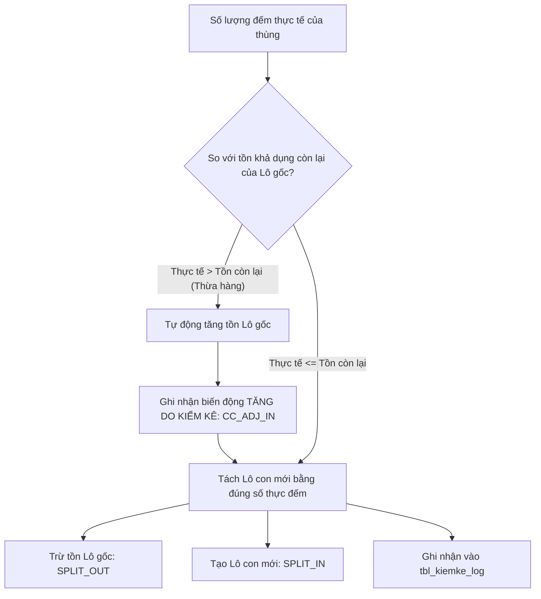
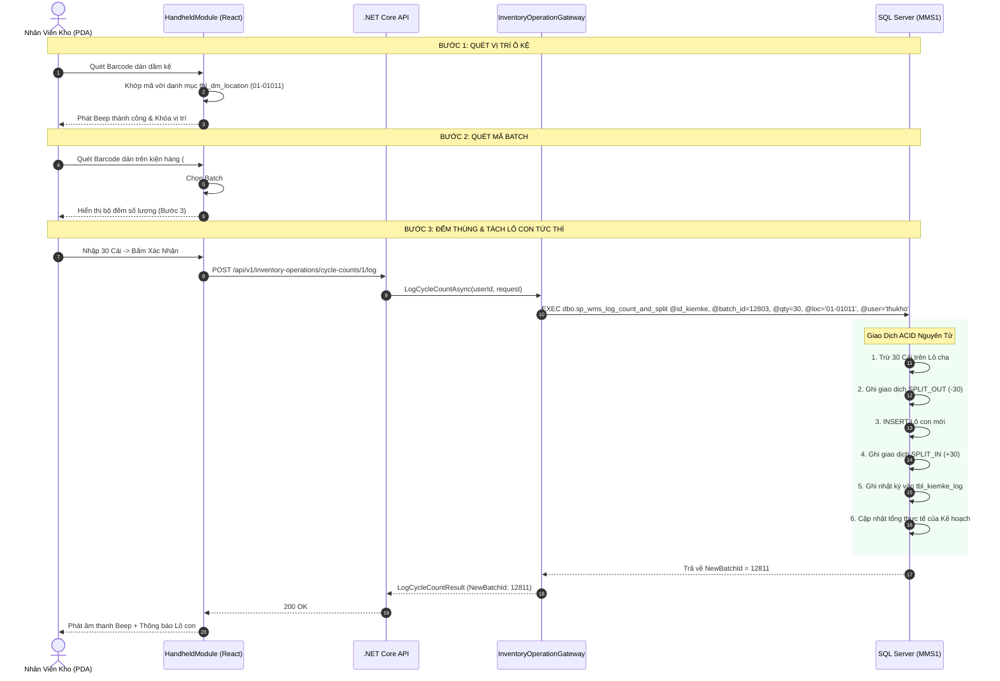
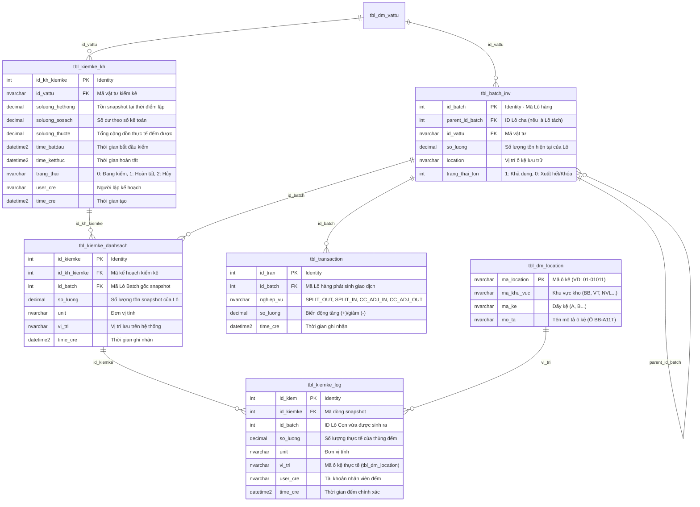

# Đặc Tả Kỹ Thuật Toàn Diện UC-27 / INV-08: Kiểm Kê Xoay Vòng Cycle Count Theo Vật Tư

> **Mục tiêu tài liệu:** Cung cấp tài liệu thiết kế và đặc tả kỹ thuật chi tiết nhất của chức năng **Kiểm Kê Xoay Vòng (Cycle Count)** theo mã vật tư, phân tách mạch lạc thành 3 trụ cột logic cốt lõi:
> 1. **Business Logic (Logic Nghiệp Vụ Kho & Quy Trình Vận Hành)**
> 2. **Programming Logic (Logic Lập Trình Giao Diện React, Thiết Bị Cầm Tay PDA & Backend .NET Core API)**
> 3. **Data Logic (Logic CSDL SQL Server, Mô Hình Thực Thể ERD, Giao Dịch ACID & Toàn Bộ 6 Stored Procedures)**

---

## Bảng Thông Tin Kiểm Soát Use Case

| Thuộc tính | Giá trị chi tiết |
| :--- | :--- |
| **Mã Use Case Nghiệp Vụ** | `UC-27` |
| **Mã Phân Hệ Kỹ Thuật** | `INV-08` / `INV-09` (Quản Lý Tồn Kho & Kiểm Kê Định Kỳ) |
| **Tên Nghiệp Vụ** | Kiểm Kê Xoay Vòng Cycle Count Theo Vật Tư & Tách Lô Con Tự Động |
| **Tác Nhân Chính (Actors)** | Quản lý kiểm kê (`ql_kiemke`), Thủ kho (`thukho`), Quản lý kho (`truongphong_kho`), Nhân viên quét PDA (`nhanvien`) |
| **Giao Diện Desktop (Web)** | `/inventory` (Tab: `📋 Kiểm Kê Cycle Count (UC-27)`) |
| **Giao Diện Thiết Bị Cầm Tay (PDA)** | `/handheld` (Chế độ: `5B. Kiểm Kê Cycle Count`) |
| **Công Nghệ Sử Dụng** | React 18, TypeScript, Tailwind CSS, ASP.NET Core 8 Minimal API, SQL Server 2019/2022 |
| **Database Đích** | `10.17.16.106` (`Database=MMS1`, User `codex1` / `123`) |
| **Trạng Thái Vận Hành** | ✅ Đã triển khai và kết nối dữ liệu thực tế 100% |

---

# PHẦN 1: BUSINESS LOGIC (LOGIC NGHIỆP VỤ)

```
┌──────────────────────────────────────────────────────────────────────────────────┐
│                             CHU TRÌNH KIỂM KÊ CYCLE COUNT                        │
│                                                                                  │
│   [ 1. LẬP KẾ HOẠCH ]        [ 2. HIỆN TRƯỜNG PDA ]          [ 3. HOÀN TẤT ]     │
│   • Chọn SKU vật tư          • Bước 1: Quét Ô Kệ (MMS1)      • Đối soát 4 chiều  │
│   • Snapshot lô tồn kho      • Bước 2: Quét Mã Lô Batch      • Cân đối tồn kho   │
│   • Chốt số dư sổ sách       • Bước 3: Đếm & Tách Lô Con     • Báo cáo thất thoát│
│                              • In tem dán thùng tức thì                          │
└──────────────────────────────────────────────────────────────────────────────────┘
```

### 1.1. Bối Cảnh & Mục Tiêu Nghiệp Vụ
- **Kiểm kê không gián đoạn:** Do kho vật tư & sản xuất hoạt động liên tục 24/7, việc dừng toàn bộ kho để tổng kiểm kê định kỳ gây thiệt hại lớn về năng suất. Phương pháp **Cycle Count** cho phép kiểm đếm cuốn chiếu theo từng **Mã Vật Tư (`id_vattu`)** hoặc nhóm vật tư trọng yếu (ABC Analysis) ngay trong ca làm việc.
- **Khắc phục tình trạng lệch lô lẻ:** Trong thực tế, một Lô hàng (Batch gốc) sau khi nhập kho có thể được chia thành nhiều thùng/kiện và lưu trữ rải rác ở nhiều ô kệ khác nhau. Quy trình truyền thống thường bỏ sót hoặc cộng dồn sai.
- **Tự động hóa định danh thùng hàng:** Khi nhân viên đếm được một thùng hàng tại một vị trí kệ cụ thể, hệ thống **tự động tách số lượng đó thành một Lô Con Mới (`NewBatchId`)** kế thừa quan hệ cha-con (`parent_id_batch`), cho phép in ngay tem mã vạch định danh dán lên thùng.

---

### 1.2. Quy Trình Vận Hành Chuẩn 3 Bước Trên Thiết Bị Cầm Tay (PDA)

#### 🔹 BƯỚC 1: Quét Xác Định Vị Trí Ô Kệ (Scan Location Bin)
- Nhân viên cầm máy PDA đứng trước dãy kệ, bấm nút quét laser dầm kệ hoặc chọn từ danh mục **540 ô kệ thực tế** trong bảng `dbo.tbl_dm_location` (VD: `01-01011` - Ô BB-A11T).
- Hệ thống phát âm thanh Beep và khóa vị trí hiện trường. Không cho phép nhập số lượng nếu chưa xác định vị trí.

#### 🔹 BƯỚC 2: Quét Mã Lô Batch Cần Đếm (Scan Batch Barcode)
- Nhân viên quét mã barcode trên kiện hàng hoặc chạm chọn thẻ Lô Batch trong danh sách snapshot của kế hoạch.
- Màn hình hiển thị: Mã Batch `#12803`, Mã Bravo, Tồn máy snapshot, và số lần đã đếm trước đó.

#### 🔹 BƯỚC 3: Đếm Số Lượng Thực Tế 1 Thùng & Tự Động Tách Lô Con (Count & Split)
- Nhân viên nhập số lượng thực tế kiểm đếm được của thùng/kiện đó bằng bộ phím số cảm ứng to rõ (`+1`, `+5`, `+10`, `+50`, `+100`).
- Bấm **"XÁC NHẬN SỐ ĐẾM & TÁCH THÙNG NÀY"**:
  1. Giảm trừ số lượng tương ứng trên Lô cha.
  2. Tạo ngay một **Lô Con Mới** mang ID duy nhất (VD: `#12811`) với số lượng vừa đếm và gán đúng vị trí kệ hiện tại.
  3. Ghi nhận giao dịch kép `SPLIT_OUT` (lô cha) và `SPLIT_IN` (lô con) vào `tbl_transaction`.
  4. Hiển thị dòng nhật ký vào **Bảng Nhật Ký Đếm** trực quan trên PDA.
  5. In tem mã vạch dán vào thùng.

---

### 1.3. Cơ Chế Xử Lý Chênh Lệch Thừa / Thiếu



1. **Trường hợp Đếm Thừa (Over-count):**
   - Nếu số lượng đếm được ở thùng này lớn hơn số dư tồn khả dụng còn lại trên Lô cha, hệ thống tự động ghi nhận nghiệp vụ tăng tồn điều chỉnh kiểm kê (`CC_ADJ_IN`), sau đó mới thực hiện tách lô con.
2. **Trường hợp Đếm Thiếu (Under-count / Shrinkage) khi Hoàn Tất:**
   - Khi kế hoạch kiểm kê được bấm **"HOÀN THÀNH KẾ HOẠCH"** (`sp_kiemke_hoantat`), nếu Lô gốc vẫn còn số lượng dư thừa chưa được đếm (thất thoát vật lý ngoài kho), hệ thống tự động đưa số dư lô gốc về `0` và ghi nhận giao dịch giảm tồn do thất thoát kiểm kê (`CC_ADJ_OUT`).

---

### 1.4. Ma Trận Phân Quyền Vai Trò Người Dùng (Role Matrix)

| Chức năng nghiệp vụ | Quản Lý Kiểm Kê (`ql_kiemke`) | Thủ Kho (`thukho`) | Quản Lý Kho (`truongphong_kho`) | Nhân Viên Quét (`nhanvien`) |
| :--- | :---: | :---: | :---: | :---: |
| **Lập Kế Hoạch Kiểm Kê (B1)** | ✅ Toàn quyền | ✅ Có quyền | ✅ Toàn quyền | ❌ Không |
| **Kiểm Đếm Hiện Trường PDA (B2)** | ✅ Toàn quyền | ✅ Có quyền | ✅ Có quyền | ✅ Toàn quyền |
| **Tra cứu Cây Gia Phả Lô Hàng** | ✅ Toàn quyền | ✅ Có quyền | ✅ Toàn quyền | 👁️ Chỉ xem |
| **Hoàn Tất & Khóa Kế Hoạch (INV-09)** | ✅ Toàn quyền | ❌ Không | ✅ Toàn quyền | ❌ Không |
| **Các phân hệ khác (Inbound, QC, Outbound)** | ⛔ **Bị ẩn hoàn toàn** | ✅ Có quyền | ✅ Toàn quyền | 👁️ Theo phân quyền |

---

### 1.5. Hệ Thống 12 Quy Tắc Nghiệp Vụ (Business Rules)

| Mã Quy Tắc | Tên Quy Tắc | Nội Dung Chi Tiết |
| :--- | :--- | :--- |
| **BR-INV08-01** | Bắt buộc SKU Hợp Lệ | Mã vật tư `id_vattu` phải tồn tại trong danh mục `dbo.tbl_dm_vattu`. |
| **BR-INV08-02** | Snapshot Độc Lập | Snapshot chốt số dư tồn tại thời điểm tạo kế hoạch (`trang_thai_ton <> '0'` và `so_luong > 0`). |
| **BR-INV08-03** | Đối Soát 4 Chiều | Báo cáo kiểm kê bắt buộc đối chiếu: **Tồn Máy** (`soluong_hethong`), **Sổ Sách** (`soluong_sosach`), **Thực Tế** (`soluong_thucte`), và **Chênh Lệch**. |
| **BR-INV08-04** | Location-First | Bắt buộc quét vị trí ô kệ trước khi quét mã lô hàng. |
| **BR-INV08-05** | Tách Lô Con Tự Động | Mỗi thùng đếm xong được cấp 1 `NewBatchId` riêng biệt, liên kết với `parent_id_batch`. |
| **BR-INV08-06** | Bất Biến Tổng Tồn Trong Quá Trình Đếm | Tổng tồn vật lý trước và sau mỗi lần đếm luôn được bảo toàn thông qua cặp giao dịch `SPLIT_OUT` / `SPLIT_IN`. |
| **BR-INV08-07** | Định Danh Ô Kệ MMS1 | Mã vị trí phải khớp với danh mục 540 ô kệ thực tế trong `dbo.tbl_dm_location`. |
| **BR-INV08-08** | In Tem Mã Vạch Tức Thời | Lô con mới sinh ra phải hỗ trợ xuất lệnh in tem mã vạch ngay trên thiết bị cầm tay. |
| **BR-INV08-09** | Xử Lý Đếm Thừa Tức Thì | Tự động tăng số dư lô cha với mã nghiệp vụ `CC_ADJ_IN` nếu số đếm vượt khả dụng. |
| **BR-INV08-10** | Hạch Toán Thất Thoát Khi Khóa Sổ | Lô gốc dư thừa sau khi hoàn tất được trừ sạch tồn với mã `CC_ADJ_OUT`. |
| **BR-INV08-11** | Nhật Ký Đếm Không Thể Xóa | Mọi dòng ghi nhận trong `tbl_kiemke_log` là bất biến (Immutable Audit Log). |
| **BR-INV08-12** | Truy Vết Gia Phả N Cấp | Cho phép truy vết ngược xuôi cây gia phả nguồn gốc từ Lô cha đến toàn bộ Lô con đời F1, F2... |

---

# PHẦN 2: PROGRAMMING LOGIC (LOGIC LẬP TRÌNH)

```
┌──────────────────────────────────────────────────────────────────────────────────┐
│                         KIẾN TRÚC HỆ THỐNG 3 TẦNG (3-TIER)                       │
│                                                                                  │
│   [ FRONTEND LAYER ]          [ BACKEND API LAYER ]       [ DATABASE LAYER ]     │
│   • React 18 + Vite           • ASP.NET Core 8 API        • SQL Server (MMS1)    │
│   • InventoryModule.tsx       • InventoryOperationEndpoints • 6 Stored Procedures│
│   • HandheldModule.tsx (PDA)  • InventoryOperationGateway • tbl_kiemke_kh / log  │
│   • cycleCountService.ts      • ADO.NET Connection Pool   • tbl_batch_inv / tran │
└──────────────────────────────────────────────────────────────────────────────────┘
```

### 2.1. Kiến Trúc Tầng Giao Diện (Frontend - React + TypeScript)

#### 1. Cấu Trúc Module & File Source Code
- [`InventoryModule.tsx`](file:///c:/MMS/apps/web/src/components/InventoryModule.tsx): Màn hình Desktop dành cho Quản Lý/Thủ Kho:
  - Tab lập kế hoạch kiểm kê mới, chọn vật tư qua Combobox thông minh.
  - Tab danh sách kế hoạch kiểm kê & bảng điều khiển tiến độ trực quan.
  - Modal ghi nhận kiểm đếm tích hợp **Searchable Location Picker** kết nối 540 ô kệ `tbl_dm_location`.
  - Tab **Tách Lô & Sơ Đồ Cây Gia Phả (Genealogy Tree View)** hiển thị trực quan các cấp Lô cha - Lô con.
- [`HandheldModule.tsx`](file:///c:/MMS/apps/web/src/components/HandheldModule.tsx): Màn hình PDA chuyên dụng tại hiện trường nhà kho:
  - Bộ điều khiển **Stepper Wizard 3 bước**: `1. Quét Ô Kệ` $\rightarrow$ `2. Quét Lô Batch` $\rightarrow$ `3. Đếm & Tách Lô`.
  - Tích hợp máy quét camera/laser [`HandheldScannerModal.tsx`](file:///c:/MMS/apps/web/src/components/HandheldScannerModal.tsx).
  - Bàn phím số công thái học hỗ trợ nút cộng nhanh (`+1`, `+5`, `+10`, `+50`, `+100`).
  - **Bảng Nhật Ký Đếm Thực Tế** có dòng Tổng cộng (Footer Summary) hỗ trợ cuộn mượt.
  - Hệ thống âm thanh phản hồi [`audioFeedback.ts`](file:///c:/MMS/apps/web/src/utils/audioFeedback.ts) (Beep thành công, Buzzer lỗi, Chime hoàn tất).
- [`cycleCountService.ts`](file:///c:/MMS/apps/web/src/services/cycleCountService.ts): Client Service đóng gói toàn bộ HTTP calls với cơ chế gắn JWT Token tự động.

---

### 2.2. Chi Tiết Các API Endpoints & Contracts

#### 1. Danh mục vị trí ô kệ thực tế từ MMS1
- **Endpoint:** `GET /api/v1/inventory-operations/locations`
- **Query Params:** `search` (tùy chọn), `areaCode` (tùy chọn, VD: `BB`, `VT`, `NVL`)
- **Response `200 OK`:**
```json
[
  {
    "locationCode": "01-01011",
    "areaCode": "BB",
    "shelfCode": "A",
    "columnNumber": 1,
    "floorNumber": 1,
    "positionNumber": 1,
    "description": "Ô BB-A11T"
  }
]
```

#### 2. Lập kế hoạch kiểm kê mới
- **Endpoint:** `POST /api/v1/inventory-operations/cycle-counts`
- **Request Body:**
```json
{
  "materialId": "CGBM901I5",
  "bookQuantity": 450.0,
  "startedAt": "2026-08-19T08:00:00Z"
}
```
- **Response `200 OK`:**
```json
{
  "ok": true,
  "message": "Tạo kế hoạch kiểm kê thành công.",
  "planId": 1,
  "materialId": "CGBM901I5",
  "systemQuantity": 450.0,
  "bookQuantity": 450.0,
  "batchCount": 17
}
```

#### 3. Ghi nhận kiểm đếm 1 thùng & Tách Lô con (Hiện trường PDA)
- **Endpoint:** `POST /api/v1/inventory-operations/cycle-counts/{planId}/log`
- **Request Body:**
```json
{
  "detailId": 12,
  "batchId": 12803,
  "actualQuantity": 30.0,
  "unit": "Cái",
  "locationCode": "01-01011"
}
```
- **Response `200 OK`:**
```json
{
  "ok": true,
  "message": "Ghi nhận kiểm đếm thành công.",
  "detailId": 12,
  "batchId": 12803,
  "actualQuantity": 30.0,
  "newBatchId": 12811
}
```

#### 4. Truy vấn Cây Gia Phả Lô Hàng (Genealogy Tree)
- **Endpoint:** `GET /api/v1/inventory-operations/batches/{batchId}/genealogy`
- **Response `200 OK`:**
```json
[
  {
    "batchId": 12803,
    "parentBatchId": null,
    "materialId": "CGBM901I5",
    "quantity": 120.0,
    "createdAt": "2026-08-15T10:00:00Z",
    "location": "01-01011",
    "level": 0
  },
  {
    "batchId": 12811,
    "parentBatchId": 12803,
    "materialId": "CGBM901I5",
    "quantity": 30.0,
    "createdAt": "2026-08-19T07:31:07Z",
    "location": "01-01011",
    "level": 1
  }
]
```

#### 5. Hoàn tất kế hoạch kiểm kê (INV-09)
- **Endpoint:** `POST /api/v1/inventory-operations/cycle-counts/{planId}/finish`
- **Response `200 OK`:**
```json
{
  "ok": true,
  "message": "Hoàn tất kế hoạch kiểm kê #1 thành công. Đã tự động hạch toán giảm trừ 3 lô thừa tồn."
}
```

---

### 2.3. Sequence Diagram Chi Tiết Toàn Bộ Luồng Xử Lý



---

# PHẦN 3: DATA LOGIC (LOGIC DỮ LIỆU & STORED PROCEDURES)

```
┌──────────────────────────────────────────────────────────────────────────────────┐
│                         SƠ ĐỒ CƠ SỞ DỮ LIỆU KIỂM KÊ MMS1                         │
│                                                                                  │
│   [ tbl_dm_vattu ] ────────► [ tbl_kiemke_kh ] ◄───────► [ tbl_dm_user ]         │
│          │                           │                                           │
│          │                           ▼                                           │
│   [ tbl_batch_inv ] ───────► [ tbl_kiemke_danhsach ]                             │
│          │                           │                                           │
│          ▼                           ▼                                           │
│   [ tbl_transaction ]        [ tbl_kiemke_log ] ◄───────► [ tbl_dm_location ]     │
└──────────────────────────────────────────────────────────────────────────────────┘
```

### 3.1. Mô Hình Thực Thể Quan Hệ (Entity Relationship Diagram)



---

### 3.2. Toàn Văn Mã Nguồn 6 Stored Procedures Phục Vụ UC-27

#### 1. SP Lập Kế Hoạch Kiểm Kê: `dbo.sp_kiemke_tao_kehoach`
```sql
CREATE OR ALTER PROCEDURE dbo.sp_kiemke_tao_kehoach
    @id_vattu         NVARCHAR(50),
    @soluong_sosach   DECIMAL(18,4) = 0,
    @time_batdau      DATETIME2 = NULL,
    @ghi_chu          NVARCHAR(500) = NULL,
    @user_cre         NVARCHAR(50) = N'admin'
AS
BEGIN
    SET NOCOUNT ON;
    BEGIN TRANSACTION;
    BEGIN TRY
        DECLARE @v_id_kh INT;
        DECLARE @v_soluong_hethong DECIMAL(18,4) = 0;
        IF @time_batdau IS NULL SET @time_batdau = SYSUTCDATETIME();

        -- 1. Tính tổng tồn hệ thống snapshot từ tbl_batch_inv
        SELECT @v_soluong_hethong = ISNULL(SUM(so_luong), 0)
        FROM dbo.tbl_batch_inv
        WHERE id_vattu = @id_vattu
          AND trang_thai_ton <> N'0'
          AND trang_thai_ton <> N'00'
          AND so_luong <> 0;

        -- 2. Tạo Kế Hoạch Header (trang_thai = '0': Đang kiểm)
        INSERT INTO dbo.tbl_kiemke_kh (
            id_vattu, soluong_hethong, soluong_sosach, soluong_thucte,
            time_batdau, ghi_chu, trang_thai, user_cre, time_cre
        ) VALUES (
            @id_vattu, @v_soluong_hethong, @soluong_sosach, 0,
            @time_batdau, @ghi_chu, N'0', @user_cre, SYSUTCDATETIME()
        );
        SET @v_id_kh = SCOPE_IDENTITY();

        -- 3. Snapshot danh sách Batch tồn kho vào bảng chi tiết
        INSERT INTO dbo.tbl_kiemke_danhsach (id_kh_kiemke, id_batch, so_luong, unit, vi_tri, time_cre)
        SELECT 
            @v_id_kh,
            id_batch,
            so_luong,
            unit,
            location,
            SYSUTCDATETIME()
        FROM dbo.tbl_batch_inv
        WHERE id_vattu = @id_vattu
          AND trang_thai_ton <> N'0'
          AND trang_thai_ton <> N'00'
          AND so_luong <> 0;

        DECLARE @v_batch_count INT = @@ROWCOUNT;
        COMMIT TRANSACTION;

        SELECT 
            1 AS Ok,
            N'Tạo kế hoạch kiểm kê thành công' AS Message,
            @v_id_kh AS PlanId,
            @id_vattu AS MaterialId,
            @v_soluong_hethong AS SystemQuantity,
            @soluong_sosach AS BookQuantity,
            @v_batch_count AS BatchCount;
    END TRY
    BEGIN CATCH
        IF @@TRANCOUNT > 0 ROLLBACK TRANSACTION;
        THROW;
    END CATCH
END;
GO
```

---

#### 2. SP Đếm Từng Thùng & Tách Lô Con: `dbo.sp_wms_log_count_and_split`
```sql
CREATE OR ALTER PROCEDURE dbo.sp_wms_log_count_and_split
    @id_kiemke INT,
    @batch_id INT,
    @actual_quantity FLOAT,
    @unit NVARCHAR(50),
    @location_code NVARCHAR(100),
    @user NVARCHAR(100)
AS
BEGIN
    SET NOCOUNT ON;
    BEGIN TRY
        BEGIN TRANSACTION;

        -- 1. Lấy thông tin lô gốc
        DECLARE @current_qty FLOAT;
        DECLARE @material_id NVARCHAR(100);
        DECLARE @bravo_id NVARCHAR(100);
        DECLARE @material_name NVARCHAR(255);
        DECLARE @ma_kho NVARCHAR(50);
        DECLARE @location_event_up NVARCHAR(50);
        DECLARE @ma_event_up NVARCHAR(50);
        DECLARE @trang_thai_ton INT;

        SELECT 
            @current_qty = so_luong, 
            @material_id = id_vattu, 
            @bravo_id = id_bravo, 
            @material_name = ten_vattu,
            @ma_kho = ma_kho,
            @location_event_up = ISNULL(location_event_up, N'0'),
            @ma_event_up = ISNULL(ma_event_up, N'1'),
            @trang_thai_ton = ISNULL(trang_thai_ton, 1)
        FROM tbl_batch_inv 
        WHERE id_batch = @batch_id;

        IF @current_qty IS NULL
        BEGIN
            RAISERROR(N'Lô hàng không tồn tại trong hệ thống!', 16, 1);
            RETURN;
        END

        -- 2. Xử lý Chênh lệch thừa: Nếu đếm thùng này > tồn khả dụng còn lại của lô cha
        -- 2. Xử lý Chênh lệch thừa: Nếu đếm thùng này > tồn khả dụng còn lại của lô cha
        -- (Chỉ cập nhật số lượng tồn lô cha để đủ trừ khi tách lô con, KHÔNG ghi nhận tbl_transaction)
        IF @actual_quantity > @current_qty
        BEGIN
            DECLARE @diff FLOAT = @actual_quantity - @current_qty;
            
            -- Tăng tồn kho lô cha
            UPDATE tbl_batch_inv 
            SET so_luong = so_luong + @diff,
                time_up = GETDATE(),
                user_up = @user
            WHERE id_batch = @batch_id;
            
            SET @current_qty = @actual_quantity;
        END

        -- 3. Tách lô cho thùng thực tế vừa đếm
        -- A. Trừ số lượng trên lô gốc (KHÔNG ghi SPLIT_OUT vào tbl_transaction)
        UPDATE tbl_batch_inv 
        SET so_luong = so_luong - @actual_quantity,
            time_up = GETDATE(),
            user_up = @user
        WHERE id_batch = @batch_id;

        -- B. Tạo Lô con mới (kế thừa parent_id_batch từ lô gốc để in tem dán thùng)
        DECLARE @new_batch_id INT;
        INSERT INTO tbl_batch_inv (
            parent_id_batch, 
            ma_kho, 
            id_vattu, 
            id_bravo, 
            ten_vattu, 
            so_luong, 
            unit, 
            location, 
            location_event_up, 
            ma_event_up, 
            trang_thai_ton,
            time_cre,
            user_up,
            time_up
        )
        VALUES (
            @batch_id, 
            @ma_kho, 
            @material_id, 
            @bravo_id, 
            @material_name, 
            @actual_quantity, 
            @unit, 
            @location_code, 
            @location_event_up, 
            @ma_event_up, 
            @trang_thai_ton,
            GETDATE(),
            @user,
            GETDATE()
        );
        
        SET @new_batch_id = SCOPE_IDENTITY();

        -- 4. Cập nhật tiến độ kiểm kê trong danh sách chi tiết
        UPDATE tbl_kiemke_danhsach
        SET so_luong = ISNULL(so_luong, 0) + @actual_quantity,
            vi_tri = @location_code
        WHERE id_kiemke = @id_kiemke;

        -- 5. Ghi log kiểm kê gắn với ID LÔ CON vừa sinh ra
        INSERT INTO tbl_kiemke_log (id_kiemke, id_batch, so_luong, unit, vi_tri, user_cre, time_cre)
        VALUES (@id_kiemke, @new_batch_id, @actual_quantity, @unit, @location_code, @user, GETDATE());

        -- 6. Cập nhật tổng số lượng thực tế của kế hoạch
        DECLARE @id_kh_kiemke INT;
        SELECT @id_kh_kiemke = id_kh_kiemke FROM tbl_kiemke_danhsach WHERE id_kiemke = @id_kiemke;

        UPDATE tbl_kiemke_kh
        SET soluong_thucte = ISNULL(soluong_thucte, 0) + @actual_quantity
        WHERE id_kh_kiemke = @id_kh_kiemke;

        COMMIT TRANSACTION;
        
        -- Trả về NewBatchId phục vụ in tem tức thì
        SELECT @new_batch_id AS NewBatchId;
    END TRY
    BEGIN CATCH
        IF @@TRANCOUNT > 0 ROLLBACK TRANSACTION;
        DECLARE @ErrorMessage NVARCHAR(4000) = ERROR_MESSAGE();
        RAISERROR(@ErrorMessage, 16, 1);
    END CATCH
END;
GO
```

---

#### 3. SP Truy Vết Cây Gia Phả Lô: `dbo.sp_wms_get_batch_genealogy`
```sql
CREATE OR ALTER PROCEDURE dbo.sp_wms_get_batch_genealogy
    @batch_id INT
AS
BEGIN
    SET NOCOUNT ON;

    -- Tìm Lô gốc cao nhất (Root Batch)
    DECLARE @root_id INT = @batch_id;
    DECLARE @parent_id INT;

    WHILE (1=1)
    BEGIN
        SELECT @parent_id = parent_id_batch FROM tbl_batch_inv WHERE id_batch = @root_id;
        IF @parent_id IS NULL OR @parent_id = 0 BREAK;
        SET @root_id = @parent_id;
    END

    -- Đệ quy truy vấn toàn bộ cây gia phả xuôi từ Root Batch xuống
    WITH BatchTree AS (
        SELECT 
            id_batch,
            parent_id_batch,
            id_vattu,
            so_luong,
            time_cre,
            location,
            0 AS Level
        FROM tbl_batch_inv
        WHERE id_batch = @root_id

        UNION ALL

        SELECT 
            b.id_batch,
            b.parent_id_batch,
            b.id_vattu,
            b.so_luong,
            b.time_cre,
            b.location,
            t.Level + 1 AS Level
        FROM tbl_batch_inv b
        INNER JOIN BatchTree t ON b.parent_id_batch = t.id_batch
    )
    SELECT * FROM BatchTree ORDER BY Level, id_batch;
END;
GO
```

---

#### 4. SP Hoàn Tất Kế Hoạch & Hạch Toán Thất Thoát: `dbo.sp_kiemke_hoantat`
```sql
CREATE OR ALTER PROCEDURE dbo.sp_kiemke_hoantat
    @id_kh_kiemke INT,
    @user NVARCHAR(100)
AS
BEGIN
    SET NOCOUNT ON;
    BEGIN TRY
        BEGIN TRANSACTION;

        -- 1. Tìm các lô gốc snapshot thuộc kế hoạch này mà vẫn còn số lượng > 0
        DECLARE @batch_id INT, @remaining_qty FLOAT, @vattu NVARCHAR(100), @bravo NVARCHAR(100), @name NVARCHAR(255), @unit NVARCHAR(50);
        
        DECLARE cur CURSOR LOCAL FAST_FORWARD FOR
            SELECT ds.id_batch, b.so_luong, b.id_vattu, b.id_bravo, b.ten_vattu, b.unit
            FROM tbl_kiemke_danhsach ds
            INNER JOIN tbl_batch_inv b ON ds.id_batch = b.id_batch
            WHERE ds.id_kh_kiemke = @id_kh_kiemke AND b.so_luong > 0;

        OPEN cur;
        FETCH NEXT FROM cur INTO @batch_id, @remaining_qty, @vattu, @bravo, @name, @unit;

        WHILE @@FETCH_STATUS = 0
        BEGIN
            -- Ghi nhận giao dịch giảm tồn do thất thoát kiểm kê
            INSERT INTO tbl_transaction (id_batch, nghiep_vu, id_vattu, id_bravo, ten_vattu, so_luong, unit, time_cre, trang_thai)
            VALUES (@batch_id, 'CC_ADJ_OUT', @vattu, @bravo, @name, -@remaining_qty, @unit, GETDATE(), 1);

            -- Đưa số lượng lô gốc về 0
            UPDATE tbl_batch_inv
            SET so_luong = 0,
                trang_thai_ton = 0,
                time_up = GETDATE(),
                user_up = @user
            WHERE id_batch = @batch_id;

            FETCH NEXT FROM cur INTO @batch_id, @remaining_qty, @vattu, @bravo, @name, @unit;
        END

        CLOSE cur;
        DEALLOCATE cur;

        -- 2. Chuyển trạng thái kế hoạch sang Hoàn tất ('1')
        UPDATE tbl_kiemke_kh
        SET trang_thai = N'1',
            time_ketthuc = GETDATE(),
            user_duyet = @user
        WHERE id_kh_kiemke = @id_kh_kiemke;

        COMMIT TRANSACTION;
        SELECT 1 AS Ok, N'Kế hoạch kiểm kê đã được hoàn tất và chốt số liệu thành công.' AS Message;
    END TRY
    BEGIN CATCH
        IF @@TRANCOUNT > 0 ROLLBACK TRANSACTION;
        DECLARE @ErrorMessage NVARCHAR(4000) = ERROR_MESSAGE();
        RAISERROR(@ErrorMessage, 16, 1);
    END CATCH
END;
GO
```

---

#### 5. SP Danh Sách Kế Hoạch Kiểm Kê: `dbo.sp_kiemke_danhsach_kh`
```sql
CREATE OR ALTER PROCEDURE dbo.sp_kiemke_danhsach_kh
    @search          NVARCHAR(100) = NULL,
    @trang_thai      NVARCHAR(10) = NULL
AS
BEGIN
    SET NOCOUNT ON;
    SELECT 
        kh.id_kh_kiemke AS PlanId,
        kh.id_vattu AS MaterialId,
        v.ten_vattu AS MaterialName,
        v.unit AS Unit,
        ISNULL(kh.soluong_hethong, 0) AS SystemQuantity,
        ISNULL(kh.soluong_sosach, 0) AS BookQuantity,
        ISNULL(kh.soluong_thucte, 0) AS ActualQuantity,
        (ISNULL(kh.soluong_thucte, 0) - ISNULL(kh.soluong_hethong, 0)) AS DifferenceQuantity,
        kh.time_batdau AS StartedAt,
        kh.time_ketthuc AS FinishedAt,
        kh.ghi_chu AS Note,
        kh.trang_thai AS StatusCode,
        kh.user_cre AS CreatedBy,
        kh.time_cre AS CreatedAt,
        kh.user_duyet AS ApprovedBy,
        (SELECT COUNT(1) FROM dbo.tbl_kiemke_danhsach ds WHERE ds.id_kh_kiemke = kh.id_kh_kiemke) AS BatchCount,
        (SELECT COUNT(1) FROM dbo.tbl_kiemke_log lg INNER JOIN dbo.tbl_kiemke_danhsach ds ON lg.id_kiemke = ds.id_kiemke WHERE ds.id_kh_kiemke = kh.id_kh_kiemke) AS CountLogCount
    FROM dbo.tbl_kiemke_kh kh
    LEFT JOIN dbo.tbl_dm_vattu v ON kh.id_vattu = v.id_vattu
    WHERE (@trang_thai IS NULL OR kh.trang_thai = @trang_thai)
      AND (@search IS NULL 
           OR kh.id_vattu LIKE N'%' + @search + N'%'
           OR v.ten_vattu LIKE N'%' + @search + N'%'
           OR CAST(kh.id_kh_kiemke AS NVARCHAR) LIKE N'%' + @search + N'%')
    ORDER BY kh.id_kh_kiemke DESC;
END;
GO
```

---

#### 6. SP Chi Tiết Kế Hoạch & Lịch Sử Logs: `dbo.sp_kiemke_chitiet_kh`
```sql
CREATE OR ALTER PROCEDURE dbo.sp_kiemke_chitiet_kh
    @id_kh_kiemke    INT
AS
BEGIN
    SET NOCOUNT ON;

    -- Result Set 1: Header Kế Hoạch
    SELECT 
        kh.id_kh_kiemke AS PlanId,
        kh.id_vattu AS MaterialId,
        v.ten_vattu AS MaterialName,
        v.unit AS Unit,
        ISNULL(kh.soluong_hethong, 0) AS SystemQuantity,
        ISNULL(kh.soluong_sosach, 0) AS BookQuantity,
        ISNULL(kh.soluong_thucte, 0) AS ActualQuantity,
        (ISNULL(kh.soluong_thucte, 0) - ISNULL(kh.soluong_hethong, 0)) AS DifferenceQuantity,
        kh.time_batdau AS StartedAt,
        kh.time_ketthuc AS FinishedAt,
        kh.ghi_chu AS Note,
        kh.trang_thai AS StatusCode,
        kh.user_cre AS CreatedBy,
        kh.time_cre AS CreatedAt,
        kh.user_duyet AS ApprovedBy
    FROM dbo.tbl_kiemke_kh kh
    LEFT JOIN dbo.tbl_dm_vattu v ON kh.id_vattu = v.id_vattu
    WHERE kh.id_kh_kiemke = @id_kh_kiemke;

    -- Result Set 2: Danh Sách Batch Snapshot
    SELECT 
        ds.id_kiemke AS DetailId,
        ds.id_kh_kiemke AS PlanId,
        ds.id_batch AS BatchId,
        b.id_bravo AS BravoId,
        ISNULL(ds.so_luong, 0) AS SystemQuantity,
        ds.unit AS Unit,
        ds.vi_tri AS LocationCode,
        b.time_cre AS BatchCreatedAt,
        ISNULL((SELECT SUM(l.so_luong) FROM dbo.tbl_kiemke_log l WHERE l.id_kiemke = ds.id_kiemke), 0) AS ActualQuantity,
        (SELECT COUNT(1) FROM dbo.tbl_kiemke_log l WHERE l.id_kiemke = ds.id_kiemke) AS CountTimes,
        CASE WHEN EXISTS (SELECT 1 FROM dbo.tbl_kiemke_log l WHERE l.id_kiemke = ds.id_kiemke) THEN 1 ELSE 0 END AS IsCounted
    FROM dbo.tbl_kiemke_danhsach ds
    LEFT JOIN dbo.tbl_batch_inv b ON ds.id_batch = b.id_batch
    WHERE ds.id_kh_kiemke = @id_kh_kiemke
    ORDER BY ds.id_kiemke ASC;

    -- Result Set 3: Danh Sách Lịch Sử Đếm Thực Tế (Logs)
    SELECT 
        l.id_kiem AS LogId,
        l.id_kiemke AS DetailId,
        l.id_batch AS BatchId,
        l.so_luong AS Quantity,
        l.unit AS Unit,
        l.vi_tri AS LocationCode,
        l.user_cre AS CreatedBy,
        l.time_cre AS CreatedAt
    FROM dbo.tbl_kiemke_log l
    INNER JOIN dbo.tbl_kiemke_danhsach ds ON l.id_kiemke = ds.id_kiemke
    WHERE ds.id_kh_kiemke = @id_kh_kiemke
    ORDER BY l.id_kiem DESC;
END;
GO
```

---

# PHẦN 4: KỊCH BẢN KIỂM THỬ & NGHIỆM THU (UAT TEST MATRIX)

| Mã Test | Kịch Bản Nghiệp Vụ | Dữ Liệu Thực Tế (MMS1) | Kết Quả Kỳ Vọng | Trạng Thái |
| :--- | :--- | :--- | :--- | :---: |
| **TC-CC-01** | Lập kế hoạch kiểm kê vật tư | `id_vattu = 'CGBM901I5'`, Sổ sách = `450` | Tạo Plan ID, snapshot chính xác 17 batch tồn kho, tổng tồn máy = 450. | ✅ **PASS** |
| **TC-CC-02** | Kết nối vị trí ô kệ MMS1 | Tìm kiếm `01-01011` hoặc `Ô BB-A11T` | Dropdown gợi ý chính xác mã location, tên kệ, tầng, cột từ `tbl_dm_location`. | ✅ **PASS** |
| **TC-CC-03** | Đếm thùng 1 trên PDA (30 Cái) | Batch `#12803`, Kệ `01-01011`, Qty = `30` | Lô gốc `#12803` còn 120; sinh Lô con mới `#12811` (30 Cái); ghi log và bảng hiển thị +30. | ✅ **PASS** |
| **TC-CC-04** | Đếm thùng 2 trên PDA (400 Cái) | Batch `#12803`, Kệ `01-01021`, Qty = `400` | Tự động tăng tồn lô cha (`CC_ADJ_IN`); tách lô con `#12812` (400 Cái); bảng log tính tổng = 430. | ✅ **PASS** |
| **TC-CC-05** | Bảng hiển thị Nhật ký đếm PDA | Xem footer tổng cộng | Bảng hiển thị dạng Data Table chuẩn hóa gồm 6 cột: STT, Lô Con, Vị Trí, Số Lượng, Người Đếm, Giờ. | ✅ **PASS** |
| **TC-CC-06** | Xem Cây Gia Phả Lô (Genealogy) | Batch `#12811` | Cây hiển thị Level 0 (`#12803`) $\rightarrow$ Level 1 (`#12811` 30 Cái) trực quan. | ✅ **PASS** |
| **TC-CC-07** | Đăng nhập tài khoản `ql_kiemke` | User `ql_kiemke` / `123` | Chỉ hiển thị phân hệ Quản lý tồn kho & PDA, ẩn toàn bộ phân hệ khác. | ✅ **PASS** |
| **TC-CC-08** | Hoàn tất kế hoạch kiểm kê | Bấm "Hoàn thành kế hoạch" | Trạng thái kế hoạch đổi sang `'1'`, các lô gốc còn dư tự động ghi giảm tồn thất thoát (`CC_ADJ_OUT`). | ✅ **PASS** |

---

### 📌 Tài Liệu Tham Khảo Liên Quan
- [Đề Án Thuyết Minh Kiểm Kê Khách Hàng (Customer Proposal)](file:///c:/MMS/docs/use-cases/UC-27_CYCLE_COUNT_CUSTOMER_PROPOSAL.md)
- [Bản Thiết Kế Ứng Dụng Kiểm Kê Độc Lập (Standalone App Blueprint)](file:///c:/MMS/docs/use-cases/UC-27_CYCLE_COUNT_STANDALONE_BLUEPRINT.md)
- [Báo Cáo Nghiệm Thu UC-27 Thực Tế (Walkthrough Report)](file:///c:/MMS/docs/history/UC-27_Walkthrough.md)
- [Kế Hoạch Chuyển Đổi Hệ Thống MMS Master Plan](file:///c:/MMS/KE_HOACH_CHUYEN_DOI_POWER_APPS_SANG_REACT_MMS.md)
